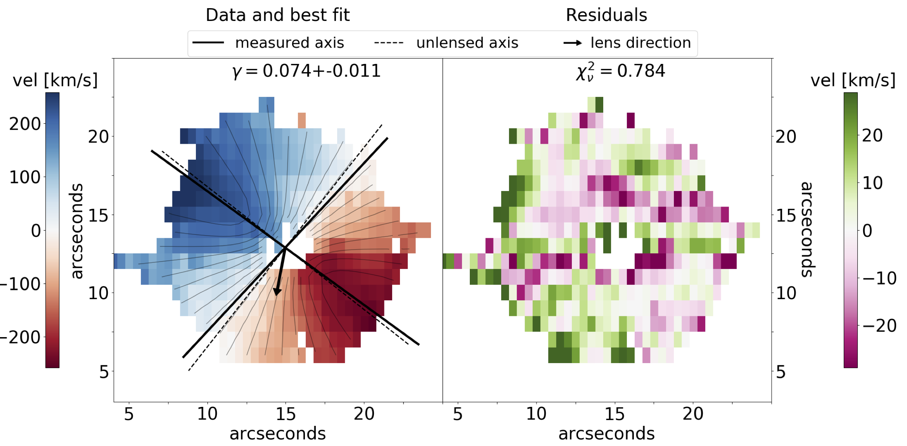
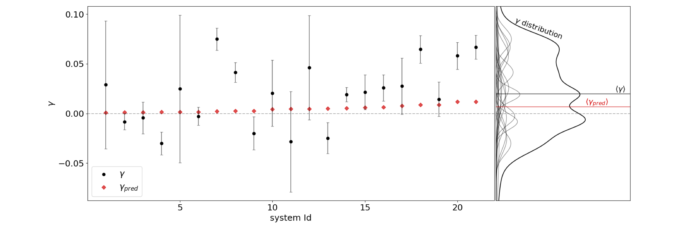
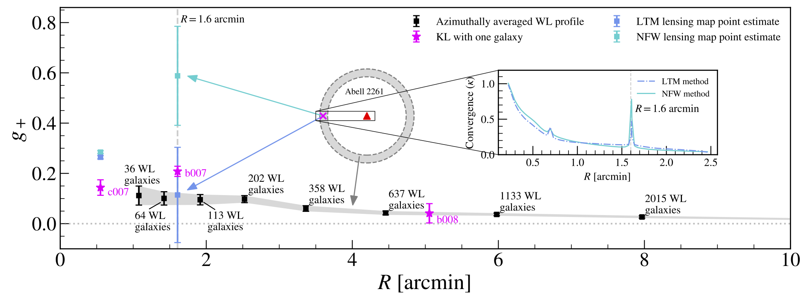
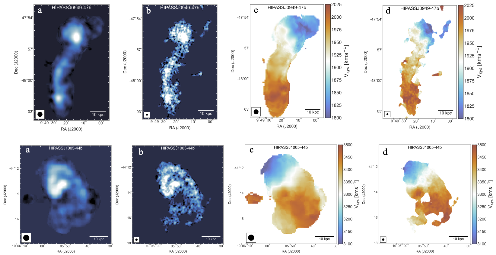
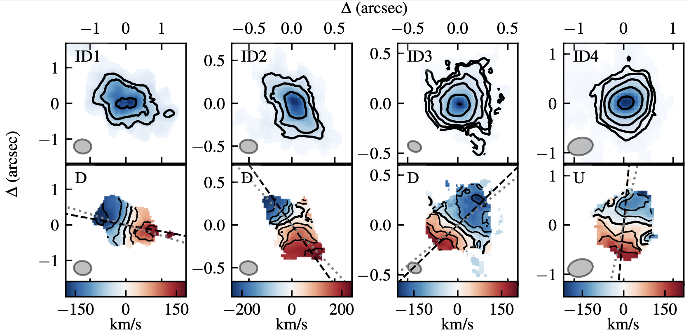
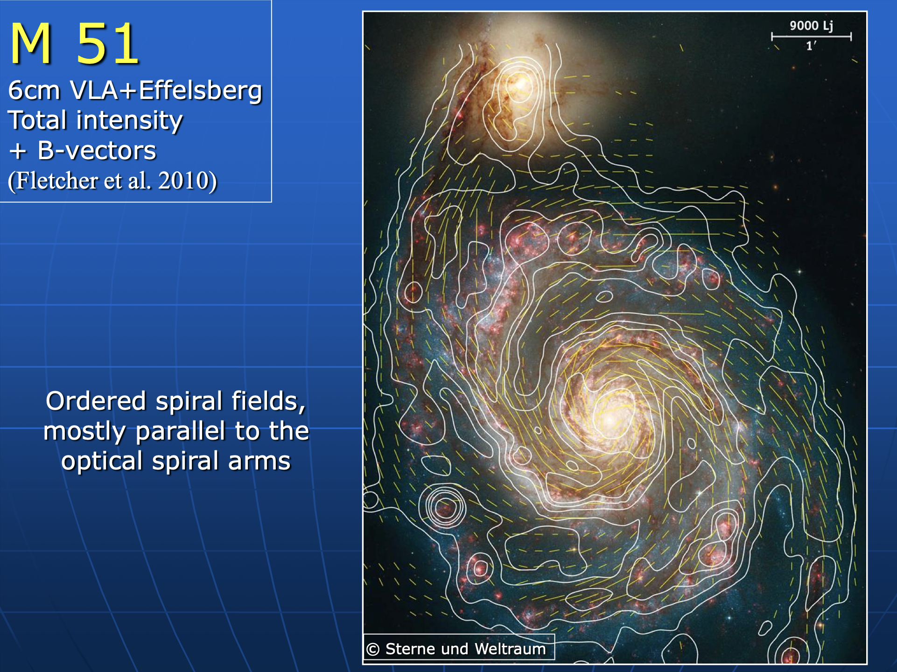
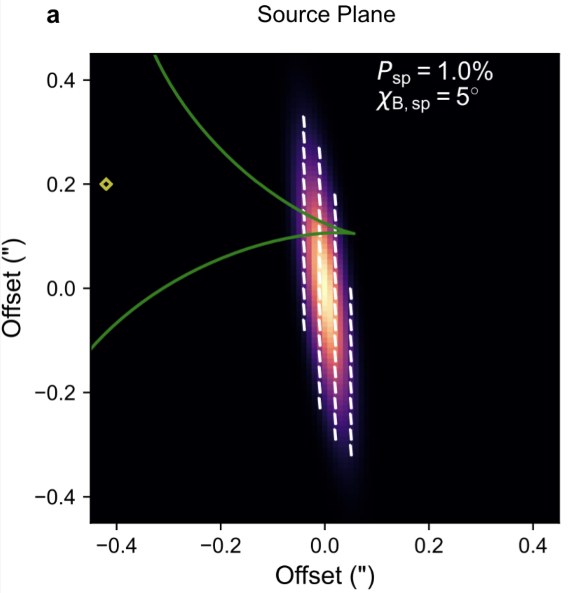

# Outline {.center}

# Motivation {.center}

In cosmic shear analyses, intrinsic galaxy shape is unknown.

- Shape noise: source of variance

    - need lots of galaxies to beat down noise

- Intrinsic alignments: source of bias

::: {.fragment}
**Estimates of intrinsic shape can mitigate both!**

- Kinematics: intrinsic position angle / ellipticity / symmetries

- Polarization: intrinsic position angle
:::

# Kinematic Lensing (KL) {.center}

## Intuitive Picture

[Hopp & Witmann (2024)](https://arxiv.org/abs/2410.00098)

{.fragment .preload .current-visible}
{.fragment .current-visible}
{.fragment width=55%}

## A Bit of History {.center}

::: {style="text-align: left"}
- [Blain et al. (2002)](https://arxiv.org/abs/astro-ph/0204138): first proposal of KL
    - ideal instruments predicted to be ALMA & SKA!   

- [Morales (2006)](https://arxiv.org/abs/astro-ph/0608494): proposed KL with HI surveys
    - relative to continuum surveys:
      -  line-to-continuum, HI $\dd N / \dd S$, low-SNR estimators   

::: {.fragment}
- [Gurri et al. (2020)](https://arxiv.org/abs/2009.10067): first KL measurement   

- [R.S. et al. (2024)](https://arxiv.org/abs/2409.08367): first detection of cluster lensing with KL   

- [Hopp & Witmann (2024):](https://arxiv.org/abs/2410.00098) model-independent KL method   leveraging  kinematic symmetries   
:::
:::

## First KL Measurement (Gurri et al. 2020) 

- 18 hand-picked galaxy-galaxy systems: $\ev{\gamma} = 0.0201 \pm 0.0079$ 

    - primarily sensitive to $\gamma_\times$; $\gamma_+$ degenerate with inclination and scale radius

- kinematic shape noise dominates uncertainty:   $\sigma_k \sim 0.03$ vs. $\sigma_p \sim 0.2$, so need $\sim$ 50 times fewer galaxies*

{width=75% .fragment .current-visible .preload}
{.fragment .current-visible}

::: {.fragment style="margin-top:180px"}
- Lower kinematic shape noise when gas & stellar velocity fields match

- Point to SKA as enabler of KL at scale!
:::

 

## KL State of the Art (R. S. et al. 2024)

- 141 target galaxies $\to$ 3 after cuts. 
- use Tully-Fisher to estimate inclination $\implies$ intrinsic ellipticity
    - $\gamma_+$ constrained via Tully-Fisher
    - $\gamma_\times$ via kinematic-photometric misalignment
- per-galaxy SNR > 1, and 10$\times$ reduction in shape noise!

{.fragment .current-visible .preload  width=85%}

{.fragment}

## KL Symmetries (Hopp & Witmann 2024)

{.fragment .current-visible .preload}
{.fragment}

## Almost Feasible with [WALLABY](https://wallaby-survey.org/beta-science/)? 

 21 CM H1 survey, 30" resolution, up to z=0.1

::: {.fragment .preload .current-visible}
{width=18%} {width=18%}

WALLABY website, data from Serra et al. (2015)
:::

::: {.fragment}
{width=95%}
:::

## Feasible with ALMA

[The ALMA-ALPAKA survey I (Rizzo et al. 2023)](https://arxiv.org/abs/2303.16227)

high-resolution CO and [CI] kinematics of star-forming galaxies at z = 0.5-3.5

# Radio Galaxy Polarization  {.center}

## Intuition

- Star-forming galaxies dominate observed sources
  - synchrotron emission driven by large-scale galactic magnetic fields
      $\implies$ polarization position angle 

- Nearby spiral polarization fractions: 1-10% (Stil et al. 2008)

- polarization angle not affected by lensing

  - but Faraday effect, and cosmic birefringence..

::: {.fragment style="margin-left:500px;margin-top:-150px"}
{width=35%}
{width=55%}

Stil et al. (2008)
:::

## Polarization: Some Examples {.scrollable}

[Slides from a presentation by David Mulcahy](https://www.mpifr-bonn.mpg.de/1281929/Beck_Galaxies.pdf)

**Polarized thermal emission from dust in a galaxy at redshift 2.6**
  [(Geach et al. 2023)](https://arxiv.org/abs/2309.02034)

:::::::::::::: {.columns}
::: {.column style="width:50%"}

:::
::: {.column style="width:50%"}
{width=75%}
:::
::::::::::::::

## A Bit of History

- Kronberg et al. 1991, Kronberg, Dyer & Roeser 1996, Burns et al. 2004:
    lensing measurements with polarized radio jets

{width=100%}

## A Bit of History

- Brown & Battye ([2011a](https://arxiv.org/abs/1005.1926), [2011b](https://arxiv.org/abs/1106.0816)): first polarization shear estimator

{width=70%}

## A Bit of History

- Whitaker et al. ([2015](https://arxiv.org/abs/1503.00061), [2018](https://arxiv.org/abs/1702.01700)): 
  - improve upon B&B11 estimator
  - **quadratic estimator**  using pol. vectors combined with finite-difference gradients of Stokes I
  - estimates of rotation from birefringence:   2.03º $\pm$ 0.75º (authors caution Farrady rotation systematics)

{width=70%}

## Weak Lensing Rotation

[Thomas et al. 2016](https://arxiv.org/abs/1612.01533)

- Tensor & vector gravitational potentials allow for   a rotation mode $\omega$ in addition to $\gamma$ and $\kappa$:
    {width=75%}

  - only measurable if source-plane position angle can be estimated  

::: {.fragment}
- Second-order effect in $\Lambda$CDM, post-Born/lens-lens coupling\

  - should be equivalent to shear $B$-modes   $\implies$ systematics (or $\Lambda$CDM) null test  
:::

::: {.fragment}
- Can solve simultaneously for shear and rotation from lensing
:::

  
## A new observable for cosmic shear

[Francfort, Durrer, & Cusin (2022)](https://arxiv.org/abs/2203.13634)

Estimator based on correlation function of lensing-induced rotation itself.

::: {.fragment}
**For a single galaxy:**  
$\alpha$ is position angle; $\delta \alpha$ is lensing-induced rotation
$$\Theta = \frac{2 - \epsilon^2}{\epsilon^2} \delta \alpha = \gamma_2 \cos 2 \alpha - \gamma_1 \sin 2 \alpha$$
:::

::: {.fragment}
**For a pair of galaxies 1,2:**
$$\Xi = \Theta(\vb n_1, \alpha_1, z_1) \Theta(\vb n_2, \alpha_2, z_2)$$
:::

::: {.fragment}
**Estimator averaging over $\Xi, \Xi'$ pairs (4-pt?):**  

:::

<!-- # Observational Prospects {.scrollable}

[EMU](http://emu-survey.org/index.html): 10" resolution,  10-15 mJy/beam sensitivity

[Gupta et al (2024):](https://arxiv.org/abs/2403.14235) 10 414 **resolved** radio galaxies in 270 deg²

[POSSUM:](https://possum-survey.org) Polarization -->

# Relevance to TOSCA 

