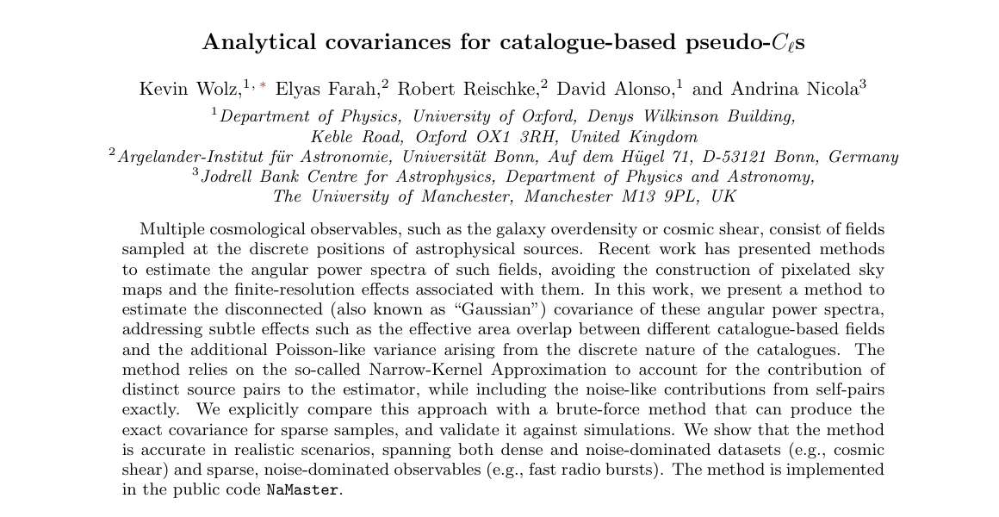
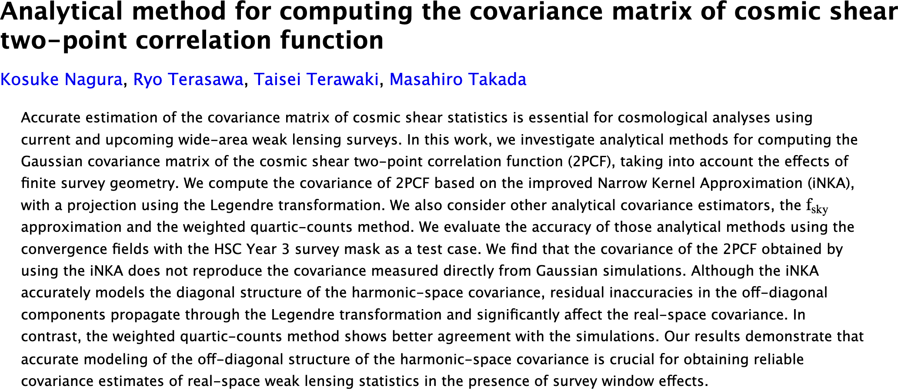

---
# ════════════════════════════════════════════════════════════════════════════
# CosmoStat journal club, Thu 3 Sep 2026. Informal, ~25 min.
# Two covariance papers: 2607.14843 (Wolz+) and 2605.16186 (Nagura+).
# The 1D toy behind slides 3–5 lives in notes/; see notes/projection-experiment.md.
# ════════════════════════════════════════════════════════════════════════════
title: "Covariances under the<br>narrow-kernel approximation"
subtitle: "arXiv 2607.14843 &nbsp;·&nbsp; 2605.16186"
output-file: index.html
occasion: CosmoStat Journal Club
description: Three recent papers on pseudo-Cl covariance estimation
draft: true
author:
    name: Cail Daley
    affiliation: "Département d'Astrophysique / UMR AIM · CEA Paris-Saclay"
date: September 3, 2026
date-format: long

format:
    revealjs:
        width:  1920
        height: 1080
        theme: [default, ../assets/house.scss, custom.scss]
        slide-number: true
        fig-align: center
        menu: false
        include-after-body:
            - assets/no_footer_on_titleslide.html
            - assets/figure-treatment.html
            - nka_script.html
        footer: "Cail Daley | CosmoStat JC | 3 September 2026"
        history: false
        hash: true
        pdf-separate-fragments: true
        pdf-max-pages-per-slide: 1
        template-partials:
            - title-slide.html
        center-title-slide: false

html-math-method:
    method: mathjax
    url: https://cdn.jsdelivr.net/npm/mathjax@3/es5/tex-svg-full.js
include-in-header:
    - assets/mathjax.html
    - nka_data.html
---

## {.paper-card}

```{=html}
<div class="cardwrap">
  
  <div class="src">Wolz, Farah, Reischke, Alonso &amp; Nicola &mdash; arXiv:2607.14843</div>
</div>
```

## A field in position space {.nka-slide auto-animate="true" auto-animate-duration="0"}

```{=html}
<div class="nka" data-step="0">
<div class="eqs"></div>
<svg class="pA" data-h="170" viewBox="0 0 1730 260" width="1730" height="260"></svg>
</div>
```

::: {.notes}
Start as simply as possible. A Gaussian random field on a line — one realisation, one function of position. Everything today lives on this picture.
:::

## A field in position space can be decomposed as a sum of modes {.nka-slide auto-animate="true" auto-animate-duration="0"}

```{=html}
<div class="nka" data-step="1" data-staged="1">
<div class="eqs"></div>
<svg class="pA" data-h="170" viewBox="0 0 1730 260" width="1730" height="260"></svg>
<svg class="pM" viewBox="0 0 1730 460" width="1730" height="460"></svg>
<span class="fragment nka-step"></span>
<span class="fragment nka-step"></span>
<span class="fragment nka-step"></span>
<span class="fragment nka-step"></span>
<span class="fragment nka-step"></span>
</div>
```

::: {.notes}
Same field. Each wave below is one Fourier mode of it — one wavenumber, one amplitude, one
phase. Click through them, low k first.

Each one also puts a point on the spectrum underneath: the expected squared amplitude at that
wavenumber, sitting right on the true curve. Watch the fourth one land above the third — that's
the bump you can see in the curve. Keep it in mind, because everything that goes wrong later
goes wrong there. There are more modes than these five; they'd fill out the rest of the curve
the same way.

Throw away the phases, keep the squared amplitudes, and C-ell is the whole statistical content
of a Gaussian field. It is what we are trying to measure.
:::

## Multiplying by a mask convolves the modes {.nka-slide}

```{=html}
<div class="nka" data-step="2" data-staged="1">
<div class="eqs"></div>
<div class="pick"></div>
<span class="fragment nka-step"></span>
<span class="fragment nka-step"></span>
<svg class="pA" data-h="170" viewBox="0 0 1730 260" width="1730" height="260"></svg>
<svg class="pC" data-h="230" data-kernel="1" data-kernel-at="1" data-kh="148"
     data-tilde="1" data-tilde-at="2"
     viewBox="0 0 1730 336" width="1730" height="336"></svg>
</div>
```

::: {.notes}
Now the mask, and this is the slide the rest of the talk leans on.

Top row, real space: we observe the field times a window. The window is not a box — its edges
are tapered, apodized, and that taper matters as much as the size of the footprint.

Bottom row, harmonic space. Multiplying in position space is convolving in harmonic space, so
each observed mode is no longer its own: it is a weighted sum of its neighbours, and the blue
bump is the kernel that says which ones. The bar under it is the number to remember — how many
neighbours each mode mixes with. Take the expectation and the smearing becomes a matrix: the
blue curve, the pseudo-spectrum, is the true spectrum seen through the coupling. Watch the bump
get rounded off.

Now switch masks. Wide and smoothly apodized mixes each mode with one neighbour either side.
Small, a couple. Holes and hard edges — and that is what a real survey footprint looks like —
five, with sidelobes reaching much further. The last two have the same area; the difference is
entirely complexity. Everything downstream is a consequence of this number.
:::

## Bandpowers make the coupling invertible {.nka-slide}

```{=html}
<div class="nka" data-step="3" data-ledger-from="3">
<div class="eqs"></div>
<svg class="pC" data-h="600" data-tilde="1" data-bins="1" data-binned="1" data-decoupled="1" data-kernel="1" data-kh="150" viewBox="0 0 1730 700" width="1730" height="700"></svg>
<div class="pick"></div>
</div>
```

::: {.notes}
And you invert it. But not mode by mode: the mask does not only smear modes, it deletes them, and a matrix that annihilates directions cannot be inverted. So you average into bandpowers about as wide as the kernel — the red squares — bin the coupling matrix to match, and invert that. The decoupled bandpowers land back on the truth. Binning is how you stop asking the data about what the mask threw away. The estimator is exact.
:::

## The covariance is where it gets expensive {.nka-slide}

```{=html}
<div class="nka" data-step="4" data-frag-step="5" data-ledger-from="4">
<div class="eqs"></div>
<div class="cost"></div>
<div class="pick"></div>
<div class="mrow">
  <div class="mcell"><canvas style="width:400px;height:400px"></canvas>
    <div class="mlab"><b>exact</b>direct sum over modes</div></div>
  <div class="mcell fragment" data-fragment-index="0"><canvas style="width:400px;height:400px"></canvas>
    <div class="mlab"><b>NKA</b>one mask-product kernel</div></div>
  <div class="mcell fragment" data-fragment-index="1"><canvas style="width:400px;height:400px"></canvas>
    <div class="mlab"><b>NKA &minus; exact</b>error</div></div>
</div>
</div>
```

::: {.notes}
The estimator is exact. Its uncertainty is not.

The covariance of a quadratic estimator is a four-point object: for every pair of modes, a sum
over a third mode of W times W-star times C. That is a cost scaling as the sixth power of the
largest mode, and at survey resolution it is simply not computable. On the left is the answer
you cannot afford — the exact covariance of the pseudo-spectrum, banded because the mask
couples neighbours.

So: the narrow-kernel approximation. If C barely changes across the width of the kernel,
evaluate it once at the midpoint of the two modes — C-bar, the average of C at k and at k-prime
— and pull it outside the sum. What is left collapses into a single kernel, Xi, and the cost
drops to the same order as the estimator itself. And notice what Xi is: it is exactly the
coupling kernel from three slides ago, the mask's own power at mode separation ell minus ell-prime
— except built from w squared instead of w, because a covariance is a four-point object and the
masks come in pairs.

I have written this for one field and one mask, which is all this toy has. In general there are
four of them: the covariance of C-tilde-ab with C-tilde-cd, and then the two C factors are
C-ac and C-bd, and Xi takes two mask products, w-a w-c and w-b w-d, plus the term with c and d
swapped. That is where the a, b, c, d you will see in the paper come from. Nothing else changes.

One thing to be clear about, because it is easy to over-read the approximation. Nothing requires
C to be constant. C-bar only has to be a good stand-in for C wherever Xi is not already zero —
the kernel's support is a handful of modes wide, so the only thing that matters is whether C
varies across that handful. Where it does not, this is essentially exact.

And the difference. Where the spectrum is smooth it is nearly exact; where it has structure on
the kernel's scale — the bump — it is not, and the error lives in the off-diagonals, not on the
diagonal.
Switch to the holed mask and the whole band goes wrong. That is the subject of the first two
papers.
:::

## Now, catalogues: what is your mask? {.nka-slide}

```{=html}
<div class="nka" data-step="6" data-ledger-from="6" data-staged="1">
<div class="eqs"></div>
<svg class="pP" data-h="80" data-foot-at="0" viewBox="0 0 1730 238" width="1730" height="238"></svg>
<div class="two lower">
  <div class="toycol fragment" data-fragment-index="0">
    <svg class="pMps" data-h="345" data-foot-at="0" data-x0="132" data-w="352"
         viewBox="0 0 520 437" width="520" height="437"></svg>
    <div class="eqblock nwdef">
      <span class="nm">mask shot noise</span>
      <span class="eq">\( \tilde N_w=\tfrac{1}{4\pi}\sum_i w_i^2 \)</span>
    </div>
  </div>
  <div class="figblock fragment" data-fragment-index="1">
    
    <div class="figside">
      <span class="src">Wolz et al., arXiv:2607.14843 — Fig. 1</span>
      <p class="verbatim caption">Mask pseudo power spectrum for the <i>Quaia</i> survey mask, comparing catalogue- and mask-based estimators. At the catalogue level, the constant shot noise floor (\(\tilde{N}_w\)) is reached at scales far below the mean interparticle scale (\(\theta_{\rm c}\)).</p>
    </div>
  </div>
</div>
</div>
```

::: {.notes}
Everything so far assumed a mask you could draw: a smooth function of position. A catalogue is
not that. The mask *is* the sources — a sum of delta functions at the places you actually
observed. There is no separate footprint map; the window and the sampling are the same object.
And the modes follow the same way: instead of summing over pixels you sum over objects, weight
times value times a phase. That is the last line of the ledger, and I am stopping it there on
purpose — everything downstream of the modes is exactly the machinery from the last three
slides. What breaks is upstream.

So ask the simplest question you can ask about a mask: what is its own power spectrum? Bottom
left. Uniform random positions, and I am just summing e-to-the-minus-i-k-x over the sources I
drew. It is flat. At every k the phases of a hundred and forty deltas point in random
directions, so they add *incoherently* — the sum is a random walk, and its square is the number
of sources. That is the shot-noise floor, N-w-tilde, the sum of w-i squared over four pi, and it
is reached almost immediately, well below pi over theta-c.

The footprint is already on: of the hundred and forty sources in the catalogue, fifty-five fall
inside it, and the grey ones are the rest. Edges, and a couple of holes. Sources inside the gaps simply do not
exist; there is nothing else to remove. Watch the low k. Below the inverse footprint scale the
deltas are no longer randomly placed: they are all sitting inside the same window, their phases
line up, and they add *coherently*. The sum stops being a random walk and starts tracing the
footprint, so the spectrum lifts off the floor — and by k of about fifteen it has fallen back onto the floor
again, well below pi over theta-c. Red rise, white floor. That is the shape on the right, in
Quaia, from the paper. Ours is a decade; theirs is six, and the only difference is the number of
sources — the rise cannot exceed N, and Quaia has millions.

Two things about that floor. First, it is the same object twice. The data's white floor is the
sum of w-i squared a-i squared over four pi — the values at the source positions — and you can
subtract it exactly, but only because you have the data values, not just the weights. The mask's
floor is that identical formula with a-i set to one: the mask is a catalogue whose data is all
ones. Second, and this is why it is a problem rather than a nuisance: the whole coupling
machinery is built *from* mask spectra. An additive floor sitting in the mask does not stay
additive downstream — it becomes a convolutional problem for the data. That is why the fix is to
band-limit the mask rather than to subtract its floor.
:::

## Band-limiting the mask {.nka-slide}

```{=html}
<div class="nka" data-step="6" data-ledger-from="6">
<div class="eqs"></div>
<svg class="pP" data-h="80" data-foot-at="0" data-cloud="1"
     viewBox="0 0 1730 238" width="1730" height="238"></svg>
<div class="two lower">
  <div class="toycol wide">
    <svg class="pMps" data-h="420" data-foot-at="0" data-cloud="1" data-pixel="1"
         data-x0="132" data-w="820" viewBox="0 0 990 512" width="990" height="512"></svg>
  </div>
  <div class="cloudcol">
    <div class="eqblock">
      <span class="nm">band-limited mask</span>
      <span class="eq">\( \bar w(x)=\sum_i w_i\,G_{\theta_{\rm c}}(x-x_i) \)</span>
    </div>
    <div class="eqblock">
      <span class="nm">cloud</span>
      <span class="eq">\( G_{\theta_{\rm c}}(x)=\dfrac{e^{-x^{2}/2\theta_{\rm c}^{2}}}{\sqrt{2\pi}\,\theta_{\rm c}} \)</span>
    </div>
    <div class="ctl-slider inline cloud">
      <label>cloud size <input type="range" data-var="thc" min="0" max="140" value="0">
        <span class="val"></span></label>
    </div>
  </div>
</div>
</div>
```

::: {.notes}
So the mask has a floor. You cannot subtract it, because the mask spectrum is not the
measurement — it is the machinery that the measurement is deconvolved with, and an additive
floor in the machinery is a convolutional problem in the data. What you can do is get rid of it.

Where does the floor come from? From pretending you know where a source is to infinite
precision. A delta function has power at every k, all the way up, forever. So stop pretending:
give each source a Gaussian cloud of size theta-c. In real space the comb blooms; overlapping
clouds merge, and the mask becomes an ordinary continuous window again. In harmonic space that
is a multiplication by the cloud's transform, e to the minus k squared theta-c squared — and
watch what it does. The coherent part at low k, which is the actual footprint, is untouched. The
white floor is cut off. The thing you wanted gone is gone and the thing you wanted kept is kept.

The blue curve is what you are aiming at: the power spectrum of the smooth footprint on its own,
with no sources in it — the thing a pixelised map of the same window would measure. Red is the
catalogue. Red is blue plus a flat N-w, which is the entire content of the paper's figure one.
So drag until the red lies on the blue for as far in k as you can get it.

Two scales, and they are not the same. The Gaussian is down to one over e at k equals one over
theta-c; the marker I am drawing is at pi over theta-c, which is the scale the paper uses for
the shot-noise subtraction. The roll-off starts a factor of three before the marker.

And here is the way I would connect this to something you already know. Sample a field on a
regular grid of spacing Delta and you get aliasing: the sampling comb transforms into another
comb, so power above pi over Delta does not vanish, it folds back onto specific modes. Sample it
at random positions instead and the sampling function's transform is not a comb — it is flat,
because random phases add incoherently. So the same power still comes back, but smeared evenly
across every mode instead of folded onto particular ones. Shot noise *is* aliasing, under random
sampling. Which makes band-limiting at theta-c of about the mean spacing exactly the move you
already make with pixels: you are choosing the resolution scale, and you are choosing it at
Nyquist. The difference is that here you chose it, and you know what it is.

Drag it and find the sweet spot: about the mean source spacing. Which is the honest statement of
what has happened here. A pixel mask was always band-limited too — at the pixel scale, which is
an arbitrary number you inherited from whoever made the map. Here the band-limit is a parameter,
and you get to set it at the scale that actually means something: the resolution the catalogue
had all along. Note what kind of move this is, though: theta-c is a choice, not a derivation.
They justify it by showing the answer plateaus over a wide range of it.

And once the mask is a smooth function again, everything from the first half of the talk starts
working: mask products are finite, the coupling kernels exist, the narrow-kernel approximation
has something to be narrow about.
:::

## Now the covariance: splitting the pairs {.nka-slide}

```{=html}
<div class="nka" data-step="8" data-ledger-from="8" data-staged="1">
<div class="eqs stretch"></div>
<div class="two fragment" data-fragment-index="0">
  <div><svg class="pXi" data-h="215" data-x0="90" data-w="700" viewBox="0 0 840 306" width="840" height="306"></svg></div>
  <div><svg class="pWhite" data-h="215" data-x0="90" data-w="700" viewBox="0 0 840 306" width="840" height="306"></svg></div>
</div>
<div class="corr big">
  <div class="fragment" data-fragment-index="1">
    <span class="nm">self-pair field</span>
    <span class="eq">\( n(x)\;\equiv\;\textstyle\sum_i w_i^{2}\,\langle a_i^{2}\rangle\,G^{2}(x-x_i)\;=\;\langle a^{2}\rangle\,\textstyle\sum_i w_i^{2}\,G^{2}(x-x_i) \)</span>
    <span class="eq">\( \langle a^{2}\rangle=\textstyle\sum_\ell C_\ell \)</span>
  </div>
  <div class="fragment" data-fragment-index="2">
    <span class="nm">distinct-pair mask product</span>
    <span class="eq">\( \mathcal{W}(x)\;\equiv\;\bar w^{2}(x)\;-\;\textstyle\sum_i w_i^{2}\,G^{2}(x-x_i) \)</span>
    <span class="eq">\( \phantom{\mathcal{W}(x)}\;=\;\textstyle\sum_{i\neq j} w_iw_j\,G(x-x_i)\,G(x-x_j) \)</span>
  </div>
  <div class="fragment" data-fragment-index="3">
    <span class="nm">catalogue covariance</span>
    <span class="eq">\( {\rm Cov}\big(\tilde C_\ell,\tilde C_{\ell'}\big)\;\simeq\;2\Big[\;\underbrace{\bar C_{\ell\ell'}^{\,2}\,\big|\mathcal{W}_{\ell-\ell'}\big|^{2}}_{\rm sig\times sig}\;+\;\underbrace{2\,\bar C_{\ell\ell'}\,{\rm Re}\big(\mathcal{W}_{\ell-\ell'}\,N^{*}_{\ell-\ell'}\big)}_{\rm sig\times noise}\;+\;\underbrace{\big|N_{\ell-\ell'}\big|^{2}}_{\rm noise\times noise}\;\Big] \)</span>
  </div>
</div>

</div>
```

::: {.notes}
So the mask is smooth now. What is the next problem?

This. The covariance kernel does not want the mask; it wants the mask *product*, w-bar times
w-bar. Write that out for a catalogue against itself and it splits in two: a sum over distinct
pairs, i not equal to j, which is a perfectly ordinary object; and a sum over every source paired
with itself. That second sum does not go away when you smooth. It is the diagonal of the
product, it is there in every catalogue auto-spectrum, and it is white noise sitting inside your
mask — which would go straight through the narrow-kernel machinery and corrupt it.

But look at what kind of object it is, and this is the part that turns out to be free.

Split every pair of sources by whether they are two different sources or the same source twice.
The distinct pairs at finite separation are the signal — that is the correlation function on the
left. The self-pairs all sit at zero separation, and their height is the variance of the field at
a point: the integral of the whole power spectrum. Now transform. A spike at zero lag is a flat
line at every k. So the self-pair term behaves algebraically exactly like white noise.

And white noise is the one thing this machinery already handles exactly.

So, first line: name the self-pair piece. It is the same sum, with the data in it — the local
variance map — and for a field of constant variance it factorises into the variance at a point
times the self-pair half of the mask product. That variance at a point is the integral of the
spectrum, which is the height of the spike you just saw. Same object.

Second line: take the self-pairs *out* of the mask product, or they are counted twice. What is
left is exactly the distinct-pair sum. And note what the subtracted piece is: its own catalogue
field, the transform of the *squared* cloud, not the square of the transform, because squaring a
Gaussian halves its width.

Third line, and this is the whole point: the narrow-kernel approximation from the first half of
the talk, applied to the distinct-pair product and to nothing else. Three terms — signal against
signal, signal against noise, noise against noise. Only the first carries the approximation.
Everything with a self-pair in it is exact.

Two things worth saying out loud. This term is there even for a perfectly noiseless field — it
is the variance of the field at a point, and it is what penalises sparse samples with bigger
error bars. And it is the flip side of the estimator's selling point: because the self-pair
floor is known exactly, you can subtract it, which is why the catalogue estimator is immune to
white noise in the first place.

This is the same floor we met on the mask slide, and now with its proper name: the data's floor
is the sum of w-i squared a-i squared over four pi. The mask's floor was that formula with the
data set to one. Subtracting needs the data values, which is why the *data's* floor can simply
be removed — and why the *mask's* floor, which feeds the coupling machinery rather than the
measurement, had to be band-limited away instead.
:::

## Cosmic shear validation {.nka-slide}

```{=html}
<div class="nka" data-step="9" data-ledger-from="9">
<div class="figpair">
  <div class="figmain">
    
  </div>
  <div class="papercap"><span class="src">Wolz et al., arXiv:2607.14843 — Fig. 4</span>Power spectrum covariance for the DES-like simulated cosmic shear sample. Results are shown for the covariance between the \(E\)-mode and \(B\)-mode power spectra (left panels of the upper and lower figures). The right panels show the \(\chi^2\) distributions calculated using the analytical covariance against the empirical reference distribution (black histograms). The blue lines, points, and histograms show results from simulations in which only the lensing shear signal is sampled at the source positions, whereas results including both the signal and Gaussian uncorrelated noise are shown in red. In the latter case, we assume a noise standard deviation per component of \(\sigma_e=0.27\). The sample variance from 1000 realisations is shown as points, with the analytical prediction as solid lines. The dashed line and crosses show the first off-diagonal element of the covariance matrix.</div>
</div>
</div>
```

::: {.notes}
Cosmic shear, DES-Y3-like. The takeaway in one line: this is a *dense* catalogue — a few
sources per square arcminute, twenty-five million of them over four thousand square degrees —
and yet shape noise dominates its variance, so almost everything you see at high multipole is
the self-pair term, and that is the part handled exactly.

Reading the figure: upper block is E-modes, lower is B-modes. Red is with shape noise at sigma-e
0.27, blue without. Points are the sample variance from a thousand realisations, solid lines the
analytic prediction — they sit on top of each other in both. Right-hand panels are the
chi-squared distributions against the empirical reference in black, and the PTE coverage numbers
are in the legends: four per cent against a nominal five in the noisy case, 5.9 in the noiseless.

Now the dashed line, because it is the pivot to the next paper. That is the FIRST OFF-DIAGONAL
of the covariance — the correlation between neighbouring bandpowers, a few per cent of the main
diagonal here, and the first place an approximation shows its failure. Hold onto it. Nagura and
collaborators take exactly this object and ask what its errors do once you Legendre-transform
back to real space: a small error spread across the off-diagonals in harmonic space does not
stay small when you sum over multipoles to get xi-plus and xi-minus. That is the second paper.
:::

## Galaxy clustering validation {.nka-slide}

```{=html}
<div class="nka" data-step="9" data-ledger-from="9">
<div class="figpair">
  <div class="figmain">
    
  </div>
  <div class="papercap"><span class="src">Wolz et al., arXiv:2607.14843 — Fig. 5</span><i>Left panel:</i> Power spectrum covariance for the LRG-like simulated galaxy clustering sample. Results are shown for power spectra calculated using random catalogues to quantify the sample completeness (red) and using a continuous mask (blue). For clarity, the mask-based results have been rescaled by a factor of 1.5. The points show the sample variance estimated from 1000 realisations, with the analytical Gaussian covariance as solid lines. The dashed line and crosses show the first off-diagonal element of the covariance matrix. <i>Right panels:</i> corresponding analytical \(\chi^2\) distributions from 1000 simulations, compared with the empirical distributions in black.</div>
</div>
</div>
```

::: {.notes}
Clustering, DESI-LRG-like. The takeaway, and it is the mirror image of the last slide: this
catalogue is much *sparser* than the shear one, yet here the signal dominates, so the load falls
on the distinct pairs — the part that carries the approximation — and it still holds.

Red is the catalogue estimator using randoms for completeness, blue the traditional continuous
mask, rescaled by a factor of 1.5 for clarity. Points are sample variance from a thousand
realisations, solid lines analytic, and again the dashed line and crosses are the first
off-diagonal.

So the two axes come apart. Density sets how many sources you have; what dominates the variance
sets which half of the machinery has to be right. Neither of these is a regime where it would
break — for that, the next paper.
:::

## Implemented in NaMaster {.nka-slide}

```{=html}
<div class="nka ship">
  <div class="shipline">catalogue-based pseudo-\(C_\ell\) spectra <b>and</b> their covariances, shipped in <code>pymaster</code> 3.0.</div>
<pre class="shipcode"><span class="c"># positions = [theta, phi] in radians; the mask IS the catalogue</span>
<span class="v">f</span>  = nmt.<span class="f">NmtFieldCatalog</span>(positions, weights, [values], lmax=lmax)
<span class="v">b</span>  = nmt.NmtBin.<span class="f">from_lmax_linear</span>(lmax=lmax, nlb=<span class="n">10</span>)

<span class="c"># decouple with the binned coupling matrix</span>
<span class="v">w</span>  = nmt.NmtWorkspace.<span class="f">from_fields</span>(f, f, b)
<span class="v">cl</span> = w.<span class="f">decouple_cell</span>(nmt.<span class="f">compute_coupled_cell</span>(f, f))

<span class="c"># the distinct pairs are approximated, the self-pairs exact</span>
<span class="v">cw</span>  = nmt.NmtCovarianceWorkspace.<span class="f">from_fields</span>(f, f, f, f)
<span class="v">cli</span> = nmt.<span class="f">get_iNKA_cell</span>(f, f, cl_guess=cl_theory)
<span class="v">cov</span> = cw.<span class="f">gaussian_covariance</span>(cli, cli, cli, cli, wa=w, wb=w)</pre>
  <div class="shipdocs">github.com/LSSTDESC/NaMaster &nbsp;·&nbsp; namaster.readthedocs.io &nbsp;·&nbsp; examples 11 &amp; 12</div>
</div>
```

::: {.notes}
And it ships — this is not a method waiting on an implementation. It is in NaMaster, the public
code most of us already use for pseudo-C-ell, as of version three, which came out in July. So
about six weeks old.

The code is real, not pseudocode. Three moves. Build a catalogue field: you hand it positions,
weights and values, and there is no mask argument, because the positions are the mask — that is
the whole first half of this talk in one constructor. Then the spectrum, which is the ordinary
workspace flow you already know: nothing about decoupling changed. Then the covariance, and the
only unfamiliar name is get-i-N-K-A-cell, which builds the effective spectra the approximation
needs — the C-bars from the corrections slide.

Two things to flag if anyone asks. Version three moved the workspaces to from-fields
constructors, so the covariance coupling coefficients are computed when you build the object
rather than in a separate call — if you have old covariance code, that is what will break. And
there are two new field classes beside this one: catalogue-momentum, where the mask comes from
randoms or a completeness map, and catalogue-clustering, which is that with the sampled field
set to one. Worked notebooks are examples eleven and twelve in the docs.
:::

## {.paper-card}

```{=html}
<div class="cardwrap">
  
  <div class="src">Nagura, Terasawa, Terawaki &amp; Takada &mdash; arXiv:2605.16186</div>
</div>
```

## A correlation function is a pair count {.nka-slide}

```{=html}
<div class="nka" data-step="10" data-ledger-from="10" data-staged="1">
<div class="eqs"></div>
<svg class="pPair" data-h="150" viewBox="0 0 1730 306" width="1730" height="306"></svg>
<svg class="pXiC" data-h="270" viewBox="0 0 1730 348" width="1730" height="348"></svg>
<div class="fragment" style="height:0"></div>
<div class="fragment" style="height:0"></div>
<div class="fragment" style="height:0"></div>
<div class="fragment" style="height:0"></div>
</div>
```

::: {.notes}
Second paper: Nagura, Terasawa, Terawaki and Takada, from Kavli IPMU and Chiba. Same machinery,
one step further — what happens when you take a harmonic covariance into real space. And before
any of the algebra, I want the object itself, because it is the most concrete thing in the talk.

Here is the catalogue again. Forget the mask for a moment; these are just sources with values.
Pick a separation. Every pair of sources at that separation — that web is all of them, a few
dozen at this bin width — contributes the product of its two values. Add those up, divide by how
many pairs you had, and that is one point of xi. That is the whole estimator. Sum of w-i w-j a-i
a-j over the pairs in the bin, divided by the sum of w-i w-j.

Bigger separation, different set of pairs, another point. And again. Do every bin and you get the
correlation function — noisy, because it is one realisation and a finite number of pairs, and it
scatters around the thin line, which is the actual correlation function of the field these
sources were drawn from.

Now the thing worth noticing, and it is the structural fact the whole paper leans on, from
Friedrich's appendix C. Nothing in that procedure knows about a mask. A pair count cannot be
biased by the survey window: you counted the pairs you have. But write the same quantity in
harmonic space and what appears is C-tilde — the *windowed* spectrum — with the number of pairs
that actually exist in the footprint as the normalisation. So xi is a linear map of the windowed
spectrum. The geometry enters twice, and it enters exactly, not as a model.

That linearity is what makes the next slide inevitable.
:::

## The projection sums over every off-diagonal {.nka-slide}

```{=html}
<div class="nka" data-step="10">
  <div class="corr big">
    <div>
      <span class="nm">projected covariance</span>
      <span class="eq">\( {\rm Cov}(\xi_i,\xi_j)\;\propto\;\sum_{\ell}\sum_{\ell'}\big[P_{\ell+1}-P_{\ell-1}\big]_i\,\big[P_{\ell'+1}-P_{\ell'-1}\big]_j\;{\rm Cov}\big(\tilde C_\ell,\tilde C_{\ell'}\big) \)<span class="tag">\( \mathcal{O}(\ell_{\rm max}^{6}) \)</span></span>
    </div>
  </div>

  <div class="anchorrow">
    <div class="acol">
      <div class="agrid">
        <div class="acorner"></div>
        <div class="astrip"><svg class="akTop" data-len="520" data-amp="58"></svg></div>
        <div class="astrip"><svg class="akLeft" data-len="520" data-amp="58"></svg></div>
        <div class="amat"><canvas class="hExact"></canvas></div>
      </div>
      <span class="acap">exact \( {\rm Cov}(\tilde C_\ell,\tilde C_{\ell'}) \)</span>
      <span class="akey">edges: \( \big[P_{\ell+1}-P_{\ell-1}\big] \) &mdash; 1D toy</span>
    </div>
    <div class="aarrow">&rarr;</div>
    <div class="acol">
      <div class="amat pad"><canvas class="cExact"></canvas></div>
      <span class="acap">\( {\rm Cov}(\xi_i,\xi_j) \)</span>
    </div>
  </div>
</div>
```

::: {.notes}
So: xi is a linear transform of C-tilde. Linear in, so the covariance propagates by sandwiching —
and that is a *double* sum, over ell and ell-prime.

Look at the picture. The matrix in the middle is the exact harmonic covariance on a holed mask —
band-diagonal, but a band with real width, because the window couples neighbouring multipoles.
Along the top edge and the left edge I have drawn the projection kernel, at two different angular
bins. In this one-dimensional toy xi is a cosine transform, so the kernel is a cosine; in the real
thing it is that Legendre difference. Either way it oscillates.

Now read equation and picture together. To get one number, Cov of xi-i with xi-j, you lay the top
kernel across the matrix, lay the left kernel down it, multiply, and add up every single element.
Not the diagonal — every element. Two oscillating weights sweeping the whole plane. So there is no
way to get the real-space covariance right while getting the harmonic off-diagonals wrong. An error
anywhere in that band, times an oscillating kernel, integrates into your error bar.

And the cost, in red: the exact harmonic covariance is order ell-max to the sixth, which the paper
calls flatly intractable at ell-max of six thousand. You cannot compute the thing in the middle of
that picture. So you are forced to approximate — and the next slide is the three approximations
people actually use.
:::

## Three approximations, three different errors {.nka-slide}

```{=html}
<div class="nka" data-step="10">
  <div class="methods">
    <div class="mhead">
      <div class="mtxt"></div>
      <div class="mpix"><span>\( {\rm Cov}(\tilde C_\ell,\tilde C_{\ell'}) \)</span></div>
      <div class="marrow"></div>
      <div class="mpix"><span>\( {\rm Cov}(\xi_i,\xi_j) \)</span></div>
      <div class="mpix dcol"><span>&minus; exact<i class="ekey"></i></span></div>
    </div>

    <div class="mrow2 fragment">
      <div class="mtxt"><div class="mbox">
        <span class="nm">f<sub>sky</sub> (Knox)</span>
        <span class="eq">\( {\rm Cov}\big(\tilde C_\ell,\tilde C_{\ell'}\big)\;\simeq\;\delta^K_{\ell\ell'}\,\dfrac{2\,C_\ell^{2}}{(2\ell+1)\,f_{\rm sky}} \)</span>
        </div>
      </div>
      <div class="mpix"><canvas class="hFsky"></canvas></div>
      <div class="marrow">&rarr;</div>
      <div class="mpix"><canvas class="cFsky"></canvas></div>
      <div class="mpix dcol"><canvas class="dFsky"></canvas><span class="dpk"></span></div>
    </div>

    <div class="mrow2 fragment">
      <div class="mtxt"><div class="mbox">
        <span class="nm">iNKA</span>
        <span class="eq">\( {\rm Cov}\big(\tilde C_\ell,\tilde C_{\ell'}\big)\;\simeq\;\dfrac12\Big(\dfrac{\tilde C_\ell+\tilde C_{\ell'}}{\langle w^2\rangle}\Big)^{2}\Big|\textstyle\sum_x w^2(x)\,e^{-i(\ell-\ell')x}\Big|^{2} \)</span>
        </div>
      </div>
      <div class="mpix"><canvas class="hInka"></canvas></div>
      <div class="marrow">&rarr;</div>
      <div class="mpix"><canvas class="cInka"></canvas></div>
      <div class="mpix dcol"><canvas class="dInka"></canvas><span class="dpk"></span></div>
    </div>

    <div class="mrow2 apart fragment">
      <div class="mtxt"><div class="mbox">
        <span class="nm">quartic counts (Schneider; Shirasaki)</span>
        <span class="eq">\( {\rm Cov}(\xi_i,\xi_j)=\dfrac{1}{N_{{\rm pair},i}N_{{\rm pair},j}}\sum_{abcd} w_aw_bw_cw_d\,\Delta_i(\theta_{ab})\,\Delta_j(\theta_{cd})\,\dfrac{\xi(\theta_{ac})\xi(\theta_{bd})+\xi(\theta_{ad})\xi(\theta_{bc})}{2} \)</span>
        </div>
      </div>
      <div class="mpix nohar"></div>
      <div class="marrow"></div>
      <div class="mpix"><canvas class="cQuar"></canvas></div>
      <div class="mpix dcol"><div class="dzero">\( \equiv 0 \)</div><span class="dpk"></span></div>
    </div>
  </div>
</div>
```

::: {.notes}
Why does anybody take the harmonic route at all? Because it is cheap and because it is what the
codes do. A pseudo-C-ell covariance is order ell-max cubed, not sixth, and NaMaster hands it to you
for free — that is the machinery we spent the first half of this talk building. And crucially, if
you compute xi from a theory spectrum on a masked sky, you have already made this choice whether
you meant to or not: your real-space covariance is a projection of somebody's harmonic
approximation.

Everything on this slide is the same one-dimensional toy, on the six-patch holed mask, so the three
rows are genuinely comparable. Left column: what each method claims the harmonic covariance is.
Middle: that harmonic matrix pushed through the identical cosine sandwich, which is the projection
from the previous slide. Right: the difference from the exact projection, diagonal zeroed, red and
blue, because the diagonal is not where the disagreement lives.

Row one, f-sky, the Knox formula. Strictly diagonal — you can see there is nothing off it —
inflated by one over f-sky, pretending the mask deletes modes without coupling them. Project it and
the error is enormous and structured.

Row two, iNKA. The harmonic matrix is now genuinely banded, the width set by the squared mask
kernel, and that is a real improvement. But look at the difference panel: the residual has not gone
away, it has moved. On a smooth single patch it would be nearly invisible; on this holed mask it is
not, and holes are what real surveys have.

Row three is set apart on purpose, because it never goes through ell at all — the harmonic slot is
empty by construction. Weighted quartic counts, from Schneider and from Shirasaki. Every pair in
bin i against every pair in bin j; the Gaussian four-point function factorises into two
cross-pairings, each the theory xi at the actual separations of real objects. Notice what is
absent: no window function, no coupling matrix, no f-sky, no assumption about a kernel — because
the sum runs over real positions, so the footprint, the holes, the boundaries and the weights are
encoded exactly by which quadruplets exist. Its difference panel is blank because it is zero: this
is the exact answer, not an approximation to it. The window is not modelled. It is counted.

Hold on to the middle column. Slides seventeen to twenty are all about what those differences do
to a real error bar.
:::

## The diagonal is innocent {.nka-slide}

```{=html}
<div class="anim" id="s4">
<div style="display:flex; gap:44px; align-items:flex-start;">
  <div>
    <canvas id="s4m" width="96" height="96" style="width:730px;height:730px"></canvas>
    <div style="margin-top:10px; font-size:28px; color:#7A6F5C;">
      iNKA covariance &nbsp;·&nbsp; <span style="color:#1B1611;font-weight:600"
      id="s4b">bands kept</span></div>
  </div>
  <div style="flex:1;">
    <svg id="s4c" viewBox="0 0 940 730" width="940" height="730"></svg>
    <div style="font-size:28px; color:#7A6F5C; margin-left:90px;">
      separation &nbsp;θ</div>
  </div>
</div>
<div class="ctl"><button id="s4r">replay</button></div>
</div>

<script>
(function(){
  var D=window.NKA_DATA.slide4;
  var NS='http://www.w3.org/2000/svg';
  function el(p,t,a){var e=document.createElementNS(NS,t);for(var k in a)e.setAttribute(k,a[k]);
    p.appendChild(e);return e;}
  function txt(p,x,y,s,a){var e=el(p,'text',Object.assign({x:x,y:y,'font-size':28,
    fill:'#7A6F5C'},a||{}));e.textContent=s;return e;}

  var KM=D.km, bin=atob(D.matrix), M=new Uint8Array(KM*KM);
  for(var q=0;q<M.length;q++)M[q]=bin.charCodeAt(q);

  var cv=document.getElementById('s4m'), ctx=cv.getContext('2d');
  function drawMatrix(n){
    var im=ctx.createImageData(KM,KM);
    for(var i=0;i<KM;i++)for(var j=0;j<KM;j++){
      var v=M[i*KM+j]/255, inb=Math.abs(i-j)<=n, o=4*(i*KM+j), u=Math.pow(v,0.55);
      // in-band: ground -> cobalt.  outside (replaced by the exact answer): muted.
      if(inb){ im.data[o]=247-186*u; im.data[o+1]=240-149*u; im.data[o+2]=225-65*u; }
      else   { im.data[o]=247-55*u;  im.data[o+1]=240-58*u;  im.data[o+2]=225-64*u; }
      im.data[o+3]=255;
    }
    ctx.putImageData(im,0,0);
  }

  var TH=D.theta, lo=Math.log10(TH[0]), hi=Math.log10(TH[TH.length-1]);
  var X0=110, Y0=60, W=800, H=600, YLO=0.80, YHI=1.04;
  function X(t){return X0+W*(Math.log10(t)-lo)/(hi-lo);}
  function Y(r){return Y0+H*(1-(r-YLO)/(YHI-YLO));}
  function drawCurve(n){
    var s=document.getElementById('s4c');s.innerHTML='';
    for(var g=0.85;g<1.041;g+=0.05){
      el(s,'line',{x1:X0,y1:Y(g),x2:X0+W,y2:Y(g),stroke:'#E0D5BF','stroke-width':2});
      txt(s,X0-78,Y(g)+10,g.toFixed(2));
    }
    el(s,'line',{x1:X0,y1:Y(1),x2:X0+W,y2:Y(1),stroke:'#1B1611','stroke-width':3});
    txt(s,X0+W-150,Y(1)-16,'exact',{fill:'#1B1611'});
    var r=D.ratios[n],d='';
    for(var i=0;i<TH.length;i++)d+=(i?'L':'M')+X(TH[i]).toFixed(1)+' '+Y(r[i]).toFixed(1)+' ';
    el(s,'path',{d:d,fill:'none',stroke:'#BC4538','stroke-width':4});
    txt(s,X0+W-340,Y(0.815),'iNKA / exact   Cov(ξ,ξ)',{fill:'#BC4538'});
    el(s,'circle',{cx:X(TH[0]),cy:Y(r[0]),r:9,fill:'#BC4538'});
    txt(s,X(TH[0])+24,Y(r[0])-30,(100*(r[0]-1)).toFixed(1)+'%',
        {fill:'#BC4538','font-size':46,'font-weight':600});
  }

  var i=0,timer=null;
  function show(j){
    var n=D.ns[j];
    drawMatrix(n); drawCurve(j);
    document.getElementById('s4b').textContent='|k − k′| ≤ '+n;

  }
  function play(){clearInterval(timer);i=0;show(0);
    timer=setInterval(function(){i++;if(i>=D.ns.length){clearInterval(timer);return;}
      show(i);},300);}
  document.getElementById('s4r').onclick=play;
  window.__jump=window.__jump||{};
  window.__jump.s4=function(j){clearInterval(timer);show(j);};
  show(0);
  var sec=document.getElementById('s4').closest('section'), was=false;
  setInterval(function(){var now=sec.classList.contains('present');
    if(now&&!was)play(); if(!now&&was)clearInterval(timer); was=now;},250);
})();
</script>
```

::: {.notes}
This is the experiment the paper doesn't do, and it settles the diagnosis.

Start on the left with iNKA's covariance matrix, and keep only the bands within some
separation of the diagonal — everything outside, greyed, I've replaced with the exact
answer. At the start only the diagonal is iNKA's, and the real-space covariance on the
right sits on top of the truth: one percent low. So the diagonal is fine.

Now widen the band. As iNKA's own off-diagonals come back in, the curve peels away and
settles at eighteen percent low. Most of that damage is done by the time the band reaches
the coupling kernel, which is fifteen modes wide here — about eighty percent of the error
is in by n of sixteen. The last couple of points accumulate slowly out to sixty, so the
cutoff is soft rather than sharp.

So: iNKA is right exactly where it was fitted, the harmonic diagonal, and real space
weights precisely the part the fit never reached. And the reverse test says the same —
zero those off-diagonals instead of correcting them and you lose eighty percent of the
covariance. That band isn't a correction to the real-space covariance. It is the
real-space covariance.
:::

## The transform is innocent; the input is not {.nka-slide}

```{=html}
<div class="nka">
<div class="figrow">
  <div class="figcell">
    
    <div class="papercap"><span class="src">Nagura et al., arXiv:2605.16186 — Fig. 3</span>Diagonal components of \(\mathrm{Cov}(\xi[\theta_-,\theta_+],\xi[\theta'_-,\theta'_+])\), measured from Gaussian realizations (dashed line) and calculated using Eq. 12 (solid lines).</div>
  </div>
  <div class="figcell">
    
    <div class="papercap"><span class="src">Nagura et al., arXiv:2605.16186 — Fig. 4</span>Correlation matrices of \(\mathrm{Cov}(\tilde C_\ell,\tilde C_{\ell'})\) computed using the iNKA (left) and measured from Gaussian simulations (center). The right plot shows the fractional difference \(\mathrm{Cov}^{\rm iNKA}/\mathrm{Cov}^{\rm sim}-1\). The iNKA reproduces the diagonal structure accurately, while noticeable differences remain in the off-diagonal components.</div>
  </div>
</div>
</div>
```

::: {.notes}
Left is the controlled experiment, and it is the cleanest thing in the paper. Black dashed
is the covariance of xi measured directly from a thousand simulations. Blue is the
*simulated harmonic* covariance pushed through that double Legendre sum. Blue lands on
black — so the transform, the pair-count normalisation, and the ell-max of six thousand
are all fine. Red is iNKA through the same machinery, and it sits visibly low: twenty-five
to thirty percent at six arcminutes, shrinking to nothing by a couple of hundred. The
failure is isolated to the covariance model. Nothing else in the chain is at fault.

Right is their diagnosis. iNKA's correlation matrix on the left, the simulated one in the
middle, ratio on the right: sharp diagonal reproduced, off-diagonal not.

Now, a caveat I want to say out loud, because I think it is the weakest link. That ratio
panel divides by a sample covariance from a thousand realisations at six thousand unbinned
multipoles. Off the diagonal, the sampling scatter on a correlation coefficient is about
one over root-N, three percent, around a true value that is itself tiny — the middle panel
is visibly pure speckle. So dividing a smooth iNKA prediction by a noisy near-zero
denominator gives you a ratio that is not a pointwise error map, and the uniform blue is
what you would get from signal much smaller than noise with random sign. The *result* on
the left I believe completely. The *diagnosis* is argued by elimination. The obvious clean
test — keep only the first N off-diagonal bands and project — is not in the paper.

So I ran it. Next slide.
:::

## Count the geometry, don't model it {.nka-slide}

```{=html}
<div class="nka">
<div class="figpair">
  <div class="figmain">
    
  </div>
  <div class="papercap"><span class="src">Nagura et al., arXiv:2605.16186 — Fig. 5</span>Diagonal components of \(\mathrm{Cov}(\xi[\theta_-,\theta_+],\xi[\theta'_-,\theta'_+])\), measured from Gaussian realizations (dashed line) and calculated using analytical methods (solid lines). Note that we consider XMM field only for this figure.</div>
</div>
</div>
```

::: {.notes}
The comparison, on the XMM field alone. Black dashed is the simulations. Green is quartic
counts and it sits on the simulations within a few percent across the whole range,
including the upturn past a hundred and fifty arcminutes that both harmonic methods miss
entirely. Red is iNKA, low by twenty to thirty percent at small theta and still ten to
fifteen percent low at large. Blue is f-sky — high by a quarter at small angles, crossing
around an hour, and then collapsing by more than a factor of two by three hundred
arcminutes, exactly where the field size bites.

That ordering deserves a moment, because it is uncomfortable for the room. Most real-space
shear analyses — CosmoLike, OneCovariance, the DES and KiDS pipelines — are not using
iNKA. They are using an f-sky or effective-area treatment. So the reading is not "stop
using iNKA," which you weren't; it is "the thing you *are* using is worse, and the fix is
expensive pair counting."

Two caveats. The simulations are Gaussian by construction, so quartic counts is being
graded on the one test it is guaranteed to pass — in a real analysis it carries its own
unquantified non-Gaussian error. And shape noise is dropped from the comparison entirely,
while for real cosmic shear the noise and mixed terms dominate the small-theta covariance.
So a fair question is whether a twenty-five percent error on the sample-variance term
survives adding shape noise in quadrature at six arcminutes.
:::

## Harmonic diagonal accuracy buys you nothing in real space {.nka-slide}

```{=html}
<div class="nka">
  <div class="punch">10% in harmonic space &nbsp;→&nbsp; <b>25–30%</b> in \(\xi(\theta)\).</div>
  <div class="punch sub">And the fix is to <b>count</b> the geometry, not model it.</div>
</div>
```

::: {.notes}
Where that leaves us.

The result is solid and the control experiment proves it: project the simulated harmonic
covariance and you recover the truth, so the transform is innocent and the input is what
is wrong. The diagnosis — that the damage is in the off-diagonals — is asserted rather
than measured in the paper, for the reason I gave two slides ago. But our own 1D toy says
they are right, and sharply. Replace iNKA's off-diagonals with the exact ones and the
projected error collapses from minus eighteen point six percent to minus zero point six.
Restore them band by band and about eighty percent of the error is back by the time the
band reaches the coupling kernel width. And the reverse test: zero those off-diagonals
instead of correcting them and you lose eighty percent of the real-space covariance
amplitude. That band is not a correction to the answer. It is the answer.

Second thing worth naming: quartic counts is the same object as Wolz's exact summation.
Both are Wick's theorem evaluated on the actual sources rather than on a modelled window —
one in configuration space, one in harmonic space, both order N to the fourth naively,
both rescued by a matrix rewrite. Two independent groups, three months apart, arriving at
"stop modelling the window and count it." That is the through-line of the whole session.

Third, the honest limits. Their implementation coarse-grains galaxies onto an Nside of two
fifty-six or five twelve depending on the angular bin — which is the same band-limiting
move as Wolz's clouds, chosen for the same reason and with the same arbitrariness. They
run one field out of six with half the bins to keep the cost down, and they report no
wall-clock time, no scaling law, no memory footprint anywhere. So the practical case for
the method rests on a cost they never state. What it does at Stage-IV volumes is an open
question.

And finally, my own reservation, which the toy backs. HSC-Y3 is six disjoint patches with
a very high perimeter-to-area ratio — the hardest possible case for a narrow-kernel
approximation. In the toy, splitting one patch into six at fixed area widens the kernel
about sevenfold and takes the iNKA real-space error from minus seven point six percent,
which nobody would write a paper about, to minus eighteen point six. So my honest reading
is that this headline is a statement about HSC's geometry at least as much as about iNKA,
and for a contiguous Rubin-like footprint the problem largely goes away. That is exactly
the question the paper cannot answer, because they have one mask.
:::

<!-- ═══ parked ═══════════════════════════════════════════════════════════
     The three toy-experiment animations are kept in the deck but hidden from
     navigation (reveal's data-visibility="hidden"), so they can come back by
     deleting one attribute. Their data still ships in nka_data.html.
     ══════════════════════════════════════════════════════════════════════ -->

## A smaller footprint means a wider kernel {.nka-slide visibility="hidden"}

```{=html}
<div class="anim" id="s3">

<svg id="s3a" viewBox="0 0 1730 330" width="1730" height="330"></svg>
<svg id="s3b" viewBox="0 0 1730 430" width="1730" height="430"></svg>
<div class="ctl"><span id="s3n" class="big"></span><button id="s3r">replay</button></div>
</div>

<script>
(function(){
  var NS='http://www.w3.org/2000/svg';
  function el(p,t,a){var e=document.createElementNS(NS,t);for(var k in a)e.setAttribute(k,a[k]);
    p.appendChild(e);return e;}
  function txt(p,x,y,s,a){var e=el(p,'text',Object.assign({x:x,y:y,'font-size':28,
    fill:'#7A6F5C'},a||{}));e.textContent=s;return e;}

  // mask + kernel are cheap enough to build in the browser
  var NX=512, N=192;
  function mask(f){var w=new Float64Array(NX),tp=0.015*NX,h=f*NX/2,m=NX/2;
    for(var j=0;j<NX;j++){var d=Math.abs(j-m),v=0;
      if(d<=h-tp)v=1;else if(d<h+tp)v=0.5*(1+Math.cos(Math.PI*(d-h+tp)/(2*tp)));w[j]=v;}
    return w;}
  function kern(w){var p=[],mx=0;
    for(var m=-80;m<=80;m++){var sr=0,si=0;
      for(var j=0;j<NX;j++){var ph=2*Math.PI*m*j/NX;sr+=w[j]*Math.cos(ph);si-=w[j]*Math.sin(ph);}
      var v=(sr*sr+si*si)/(NX*NX);p.push(v);if(v>mx)mx=v;}
    return p.map(function(v){return v/mx;});}
  // effective coupling width: full width of the smallest symmetric window in
  // |W|^2 holding half the kernel power (same definition as the python side)
  // half-width of the smallest symmetric window holding half the OFF-diagonal
  // coupling power — "± n modes", the same quantity and the same words as the
  // rest of the deck
  function kwidth(k){var c=(k.length-1)/2,tot=0,i;
    for(i=1;i<=c;i++)tot+=k[c-i]+k[c+i];
    var acc=0,n=0;
    while(acc<0.5*tot&&n<c){n++;acc+=k[c-n]+k[c+n];}
    return Math.max(n,1);}
  function pmLabel(n){return '\u00b1'+n+(n===1?' mode':' modes');}

  var PAD=90, AW=1730-PAD-40;
  function drawMask(f,w){
    var s=document.getElementById('s3a');s.innerHTML='';
    var y0=56,h=230,mid=y0+h/2;
    el(s,'line',{x1:PAD,y1:mid,x2:PAD+AW,y2:mid,stroke:'#C5B89E','stroke-width':2});
    var d='';
    for(var j=0;j<NX;j++)d+=(j?'L':'M')+(PAD+AW*j/(NX-1)).toFixed(1)+' '+(mid-w[j]*h*0.40).toFixed(1)+' ';
    el(s,'path',{d:d,fill:'none',stroke:'#3D5BA0','stroke-width':4});
    var lo=PAD+AW*(0.5-f/2),hi=PAD+AW*(0.5+f/2);
    el(s,'rect',{x:lo,y:mid-h*0.40,width:hi-lo,height:h*0.40,fill:'#3D5BA0',opacity:.10});
    txt(s,PAD,y0-16,'mask  w(x)',{fill:'#3D5BA0'});
    txt(s,PAD,y0+h+34,'position  x');
  }
  function drawKernel(k){
    var s=document.getElementById('s3b');s.innerHTML='';
    var y0=34,h=300,x0=PAD;
    el(s,'line',{x1:x0,y1:y0+h,x2:x0+AW,y2:y0+h,stroke:'#C5B89E','stroke-width':2});
    var d='';
    var A=30,B=130,NP=B-A;      // show the central +-50 modes
    for(var i=A;i<=B;i++)d+=(i>A?'L':'M')+(x0+AW*(i-A)/NP).toFixed(1)+' '+(y0+h-k[i]*h).toFixed(1)+' ';
    el(s,'path',{d:d,fill:'none',stroke:'#BC4538','stroke-width':4});
    var half=kwidth(k), cc=(k.length-1)/2-A;
    var lo=Math.max(cc-half,0), hi=Math.min(cc+half,NP);
    el(s,'line',{x1:x0+AW*lo/NP,y1:y0+h+26,x2:x0+AW*hi/NP,y2:y0+h+26,
                 stroke:'#BC4538','stroke-width':9,'stroke-linecap':'round'});
    txt(s,x0,y0-2,'mask kernel  |W|²',{fill:'#BC4538'});
    txt(s,x0,y0+h+74,'kernel width — how many neighbouring modes each k mixes with',{fill:'#7A6F5C'});
  }

  var frames=[],i=0,timer=null;
  for(var t=0;t<28;t++){var f=0.60-(0.60-0.06)*t/27;var w=mask(f);var k=kern(w);
    frames.push({f:f,w:w,k:k,fw:kwidth(k)});}
  function show(j){var fr=frames[j];drawMask(fr.f,fr.w);drawKernel(fr.k);
    document.getElementById('s3n').textContent=pmLabel(fr.fw);}
  function play(){clearInterval(timer);i=0;show(0);
    timer=setInterval(function(){i++;if(i>=frames.length){clearInterval(timer);return;}
      show(i);},260);}
  document.getElementById('s3r').onclick=play;
  window.__jump=window.__jump||{};
  window.__jump.s3=function(j){clearInterval(timer);show(j);};
  show(0);

  var sec=document.getElementById('s3').closest('section'), was=false;
  setInterval(function(){var now=sec.classList.contains('present');
    if(now&&!was)play(); if(!now&&was)clearInterval(timer); was=now;},250);
})();
</script>
```

::: {.notes}
Quick setup beat. The mask is a top-hat and I'm shrinking it; watch the kernel underneath.
The width of the coupling kernel goes like one over the footprint width — a big contiguous
survey couples a mode only to its immediate neighbours, a small one smears across dozens.
Everything that follows is about what happens inside that width.
:::

## Six patches, not one, is what breaks it {.nka-slide visibility="hidden"}

```{=html}
<div class="anim" id="s5">
<div style="display:flex; gap:50px; align-items:flex-start;">
  <div><svg id="s5a" viewBox="0 0 720 730" width="720" height="730"></svg></div>
  <div style="flex:1;"><svg id="s5b" viewBox="0 0 940 730" width="940" height="730"></svg>
    <div style="font-size:28px; color:#7A6F5C; margin-left:90px;">separation &nbsp;θ</div>
  </div>
</div>
<div class="ctl"><button id="s5r">replay</button></div>
</div>

<script>
(function(){
  var D=window.NKA_DATA.slide5, C=D.cases;
  var NS='http://www.w3.org/2000/svg', COL=['#3D5BA0','#C49333','#BC4538'];
  function pm(n){return '\u00b1'+n+(n===1?' mode':' modes');}
  function el(p,t,a){var e=document.createElementNS(NS,t);for(var k in a)e.setAttribute(k,a[k]);
    p.appendChild(e);return e;}
  function txt(p,x,y,s,a){var e=el(p,'text',Object.assign({x:x,y:y,'font-size':28,
    fill:'#7A6F5C'},a||{}));e.textContent=s;return e;}

  function drawLeft(upto){
    var s=document.getElementById('s5a');s.innerHTML='';
    var X0=70,W=610;
    for(var c=0;c<=upto;c++){
      var m=C[c].mask, y=44+c*86, h=62;
      el(s,'line',{x1:X0,y1:y+h,x2:X0+W,y2:y+h,stroke:'#E0D5BF','stroke-width':2});
      var d='';
      for(var j=0;j<m.length;j++)d+=(j?'L':'M')+(X0+W*j/(m.length-1)).toFixed(1)+' '+(y+h-m[j]*h).toFixed(1)+' ';
      el(s,'path',{d:d,fill:'none',stroke:COL[c],'stroke-width':3.5});
    }
    txt(s,X0,28,'same area, split');
    var Y0=350,H=230;
    el(s,'line',{x1:X0,y1:Y0+H,x2:X0+W,y2:Y0+H,stroke:'#C5B89E','stroke-width':2});
    for(var c2=0;c2<=upto;c2++){
      var k=C[c2].kernel,d2='';
      for(var i=0;i<k.length;i++)d2+=(i?'L':'M')+(X0+W*i/(k.length-1)).toFixed(1)+' '+(Y0+H-k[i]*H).toFixed(1)+' ';
      el(s,'path',{d:d2,fill:'none',stroke:COL[c2],'stroke-width':3,opacity:.85});
    }
    txt(s,X0,Y0-16,'kernel  |W|²');
    // kernel-width bars: the reach the comb structure hides
    for(var c3=0;c3<=upto;c3++){
      var kk=C[c3].kernel, cc=(kk.length-1)/2, hw=Math.max(1,Math.round(C[c3].fwhm/2));
      var lo2=cc-hw, hi2=cc+hw;
      var yb=Y0+H+46+c3*44;
      el(s,'line',{x1:X0+W*lo2/(kk.length-1),y1:yb,x2:X0+W*hi2/(kk.length-1),y2:yb,
                   stroke:COL[c3],'stroke-width':9,'stroke-linecap':'round'});
      txt(s,X0+W*hi2/(kk.length-1)+20,yb+11,pm(Math.max(1,Math.round(C[c3].fwhm/2))),{fill:COL[c3]});
    }
  }

  var lo=Math.log10(C[0].theta[0]), hi=Math.log10(C[0].theta[C[0].theta.length-1]);
  var X0=110,Y0=60,W=790,H=580,YLO=0.78,YHI=1.05;
  function X(t){return X0+W*(Math.log10(t)-lo)/(hi-lo);}
  function Y(r){return Y0+H*(1-(r-YLO)/(YHI-YLO));}
  function drawRight(upto){
    var s=document.getElementById('s5b');s.innerHTML='';
    for(var g=0.80;g<1.041;g+=0.05){
      el(s,'line',{x1:X0,y1:Y(g),x2:X0+W,y2:Y(g),stroke:'#E0D5BF','stroke-width':2});
      txt(s,X0-78,Y(g)+10,g.toFixed(2));
    }
    el(s,'line',{x1:X0,y1:Y(1),x2:X0+W,y2:Y(1),stroke:'#1B1611','stroke-width':3});
    txt(s,X0+W-150,Y(1)-16,'exact',{fill:'#1B1611'});
    for(var c=0;c<=upto;c++){
      var th=C[c].theta,r=C[c].ratio,d='';
      for(var i=0;i<th.length;i++)d+=(i?'L':'M')+X(th[i]).toFixed(1)+' '+Y(r[i]).toFixed(1)+' ';
      el(s,'path',{d:d,fill:'none',stroke:COL[c],'stroke-width':4});
      el(s,'line',{x1:X0+30,y1:Y0+40+c*46,x2:X0+86,y2:Y0+40+c*46,
                   stroke:COL[c],'stroke-width':5});
      txt(s,X0+100,Y0+52+c*46,C[c].npatch+(C[c].npatch>1?' patches':' patch'),{fill:COL[c]});
    }
    txt(s,X0+W-340,Y(0.795),'iNKA / exact   Cov(ξ,ξ)');
  }

  var i=0,timer=null;
  function show(j){drawLeft(j);drawRight(j);}
  function play(){clearInterval(timer);i=0;show(0);
    timer=setInterval(function(){i++;if(i>=C.length){clearInterval(timer);return;}
      show(i);},1400);}
  document.getElementById('s5r').onclick=play;
  window.__jump=window.__jump||{};
  window.__jump.s5=function(j){clearInterval(timer);show(j);};
  show(0);
  var sec=document.getElementById('s5').closest('section'), was=false;
  setInterval(function(){var now=sec.classList.contains('present');
    if(now&&!was)play(); if(!now&&was)clearInterval(timer); was=now;},250);
})();
</script>
```

::: {.notes}
Last beat, and it's the one that decides how much we should care.

Hold the survey area fixed at twenty percent and cut it into more pieces. One patch,
three, six — HSC-Y3 is six disjoint fields. The kernel widens five-fold, from five modes
to twenty-five, purely from the perimeter.

And the real-space error tracks it: seven percent for the contiguous mask, thirteen for
six patches. Seven percent is not a paper. Thirteen, with the wild intermediate-scale
excursions I've cut off the top of this plot, is.

So my honest reading is that this result is at least as much a statement about HSC's
geometry as about iNKA. For a contiguous Rubin-like footprint, in this toy, the problem
largely goes away — which is exactly the question the paper can't answer, because they
have one mask.
:::
