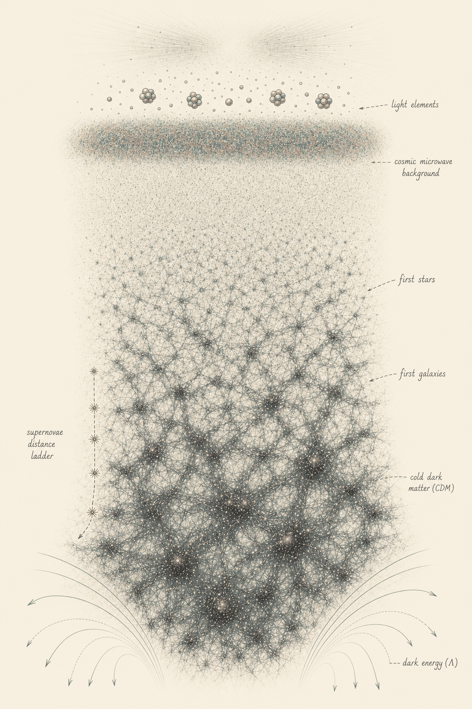
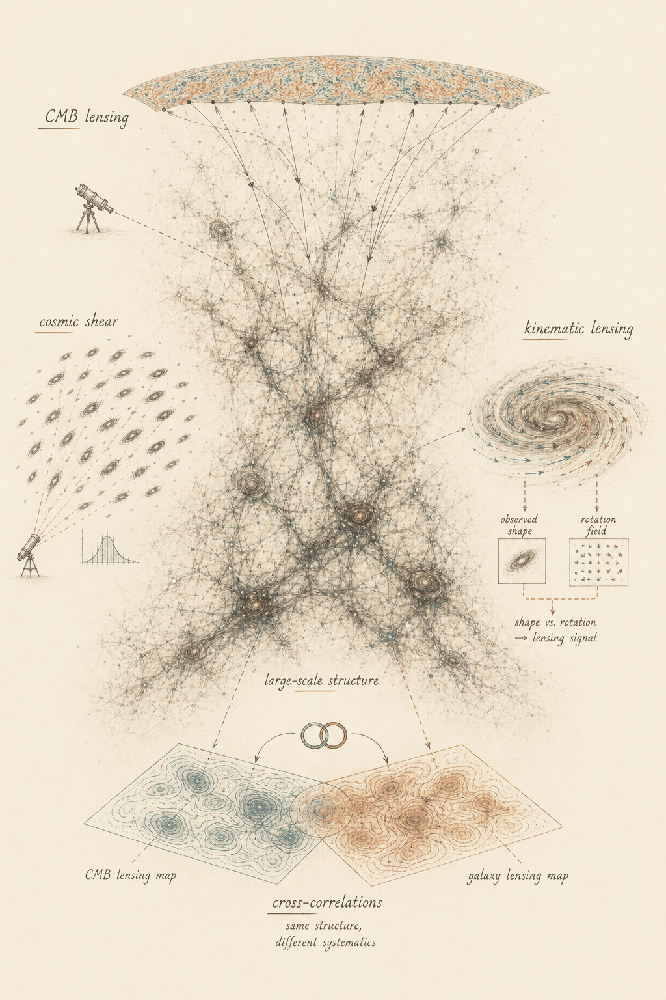

## A century of observation, six numbers, and a 95% we can't explain {#standard-model}

:::::::::::::: {.columns}
::: {.column style="width:52%"}

::: {style="margin-top:0.3em"}
A century of observation has converged on a single model: ordinary and dark matter,
expanding ever faster under **dark energy**. We call it **ΛCDM**.
:::

::: {style="margin-top:0.8em"}
**Six parameters** fit it all at once — the cosmic microwave background, the large-scale
distribution of galaxies, supernova distances, the abundances of the light elements.
:::

::: {style="margin-top:0.8em"}
And yet **95%** of it — **dark energy** and **cold dark matter** — stays *phenomenological*: we
know how it shapes spacetime; we do not know what it is.
:::

:::
::: {.column style="width:48%"}

{.blend-figure width=68%}

<!-- IMAGE PLACEHOLDER (GPT-image-2, slide-images constitution): one illustration tying
     together the probes ΛCDM describes at once, with a hint of where the model strains. -->

:::
::::::::::::::

::: notes
~60 sec — ground the room. Six numbers, many independent probes, all consistent — an
extraordinary success — and yet its dominant ingredients are unexplained. Sets up "so how
do we make progress?".
:::

## Progress now means finding the systematics before they fool us {#precision}

::: {style="margin-top:0.4em"}
We make progress by **pushing this model until something gives** — percent-level measurements
from complementary probes, asking whether the joint picture still needs only those six numbers.
:::

::: {style="margin-top:0.7em"}
Two tensions hold the field's attention: the expansion rate $H_0$ (early vs. nearby disagree
at **~5σ**), and **S₈**, the amplitude of late-time matter clustering.
:::

::: {style="margin-top:0.7em"}
Each time, the same question: **new physics, or an artifact of the instrument, the data, the
analysis?** S₈ is the cautionary tale — weak lensing sat 2–3σ low for years, until KiDS-Legacy
and DES Y6 shifted up and the tension largely dissolved.
:::

::: {style="margin-top:0.7em;font-style:italic"}
As Euclid, Rubin, and next-generation CMB shrink the statistical errors another order of
magnitude, **systematics will set the error budget** — and that is where my work lives.
:::

::: notes
The pivot. Land the two tensions, then the recurring question. The S₈ history is the
cautionary tale — looked like physics, dissolved into systematics; it returns at the close of
the deep-dive. End on "systematics set the budget," which hands straight to my research.
:::

## I map large-scale structure through gravitational lensing {#lensing-landscape}

:::::::::::::: {.columns}
::: {.column style="width:49%"}

::: {style="margin-top:0.3em"}
My wheelhouse is **large-scale structure**: the cosmic web traced by galaxies, dark matter, and
lensed light.
:::

::: {style="margin-top:0.55em"}
I work where independent probes read the **same matter field**:
:::

::: {style="margin-top:0.45em;font-size:0.9em"}
- **CMB lensing** with SPT-3G — my maps anchor tight CMB constraints
- **Cosmic shear** with UNIONS — the weak-lensing science in my second talk
- **Kinematic lensing** — galaxy rotation as an independent shape reference
- **SPT × Euclid cross-correlations** — independent maps, shared structure
:::

::: {style="margin-top:0.55em;font-style:italic"}
The common thread is using geometry to separate cosmology from systematics.
:::

:::
::: {.column style="width:51%"}

{.blend-figure width=64%}

:::
::::::::::::::

::: notes
~2 min. This replaces the old three-slide research tour. Point at the diagram: CMB lensing
(SPT-3G PhD maps), cosmic shear (UNIONS, second talk), kinematic lensing (rotation field gives
an independent unlensed-shape reference; Ram/Nakhle mentorship if there is time), and
cross-correlations (Euclid × SPT: independent maps of the same matter). The identity beat:
large-scale structure + gravitational lensing, and a taste for cross-checks where each probe's
systematics are different.
:::

## AI capabilities are doubling every few months {#inflection .metr-slide}

::: {.metr-wrap}
<iframe class="metr-embed" src="https://metr.org/horizon-chart-embed" title="METR — task-completion time horizon (live, interactive)" loading="lazy"></iframe>
:::

::: notes
The conceptual heart — placed FIRST in the proposal half, because it is the *cause* of what
follows. Speak over the live METR chart; toggle linear/log. Beats:
- Sutton's bitter lesson — general computation beats encoded expertise.
- Frontier models now complete ~12-hour expert tasks; doubling time ~4 months; ~2,500× in four
  years if it holds.
- Use the number, then pivot to the next slide: apply that curve to research and the bottleneck
  moves from producing results to verifying them.

OFFLINE FALLBACK (no venue internet): swap the iframe for
  {width=70% fig-align="center"}
:::

## As output outpaces verification, science becomes a design problem {#thesis}

::: {style="margin-top:1.1em;font-size:1.05em"}
Apply that curve to research. The constraint stops being how fast we can **produce** results —
and becomes how fast we can **verify** them.
:::

::: {style="margin-top:1.1em"}
> The question shifts: from *producing results* to **designing research systems that check
> themselves as fast as they discover.**
:::

::: {style="margin-top:1.2em;font-style:italic"}
This is the lens for the program ahead — and it is already how I work.
:::

::: notes
~40 sec. Now the *consequence* of the curve, not its preface: because models can already do
this, output outpaces verification, so the work shifts to designing systems that check
themselves. Pays off again at the program, at benchmarks, and at the close.
:::

## My UNIONS analysis was produced almost entirely by agents I direct {#existence-proof}

:::::::::::::: {.columns}
::: {.column style="width:50%"}

::: {style="margin-top:0.5em"}
- ~10,000 lines of analysis code
- Three independent statistical frameworks
- Full manuscript (Daley et al. 2026)
- **~120,000 lines edited by agents** across the project
:::

:::
::: {.column style="width:50%"}

::: {style="margin-top:0.5em"}
My role shifted to:

- Designing the analysis architecture
- Designing the validation tests
- Verifying correctness at each stage
:::

:::
::::::::::::::

::: {style="margin-top:1em;font-style:italic"}
The peer-reviewed existence proof: from implementation to specification — and the analysis
where I worked it out is my **second talk.**
:::

::: notes
~1 min. The pivot's payoff: peer-reviewed evidence the role-shift is already real. Numbers are
the existence proof for the *program*; science detail punted to Talk 2. The 120k figure lands.
:::

## I'm in takeoff too — and I read almost none of the code {#personal-takeoff}

::: {style="margin-top:0.6em;font-size:1.05em"}
The same curve runs through my own week. Since the start of June, across **`sp_validation`**,
**`ShapePipe`**, and **`cmbx`**, agents under my direction have committed
:::

::: {style="margin-top:0.6em;text-align:center;font-size:2.4em;color:#BC4538;font-weight:600"}
~XX,000 lines
<!-- CAIL TO FINALISE — do not fabricate. OBSERVED 2026-06-06 from the ACTIVE clones (worker
     SSH'd to candide/cineca and ran git log --all --since=2026-06-01 --numstat). The number is
     METHODOLOGY-DEPENDENT by ~10×, so it's your call which framing is honest:

     ACTIVE clones are on CANDIDE under /n17data/cdaley/unions/:
       sp_validation = /n17data/cdaley/unions/pure_eb/code/sp_validation
       shapepipe     = /n17data/cdaley/unions/shapepipe
     (cineca cdaley00/{cmbx,sp_validation} clones are STALE — 0 commits since Jun 1.
      No active cmbx clone with June commits was found on candide or cineca.)

     ADDED LINES since 2026-06-01 (git log --all --numstat):
                       all-authors    author=Daley (your agents commit as cail.daley@cea.fr)
       sp_validation     45,797          2,945
       shapepipe          1,796          1,678
       cmbx                 (no June activity located)
       ------------------------------------------------
       TOTAL             ~47,600         ~4,600

     The all-authors total is inflated by collaborators (Sacha Guerrini) AND by notebook/
     generated-file churn that --all/--numstat counts as "lines". The author-filtered ~4,600 is
     the defensible "under my direction" figure, but undersells the agentic-throughput story you
     want this slide to tell. Recommend: either present ~4,600 honestly as YOUR commits, OR pick
     a cleaner metric (e.g. net diff on the merged branch, or lines in agent-authored commits
     excluding generated/data files) — your call, and verify before the practice jury. -->

:::

::: {style="margin-top:0.6em"}
I read almost none of it. My time goes to **specifying** what the code must do and **designing
the tests** that prove it did — the throughput is the agents'; the **judgment is mine.**
:::

::: {style="margin-top:0.5em;font-style:italic"}
This only works if the verification keeps pace. That apparatus is the program.
:::

::: notes
~1 min. The human mirror of the METR slide — I am on the same exponential. The striking move:
a big code number, then "I read almost none of it." The point is not productivity bragging; it
is that the work has moved to specification and verification, which is exactly the design
problem. Hands directly to the program and the benchmarks. NEEDS the real line count (cluster).
:::

## A four-year program on two axes {#program}

:::::::::::::: {.columns}
::: {.column style="width:50%"}

**UNIONS — tomographic and multi-probe**

::: {style="margin-top:0.3em;font-size:0.85em"}
- **Year 1:** first tomographic cosmic shear constraints from UNIONS-3500
- **Year 3:** full multi-probe — shear + galaxy–galaxy lensing + clustering
- Outcome: percent-level S₈ and a competitive dark-energy equation of state, independent of DES/KiDS
:::

:::
::: {.column style="width:50%"}

**Euclid × CMB — multi-probe cross-correlations**

::: {style="margin-top:0.3em;font-size:0.85em"}
- **Years 1–2:** DR1 cross-correlation science (SPT, ACT, Planck)
- **Years 3–4:** comprehensive multi-probe cross-correlations with DR2
- Foundation already in place: Euclid CMB WG role, SPT MOU
:::

:::
::::::::::::::

::: {style="margin-top:1em;font-style:italic"}
Two axes, milestones defined by **scientific deliverables** — tomographic shear, the
multi-probe gold standard, the first SPT×Euclid cross-correlation.
:::

::: notes
~1.5 min. The program proper — give it room. Both axes build on foundations already in place.
Specific years; milestones are scientific results, not tooling. Next slide: how is this much
breadth tractable for a small team?
:::

## Agentic throughput makes that breadth tractable for a small team {#program-methods}

::: {style="margin-top:0.5em"}
Both axes are ambitious for a team UNIONS' size — its core analysis group is an **order of
magnitude smaller** than DES or KiDS.
:::

::: {style="margin-top:0.6em"}
Agents make the breadth possible: **systematic exploration of analysis choices** — catalog
versions, scale cuts, estimator bases — that would otherwise be prohibitively labour-intensive
at this scale.
:::

::: {style="margin-top:0.6em"}
The careful, validated pipelines built for the first release are the **foundation**; agents
extend their reach rather than replace their rigour.
:::

::: {style="margin-top:0.8em;font-style:italic"}
More exploration, more validation, a complete decision record — **a research system that
scales its own checking.**
:::

::: notes
~1 min. The "why now / why me at this scale" beat. Smallness is the opportunity — less
overhead, real need for throughput, on top of pipelines already careful and validated. Ends on
the thesis callback; hands to the benchmarks.
:::

## I develop the open ecosystem that makes agentic science verifiable {#lightcone}

::: {style="margin-top:0.4em"}
If science is becoming a design problem, **this is the design** — the apparatus that lets the
system check itself. I develop it within **Lightcone Research**, a joint **CNRS–Berkeley**
open-source project: the open ecosystem for **reproducible, composable, and verifiable** science
in the age of agentic AI.
:::

::: {style="margin-top:0.6em"}
My contributions — the layer that makes an agent's work auditable:
:::

:::::::::::::: {.columns}
::: {.column style="width:33%"}
**`felt`**

A traversable decision-and-progress graph — every analysis choice recorded and reviewable
:::
::: {.column style="width:33%"}
**ASTRA**

An open schema that brings the decisions, alternatives, and evidence behind a result into the
record, beside the code and data
:::
::: {.column style="width:33%"}
**Vellum**

A viewer that renders an analysis as a browsable provenance graph — the human audits the agent
:::
::::::::::::::

::: {style="margin-top:0.7em;font-style:italic"}
The risk it answers: agents optimize for plausibility over correctness. Lightcone is the
infrastructure AI co-scientists are missing.
:::

::: notes
~1.5 min — the full Lightcone slide Cail asked for. Voice: scientist-not-builder — I *develop /
contribute to* Lightcone as a scientist, never "founded." The closing line is their own public
framing ("the infrastructure AI co-scientists are missing") — lands in the room without
reaching. Do NOT mention the funding. felt/ASTRA/Vellum are the verification layer that emerged
from doing the science — the wake, not the destination.
:::

## Building agentic science benchmarks {#benchmarks}

::: {style="margin-top:0.5em"}
Provenance makes an analysis *auditable*; **benchmarks** ask whether the agents are actually
**right**. Real analysis tasks — messy, with multiple defensible solutions — that test whether
an agent reaches a sound result *and* leaves a defensible record.
:::

::: {style="margin-top:0.7em"}
- A **Year 2 deliverable**, a growing suite with **DATAIA** and **PostGenAI@Paris**
- With **Pleias**, I compare **sovereign French models against frontier systems** on these
  tasks — a live test of where French-sovereign AI can already do frontier science
:::

::: {style="margin-top:0.7em;font-style:italic"}
The field has no measure of agentic scientific competence yet. This builds one.
:::

::: notes
~1 min. The committee will worry about hallucination and reproducibility — get ahead of it.
Benchmarks are the field-level contribution: a way to *measure* whether agents do science
correctly, not just plausibly. The Pleias line carries the sovereignty angle (French Science
Commons; sovereign-vs-frontier on real verification tasks) — reads well to a CNRS jury and
gives intellectual cover for frontier-model use. DATAIA + PostGenAI@Paris anchor it in the
Paris-Saclay ecosystem.
:::

## The team and the ecosystem are already in place {#team}

:::::::::::::: {.columns}
::: {.column style="width:50%"}

**Team**

- 2 PhD students (Year 1), co-supervised with Martin Kilbinger + Samuel Farrens
- 1 postdoc (Year 2), agentic methods focus
- AI methods guidance: François Lanusse

**The mentorship question**

How do you develop verification instincts in students who have never analysed data *without* AI? Already probing it — the kinematic-lensing supervision, and an M2 internship this spring.

:::
::: {.column style="width:50%"}

**Lab integration**

::: {style="margin-top:0.3em;font-size:0.85em"}
- **UMR AIM (CosmoStat)** — UNIONS analyses, Lightcone Research: Kilbinger, Farrens, Lanusse
- **IAS** — Euclid CMB cross-correlations: Fabbian, Salvati
- **Paris-Saclay ecosystem** — DATAIA, PostGenAI@Paris, Pleias (French Science Commons, sovereign AI)
:::

:::
::::::::::::::

::: notes
The two lab homes map onto the two scientific axes. "Agentic pedagogy" is a genuinely open
question — surfacing it shows intellectual honesty and marks it as a research contribution; it
ties back to the kinematic mentorship, so it reads as practice, not aspiration.
:::

## France is where this program belongs {#summary}

::: {style="margin-top:0.8em"}

1. **Track record** — CMB lensing with SPT-3G (the maps behind its tightest constraints), UNIONS B-modes, Euclid CMB cross-correlations, and the mentorship to grow it

2. **A clear program** — UNIONS tomographic → multi-probe; Euclid-CMB DR1 → DR2; verification benchmarks, made tractable by agentic throughput

3. **The right place** — CosmoStat + IAS + DATAIA: the research ecosystem is here

:::

::: {style="margin-top:1.2em;font-style:italic;text-align:center"}
As science becomes a design problem, the question I find most exciting is how we design research
that checks itself.
:::

::: {style="margin-top:0.5em;text-align:center"}
Thank you.
:::

::: notes
Short close. Three lines — track record, program, France — then the thesis callback to bookend
the open. Leads with SPT (the new emphasis) and folds in mentorship. No new information.
:::
