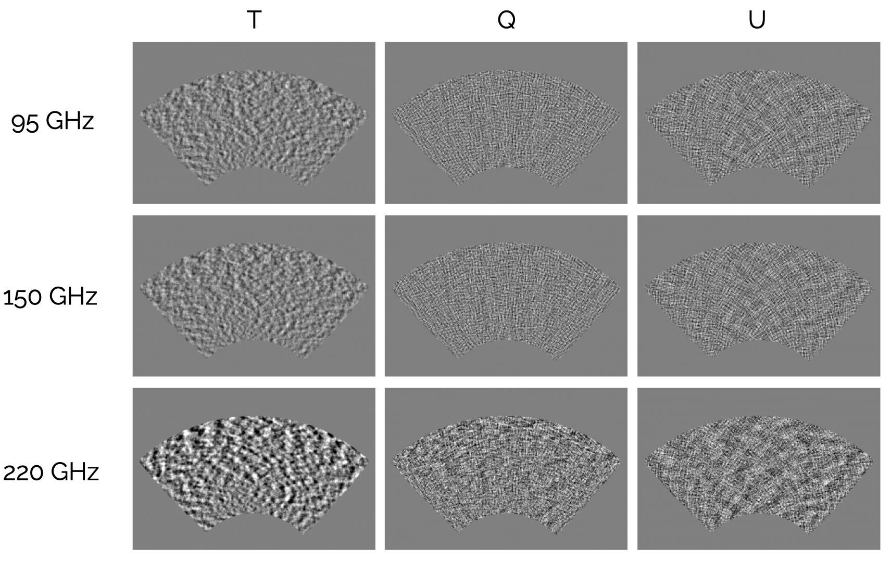
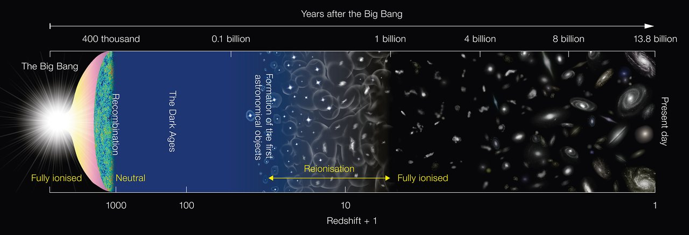
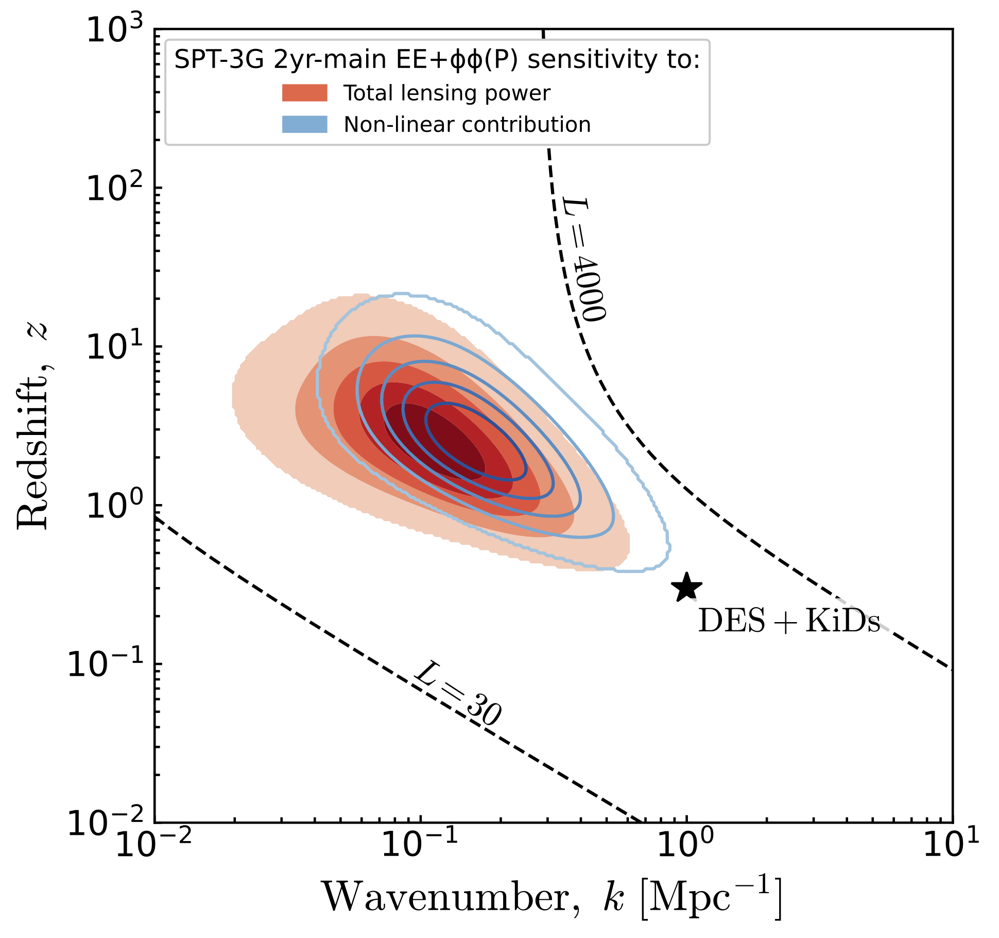
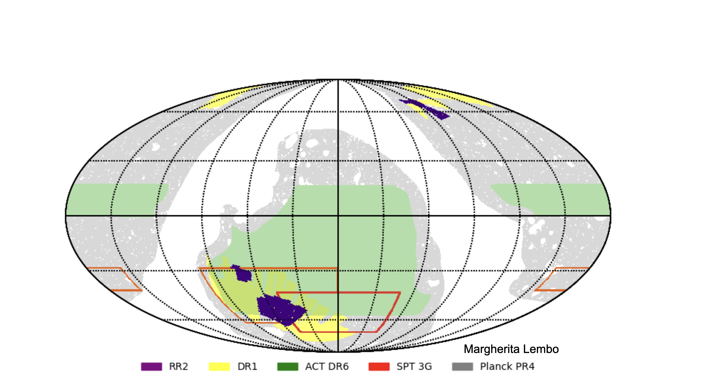

## A six-parameter universe {#standard-model}

:::::::::::::: {.columns}
::: {.column style="width:52%"}

::: {style="margin-top:0.3em"}
A century of observation has converged on a single model: a universe of ordinary
and dark matter, expanding ever faster under **dark energy**. We call it **ΛCDM**.
:::

::: {style="margin-top:0.8em"}
**Six parameters** fit it all at once — the cosmic microwave background, the
large-scale distribution of galaxies, supernova distances, the abundances of the
light elements.
:::

::: {style="margin-top:0.8em"}
And yet **95%** of this universe — the Λ and the cold dark matter — stays
*phenomenological*: we know how it shapes spacetime; we do not know what it is.
:::

:::
::: {.column style="width:48%"}

::: {.img-placeholder}
the probes of ΛCDM, together CMB · galaxies · supernovae · light elements  [ figure to come ]
:::

<!-- IMAGE PLACEHOLDER (GPT-image): one illustration tying together the probes ΛCDM
     describes at once — CMB map, galaxy survey / large-scale structure, supernova
     distance ladder, light-element abundances — with a hint of where the model strains. -->

:::
::::::::::::::

::: notes
~60 seconds — ground the room in the science. The load-bearing beat: six numbers, many
independent probes, all consistent — an extraordinary success. Then the twist: the model
works, but its dominant ingredients are unexplained. Sets up "so how do we make progress?".
:::

## Precision cosmology: systematic, or new physics? {#precision}

::: {style="margin-top:0.4em"}
We make progress by **pushing this model until something gives** — percent-level
measurements from complementary probes, asking whether the joint picture still needs
only those six numbers.
:::

::: {style="margin-top:0.7em"}
Two tensions hold the field's attention:
:::

::: {style="margin-top:0.3em"}
- the expansion rate $H_0$ — the early and nearby universe disagree at **~5σ**
- **S₈**, the amplitude of late-time matter clustering
:::

::: {style="margin-top:0.7em"}
Each time, the same question: is the discrepancy **new physics**, or an artifact of the
instrument, the data, the analysis? S₈ is the cautionary tale — weak lensing sat 2–3σ low
for years, until KiDS-Legacy and DES Y6 shifted upward and the tension largely dissolved.
:::

::: {style="margin-top:0.7em;font-style:italic"}
Euclid, Rubin/LSST, and next-generation CMB shrink the statistical errors another order of
magnitude. **Systematics will dominate every measurement** — and that is where my work lives.
:::

::: notes
The pivot. "Pushing the model until it breaks" is the headline. Land the two tensions, then
the recurring question (systematic or new physics). The S₈ history is the cautionary tale —
a tension that looked like physics and dissolved into systematics; it returns at the close of
the deep-dive talk. End on "systematics will dominate," which hands straight to the research
arc — characterising systematics is the throughline of everything that follows.
:::

## CMB lensing with the South Pole Telescope {#cmb-lensing}

:::::::::::::: {.columns}
::: {.column style="width:50%"}

::: {style="margin-top:0.3em"}
My doctoral work measured **CMB lensing** with **SPT-3G**: as the microwave background
crosses the universe, its path is bent by every clump of matter it passes — reconstructing
that bending maps the matter integrated across most of cosmic history.
:::

::: {style="margin-top:0.6em;font-size:0.92em"}
- Led **one of three independent lensing pipelines** — a quadratic estimator with
  minimum-variance frequency combination and **bias-hardening against galaxy and dust
  contamination, a first for this class of SPT analysis**
- Produced the **CMB maps used by all three pipelines** and the D1 cosmology analyses —
  3,286 observations, three bands, ~60,000 CPU-hours
:::

::: {style="margin-top:0.6em"}
These maps underpin SPT's flagship results: **$H_0 = 66.66 \pm 0.60$ from SPT alone**, and —
with ACT and Planck — **the tightest CMB cosmological constraints to date.**
:::

::: {style="margin-top:0.5em;font-style:italic"}
Data analysis end to end: raw observations → maps → lensing → cosmology.
:::

:::
::: {.column style="width:50%"}

{width=100%}

:::
::::::::::::::

::: notes
~1.5 min. The PhD slide — emphasise breadth (the full chain, raw data to cosmology) and the
D1 maps paper (Quan et al. 2026): I produced the maps everyone downstream uses. The payoff is
the tightness — SPT alone, then SPT+ACT+Planck, the tightest CMB constraints to date. This is
the "I do hard data analysis at the deepest level" credential, and the systematics throughline
starts here (bias-hardening, contamination control).
:::

## From CMB lensing to weak lensing {#weak-lensing}

:::::::::::::: {.columns}
::: {.column style="width:56%"}

::: {style="margin-top:0.4em"}
CMB lensing maps the matter between us and the early universe. **Weak gravitational
lensing** maps the *same* matter a different way — through the shapes of millions of
distant galaxies, subtly sheared by the large-scale structure in front of them.
:::

::: {style="margin-top:0.7em"}
Two complementary windows on one cosmic web: the early-universe light, and the late-time
galaxies.
:::

::: {style="margin-top:0.7em"}
My weak-lensing work is with **UNIONS** — the first wide-field, deep survey of the
**northern sky**, and an independent line on the S₈ question.
:::

::: {style="margin-top:0.5em;font-style:italic"}
That analysis is my **second talk** — here I only place it on the map.
:::

:::
::: {.column style="width:44%"}

{width=100%}

:::
::::::::::::::

::: notes
~45 sec — deliberately brief. The bridge slide: CMB lensing and weak lensing are two probes of
the same matter field, early vs late. This is where large-scale structure / cosmic shear gets
introduced, lightly. UNIONS gets exactly one beat — the punt to Talk 2, where the whole B-mode
analysis lives. Do NOT do the science here; keep the powder dry.
:::

## Kinematic lensing — and mentoring it {#kinematic}

:::::::::::::: {.columns}
::: {.column style="width:56%"}

::: {style="margin-top:0.4em"}
A third, newer probe: **kinematic lensing** — using a galaxy's **rotation**, not just its
shape, to read the lensing distortion. It sidesteps the dominant systematic in cosmic
shear: the unknown *intrinsic* shapes of galaxies.
:::

::: {style="margin-top:0.7em"}
This is where I mentor. Two CosmoStat master's students:
:::

::: {style="margin-top:0.3em;font-size:0.92em"}
- **Jordy Ram** (M2) — kinematic weak lensing with spiral and elliptical galaxies;
  **first paper in preparation**, with Martin Kilbinger, close to submission
- **Serena Nakhle** (M1) — extending the method to integral-field survey data (SAMI, WiFeS)
:::

::: {style="margin-top:0.6em;font-style:italic"}
Supervising the development of a new method end-to-end — the kind of mentorship the program
builds on.
:::

:::
::: {.column style="width:44%"}

{width=100%}

<!-- OPTIONAL (Cail to decide): replace/supplement this figure with headshots of Jordy Ram
     and Serena Nakhle to foreground the mentorship. Flagged as possibly overkill given the
     space — drop the photos in images/ and swap if wanted. -->

:::
::::::::::::::

::: notes
~1 min. The mentorship slide, carried by real science (kinematic lensing). Name both students
and the near-submission paper — concrete, current mentorship, not a promise. The figure is a
kinematic-lensing convergence result. Photos of the two students are an option (warm, signals
you take mentorship seriously) but may be overkill for the room — flagged for Cail.
:::

## Euclid × CMB: cross-correlation {#euclid}

:::::::::::::: {.columns}
::: {.column style="width:58%"}

::: {style="margin-top:0.4em"}
The most robust move of all: **cross-correlate two independent matter maps** — CMB lensing
from SPT-3G, galaxy lensing from Euclid. A systematic that plagues one does not appear in
the other, so their agreement is a clean diagnostic and shared parameters self-calibrate.
:::

::: {style="margin-top:0.7em;font-size:0.95em"}
- **Principal postdoc** in Euclid's CMB cross-correlations working group
- Proposed and lead the accepted **SPT × Euclid MOU** — ~1,600 deg² of overlap
- First science with **DR1, October 2026**
:::

::: {style="margin-top:0.8em"}
Three international collaborations — **SPT-3G, UNIONS, Euclid** — I lead analyses in each.
And across all three the limit is the same: **systematics, not statistics.**
:::

:::
::: {.column style="width:42%"}

{width=100%}

:::
::::::::::::::

::: notes
~1 min. Close the science arc: cross-correlation is the most systematics-robust probe, and I
lead the SPT×Euclid bridge into it. The last line is the hinge of the whole talk — every one of
these measurements is becoming systematics-limited, so the question becomes how exhaustively we
can test assumptions. That hands straight to the AI inflection: exhaustive testing at this scale
is what's newly possible.
:::

## AI capabilities are increasing exponentially {#inflection .metr-slide}

::: {.metr-wrap}
<iframe class="metr-embed" src="https://metr.org/horizon-chart-embed" title="METR — task-completion time horizon (live, interactive)" loading="lazy"></iframe>
:::

::: notes
The conceptual heart of the talk — now placed FIRST in the program half, because it is the
*cause* of everything that follows. Speak over the live METR chart; toggle linear/log to show
the trend both ways. The beats:
- Sutton's bitter lesson — general computation beats encoded expertise, every time.
- Applied to research: frontier models now complete tasks that take a human expert ~12 hours;
  the capability doubling time is ~4 months; if it holds, ~2,500× more capable in four years.
- The "2,500×" number is striking — use it, then pivot to the next slide: apply that curve to
  research and the bottleneck moves from producing results to verifying them.

OFFLINE FALLBACK (no internet at the venue): replace the iframe above with the static image:
  {width=70% fig-align="center"}
:::

## Science is becoming a design problem {#thesis}

::: {style="margin-top:1.1em;font-size:1.05em"}
Apply that curve to research. The constraint stops being how fast we can **produce**
results — and becomes how fast we can **verify** them.
:::

::: {style="margin-top:1.1em"}
> The question shifts: from *producing results* to **designing research systems
> that check themselves as fast as they discover.**
:::

::: {style="margin-top:1.2em;font-style:italic"}
This is the lens for the program ahead — and it is already how I work.
:::

::: notes
The framing beat — ~40 seconds. Now it lands as the *consequence* of the capability curve, not
before it: because models can already do this, output begins to outpace verification, so the
work shifts to designing systems that check themselves. The thesis pays off again at the
four-year program ("a system that scales its own checking"), at verification, and at the close.
Researcher altitude — the verification apparatus is the wake of doing the science.
:::

## The existence proof: UNIONS Paper II {#existence-proof}

::: {style="margin-top:0.6em"}
I did not arrive at this in the abstract. My **UNIONS B-mode analysis** was produced
**almost entirely by AI agents under my direction**:
:::

:::::::::::::: {.columns}
::: {.column style="width:50%"}

::: {style="margin-top:0.5em"}
- ~10,000 lines of analysis code
- Three independent statistical frameworks
- Full manuscript (Daley et al. 2026)
- **~120,000 lines edited by agents** across the project
:::

:::
::: {.column style="width:50%"}

::: {style="margin-top:0.5em"}
My role shifted to:

- Designing the analysis architecture
- Designing the validation tests
- Verifying correctness at each stage
:::

:::
::::::::::::::

::: {style="margin-top:1em;font-style:italic"}
This is how I already work — and the analysis where I worked it out is my **second talk**.
Here, it is the existence proof: the program ahead is reachable for a small team.
:::

::: notes
~1 min. The pivot's payoff: we said the role shifts to specification/design/verification — here
is the peer-reviewed evidence it is already happening. Reframed from the old deck: the numbers
are the existence proof for the *program*, and the science detail is explicitly punted to Talk 2
("the analysis where I worked it out is my second talk"). The 120k-lines figure always lands.
:::

## A four-year research program {#program}

:::::::::::::: {.columns}
::: {.column style="width:50%"}

**UNIONS — tomographic and multi-probe**

::: {style="margin-top:0.3em;font-size:0.85em"}
- **Year 1:** first tomographic cosmic shear constraints from UNIONS-3500
- **Year 3:** full multi-probe — shear + galaxy–galaxy lensing + clustering
- Outcome: percent-level S₈ and a competitive dark-energy equation of state, independent of DES/KiDS
:::

:::
::: {.column style="width:50%"}

**Euclid × CMB — multi-probe cross-correlations**

::: {style="margin-top:0.3em;font-size:0.85em"}
- **Years 1–2:** DR1 cross-correlation science (SPT, ACT, Planck)
- **Years 3–4:** comprehensive multi-probe cross-correlations with DR2
- Foundation already in place: Euclid CMB WG role, SPT MOU
:::

:::
::::::::::::::

::: {style="margin-top:1em;font-style:italic"}
Two axes, milestones defined by **scientific deliverables** — tomographic shear, the
multi-probe gold standard, the first SPT×Euclid cross-correlation.
:::

::: notes
~1.5 min. The program proper — give it room. Two axes, both building on foundations already in
place (the UNIONS pipelines, the Euclid WG role, the SPT MOU). Be specific about the years;
milestones are scientific results, not tooling. Next slide answers "how is this much breadth
tractable for one researcher and a small team?".
:::

## What makes this breadth tractable {#program-methods}

::: {style="margin-top:0.5em"}
Both axes are ambitious for a team UNIONS' size — its core analysis group is an
**order of magnitude smaller** than DES or KiDS.
:::

::: {style="margin-top:0.6em"}
Agentic methods are what make the breadth possible: **systematic exploration of analysis
choices** — catalog versions, scale cuts, estimator bases — that would otherwise be
prohibitively labour-intensive at this scale.
:::

::: {style="margin-top:0.6em"}
The careful, validated pipelines built for the first release are the **foundation**; agents
extend their reach rather than replace their rigour.
:::

::: {style="margin-top:0.8em;font-style:italic"}
More exploration, more validation, a complete decision record — **a research system that
scales its own checking.**
:::

::: notes
~1 min. The "why now / why me at this scale" beat. The smallness of the UNIONS team is the
opportunity, not the limitation: less overhead, and a genuine need for the throughput agentic
methods supply, on top of pipelines that are already careful and validated. Ends on the thesis
callback and hands to verification — the apparatus that makes "scales its own checking" real.
:::

## Verification and benchmarks {#verification}

::: {style="margin-top:0.5em"}
If science is becoming a design problem, **this is the design** — the apparatus that lets the
system check itself.
:::

::: {style="margin-top:0.5em"}
The risk it answers: **AI systems hallucinate.** They optimize for plausibility over correctness.
:::

::: {style="margin-top:0.6em"}
Tools in development (with François Lanusse, Lightcone Research):
:::

:::::::::::::: {.columns}
::: {.column style="width:33%"}
**`felt`**

Traversable decision and progress graph — every analysis choice is traceable
:::
::: {.column style="width:33%"}
**ASTRA specification**

Structured, machine-readable analysis records; structured outputs for agent-written analyses
:::
::: {.column style="width:33%"}
***Tapestries***

Browsable provenance visualisation — the human can audit the agent's decisions
:::
::::::::::::::

::: {style="margin-top:0.8em"}
**Benchmarks** — real analysis tasks: messy, with multiple defensible solutions. Year 2 deliverable; growing suite in collaboration with DATAIA and PostGenAI@Paris.
:::

::: notes
Don't skip this slide. The committee will have concerns about hallucination and reproducibility —
get ahead of it. Naming the risk plainly signals scientific maturity. The three tools show the
verification layer being developed alongside the AI — the wake of doing the science, not a product.
:::

## Team, mentorship, and lab integration {#team}

:::::::::::::: {.columns}
::: {.column style="width:50%"}

**Team**

- 2 PhD students (Year 1), co-supervised with Martin Kilbinger + Samuel Farrens
- 1 postdoc (Year 2), agentic methods focus
- AI methods guidance: François Lanusse

**The mentorship question**

How do you develop verification instincts in students who have never analysed data *without* AI? Already probing it — the kinematic-lensing supervision, and an M2 internship this spring.

:::
::: {.column style="width:50%"}

**Lab integration**

::: {style="margin-top:0.3em;font-size:0.85em"}
- **UMR AIM (CosmoStat)** — UNIONS analyses, Lightcone Research: Kilbinger, Farrens, Lanusse
- **IAS** — Euclid CMB cross-correlations: Fabbian, Salvati, Bonnaire
- **Paris-Saclay ecosystem** — DATAIA, PostGenAI@Paris, Pleias (French Science Commons, sovereign AI)
:::

:::
::::::::::::::

::: notes
The two lab homes map cleanly onto the two scientific axes (UMR AIM for UNIONS, IAS for
Euclid-CMB). "Agentic pedagogy" is a genuinely open question — surfacing it shows intellectual
honesty and marks it as a research contribution in its own right; it ties back to the kinematic
mentorship shown earlier, so it reads as practice, not aspiration.
:::

## Summary {#summary}

::: {style="margin-top:0.8em"}

1. **Strong track record** — CMB lensing with SPT-3G (the maps behind its tightest constraints), UNIONS B-modes, Euclid CMB cross-correlations, and the mentorship to grow it

2. **Clear program** — UNIONS tomographic → multi-probe; Euclid-CMB DR1 → DR2; verification benchmarks, made tractable by agentic methods

3. **France is the right place** — CosmoStat + IAS + DATAIA: the research ecosystem is here

:::

::: {style="margin-top:1.2em;font-style:italic;text-align:center"}
As science becomes a design problem, the question I find most exciting is how we design research that checks itself.
:::

::: {style="margin-top:0.5em;text-align:center"}
Thank you.
:::

::: notes
Short, punchy close. Three lines — track record, program, France — then the thesis callback to
bookend the opening frame. The track-record line now leads with SPT-3G (the restructure's new
emphasis) and folds in mentorship. Don't add new information here.
:::
