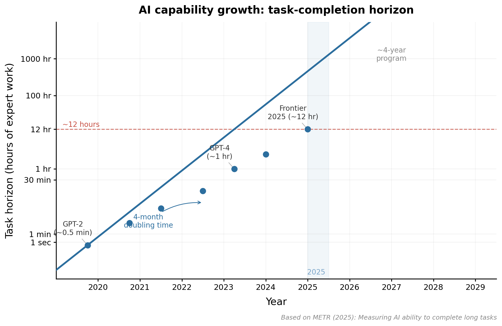

## A six-parameter universe {#standard-model}

:::::::::::::: {.columns}
::: {.column style="width:52%"}

::: {style="margin-top:0.3em"}
A century of observation has converged on a single model: a universe of ordinary
and dark matter, expanding ever faster under **dark energy**. We call it **ΛCDM**.
:::

::: {style="margin-top:0.8em"}
**Six parameters** fit it all at once — the cosmic microwave background, the
large-scale distribution of galaxies, supernova distances, the abundances of the
light elements.
:::

::: {style="margin-top:0.8em"}
And yet **95%** of this universe — the Λ and the cold dark matter — stays
*phenomenological*: we know how it shapes spacetime; we do not know what it is.
:::

:::
::: {.column style="width:48%"}

::: {.img-placeholder}
the probes of ΛCDM, together CMB · galaxies · supernovae · light elements  [ figure to come ]
:::

<!-- IMAGE PLACEHOLDER (GPT-image): one illustration tying together the probes ΛCDM
     describes at once — CMB map, galaxy survey / large-scale structure, supernova
     distance ladder, light-element abundances — with a hint of where the model strains. -->

:::
::::::::::::::

::: notes
~60 seconds — ground the room in the science. The load-bearing beat: six numbers, many
independent probes, all consistent — an extraordinary success. Then the twist: the model
works, but its dominant ingredients are unexplained. Sets up "so how do we make progress?".
:::

## Precision cosmology: systematic, or new physics? {#precision}

::: {style="margin-top:0.4em"}
We make progress by **pushing this model until something gives** — percent-level
measurements from complementary probes, asking whether the joint picture still needs
only those six numbers.
:::

::: {style="margin-top:0.7em"}
Two tensions hold the field's attention:
:::

::: {style="margin-top:0.3em"}
- the expansion rate $H_0$ — the early and nearby universe disagree at **~5σ**
- **S₈**, the amplitude of late-time matter clustering
:::

::: {style="margin-top:0.7em"}
Each time, the same question: is the discrepancy **new physics**, or an artifact of the
instrument, the data, the analysis? S₈ is the cautionary tale — weak lensing sat 2–3σ low
for years, until KiDS-Legacy and DES Y6 shifted upward and the tension largely dissolved.
:::

::: {style="margin-top:0.7em;font-style:italic"}
Euclid, Rubin/LSST, and next-generation CMB shrink the statistical errors another order of
magnitude. **Systematics will dominate every measurement** — and that is where my work lives.
:::

::: notes
The pivot. "Pushing the model until it breaks" is the headline. Land the two tensions, then
the recurring question (systematic or new physics). The S₈ history is the cautionary tale —
a tension that looked like physics and dissolved into systematics; it returns at the close of
the deep-dive talk. End on "systematics will dominate," which hands straight to the research
arc — characterising systematics is the throughline of everything that follows.
:::

## Research arc: from CMB to weak lensing

:::::::::::::: {.columns}
::: {.column style="width:50%"}

**South Pole Telescope — CMB lensing**

::: {style="margin-top:0.3em;font-size:0.85em"}
- SPT-3G CMB power spectra and lensing reconstruction
- Euclid × SPT cross-correlation MOU
- Post-doctoral work at CEA, CosmoStat
:::

:::
::: {.column style="width:50%"}

**UNIONS-3500 — cosmic shear**

::: {style="margin-top:0.3em;font-size:0.85em"}
- UNIONS-3500 B-mode systematics → cosmology (Paper II, III–V)
- Kinematic lensing (Hopp & Wittman 2026, co-supervision)
- Euclid CMB cross-correlations working group (principal postdoc)
:::

:::
::::::::::::::

::: {style="margin-top:1.2em"}
Three international collaborations: **UNIONS**, **Euclid**, **SPT-3G**. I lead analyses in each.
:::

::: notes
Set the scope early: I'm a cosmologist who works across lensing probes. The CMB→weak lensing trajectory shows methodological breadth. The three collaborations signal that I operate at scale.
:::

## UNIONS-3500: B-modes and northern-sky cosmology {#unions-result}

:::::::::::::: {.columns}
::: {.column style="width:52%"}

{width=100%}

:::
::: {.column style="width:48%"}

::: {style="margin-top:0.4em"}
**UNIONS** — MegaCam/CFHT, ~3500 deg², first northern-sky wide-field weak lensing

**Paper II (B-modes):**
- Three independent statistics (COSEBIs, $\xi_\pm^B$, $C_\ell^{BB}$)
- Key finding: statistics disagree over the full angular range
- That disagreement is the information — forces scale cuts, identifies contamination
:::

::: {style="margin-top:0.6em"}
**Papers III–V:** S₈ constraints consistent with Planck and Stage-III at ~1σ
:::

:::
::::::::::::::

::: notes
This is the flagship result. The B-mode data vector panel is the centrepiece — it shows the three statistics diverging over the full angular range, which is exactly what led to the scale cuts and clean cosmology.
Don't rush this slide. The finding ("statistics disagree") is counterintuitive at first but immediately compelling once explained.
:::

## Science is becoming a design problem {#thesis}

::: {style="margin-top:1.3em;font-size:1.05em"}
Research is accelerating — and increasingly AI-mediated. Scientific output is
beginning to **outpace our ability to verify it.**
:::

::: {style="margin-top:1.1em"}
> The question shifts: from *producing results* to **designing research systems
> that check themselves as fast as they discover.**
:::

::: {style="margin-top:1.2em;font-style:italic"}
This through-line runs through the work you just saw, how I produce it, and the
four-year program ahead.
:::

::: notes
The framing beat — ~40 seconds. This is the lens for everything else. Having just shown a
cosmology result and the research arc, name the meta-point: verification is becoming the
bottleneck, so the work shifts to designing systems that check themselves. Let it breathe,
then the AI inflection slide explains why this is suddenly tractable. The thesis pays off
again at the four-year program ("a system that scales its own checking"), at verification,
and at the close. Researcher altitude — the verification apparatus is the wake of doing the
science.
:::

## AI capabilities are increasing exponentially {#inflection .metr-slide}

::: {.metr-wrap}
<iframe class="metr-embed" src="https://metr.org/horizon-chart-embed" title="METR — task-completion time horizon (live, interactive)" loading="lazy"></iframe>
:::

::: notes
The conceptual heart of the talk — the live METR chart. Speak over it; toggle linear/log live to
show the trend both ways. The beats:
- Sutton's bitter lesson — general computation beats encoded expertise, every time.
- Applied to research: frontier models now complete tasks that take a human expert ~12 hours;
  the capability doubling time is ~4 months; if it holds, ~2,500× more capable in four years.
- The "2,500×" number is striking — use it, then pivot: the researcher's job doesn't disappear,
  it upgrades. This is the design problem — the role shifts from implementation to specification,
  design, and verification.

OFFLINE FALLBACK (no internet at the venue): replace the iframe above with the static image:
  {width=70% fig-align="center"}
:::

## The existence proof: UNIONS Paper II {#existence-proof}

::: {style="margin-top:0.5em"}
This analysis was produced almost entirely by AI agents under my direction:
:::

:::::::::::::: {.columns}
::: {.column style="width:50%"}

::: {style="margin-top:0.5em"}
- ~10,000 lines of analysis code
- Three independent statistical frameworks
- Full manuscript (Daley et al. 2026)
- **~120,000 lines edited by agents** across the project
:::

:::
::: {.column style="width:50%"}

::: {style="margin-top:0.5em"}
My role:

- Designing the analysis architecture
- Designing the validation tests
- Verifying correctness at each stage
:::

:::
::::::::::::::

::: {style="margin-top:1em;font-style:italic"}
This is how I already work.
:::

::: notes
Build on the previous slide. The existence proof should feel like a landing: we said the role shifts to specification/design/verification — here's the evidence that this is already happening, in a paper that's been peer-reviewed.
The 120k lines number always lands well. Use it.
:::

## Euclid × CMB: cross-correlation science

:::::::::::::: {.columns}
::: {.column style="width:58%"}

::: {style="margin-top:0.4em"}
- Principal postdoc in Euclid's **CMB cross-correlations** science working group
- Lead the **SPT–Euclid MOU** project
- DR1 (October 2026): first science coming
:::

::: {style="margin-top:0.8em"}
Cross-correlations are robust: independent systematics between CMB lensing and galaxy lensing — neither contaminant appears in both probes.
:::

:::
::: {.column style="width:42%"}

{width=100%}

:::
::::::::::::::

::: notes
Brief slide — 45 sec. Land "principal postdoc" and DR1 in October. The independent systematics argument is the scientific justification for why these cross-correlations matter.
:::

## A four-year research program {#program}

:::::::::::::: {.columns}
::: {.column style="width:50%"}

**UNIONS — tomographic and multi-probe**

::: {style="margin-top:0.3em;font-size:0.85em"}
- **Year 1:** first tomographic cosmic shear constraints from UNIONS-3500
- **Year 3:** multi-probe analysis (shear + GGL + clustering)
- Outcome: percent-level S₈ constraints, independent of DES/KiDS
:::

:::
::: {.column style="width:50%"}

**Euclid × CMB — multi-probe cross-correlations**

::: {style="margin-top:0.3em;font-size:0.85em"}
- **Years 1–2:** DR1 cross-correlation science (SPT, ACT, Planck)
- **Years 3–4:** comprehensive multi-probe cross-correlations with DR2
- Foundation already in place: Euclid CMB WG role, SPT MOU
:::

:::
::::::::::::::

::: {style="margin-top:1em;font-style:italic"}
Both axes also work the design problem directly: **a research system that scales its own checking** — more exploration, more validation, a complete decision record.
:::

::: notes
Two axes, one unifying thread. The key pitch: the agentic methods open up a programme that would be impractical with hand-coding alone. Be specific about the years; milestones defined by scientific deliverables, not tooling.
:::

## Verification and benchmarks

::: {style="margin-top:0.5em"}
If science is becoming a design problem, **this is the design** — the apparatus that lets the system check itself.
:::

::: {style="margin-top:0.5em"}
The risk it answers: **AI systems hallucinate.** They optimize for plausibility over correctness.
:::

::: {style="margin-top:0.6em"}
Tools in development (with François Lanusse, Lightcone Research):
:::

:::::::::::::: {.columns}
::: {.column style="width:33%"}
**`felt`**

Traversable decision and progress graph — every analysis choice is traceable
:::
::: {.column style="width:33%"}
**ASTRA specification**

Structured, machine-readable analysis records; structured outputs for agent-written analyses
:::
::: {.column style="width:33%"}
***Tapestries***

Browsable provenance visualisation — the human can audit the agent's decisions
:::
::::::::::::::

::: {style="margin-top:0.8em"}
**Benchmarks** — real analysis tasks: messy, with multiple defensible solutions. Year 2 deliverable; growing suite in collaboration with DATAIA and PostGenAI@Paris.
:::

::: notes
Don't skip this slide. The committee will have concerns about hallucination and reproducibility — get ahead of it. Naming the risk plainly signals scientific maturity. The three tools show the verification layer being developed alongside the AI.
:::

## Team, mentorship, and lab integration

:::::::::::::: {.columns}
::: {.column style="width:50%"}

**Team**

- 2 PhD students (Year 1), co-supervised with Martin Kilbinger + Samuel Farrens
- 1 postdoc (Year 2), agentic methods focus
- AI methods guidance: François Lanusse

**Mentorship question**

How do you develop verification instincts in students who haven't learned without AI? Early experiments in progress (M2 internship, Spring 2026).

:::
::: {.column style="width:50%"}

**Lab integration**

::: {style="margin-top:0.3em;font-size:0.85em"}
- **UMR AIM (CosmoStat)** — UNIONS analyses, Lightcone Research: Kilbinger, Farrens, Lanusse
- **IAS** — Euclid CMB cross-correlations: Fabbian, Salvati, Bonnaire
- **Paris-Saclay ecosystem** — DATAIA, PostGenAI@Paris, Pleias (French Science Commons, sovereign AI)
:::

:::
::::::::::::::

::: notes
"Agentic pedagogy" is a genuinely open question — surfacing it shows intellectual honesty and marks it as a research contribution in its own right. The two lab homes map cleanly onto the two scientific axes (UMR AIM for UNIONS, IAS for Euclid-CMB).
:::

## Summary

::: {style="margin-top:0.8em"}

1. **Strong track record** — UNIONS Paper II (B-modes and cosmology), Euclid CMB cross-correlations (SPT MOU), SPT-3G work

2. **Clear program** — UNIONS tomographic → multi-probe; Euclid-CMB DR1 → DR2; verification benchmarks

3. **France is the right place** — CosmoStat + IAS + DATAIA: the research ecosystem is here

:::

::: {style="margin-top:1.2em;font-style:italic;text-align:center"}
As science becomes a design problem, the question I find most exciting is how we design research that checks itself.
:::

::: {style="margin-top:0.5em;text-align:center"}
Thank you.
:::

::: notes
Short, punchy close. Three lines, same order as the talk, then the thesis callback to bookend the opening frame. Don't add new information here.
:::
