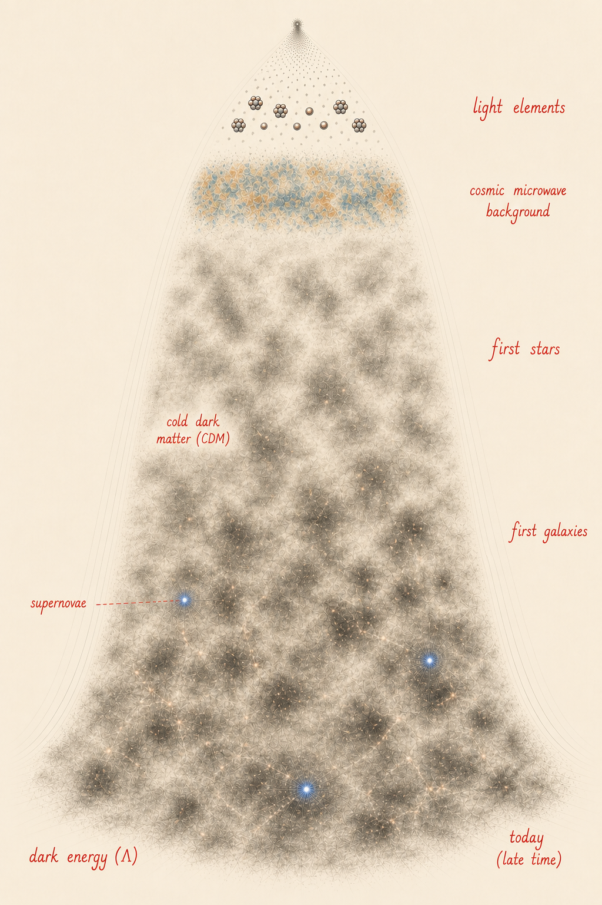
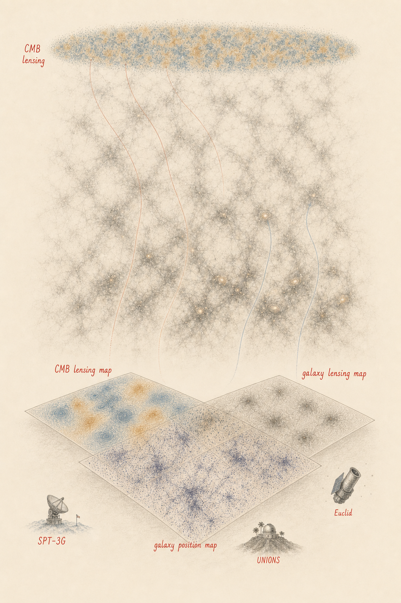
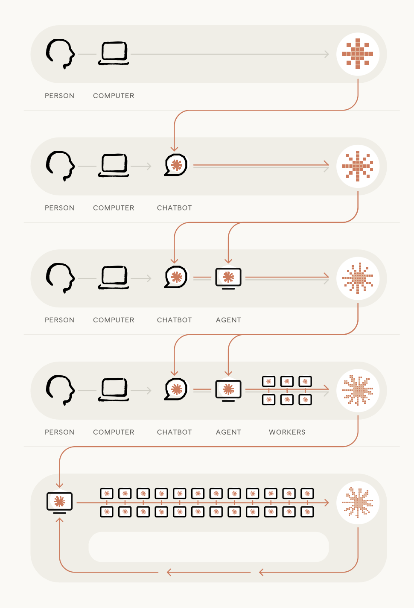
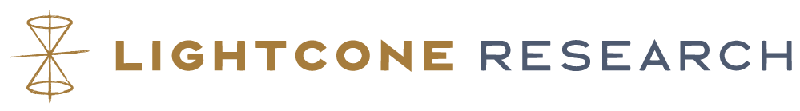

## A successful but unsatisfying model {#standard-model}

:::::::::::::: {.columns}
::: {.column style="width:55%"}

::: {style="margin-top:1.3em"}
A universe dominated by **dark energy** and **cold dark matter**.
:::

::: {style="margin-top:1.9em"}
**Six parameters** describe a diversity of observations.
:::

::: {style="margin-top:1.9em"}
And yet **95%** stays phenomenological: the model describes only their behavior — how dark
energy and dark matter shape spacetime.
:::

:::
::: {.column style="width:45%"}

::: {.standard-model-figure}
{.blend-figure}
:::

<!-- IMAGE PLACEHOLDER (GPT-image-2, slide-images constitution): one illustration tying
     together the probes ΛCDM describes at once, with a hint of where the model strains. -->

:::
::::::::::::::

::: notes
~60 sec — ground the room. Six numbers, many independent probes, all consistent — an
extraordinary success — and yet its dominant ingredients are unexplained. Sets up "so how
do we make progress?".
:::

## Progress now means finding the systematics before they fool us {#precision}

::: {style="margin-top:0.6em"}
We push the model until something gives: does the joint picture still need only **six numbers**?
:::

::: {style="margin-top:1.0em"}
Two tensions hold the field's attention:
:::

::: {style="margin-top:0.5em;font-size:0.95em"}
- **$H_0$** — early and nearby measurements disagree at **~5σ**
- **S₈** — the amplitude of late-time matter clustering
:::

::: {style="margin-top:1.0em"}
Each time, the same question: **new physics, or a systematic?**
:::

::: {style="margin-top:1.0em"}
S₈ is the cautionary tale: it sat 2–3σ low for years, until better data dissolved the tension.
As the errors shrink, **systematics set the budget** — and that is where my work lives.
:::

::: notes
The pivot. Land the two tensions, then the recurring question. The S₈ history is the
cautionary tale — looked like physics, dissolved into systematics; it returns at the close of
the deep-dive. End on "systematics set the budget," which hands straight to my research.
:::

## Combining observables to test ΛCDM and understand systematics {#lensing-landscape}

:::::::::::::: {.columns}
::: {.column style="width:58%"}

::: {style="margin-top:0.15em"}
Large-scale structure gives three complementary views of the same matter field.
:::

::: {style="margin-top:0.3em"}
The leverage comes from combining observables whose systematics are different:
:::

::: {style="margin-top:0.3em;font-size:0.78em"}
- **CMB lensing** with SPT-3G — an integral over the full matter distribution
- **Galaxy lensing** with UNIONS and Euclid — late-time structure through cosmic shear
- **Galaxy positions** with Euclid — clustering as an independent density tracer
- **Cross-correlations** — shared cosmology, different failure modes
:::

::: {style="margin-top:0.35em;font-size:0.86em"}
Independent observables turn systematics into testable differences.
:::

:::
::: {.column style="width:42%"}

::: {.research-landscape-figure}
{.blend-figure}
:::

:::
::::::::::::::

::: notes
~2 min. This replaces the old three-slide research tour. Point at the diagram: CMB lensing
(SPT-3G PhD maps), cosmic shear (UNIONS, second talk), kinematic lensing (rotation field gives
an independent unlensed-shape reference; Ram/Nakhle mentorship if there is time), and
cross-correlations (Euclid × SPT: independent maps of the same matter). The identity beat:
large-scale structure + gravitational lensing, and a taste for cross-checks where each probe's
systematics are different.
:::

## AI capabilities are doubling every few months {#inflection .metr-slide}

::: {.fragment .metr-step}
:::

::: {.metr-stage}

::: {.metr-chart-title}
Time horizon of software tasks
:::

::: {.metr-chart-wrap}

::: {.metr-cropbox}
<iframe class="metr-embed" src="https://metr.org/horizon-chart-embed" title="METR — task-completion time horizon (live, interactive)" loading="lazy"></iframe>
:::

:::

::: {.metr-diagram-col}

::: {.metr-title}
And human work is changing as models improve
:::

::: {.anthropic-diagram}
{.blend-figure}
:::

:::

:::

::: notes
The conceptual heart — placed FIRST in the proposal half, because it is the *cause* of what
follows. TWO-BEAT REVEAL: the slide opens with the live METR chart full-width — speak over it,
land the doubling. Then one click: the chart slides to the left half and Anthropic's own
autonomy-progression diagram fades in on the right (person → chatbot → agent → workers → closing
the loop — the human role recedes up the stack). External benchmark + the view from inside a
frontier lab. Beats:
- Sutton's bitter lesson — general computation beats encoded expertise.
- Frontier models now complete ~12-hour expert tasks; doubling time ~4 months; ~2,500× in four
  years if it holds.
- Then the human mirror (the diagram): even the labs building these models are climbing this
  ladder — agents direct agents, the person moves to the top. Apply that to research → next slide.

The diagram is from Anthropic's 2026 piece "When AI builds itself" (recursive self-improvement);
credited on slide. OFFLINE FALLBACK (no venue internet): swap the iframe for
  {width=100% fig-align="center"}
:::

## As output outpaces verification, science becomes a design problem {#thesis}

::: {style="margin-top:1.0em;font-size:1.05em"}
Apply that curve to research, and **verification becomes the constraint** — how fast we can
check what the agents produce.
:::

::: {style="margin-top:1.0em"}
> An area of human comparative advantage, **for now**, is research taste and judgment, including
> choosing which problems matter, **which results to trust**, and when an approach is a dead end.

::: {.thesis-credit}
— [Anthropic, "When AI builds itself" (2026)](https://www.anthropic.com/institute/recursive-self-improvement)
:::
:::

::: {style="margin-top:1.0em"}
> The question shifts to **designing research systems that check themselves as fast as they
> discover.**
:::

::: {style="margin-top:1.0em"}
The lens for the program ahead — and already how I work.
:::

::: notes
~40 sec. Now the *consequence* of the curve, not its preface: because models can already do
this, output outpaces verification, so the work shifts to designing systems that check
themselves. Pays off again at the program, at benchmarks, and at the close.
:::

## My UNIONS analysis was produced almost entirely by agents I direct {#existence-proof}

:::::::::::::: {.columns}
::: {.column style="width:50%"}

::: {style="margin-top:0.5em"}
- ~10,000 lines of analysis code
- Three independent statistical frameworks
- Full manuscript (Daley et al. 2026)
- **~120,000 lines edited by agents** across the project
:::

:::
::: {.column style="width:50%"}

::: {style="margin-top:0.5em"}
My role shifted to:

- Designing the analysis architecture
- Designing the validation tests
- Verifying correctness at each stage
:::

:::
::::::::::::::

::: {style="margin-top:1em"}
The peer-reviewed existence proof: from implementation to specification — and the analysis
where I worked it out is my **second talk.**
:::

::: notes
~1 min. The pivot's payoff: peer-reviewed evidence the role-shift is already real. Numbers are
the existence proof for the *program*; science detail punted to Talk 2. The 120k figure lands.
:::

## A four-year program on two axes {#program}

:::::::::::::: {.columns}
::: {.column style="width:50%"}

**UNIONS — tomographic and multi-probe**

::: {style="margin-top:0.3em;font-size:0.85em"}
- **Year 1:** first tomographic cosmic shear constraints from UNIONS-3500
- **Year 3:** full multi-probe — shear + galaxy–galaxy lensing + clustering
- Outcome: percent-level S₈ and a competitive dark-energy equation of state, independent of DES/KiDS
:::

:::
::: {.column style="width:50%"}

**Euclid × CMB — multi-probe cross-correlations**

::: {style="margin-top:0.3em;font-size:0.85em"}
- **Years 1–2:** DR1 cross-correlation science (SPT, ACT, Planck)
- **Years 3–4:** comprehensive multi-probe cross-correlations with DR2
- Foundation already in place: Euclid CMB WG role, SPT MOU
:::

:::
::::::::::::::

::: {style="margin-top:1em"}
Two axes, milestones defined by **scientific deliverables** — tomographic shear, the
multi-probe gold standard, the first SPT×Euclid cross-correlation.
:::

::: notes
~1.5 min. The program proper — give it room. Both axes build on foundations already in place.
Specific years; milestones are scientific results, not tooling. Next slide: how is this much
breadth tractable for a small team?
:::

## Agentic throughput makes that breadth tractable for a small team {#program-methods}

::: {style="margin-top:0.6em"}
UNIONS' core analysis group is an **order of magnitude smaller** than DES or KiDS.
:::

::: {style="margin-top:0.9em"}
Agents make the breadth possible — **systematic exploration of catalog versions, scale cuts, and
estimator bases**, prohibitive by hand at this scale.
:::

::: {style="margin-top:0.9em"}
They extend the reach of pipelines already careful and validated.
:::

::: {style="margin-top:1.0em"}
More exploration, more validation, a complete decision record — **a system that scales its own
checking.**
:::

::: notes
~1 min. The "why now / why me at this scale" beat. Smallness is the opportunity — less
overhead, real need for throughput, on top of pipelines already careful and validated. Ends on
the thesis callback; hands to the benchmarks.
:::

## I build open tools that keep an AI agent's science auditable {#lightcone}

::: {style="margin-top:0.55em;text-align:center"}
{.lightcone-logo}
:::

::: {style="margin-top:0.55em"}
**Lightcone Research** — a joint **CNRS–Berkeley** open-source initiative building the tooling for
**reproducible, composable, and verifiable** science in the age of agentic AI.
:::

::: {style="margin-top:0.6em"}
Within it, I develop the **agentic layer** — how agents are directed, and how their work is recorded:
:::

:::::::::::::: {.columns}
::: {.column style="width:50%"}
**`felt`**

A traversable record of every analysis choice, alternative, and result — an agent's work made auditable.
:::
::: {.column style="width:50%"}
**Skills**

Reusable, shareable methods that direct agents through a rigorous analysis the same way each time.
:::
::::::::::::::

::: {style="margin-top:0.7em"}
The risk it answers: agents optimize for plausibility over correctness — the open infrastructure
AI co-scientists are missing.
:::

::: notes
~1.5 min. Voice: scientist-not-builder — I develop / contribute to Lightcone Research, never
"founded," and never mention funding. My contribution is the AGENTIC LAYER — felt (the
provenance/decision record) and Skills (the reusable methods that direct agents). Do NOT mention
Vellum, and do NOT claim ASTRA (not mine). felt + Skills are how an agent is directed and how its
work is recorded, which is what keeps AI-run analysis auditable. The closing line is a public
framing that lands without reaching.
:::

## Benchmarks test whether the agents are actually right {#benchmarks}

::: {style="margin-top:0.5em"}
Provenance makes the work auditable. The benchmark itself is **real analysis tasks** — messy,
with multiple defensible solutions — scored on whether an agent reaches a sound result and
leaves a defensible record.
:::

::: {style="margin-top:0.7em"}
- A **Year 2 deliverable**, a growing suite with **DATAIA** and **PostGenAI@Paris**
- With **Pleias**, I compare **sovereign French models against frontier systems** — a live test
  of where French-sovereign AI can already do frontier science
:::

::: {style="margin-top:0.7em"}
The field has no measure of agentic scientific competence yet. This builds one.
:::

::: notes
~1 min. The committee will worry about hallucination and reproducibility — get ahead of it.
Benchmarks are the field-level contribution: a way to *measure* whether agents do science
correctly, not just plausibly. The Pleias line carries the sovereignty angle (French Science
Commons; sovereign-vs-frontier on real verification tasks) — reads well to a CNRS jury and
gives intellectual cover for frontier-model use. DATAIA + PostGenAI@Paris anchor it in the
Paris-Saclay ecosystem.
:::

## The team and the ecosystem are already in place {#team}

:::::::::::::: {.columns}
::: {.column style="width:50%"}

**Team**

- 2 PhD students (Year 1), co-supervised with Martin Kilbinger + Samuel Farrens
- 1 postdoc (Year 2), agentic methods focus
- AI methods guidance: François Lanusse

**The mentorship question**

How do you develop verification instincts in students who have never analysed data without AI? Already probing it — the kinematic-lensing supervision, and an M2 internship this spring.

:::
::: {.column style="width:50%"}

**Lab integration**

::: {style="margin-top:0.3em;font-size:0.85em"}
- **UMR AIM (CosmoStat)** — UNIONS analyses, Lightcone Research: Kilbinger, Farrens, Lanusse
- **IAS** — Euclid CMB cross-correlations: Fabbian, Salvati
- **Paris-Saclay ecosystem** — DATAIA, PostGenAI@Paris, Pleias (French Science Commons, sovereign AI)
:::

:::
::::::::::::::

::: notes
The two lab homes map onto the two scientific axes. "Agentic pedagogy" is a genuinely open
question — surfacing it shows intellectual honesty and marks it as a research contribution; it
ties back to the kinematic mentorship, so it reads as practice, not aspiration.
:::

## France is where this program belongs {#summary}

::: {style="margin-top:0.8em"}

1. **Track record** — CMB lensing with SPT-3G (the maps behind its tightest constraints), UNIONS B-modes, Euclid CMB cross-correlations, and the mentorship to grow it

2. **A clear program** — UNIONS tomographic → multi-probe; Euclid-CMB DR1 → DR2; verification benchmarks, made tractable by agentic throughput

3. **The right place** — CosmoStat + IAS + DATAIA: the research ecosystem is here

:::

::: {style="margin-top:1.2em;text-align:center"}
As science becomes a design problem, the question I find most exciting is how we design research
that checks itself.
:::

::: {style="margin-top:0.5em;text-align:center"}
Thank you.
:::

::: notes
Short close. Three lines — track record, program, France — then the thesis callback to bookend
the open. Leads with SPT (the new emphasis) and folds in mentorship. No new information.
:::
