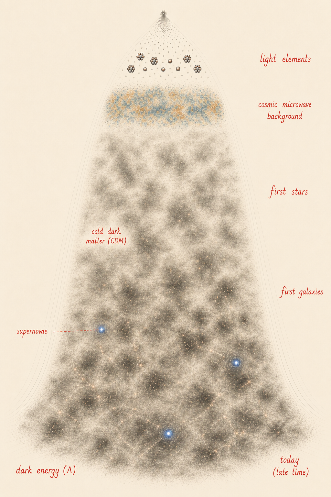
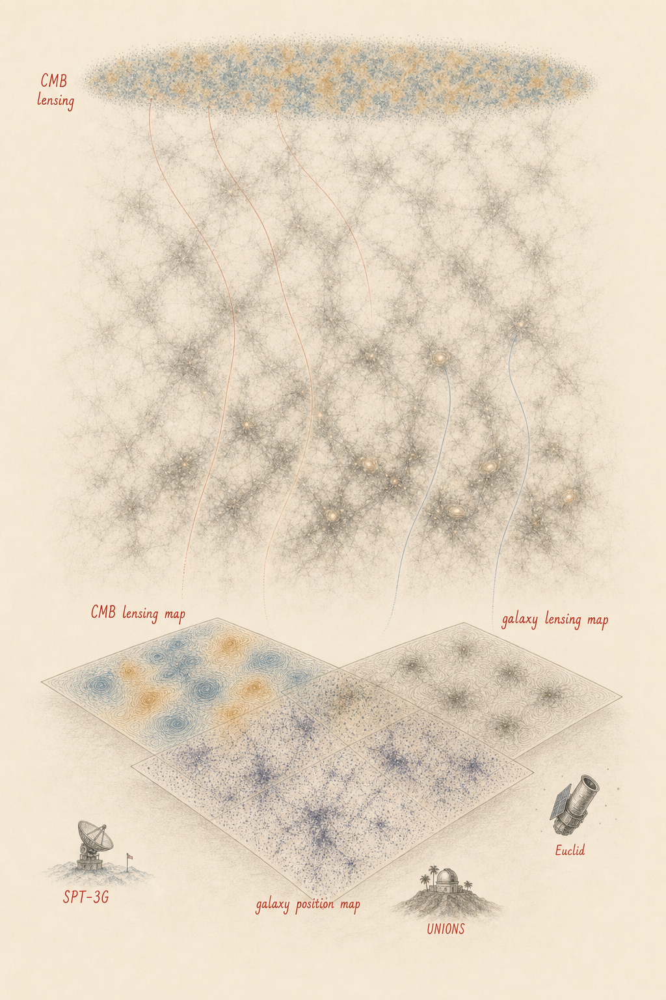
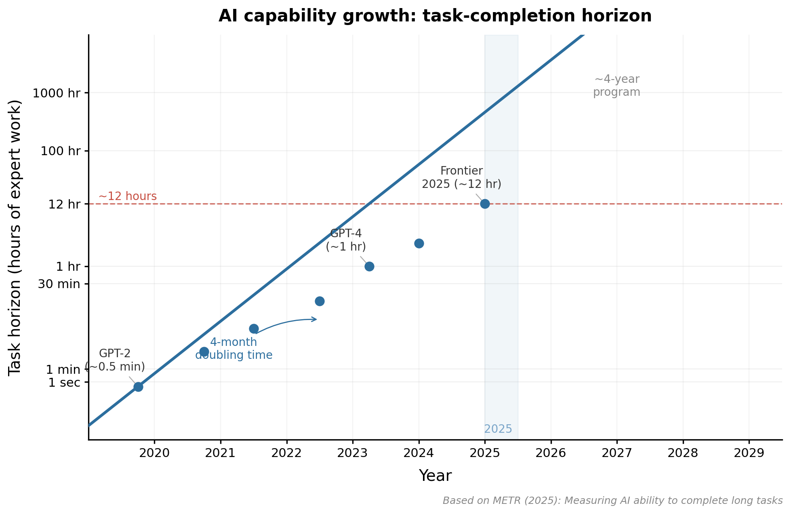
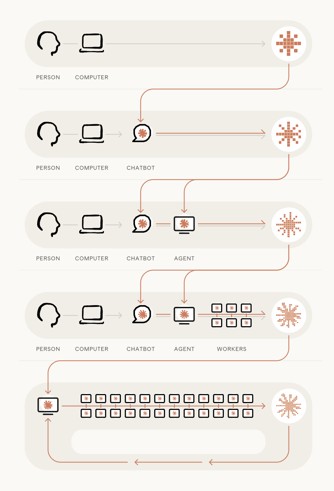

## I'm an observational cosmologist who works close to the data {#intro}

::: {style="margin-top:0.6em;text-align:center"}
I work in weak gravitational lensing and large-scale structure,<br>across several international
collaborations.
:::

{.intro-trajectory}

::: {style="margin-top:0.3em;text-align:center"}
Two interests, and they feed each other: the cosmology, and how this research itself is changing.
:::

::: notes
~45 sec. Establish the cosmologist and the adult before any AI talk. The trajectory visual carries
it: PhD at Illinois (SPT-3G CMB lensing, the maps behind some of its tightest constraints) → postdoc
at CEA / UMR AIM (UNIONS B-modes, Euclid × CMB). The bracket says "close to the data" — at every
point the work spans the full stack (maps → catalogs → estimators → cosmology). Closing line plants
the dual modality without explaining it yet. Distinct from the landscape slide (this = identity +
trajectory; that = current breadth).
:::


## Cosmology aspires to be consensus-based {#standard-model}

:::::::::::::: {.columns}
::: {.column style="width:55%"}

::: {style="margin-top:1.0em"}
**Six parameters** predict observables over orders of magnitude of time and spatial scale.
:::

::: {.fragment}

::: {.lcdm-pie}
{.blend-figure}
:::

::: {.pie-credit}
David Spergel / AAAS / Science
:::

:::

:::
::: {.column style="width:45%"}

::: {.standard-model-figure}
{.blend-figure}
:::

:::
::::::::::::::

::: notes
~60 sec — ground the room. The consensus framing: cosmology's strength is that MANY independent
probes converge on the same six numbers — that agreement IS the consensus. Dual-channel by design:
the slide carries one line + the figures; the richness is SPOKEN. Open on the cone + the one line;
say it out loud — six parameters predict observables across orders of magnitude in space AND time,
from light elements and the CMB (a one-day-old baby picture of the universe) to late-time galaxy
clustering — point at the cone for the range. Then CLICK: the Spergel budget pie fades in —
composition (dark energy / cold dark matter / atomic), the budget closes, the model describes 100%
of the content perfectly. The turn (spoken, not printed): it's phenomenological — we capture how
dark energy and dark matter shape
spacetime, not what they are. Sets up "so how do we make progress?".
:::


## New physics or systematics? {#precision}

::: {.h0-plot}
{.blend-figure}
:::

::: {.tension-cap}
Early and late times disagree at $5\sigma$
:::

::: {.plot-credit}
[DESI Collaboration (2024)](https://arxiv.org/abs/2404.03002)
:::

::: {.precision-annot}

::: {.annot-head}
$H_0$: the expansion rate of the universe **today**
:::

::: {.annot-early}
[Early-time]{.lbl-early} observables *predict* $H_0$ today
:::

::: {.annot-late}
[Late-time]{.lbl-late} observables *measure it directly*
:::

:::

::: notes
The pivot, and the judgment seed. Title IS the question; the plot is the evidence, the rest is
spoken. The right column carries the mechanism that MAKES it a question: early-universe observables
(CMB, BAO) PREDICT today's $H_0$ by extrapolating ΛCDM forward; late-universe observables (Cepheids,
TRGB) MEASURE it directly. They disagree at $5\sigma$ — so either the model is wrong (new physics)
or one side has a systematic. The cleanest instance of the hardest call in cosmology. S₈ used to sit
here as the second tension; it now lives only in Talk 2's close (looked like physics, dissolved into
systematics — the matched-pair rhyme). Land the payoff out loud: as errors shrink, systematics set
the budget — and that is where my work lives. "Signal or systematic?" comes back as "judgment" later.
:::


## I lead analyses across three collaborations {#lensing-landscape}

:::::::::::::: {.columns}
::: {.column style="width:58%"}

::: {style="margin-top:0.15em"}
Large-scale structure probes the content and expansion history of the universe.
:::

::: {style="margin-top:0.3em;font-size:0.78em"}
- **SPT-3G** — contributed to the tightest constraints from CMB lensing during my PhD (Ge et al.; Quan et al.; Omori et al. in prep.)
- **UNIONS** — led a paper in the first cosmic shear release
- **Euclid** — leading an MOU with SPT-3G to produce the tightest combined constraints on large-scale structure
- **Kinematic lensing** — supervised two master's students (paper in prep.)
:::

::: {style="margin-top:0.35em;font-size:0.86em"}
The leverage comes from combining observables whose systematics differ — independent observables
turn systematics into testable differences.
:::

:::
::: {.column style="width:42%"}

::: {.research-landscape-figure}
{.blend-figure}
:::

:::
::::::::::::::

::: notes
~2 min. The current breadth, framed as career-level accomplishments across collaborations (dropped
"I lead analyses in each"). SPT-3G: produced the CMB maps + contributed to the tightest CMB-lensing
constraints during the PhD (Ge+25, Quan+26, Omori+ in prep). UNIONS: led a first-release cosmic-shear
paper (the second talk). Euclid: leading the SPT-3G MOU toward the tightest combined LSS
constraints. Kinematic lensing: supervising two M-students (paper in prep). The diagram on the
right shows the probes.
:::


## AI capabilities are doubling every few months {#inflection .metr-slide}

::: {.metr-stage}

::: {.metr-chart-wrap}

::: {.metr-chart-title}
Time Horizon of Software Tasks
:::

::: {.metr-cropbox}
<iframe class="metr-embed" src="https://metr.org/horizon-chart-embed" title="METR — task-completion time horizon (live, interactive)" loading="lazy"></iframe>
:::

:::

::: {.metr-axes-col}

- Scaling laws
- Test-time compute
- Synthetic data

:::

:::

::: notes
The hinge. The live METR chart (zoomed for legibility) carries the message; speak it — frontier
models now complete ~12-hour expert tasks, doubling ~4 months, ~2,500× in four years if it holds.
The three bullets are the reasons the trend may continue (scaling laws, test-time compute, synthetic
data — the new scaling axes; Pleias works on synthetic data). The title poses the question the next
slides answer (the bitter lesson; the practice must change). OFFLINE FALLBACK: swap the iframe for
  {width=100% fig-align="center"}
:::


## What does this mean for research? {#bitter-lesson}

::: {style="margin-top:0.9em"}
- METR's trend extrapolates to a **2,500×** growth in capability over four years.
:::

::: {style="margin-top:0.7em;max-width:72%;margin-left:auto;margin-right:auto;font-size:1.1em;text-align:center"}
> Don't be distracted by human knowledge, as AI has been historically. Focus on methods for
> creating knowledge that **scale with computation — like search and learning.**

::: {.thesis-credit}
— Richard Sutton
:::
:::

::: {style="margin-top:0.9em;text-align:left;font-size:1.05em"}
Observational cosmology analyses take **~5 years!**
:::

::: notes
The hinge, answered. Top: the METR 2,500× extrapolation sets the scale of change. Middle: Sutton's
bitter lesson (centred) is the response — bet on what scales with computation, not frozen
tools/knowledge. Bottom: the tension for a cosmologist — our analyses take ~5 years. SPOKEN: the
bitter lesson is coming for science, relearned painfully (chess, Go, speech, vision); its
application to research itself may be the most consequential; scientists outside ML will learn it
too, often the hard way. (felt/ASTRA introduced later.)
:::


## The practice of research is changing {#thesis}

:::::::::::::: {.columns}
::: {.column style="width:46%"}

::: {style="margin-top:0.7em;font-size:1.02em"}
As output outpaces verification, the work shifts from writing analysis code to specifying it and
checking it.
:::

::: {style="margin-top:1.1em"}
The human role keeps receding up the stack — and any fixed "agentic framework" is outpaced by the
next generation of models.
:::

::: {style="margin-top:1.1em"}
So the practice keeps changing: designing research that checks itself as fast as it discovers.
:::

:::
::: {.column style="width:54%"}

::: {style="height:1010px;display:flex;align-items:flex-start;justify-content:flex-end;margin-top:-145px"}
{.blend-figure style="max-height:1010px;max-width:100%"}
:::

::: {style="text-align:right;font-size:0.5em;color:#7a6f5c;margin-top:0.2em"}
Credit: Anthropic
:::

:::
::::::::::::::

::: notes
REFRAME of the thesis slide, retitled (Cail). Two-column: text left, Anthropic's progression diagram
(person → chatbot → agent → workers — the human recedes up the stack) on the right third, full
height below the headline. Material/voice from the dossier: role shifts to specify + check; any
fixed framework outpaced; Claude Code "no code older than three months" as a spoken example.
:::


## I contribute to open infrastructure for verifiable AI science {#lightcone}

:::::::::::::: {.columns style="align-items:center;margin-top:1.2em"}
::: {.column width="18%"}
{style="height:128px"}
:::
::: {.column width="82%"}
[**Lightcone Research** — an open ecosystem for reproducible, composable, and verifiable science in the age of agentic AI. CNRS + UC Berkeley; I am a core team member.]{style="font-size:0.92em"}
:::
::::::::::::::

:::::::::::::: {.columns style="margin-top:2.0em"}
::: {.column style="width:50%"}

**Pleias**

::: {style="margin-top:0.3em;font-size:0.9em"}
I'm working with the French open-model lab to benchmark sovereign models, fine-tuned on<br>**synthetic data built on the French Science Commons**.
:::

:::
::: {.column style="width:50%"}

**`felt`**

::: {style="margin-top:0.3em;font-size:0.9em"}
- a traversable record of every analysis decision, alternative, and result
- becoming a job scheduler and agentic research factory
:::

:::
::::::::::::::

::: notes
Lightcone slide, moved earlier (Cail) + de-bloated. ASTRA dropped — don't mention separately.
Logo inline with the Lightcone Research name. Voice: contribute / core team member — never
founded, never funding, never Vellum. felt = the traversable record (every decision/alternative/
result), becoming a job scheduler / agentic research factory (the tool scales with use — the
Bitter Lesson payoff). Pleias text is Cail's exact phrasing — do not paraphrase. NOTE: Pleias
also currently appears on the benchmarks slide — de-dup (likely drop there now that this slide
owns Pleias).
:::


## {#felt-in-use data-state="hide-chrome" background-image="screenshots/felt-kanban.png" background-size="contain" background-position="center" background-color="#F7F0E1"}

```{=html}
<style>
/* Full-bleed screenshot slides: hide footer + slide number while the slide is open.
   reveal toggles `hide-chrome` on <body> via the slide's data-state. */
body.hide-chrome div.footer-default,
body.hide-chrome .slide-number,
body.hide-chrome .slide-number-default { display: none !important; }
</style>
```

::: {.fragment .fade-in style="position:absolute;top:50%;left:50%;transform:translate(-50%,-50%);margin:0"}
{.no-treat style="height:880px;border-radius:8px;box-shadow:0 24px 80px rgba(0,0,0,0.55)"}
:::

::: notes
felt in use (Cail). Full-bleed background = the portolan/shuttle kanban (felt as job scheduler /
agentic research factory — agents dispatched against fibers). On click, a felt report.html render
(the GLASS δδ systematics recovery) animates in centered — felt as the traversable record of an
analysis. No title; the screens carry it, spoken. NOTE: kanban + report show real unpublished
science + personal fiber names — do NOT commit/publish this deck (already the standing rule).
:::


## Developing the practice by doing {#loop}

::: {style="margin-top:0.8em;font-size:1.02em"}
AI-first (done rigorously) will produce the best cosmology,<br>and pushing AI-mediated frontier
research is the only way to develop the practice.
:::

::: {style="margin-top:1.0em"}
The proof — my UNIONS analysis (Daley et al. 2026), produced almost entirely by agents I direct:
:::

:::::::::::::: {.columns}
::: {.column style="width:55%"}

::: {style="margin-top:0.3em;font-size:0.9em"}
- ~10,000 lines of analysis, three statistical frameworks, the manuscript
- ~120,000 lines edited by agents
- a core team an order of magnitude smaller than DES or KiDS
:::

:::
::: {.column style="width:45%"}

::: {style="margin-top:0.3em;font-size:0.9em"}
My role: analysis architecture, the validation tests, verifying correctness.

The analysis where I worked it out is my second talk.
:::

:::
::::::::::::::

::: notes
REFRAME of the existence-proof slide. ~1 min. Lead with the loop, both ways (Cail's framing); the
UNIONS numbers are the evidence that AI-first does better cosmology; the small-team line shows why
the breadth is tractable. Science punted to Talk 2. Candidate visual: a two-way cosmology ⇄
practice motif to carry the loop with less text.
:::


## The skill that remains is judgment {#judgment}

::: {style="margin-top:0.9em"}
> An area of human comparative advantage, for now, is research taste and judgment — choosing which
> problems matter, which results to trust, and when an approach is a dead end.

::: {.thesis-credit}
— [Anthropic, "When AI builds itself" (2026)](https://www.anthropic.com/institute/recursive-self-improvement)
:::
:::

::: {style="margin-top:1.1em"}
When agents do the execution, the human's job is judgment: knowing what to expect, seeing when the
data deviate, deciding what matters.
:::

::: {style="margin-top:0.9em"}
Cosmology is where that is most demanding — a five-year analysis is hundreds of decisions, and the
hardest recurs: signal, or systematic?
:::

::: notes
NEW (rough). The MICRO level — the human residue. The Anthropic taste quote (moved here from the
thesis slide) → the residual skill is judgment → cosmology is the most judgment-dense science →
closes back onto the systematics slide. "Signal or systematic = taste" is the load-bearing
connection. Dossier support (spoken): "not because AI replaces their judgment but because it lets
them focus on the decisions where that judgment matters most." Keep measured.
:::


## A four-year program on two axes {#program}

:::::::::::::: {.columns}
::: {.column style="width:50%"}

**UNIONS — tomographic and multi-probe**

::: {style="margin-top:0.3em;font-size:0.85em"}
- **Year 1:** first tomographic cosmic shear constraints from UNIONS-3500
- **Year 3:** full multi-probe — shear + galaxy–galaxy lensing + clustering
- Outcome: percent-level S₈ and a competitive dark-energy equation of state, independent of DES/KiDS
:::

:::
::: {.column style="width:50%"}

**Euclid × CMB — multi-probe cross-correlations**

::: {style="margin-top:0.3em;font-size:0.85em"}
- **Years 1–2:** DR1 cross-correlation science (SPT, ACT, Planck)
- **Years 3–4:** comprehensive multi-probe cross-correlations with DR2
- Foundation already in place: Euclid CMB WG role, SPT MOU
:::

:::
::::::::::::::

::: {style="margin-top:1em"}
Two axes, milestones defined by **scientific deliverables** — tomographic shear, the
multi-probe gold standard, the first SPT×Euclid cross-correlation.
:::

::: notes
~1.5 min. The program proper — give it room. Both axes build on foundations already in place.
Specific years; milestones are scientific results, not tooling. Made tractable by the AI-first
practice established above. Next: how the program also produces a field-level contribution.
:::


## Benchmarks become certification {#benchmarks}

::: {style="margin-top:0.6em"}
As the practice evolves, you have to know it's actually getting better — otherwise you're
unmoored, with no measure of what's real. So you certify the work, and keep re-certifying.
:::

::: {style="margin-top:0.8em"}
The benchmark is real scientific work — open-ended, messy, many defensible paths — scored on
whether an agent reaches a sound result and leaves a defensible record.
:::

::: {style="margin-top:0.8em;font-size:0.95em"}
Done well, these become synthetic environments — synthetic data, RL environments — the same signal
driving frontier progress, but grounded in real science: a sovereign training signal.
:::

::: {style="margin-top:0.8em;font-size:0.9em"}
- A Year-2 deliverable, with DATAIA and PostGenAI@Paris
- With Pleias, sovereign French models vs frontier systems on real verification tasks
:::

::: notes
REFRAME (rough). The strongest ML-legible beat: certification-as-practice (you always reassess
benchmarks) → open-ended benchmarks on real scientific work → synthetic data / RL environments →
sovereign training signal. Gets ahead of the hallucination/reproducibility worry AND gives France
a training-signal story. Pleias carries sovereignty + cover for frontier-model use.
:::


## Teaching judgment rather than prompting {#teaching}

::: {style="margin-top:0.6em"}
My students came in skeptical of AI — some preferred to work by hand, and I didn't push it. What
changed is how I support them: I can reproduce, check, and unblock far more — but their work is
what tells me where to look.
:::

::: {style="margin-top:0.8em"}
They find what doesn't make sense; together we go deeper than either of us could alone.
:::

::: {style="margin-top:0.8em"}
The open question for the whole field: how do you teach someone to verify, not type — to form an
expectation, test it, and learn from the gap? Experiment is nearly free now; the constraint is
curiosity and perseverance. A conversation I want to take up with pedagogical centres at
Paris-Saclay.
:::

::: notes
NEW (rough). The honest mentoring beat — the honesty (students skeptical, didn't force it) is an
asset for an AI-wary jury; reads as adult, not evangelist. The division of cognitive labor (their
work seeds the depth) is the concrete proof he's thought about this. Open research question,
grounded in real supervision (kinematic-lensing M1/M2). Ties mentoring → community → sovereignty.
:::


## Sovereignty requires experience as well as model access {#sovereignty}

::: {style="margin-top:0.6em"}
Sovereignty isn't only sovereign access to capable models. It is having people trained in this
practice — an intellectual sovereignty, like computing literacy once was, but far more so.
Capability you can rent; diffused practice you have to build, and it diffuses slowly.
:::

:::::::::::::: {.columns}
::: {.column style="width:50%"}

**The team, already forming**

::: {style="margin-top:0.3em;font-size:0.85em"}
- 2 PhD students (Year 1), co-supervised with Kilbinger + Farrens
- 1 postdoc (Year 2), agentic-methods focus
- AI-methods guidance: Lanusse
:::

:::
::: {.column style="width:50%"}

**The ecosystem, already here**

::: {style="margin-top:0.3em;font-size:0.85em"}
- CosmoStat (UMR AIM) — UNIONS, Lightcone
- IAS — Euclid × CMB
- DATAIA · PostGenAI@Paris · Pleias — sovereign AI, French Science Commons
:::

:::
::::::::::::::

::: notes
REFRAME (rough). Sovereignty-as-people is the committee-strong frame (mind CNRS model-ban decorum —
people/practice, not model access). Folds the old team + lab-integration slide in as evidence the
people and ecosystem are already in place. The two lab homes map onto the two scientific axes.
:::


## France can lead what comes next {#summary}

::: {style="margin-top:0.8em"}

1. **Track record** — CMB lensing with SPT-3G (the maps behind its tightest constraints), UNIONS B-modes, Euclid CMB cross-correlations, and the mentorship to grow it

2. **A clear program** — UNIONS tomographic → multi-probe; Euclid-CMB DR1 → DR2; certification benchmarks, made tractable by an AI-first practice

3. **The right place** — CosmoStat + IAS + DATAIA: the research ecosystem is here

:::

::: {style="margin-top:1.1em;text-align:center"}
AI will keep improving on its own. It is up to us to develop the judgment and verification to do
rigorous science with it — a practice in which humans remain meaningful participants.
:::

::: {style="margin-top:0.5em;text-align:center"}
The bitter lesson's application to research itself may be the most consequential yet; if we don't
learn it from scratch, France is well positioned to lead what comes next.
:::

::: {style="margin-top:0.5em;text-align:center"}
Thank you.
:::

::: notes
Short close. Three lines — track record, program, France — then the close drawn from the dossier's
Outlook: AI improves on its own, but it is up to us to develop the judgment / verification /
institutional capacity for rigorous science; humans remain meaningful participants; the bitter
lesson's application to research may be the most consequential; France positioned to lead what comes
next. Leads with SPT, folds in mentorship. No new information.
:::
