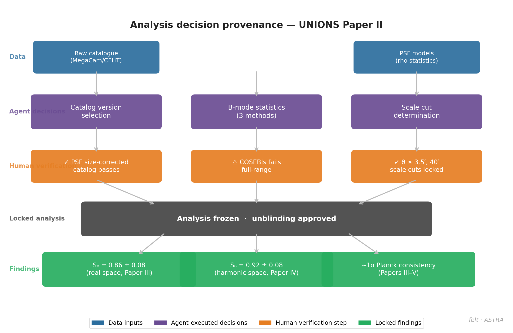

## UNIONS: the northern sky's weak lensing survey {#unions-opportunity}

:::::::::::::: {.columns}
::: {.column style="width:55%"}

::: {style="margin-top:0.4em"}
- MegaCam/CFHT, **~3,500 deg²** of deep $r$-band imaging
- **~61 million source galaxies**, $n_\mathrm{eff} \approx 5 \, \mathrm{arcmin}^{-2}$
- The only wide-field, deep survey of its generation covering the **northern sky**
:::

::: {style="margin-top:0.4em"}
- **Minimal overlap** with KiDS, DES, HSC — an independent cosmic shear measurement
- Statistical power comparable to the **first year of the next generation** of experiments
- Northern footprint pairs naturally with **Euclid** and other northern surveys
:::

:::
::: {.column style="width:45%"}

{width=100%}

:::
::::::::::::::

::: notes
~1.5 min. Open broad: this is a UNIONS-vision talk, with the systematics deep-dive inside it. The three load-bearing facts: unique northern footprint (independent of the southern surveys), statistical power of a next-gen first year, and the natural pairing with Euclid. Establish that UNIONS earns a place in the S8/systematics landscape on its own terms.
:::

## A four-year staircase to the gold standard {#staircase}

:::::::::::::: {.columns}
::: {.column style="width:48%"}

::: {style="margin-top:0.4em"}
- **Now** — first 2D cosmic shear constraints from UNIONS-3500
- **Year 1** — tomographic cosmic shear, the standard in the field
- **Year 3** — full multi-probe: cosmic shear + galaxy–galaxy lensing + galaxy clustering, the **gold standard**
:::

::: {style="margin-top:0.8em;font-style:italic"}
Lands at percent-level $S_8$ and a competitive dark-energy equation of state, with cross-correlations into DESI and Planck.
:::

:::
::: {.column style="width:52%"}

<!-- IMAGE PLACEHOLDER: UNIONS four-year staircase — ascending steps labelled
     "2D cosmic shear (now)" → "tomographic shear (Yr 1)" → "multi-probe 3x2pt (Yr 3)"
     → "percent-level S8 + dark-energy EOS", each step adding a probe/constraint;
     to be generated as a clean illustration. -->

::: {style="border:2px dashed #BC4538;border-radius:0.4em;padding:2em 1em;text-align:center;color:#888;font-style:italic;margin-top:1.5em"}
[ staircase figure to come ]  
2D shear → tomographic → multi-probe → percent-level $S_8$ + dark energy
:::

:::
::::::::::::::

::: notes
~1.5 min. This is THE leadership vision — the program I will lead over four years. Each step is the field standard for its stage: 2D now, tomographic next (Year 1), full multi-probe (Year 3, the gold standard for dark energy and neutrino mass). End state is percent-level S8 and a dark-energy EOS, independent of DES/KiDS, with cross-correlations into DESI and Planck. The staircase image should make the progression feel inevitable.
:::

## Why now: a small team, agentic throughput {#why-now}

:::::::::::::: {.columns}
::: {.column style="width:56%"}

::: {style="margin-top:0.4em"}
UNIONS' core analysis team is an **order of magnitude smaller** than DES or KiDS.
:::

::: {style="margin-top:0.7em"}
- Far less coordination overhead
- Far greater need for the research throughput that **agentic methods** provide
:::

::: {style="margin-top:0.8em"}
The careful analysis pipelines developed for the current release are the **foundation** agents build on — enabling systematic exploration of methodological choices that would otherwise be prohibitively labour-intensive at this scale.
:::

::: {style="margin-top:0.7em;font-style:italic"}
This is the opening: a small team, about to take off.
:::

:::
::: {.column style="width:44%"}

{width=100%}

:::
::::::::::::::

::: notes
~1.5 min. The "why now / why me" beat. The smallness of the team is the opportunity: less overhead, and a genuine need for throughput that agentic methods supply. The pipelines already developed are the foundation — agents extend breadth on top of careful, validated infrastructure. This is the "we're about to take off" moment; the existence proof comes later in the talk.
:::

## The first step we had to get right {#first-step}

::: {style="margin-top:1.2em;font-size:1.05em"}
Before any of that vision, one thing has to hold: the galaxy-shape catalog must be **clean enough for cosmology.**
:::

::: {style="margin-top:1.1em"}
> Gravitational lensing leaves a specific geometric fingerprint. Any departure from it diagnoses residual contamination — and a single null test only sees the scales it is built for.
:::

::: {style="margin-top:1.1em;font-style:italic"}
The first UNIONS release is the existence proof that we can characterise these systematics, end to end, with a small team.
:::

::: notes
~45 sec. The hinge of the talk: zoom from the program down to the foundational requirement. The shear catalog must be clean before any cosmology is trustworthy. The geometric fingerprint of lensing (E-modes) and the scale-limitation of any single test set up the next three slides. Frame the B-mode work as the existence proof for the whole end-to-end vision.
:::

## Cosmic shear: the E/B fingerprint {#shear-setup}

:::::::::::::: {.columns}
::: {.column style="width:60%"}

Gravitational lensing distorts galaxy shapes. We measure the **two-point shear correlations** — the statistical signal of the large-scale matter distribution.

::: {style="margin-top:0.6em"}
The shear field decomposes into:

- **E-modes** (curl-free): the cosmological lensing signal
- **B-modes** (divergence-free): zero from gravity alone
:::

::: {style="margin-top:0.6em;font-style:italic"}
Non-zero B-modes diagnose residual systematics:
PSF leakage, additive shear bias, multiplicative calibration errors.
:::

:::
::: {.column style="width:40%"}

:::::: {.columns}
::: {.column width="50%"}
{width=100%}
:::
::: {.column width="50%"}
{width=100%}
:::
::::::

:::
::::::::::::::

::: notes
~1.5 min. The E/B decomposition is the key concept: E-modes are what we want, B-modes are what should be zero and tell us something is wrong when they aren't. The pattern images are intuitive. This is the "problem" slide — lensing's specific signature, and why we need more than one test.
:::

## Three statistics, one systematics test {#three-stats}

:::::::::::::: {.columns}
::: {.column style="width:58%"}

::: {style="margin-top:0.4em"}
I use three complementary B-mode tests, in different statistical bases:
:::

::: {style="margin-top:0.4em;font-size:0.95em"}
1. **$\xi_\pm^B$ (configuration space)** — pure E/B decomposition of the two-point correlation function; direct diagnostic
2. **COSEBIs** (Complete Orthogonal Sets of E/B-separating Integrals) — discrete modes maximally sensitive to B-mode contamination on specific scales
3. **$C_\ell^{BB}$ (harmonic space)** — power spectrum; different scale weighting than real-space statistics
:::

::: {style="margin-top:0.4em;font-style:italic"}
Each weights angular scales differently. When the three disagree, the disagreement itself localises the contamination.
:::

:::
::: {.column style="width:42%"}

{width=100%}

:::
::::::::::::::

::: notes
~1.5 min. The three bases are complementary: they weight scales differently, so disagreement between them carries information about *where* the contamination lives. Requiring all three to pass jointly is what sets the catalog choice and scale cuts. This is the key setup for the data vector.
:::

## The B-mode data vector {#data-vector}

{width=85% fig-align="center"}

::: notes
~30 sec. Let the figure breathe. Row by row: xi_+ E and B (top), xi_- E and B, COSEBIs E and B, Cl E and B. The B-mode rows should be consistent with zero — or not, as the case may be.
:::

## The statistics disagree — and that is information {#disagreement}

:::::::::::::: {.columns}
::: {.column style="width:52%"}

Over the **full angular range** (1–250 arcmin, $\ell \lesssim 2000$):

::: {style="margin-top:0.5em"}
- $\xi_\pm^B$: **passes** ✓
- $C_\ell^{BB}$: **passes** ✓
- **COSEBIs: fails** ✗
:::

::: {style="margin-top:0.5em"}
The disagreement is set by the **filter functions**: COSEBIs concentrate sensitivity on the scales where the contamination lives.
:::

::: {style="margin-top:0.45em;font-size:0.9em;font-style:italic"}
The oscillating pattern is consistent with an additive shear bias repeating at the CCD scale — a known MegaCam artifact first reported in CFHTLenS (Asgari et al. 2019).
:::

:::
::: {.column style="width:48%"}

{width=100%}

:::
::::::::::::::

::: notes
~2 min, the key finding. COSEBIs are designed to be maximally sensitive to specific B-mode patterns, so when they fail and the others pass, we've localised the contamination. The oscillating pattern is the signature — an additive shear bias at the CCD scale, a known MegaCam systematic first seen in CFHTLenS. The intellectual move: the disagreement is the analysis working as designed, not a failure.
:::

## Disagreement sets the catalog and the scale cuts {#scale-cuts}

::: {style="margin-top:0.5em"}
The B-mode tests do more than pass or fail. The joint requirement determines:
:::

:::::::::::::: {.columns}
::: {.column style="width:50%"}

**1. Catalog version selection**

Only the PSF size-corrected catalog passes across all three statistics and scale cuts. This choice is locked before unblinding.

**2. Angular scale cuts**

COSEBIs pass after imposing:

- $\theta \geq 3.5'$ (for $\xi_+$)
- $\theta \geq 40'$ (for $\xi_-$)

These become the analysis scale cuts for the cosmology papers.

:::
::: {.column style="width:50%"}

{width=100%}

:::
::::::::::::::

::: notes
~1.5 min. The disagreement does work: it selects the catalog version and sets the scale cuts. Both decisions are locked before the cosmology is revealed — principled blinding discipline, immune to fishing for a good S8.
:::

## Cosmological constraints, deliberately conservative {#cosmology}

:::::::::::::: {.columns}
::: {.column style="width:55%;font-size:0.94em"}

::: {style="margin-top:0.5em"}
With a validated catalog and frozen scale cuts, the two independent analysis conventions find:

- **S₈ = 0.86 ± 0.08** (configuration space) and **S₈ = 0.92 ± 0.08** (harmonic space)
- Consistent with each other, and with the early-universe value ($S_8 = 0.834 \pm 0.016$) to within ~1σ
:::

::: {style="margin-top:0.5em;font-size:0.95em"}
The error bars are **wider** than the recent KiDS and DES releases — by design. UNIONS is a small team; we made conservative choices and responsibly inflated our systematic budget throughout.
:::

::: {style="margin-top:0.4em;font-size:0.92em;font-style:italic"}
We avoid the failure mode the history of $S_8$ has now diagnosed — a tight constraint that moves dramatically once systematics are better understood.
:::

:::
::: {.column style="width:45%"}

{width=100%}

:::
::::::::::::::

::: notes
~1.5 min. Lead with the headline numbers and the agreement between the two conventions. Then the deliberate conservatism: wider error bars, on purpose, because a small team should inflate its systematic budget rather than claim a tight constraint that later moves. This is the cross-talk bridge — the same S8 lesson that opens Talk 1 closes here.
:::

## An agentic existence proof {#agentic}

:::::::::::::: {.columns}
::: {.column style="width:55%;font-size:0.94em"}

::: {style="margin-top:0.5em"}
This analysis was produced entirely by AI agents under my direction:
:::

::: {style="margin-top:0.6em"}
- **~10,000 lines** of analysis code, figures, and manuscript
- **120,000+ lines edited** across the project
- Three independent statistical frameworks, characterised end to end
:::

::: {style="margin-top:0.5em"}
My role has shifted to **designing the analyses** and the **tests and checks that verify correctness** — from implementation to specification.
:::

::: {style="margin-top:0.4em;font-style:italic"}
Proof the end-to-end vision is reachable for a small team.
:::

:::
::: {.column style="width:45%"}

{width=100%}

:::
::::::::::::::

::: notes
~1 min. This is the existence proof for the program. ~10,000 lines produced, 120,000+ edited, all under my direction. Lead with it as a strength. The role shift — from coding to design, from implementation to specification — is exactly what makes the four-year multi-probe breadth tractable for a team this size. Every decision recorded in a structured provenance graph (the figure).
:::

## From existence proof to gold standard {#forward}

:::::::::::::: {.columns}
::: {.column style="width:55%;font-size:0.9em"}

**What this first release delivers**

- The first northern-sky cosmic shear constraints
- A systematics framework where disagreement becomes diagnosis
- $S_8$ consistent with the concordance model, conservatively

**Where I lead UNIONS next**

- **Tomographic** cosmic shear (Year 1)
- **Multi-probe** — shear + GGL + clustering (Year 3)
- Percent-level $S_8$ + dark energy, independent of DES/KiDS

:::
::: {.column style="width:45%"}

{width=100%}

:::
::::::::::::::

::: {style="margin-top:0.3em;font-style:italic;text-align:center"}
A clean first step, agentic throughput, and a clear staircase ahead. Thank you.
:::

::: notes
~1 min. Zoom back out to the vision. The first release is the existence proof — a clean catalog, a working systematics framework, a conservative S8. The staircase from here is tomographic (Year 1) to multi-probe (Year 3), landing at percent-level S8 and dark energy. Use the convergence figure to show UNIONS joining the S8 landscape — closing the loop on the northern-sky opportunity that opened the talk. My leadership role is the through-line.
:::
