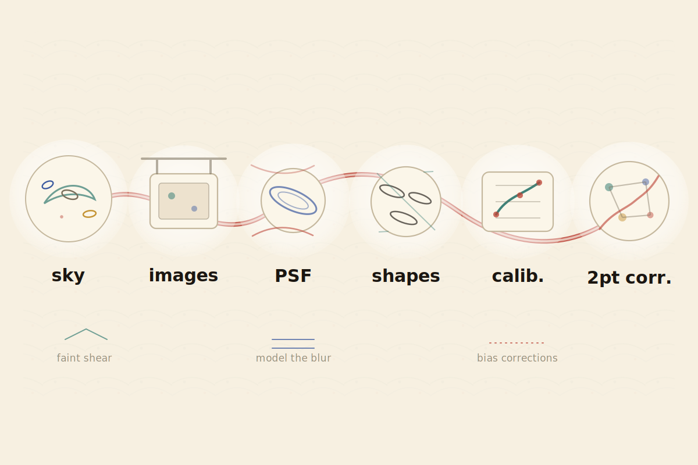
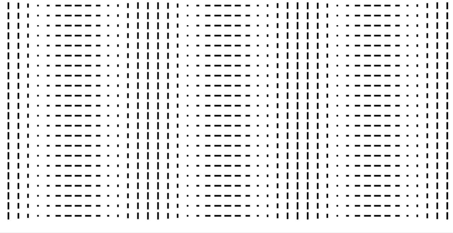
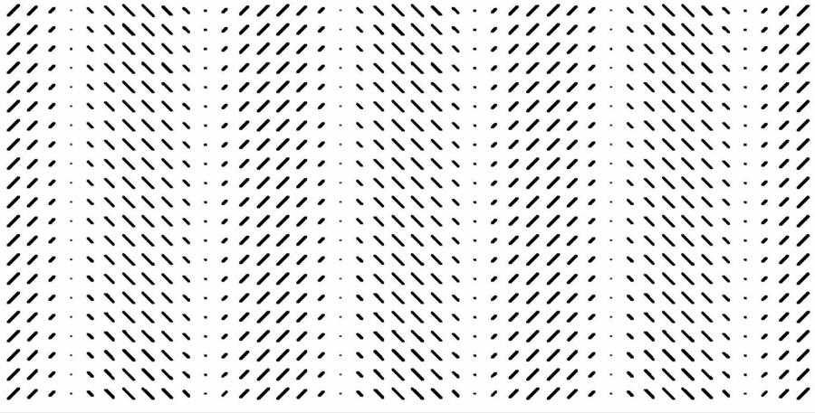
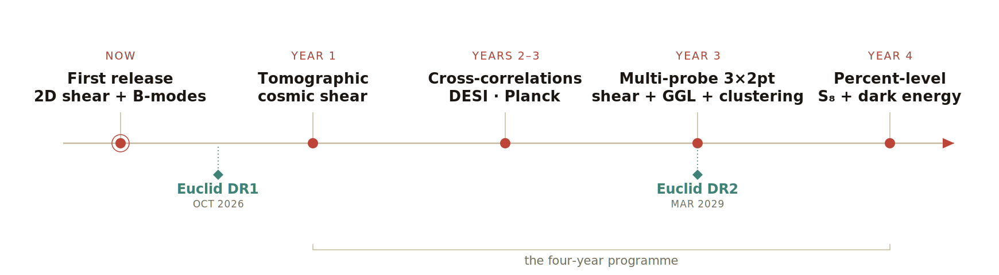

## Constraining cosmology with galaxy shapes {#shear-intro}

::: {.absolute top=30 right=36 width=560}
```{=html}
<svg id="wl-shear" viewBox="90 50 480 460" width="100%" role="img" aria-label="Background galaxies sheared into tangential alignment as a foreground mass appears">
<defs>
<radialGradient id="wlMassGlow" cx="50%" cy="50%" r="50%">
<stop offset="0%" stop-color="#bc4538" stop-opacity="0.30"/>
<stop offset="48%" stop-color="#bc4538" stop-opacity="0.11"/>
<stop offset="100%" stop-color="#bc4538" stop-opacity="0"/>
</radialGradient>
</defs>
<g class="fragment" data-fragment-index="1" id="wl-cluster">
<circle cx="350" cy="270" r="140" fill="url(#wlMassGlow)"/>
<circle cx="350" cy="270" r="74" fill="none" stroke="#bc4538" stroke-width="1.4" stroke-dasharray="2 8" opacity="0.4"/>
<ellipse cx="350" cy="270" rx="13" ry="9" fill="#c49333" fill-opacity="0.62" transform="rotate(18 350 270)"/>
<ellipse cx="328" cy="256" rx="9" ry="6" fill="#bc4538" fill-opacity="0.5" transform="rotate(-22 328 256)"/>
<ellipse cx="372" cy="284" rx="8" ry="5.5" fill="#c49333" fill-opacity="0.5" transform="rotate(40 372 284)"/>
<ellipse cx="364" cy="252" rx="6.5" ry="4.5" fill="#bc4538" fill-opacity="0.42" transform="rotate(8 364 252)"/>
<ellipse cx="334" cy="286" rx="6" ry="4" fill="#c49333" fill-opacity="0.42" transform="rotate(-10 334 286)"/>
</g>
<circle r="1" class="wl-gal" style="--ti:translate(498.8px,255.0px) rotate(42.0deg) scale(22.29,10.10);--tl:translate(508.7px,254.0px) rotate(58.3deg) scale(27.81,10.68);--d:0.11s"/>
<circle r="1" class="wl-gal" style="--ti:translate(448.9px,300.9px) rotate(40.3deg) scale(22.94,9.81);--tl:translate(461.8px,305.0px) rotate(65.9deg) scale(24.91,13.06);--d:0.04s"/>
<circle r="1" class="wl-gal" style="--ti:translate(467.3px,361.9px) rotate(-0.8deg) scale(21.97,10.24);--tl:translate(475.2px,368.1px) rotate(-19.6deg) scale(25.92,11.47);--d:0.21s"/>
<circle r="1" class="wl-gal" style="--ti:translate(359.0px,470.2px) rotate(38.4deg) scale(20.73,10.85);--tl:translate(359.3px,477.3px) rotate(25.0deg) scale(24.28,11.34);--d:0.01s"/>
<circle r="1" class="wl-gal" style="--ti:translate(311.5px,459.1px) rotate(-27.8deg) scale(20.86,10.79);--tl:translate(310.0px,466.4px) rotate(-14.3deg) scale(24.84,11.19);--d:0.11s"/>
<circle r="1" class="wl-gal" style="--ti:translate(316.8px,386.9px) rotate(-38.8deg) scale(20.03,11.23);--tl:translate(313.6px,398.4px) rotate(-11.3deg) scale(24.63,12.71);--d:0.00s"/>
<circle r="1" class="wl-gal" style="--ti:translate(132.6px,338.6px) rotate(83.4deg) scale(20.13,11.18);--tl:translate(127.0px,340.3px) rotate(79.7deg) scale(24.72,10.78);--d:0.19s"/>
<circle r="1" class="wl-gal" style="--ti:translate(129.5px,277.7px) rotate(-42.8deg) scale(23.36,9.63);--tl:translate(123.3px,277.9px) rotate(-53.5deg) scale(25.66,10.47);--d:0.11s"/>
<circle r="1" class="wl-gal" style="--ti:translate(170.4px,226.7px) rotate(0.9deg) scale(21.19,10.62);--tl:translate(162.7px,224.9px) rotate(-10.6deg) scale(20.63,13.63);--d:0.17s"/>
<circle r="1" class="wl-gal" style="--ti:translate(235.6px,167.7px) rotate(37.6deg) scale(22.65,9.93);--tl:translate(228.4px,161.2px) rotate(32.5deg) scale(21.13,13.96);--d:0.04s"/>
<circle r="1" class="wl-gal" style="--ti:translate(263.1px,98.7px) rotate(9.8deg) scale(21.46,10.49);--tl:translate(259.7px,92.0px) rotate(-2.5deg) scale(25.84,10.77);--d:0.03s"/>
<circle r="1" class="wl-gal" style="--ti:translate(299.0px,110.0px) rotate(-55.2deg) scale(17.45,12.89);--tl:translate(296.4px,101.7px) rotate(-33.2deg) scale(22.33,12.91);--d:0.03s"/>
<circle r="1" class="wl-gal" style="--ti:translate(445.1px,129.3px) rotate(59.1deg) scale(22.56,9.97);--tl:translate(450.0px,122.1px) rotate(49.7deg) scale(29.43,9.76);--d:0.15s"/>
<circle r="1" class="wl-gal" style="--ti:translate(454.0px,137.0px) rotate(-76.7deg) scale(18.06,12.46);--tl:translate(459.4px,130.1px) rotate(-110.7deg) scale(19.90,14.46);--d:0.15s"/>
<circle r="1" class="wl-gal" style="--ti:translate(471.6px,196.5px) rotate(-35.5deg) scale(22.15,10.16);--tl:translate(480.6px,191.1px) rotate(-42.3deg) scale(20.55,14.64);--d:0.07s"/>
</svg>
```
:::

::: {style="width:70%;margin-top:0.9em;font-size:1.03em"}
- **Cosmic shear:** gravitational lensing distorts galaxy shapes by ~1%, **coherently**
- Millions of shapes → **summary statistics** → cosmology
- An intricate pipeline, **sensitive to systematics**
:::

::: {.absolute bottom=80 left=50 width=1820}
{.blend-figure width=100%}
:::

::: notes
~1.5 min, general jury. Say the physics; don't read the slide. Start on the random field (top
right): galaxies have their own random shapes and orientations. CLICK — a mass concentration
appears, and its gravity bends the light of everything behind it, nudging those shapes to align
tangentially around it. Any one galaxy barely moves (~1%), but the alignment is coherent, so
averaged over millions of galaxies it becomes a clean signal that maps the matter — the cosmic
web. A single cluster is the easy case to picture; the real signal is the same effect from all
the large-scale structure at once. We read it out through the two-point shear correlation — how
galaxy shapes align as a function of separation. The bottom strip is the long road from raw sky
images to a cosmological constraint: model the PSF, measure shapes, calibrate, correlate. The
whole rest of the talk lives at one hinge in that chain — getting the shapes clean enough to trust.
:::


## UNIONS is the first deep weak-lensing map of the northern sky {#unions-opportunity}

:::: {style="display:flex;flex-direction:column;justify-content:center;gap:1.1em;height:80vh;font-size:1.12em"}

::: {}
MegaCam / CFHT — **~3,500 deg²** of deep $r$-band imaging at **0.7″** median seeing, yielding
**~61 million** source galaxies ($n_\mathrm{eff} \approx 5 \, \mathrm{arcmin}^{-2}$).
:::

::: {}
That is the statistical power of a **next-generation survey's first year** — and the first such
dataset anywhere in the **northern sky**.
:::

::: {}
Built by a team an **order of magnitude smaller** than DES or KiDS.
:::

::::

::: notes
~1 min. The opener — a new deep, wide survey, in the north, with the statistical power of a
next-generation survey's first year, built by a tiny team. State what UNIONS is and at what
scale; the independence argument (why the north matters) is the next slide. Keep it broad and
confident — this is the "look at the cool dataset" beat.
:::


## UNIONS is the independent northern check cosmic shear was missing {#unions-independent}

:::::::::::::: {.columns}
::: {.column style="width:53%"}

::: {style="margin-top:0.45em"}
The $S_8$ debate has **converged** as systematics improved — and a consensus is only as strong as
its **independent checks.**
:::

::: {style="margin-top:0.55em"}
But **KiDS, DES, and HSC all share the same southern sky.** UNIONS overlaps **none** of them:
independent structure, sample variance, Galactic foregrounds, and instrument.
:::

::: {style="margin-top:0.55em"}
And its northern footprint opens cross-correlations the south can't — **DESI**, **Planck**,
**ACT**, and **Euclid**, all at high declination.
:::

:::
::: {.column style="width:47%"}

{width=100%}

:::
::::::::::::::

::: notes
~1.5 min. The consensus argument, in the Moriond framing. S₈ is converging as systematics improve
(KiDS 3.0σ→0.74σ, DES 2.3σ→1.1σ), so consensus matters — and consensus needs genuinely
independent measurements, not more data from overlapping footprints. KiDS/DES/HSC all overlap
(Jefferson+2025, "overlaps between all pairs"); UNIONS shares sky with none → independent sample
variance, Galactic foregrounds, and instrument (CFHT MegaCam vs DECam/OmegaCAM/HSC). The northern
footprint is uniquely valuable for cross-correlation: DESI spectroscopy, Planck/ACT CMB lensing,
and Euclid at high northern declination — things the southern surveys can't do as easily. The map
shows UNIONS-3500 (purple) alone in the north while everyone else crowds the south.
:::


## Cosmic shear makes only E-modes, so B-modes flag systematics {#shear-eb}

:::::::::::::: {.columns}
::: {.column style="width:60%"}

::: {style="margin-top:0.4em"}
Gravitational lensing leaves a specific geometric fingerprint. To leading order the shear field
is **curl-free**, and decomposes into:
:::

::: {style="margin-top:0.4em"}
- **E-modes** (gradient-like): the cosmological lensing signal
- **B-modes** (curl-like): sourced only by higher-order effects **orders of magnitude below
  current sensitivity** — so effectively zero
:::

::: {style="margin-top:0.5em"}
At Stage-III sensitivity, a detected **B-mode is a clean flag for residual systematics** — PSF
leakage, additive shear bias, calibration error. (The converse doesn't hold: no B-modes does
not prove no systematics.)
:::

:::
::: {.column style="width:40%"}

::: {style="margin-top:0.6em;text-align:center"}
{.eb-pattern width=88%}
:::

::: {style="margin-top:1.1em;text-align:center"}
{.eb-pattern width=88%}
:::

:::
::::::::::::::

::: notes
~1.5 min. The key concept, science corrected to the paper: scalar lensing is curl-free to
leading order → gradient-like E-modes (signal), curl-like B-modes (sourced only by tiny
higher-order effects, so ≈0). At current sensitivity a detected B-mode means a systematic. State
the honest caveat — absence of B-modes doesn't rule out contamination. The pattern images are
intuitive. This is the "what could go wrong, and how we'd see it" slide.
:::


## Before any cosmology, the shear catalog must be clean enough {#first-step}

::: {style="margin-top:1.2em;font-size:1.05em"}
A single null test only sees the scales it is built for. So the question is sharper than "are
there B-modes?" — it is **"clean across which scales, in which basis?"**
:::

::: {style="margin-top:1.1em"}
> The first UNIONS release is the existence proof that a small team can characterise these
> systematics, end to end, before trusting a single cosmological number.
:::

::: {style="margin-top:1.1em"}
That is the work in this talk: turning a B-mode null test into a tool that decides the
analysis.
:::

::: notes
~45 sec. The hinge: zoom from "B-modes flag systematics" to the real problem — any single test
is scale-limited and basis-dependent, so a clean answer needs multiple tests across scales.
Frame the B-mode work as the existence proof for end-to-end systematics control by a small team.
Sets up the three statistics.
:::


## I use three E/B-separable statistics, because each has different blind spots {#three-stats}

:::::::::::::: {.columns}
::: {.column style="width:54%"}

::: {style="margin-top:0.3em;font-size:0.95em"}
1. **$\xi_\pm^B(\theta)$** — pure-mode correlation functions; a direct real-space E/B split
2. **COSEBIs** — a complete orthogonal mode basis; the Stage-III workhorse for tracing systematics
3. **$C_\ell^{BB}$** — catalog-based harmonic-space power spectra; a different scale weighting
:::

::: {style="margin-top:0.4em"}
They probe the same shear field, but their filter functions **weight angular scales
differently**, and the mapping between bases is not one-to-one.
:::

::: {style="margin-top:0.4em"}
So contamination that one basis absorbs, another exposes. The full data vector is rich — the
point is what happens **when the three disagree.**
:::

:::
::: {.column style="width:46%"}

{width=92%}

:::
::::::::::::::

::: notes
~1.5 min. Three complementary bases; each weights scales differently, so comparing across them
exposes systematics any single one would absorb (the paper's central methodological point).
Keep the data vector HIGH-LEVEL here — it's the figure on this slide, not its own slide (per
Cail). Don't walk every panel; the message is "three bases, and they need not agree." Sets up
the disagreement.
:::


## The statistics disagree, and that disagreement is the information {#disagreement}

:::::::::::::: {.columns}
::: {.column style="width:57%"}

Over the **full angular range**:

::: {style="margin-top:0.4em"}
- $\xi_\pm^B$: **passes** ✓
- $C_\ell^{BB}$: **passes** ✓
- **COSEBIs: fails** ✗
:::

::: {style="margin-top:0.45em;font-size:0.95em"}
All three carry the same low-level contamination — only COSEBIs compress it into a recognisable
**oscillating fingerprint**: a $>\!4\sigma$ B-mode pattern at the CCD scale.
:::

::: {style="margin-top:0.35em;font-size:0.85em"}
A near-constant ellipticity per CCD; the jumps at chip boundaries carry curl. The same MegaCam
camera as **CFHTLenS**, where it was first traced (Asgari et al. 2019).
:::

::: {style="margin-top:0.35em;font-size:0.85em"}
Recompute COSEBIs from the $C_\ell^{BB}$ bandpowers — **same data** — and they still fail. The
disagreement is the **filter**, not the space.
:::

:::
::: {.column style="width:43%"}

{width=100%}

:::
::::::::::::::

::: notes
~2 min, the key finding. The honest framing (from the paper): the same low-level contamination is
present in all three statistics — ξ±B and C_ℓ^BB "pass but show low-level structure," while
COSEBIs cross 4σ. Because COSEBIs are orthogonal over a finite range, a feature compact in angle
(the CCD scale) spreads across the whole mode spectrum as a coherent oscillation — a recognisable
fingerprint the other bases dilute below significance. Robust: all four catalog versions show it.
Mechanism, concrete and from the paper: constant ellipticity per CCD, discontinuities at chip
boundaries carry curl → B-modes at MegaCam's 6–14 arcmin CCD scale; the repeating-additive-bias
effect Asgari+2019 traced across CFHTLenS/KiDS-450/DES-SV — relevant here because CFHTLenS used
the same MegaCam camera. The clinching proof (if asked): recompute COSEBIs *from* the C_ℓ
bandpowers — same data — and they still fail where C_ℓ passed, because the COSEBI filter functions
weight the contaminated scales differently. So the disagreement is set by the filter, not by
real- vs harmonic-space. The intellectual move: disagreement is the analysis working as designed.
:::


## The disagreement selects the catalog and sets the scale cuts {#scale-cuts}

:::::::::::::: {.columns}
::: {.column style="width:50%"}

The joint requirement — pass **all three** statistics — does real work:

**1. Catalog selection**

B-mode failures on early catalogs drove a tighter **galaxy size cut**. We tested **stellar-halo
masking** too, but it introduced new failures — so the **size-cut catalog** is fiducial.

**2. Angular scale cuts**

The cuts that suppress the CCD-scale signal become the **scale cuts for the cosmology papers** —
locked, within a **blinded** framework, before any S₈ is revealed.

:::
::: {.column style="width:50%"}

{width=100%}

:::
::::::::::::::

::: notes
~1.5 min. The disagreement does work: it selects the catalog and sets the scale cuts. Catalog —
of four variants, only the size-cut catalog passes all three statistics, so it's fiducial. The
honest detail: stellar-halo masking was the *more* aggressive, ostensibly-conservative choice,
but the irregular mask geometry introduced new pure-mode failures — so the tests, not our
priors, picked the catalog. Scale cuts — the cuts that suppress the CCD signal become the cosmology
papers' scale cuts, locked before unblinding (principled blinding discipline, immune to fishing
for a good S₈). PTE-grid figure shows the broad stable region the adopted cuts sit in.
:::


## Our S₈ is conservative by design: wider error bars, on purpose {#cosmology}

:::::::::::::: {.columns}
::: {.column style="width:55%;font-size:0.94em"}

::: {style="margin-top:0.5em"}
With a validated catalog and frozen scale cuts, the two independent analysis conventions find:

- **S₈ = 0.86 ± 0.08** (configuration space) and **S₈ = 0.92 ± 0.08** (harmonic space)
- Consistent with each other, and with the early-universe value ($0.834 \pm 0.016$) to ~1σ
:::

::: {style="margin-top:0.5em;font-size:0.95em"}
The error bars are **wider** than the recent KiDS and DES releases — deliberately. A small team
made conservative choices and inflated its systematic budget throughout.
:::

::: {style="margin-top:0.4em;font-size:0.92em"}
We avoid the failure mode the history of S₈ has now diagnosed: a tight constraint that moves
once systematics are better understood.
:::

:::
::: {.column style="width:45%"}

{width=100%}

:::
::::::::::::::

::: notes
~1.5 min. Lead with the headline numbers and the agreement between the two conventions, then the
deliberate conservatism: wider bars on purpose, because a small team should inflate its budget
rather than claim a tight constraint that later moves. This is the cross-talk bridge — the same
S₈ cautionary tale that opens Talk 1 closes here.
:::


## With the pipeline built, UNIONS can iterate toward the multi-probe gold standard {#forward}

::: {style="margin-top:0.45em;font-size:0.96em"}
The systematics framework is built — so a team an **order of magnitude smaller** than DES or KiDS
can now run the analysis **end to end.** With **agentic methods** doing the heavy lifting, each
release sharpens the next: redo everything as the data grows, and explore the full space of
choices instead of triaging it.
:::

{width=97%}

::: {style="margin-top:0.25em;text-align:center;font-size:0.95em"}
A first step, characterised end to end — and produced almost entirely by AI agents under my
direction. **Thank you.**
:::

::: notes
~1.5 min. The close: not a program pitch (that's Talk 1) — the scientific future, with agentic
methods as the engine. The framework and pipelines now exist, so a tiny team can run the whole
analysis end to end and, crucially, explore the full space of methodological choices instead of
triaging it for lack of time. That's the flywheel: each release accelerates the next. Walk the
roadmap left to right — first release (this talk) → tomographic shear (Year 1, breaks the IA
degeneracy, tightens S₈) → cross-correlations with DESI/Planck → the multi-probe 3×2pt analysis
(Year 3, the gold standard for dark energy and neutrino mass) → percent-level S₈ and dark energy.
Euclid DR1 (Oct 2026) and DR2 (Mar 2029) set the external rhythm. End on the agentic beat: this
first release was produced almost entirely by AI agents under my direction — the method that makes
the whole roadmap tractable for a small team.
:::
