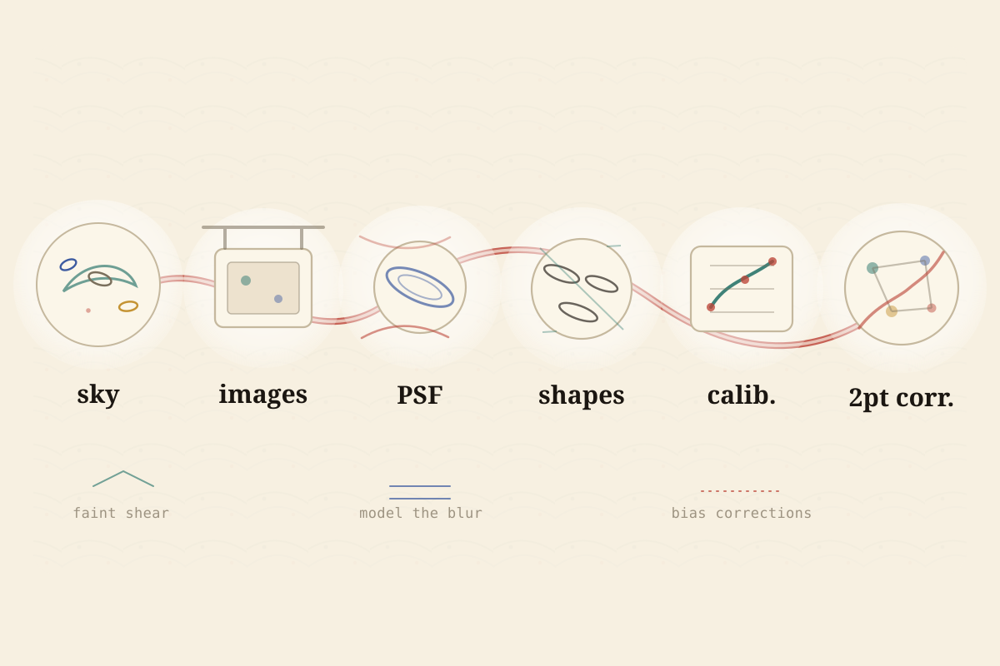
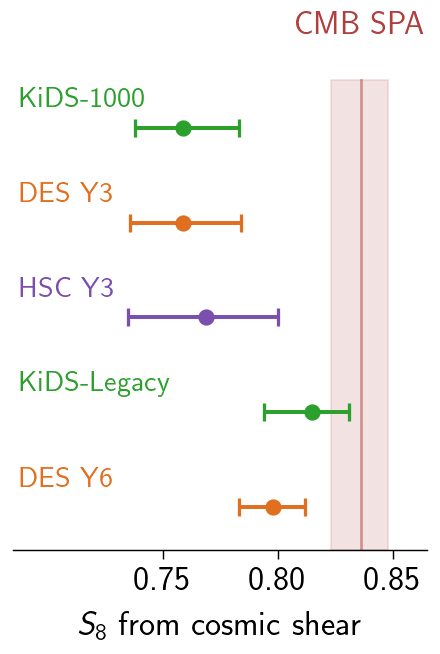
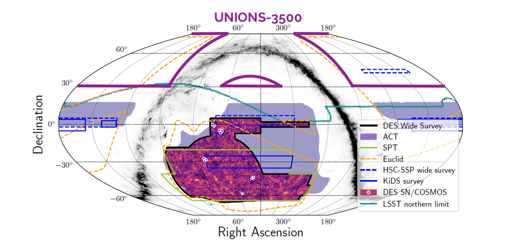
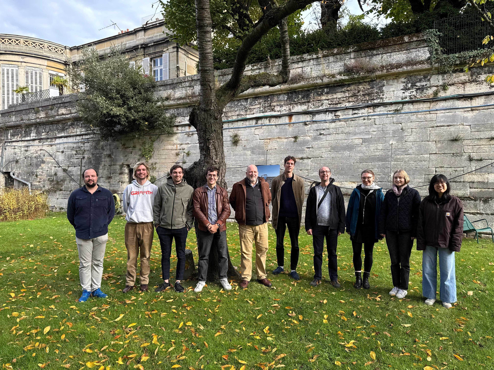
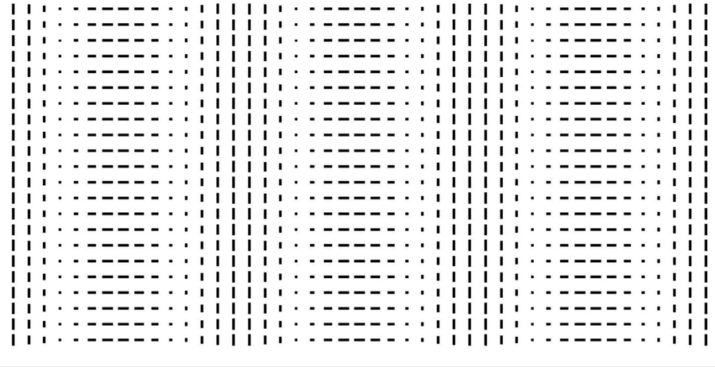
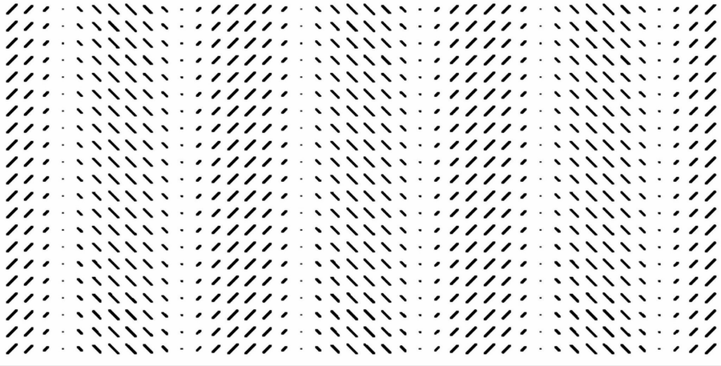
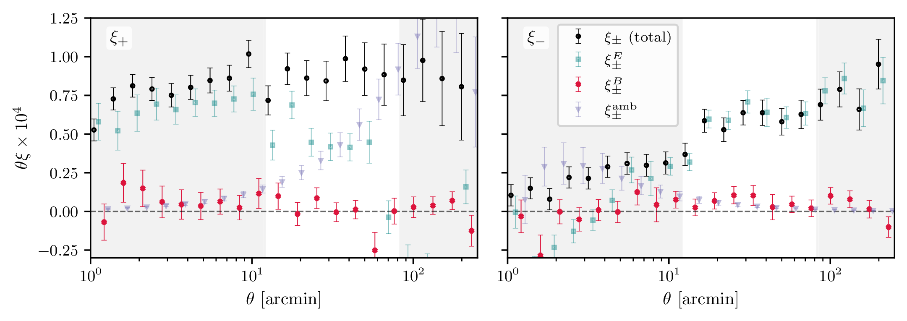
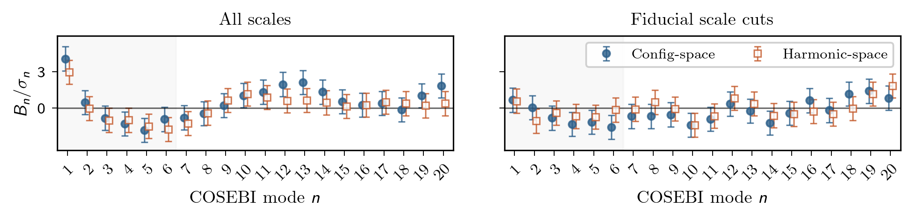
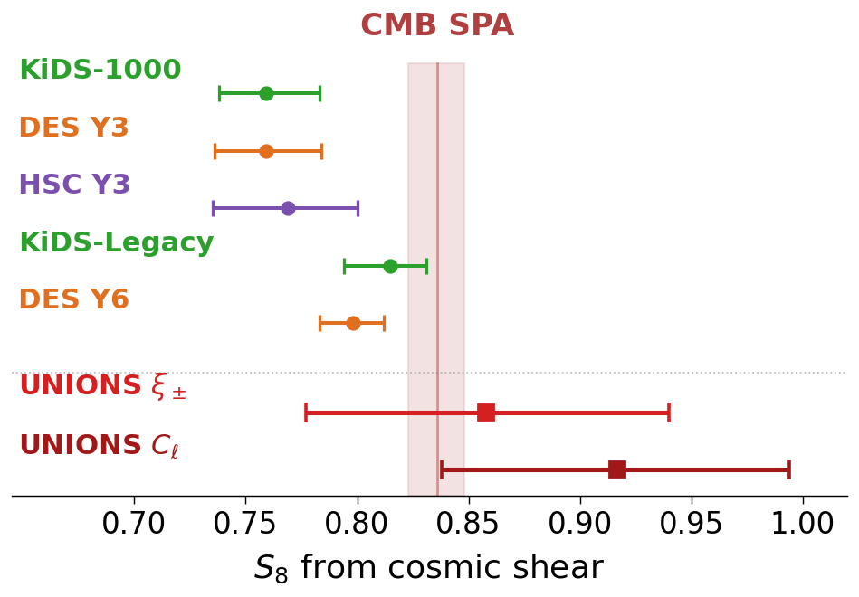
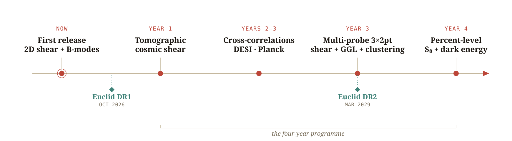

## Constraining cosmology with galaxy shapes {#shear-intro}

::: {.absolute top=110 right=36 width=560}
```{=html}
<svg id="wl-shear" viewBox="90 50 480 460" width="100%" role="img" aria-label="Background galaxies sheared into tangential alignment as a foreground mass appears">
<defs>
<radialGradient id="wlMassGlow" cx="50%" cy="50%" r="50%">
<stop offset="0%" stop-color="#bc4538" stop-opacity="0.30"/>
<stop offset="48%" stop-color="#bc4538" stop-opacity="0.11"/>
<stop offset="100%" stop-color="#bc4538" stop-opacity="0"/>
</radialGradient>
</defs>
<g class="fragment" data-fragment-index="1" id="wl-cluster">
<circle cx="350" cy="270" r="140" fill="url(#wlMassGlow)"/>
<circle cx="350" cy="270" r="74" fill="none" stroke="#bc4538" stroke-width="1.4" stroke-dasharray="2 8" opacity="0.4"/>
<ellipse cx="350" cy="270" rx="13" ry="9" fill="#c49333" fill-opacity="0.62" transform="rotate(18 350 270)"/>
<ellipse cx="328" cy="256" rx="9" ry="6" fill="#bc4538" fill-opacity="0.5" transform="rotate(-22 328 256)"/>
<ellipse cx="372" cy="284" rx="8" ry="5.5" fill="#c49333" fill-opacity="0.5" transform="rotate(40 372 284)"/>
<ellipse cx="364" cy="252" rx="6.5" ry="4.5" fill="#bc4538" fill-opacity="0.42" transform="rotate(8 364 252)"/>
<ellipse cx="334" cy="286" rx="6" ry="4" fill="#c49333" fill-opacity="0.42" transform="rotate(-10 334 286)"/>
</g>
<circle r="1" class="wl-gal" style="--ti:translate(498.8px,255.0px) rotate(42.0deg) scale(22.29,10.10);--tl:translate(508.7px,254.0px) rotate(58.3deg) scale(27.81,10.68);--d:0.11s"/>
<circle r="1" class="wl-gal" style="--ti:translate(448.9px,300.9px) rotate(40.3deg) scale(22.94,9.81);--tl:translate(461.8px,305.0px) rotate(65.9deg) scale(24.91,13.06);--d:0.04s"/>
<circle r="1" class="wl-gal" style="--ti:translate(467.3px,361.9px) rotate(-0.8deg) scale(21.97,10.24);--tl:translate(475.2px,368.1px) rotate(-19.6deg) scale(25.92,11.47);--d:0.21s"/>
<circle r="1" class="wl-gal" style="--ti:translate(359.0px,470.2px) rotate(38.4deg) scale(20.73,10.85);--tl:translate(359.3px,477.3px) rotate(25.0deg) scale(24.28,11.34);--d:0.01s"/>
<circle r="1" class="wl-gal" style="--ti:translate(311.5px,459.1px) rotate(-27.8deg) scale(20.86,10.79);--tl:translate(310.0px,466.4px) rotate(-14.3deg) scale(24.84,11.19);--d:0.11s"/>
<circle r="1" class="wl-gal" style="--ti:translate(316.8px,386.9px) rotate(-38.8deg) scale(20.03,11.23);--tl:translate(313.6px,398.4px) rotate(-11.3deg) scale(24.63,12.71);--d:0.00s"/>
<circle r="1" class="wl-gal" style="--ti:translate(132.6px,338.6px) rotate(83.4deg) scale(20.13,11.18);--tl:translate(127.0px,340.3px) rotate(79.7deg) scale(24.72,10.78);--d:0.19s"/>
<circle r="1" class="wl-gal" style="--ti:translate(129.5px,277.7px) rotate(-42.8deg) scale(23.36,9.63);--tl:translate(123.3px,277.9px) rotate(-53.5deg) scale(25.66,10.47);--d:0.11s"/>
<circle r="1" class="wl-gal" style="--ti:translate(170.4px,226.7px) rotate(0.9deg) scale(21.19,10.62);--tl:translate(162.7px,224.9px) rotate(-10.6deg) scale(20.63,13.63);--d:0.17s"/>
<circle r="1" class="wl-gal" style="--ti:translate(235.6px,167.7px) rotate(37.6deg) scale(22.65,9.93);--tl:translate(228.4px,161.2px) rotate(32.5deg) scale(21.13,13.96);--d:0.04s"/>
<circle r="1" class="wl-gal" style="--ti:translate(263.1px,98.7px) rotate(9.8deg) scale(21.46,10.49);--tl:translate(259.7px,92.0px) rotate(-2.5deg) scale(25.84,10.77);--d:0.03s"/>
<circle r="1" class="wl-gal" style="--ti:translate(299.0px,110.0px) rotate(-55.2deg) scale(17.45,12.89);--tl:translate(296.4px,101.7px) rotate(-33.2deg) scale(22.33,12.91);--d:0.03s"/>
<circle r="1" class="wl-gal" style="--ti:translate(445.1px,129.3px) rotate(59.1deg) scale(22.56,9.97);--tl:translate(450.0px,122.1px) rotate(49.7deg) scale(29.43,9.76);--d:0.15s"/>
<circle r="1" class="wl-gal" style="--ti:translate(454.0px,137.0px) rotate(-76.7deg) scale(18.06,12.46);--tl:translate(459.4px,130.1px) rotate(-110.7deg) scale(19.90,14.46);--d:0.15s"/>
<circle r="1" class="wl-gal" style="--ti:translate(471.6px,196.5px) rotate(-35.5deg) scale(22.15,10.16);--tl:translate(480.6px,191.1px) rotate(-42.3deg) scale(20.55,14.64);--d:0.07s"/>
</svg>
```
:::

::: {style="width:62%;margin-top:2.1em;font-size:1.08em"}
**Cosmic shear:** gravitational lensing distorts galaxy shapes by ~1%, **coherently**
:::

::: {.absolute bottom=50 left=80 width=1760 .fragment fragment-index=2}
::: {style="text-align:center;font-size:1.0em;margin-bottom:0.18em"}
Intricate pipelines, **sensitive to systematics**:
:::

{.blend-figure width=100%}
:::

::: notes
~1.5 min, general jury. Say the physics; don't read the slide. Start on the random field (top
right): galaxies have their own random shapes and orientations. CLICK — a mass concentration
appears, and its gravity bends the light of everything behind it, nudging those shapes to align
tangentially around it. Any one galaxy barely moves (~1%), but the alignment is coherent, so
averaged over millions of galaxies it becomes a clean signal that maps the matter — the cosmic
web. A single cluster is the easy case to picture; the real signal is the same effect from all
the large-scale structure at once. We read it out through the two-point shear correlation — how
galaxy shapes align as a function of separation. The bottom strip is the long road from raw sky
images to a cosmological constraint: model the PSF, measure shapes, calibrate, correlate. The
whole rest of the talk lives at one hinge in that chain — getting the shapes clean enough to trust.
:::


## Cosmic shear benefits from independent measurements {#independent-checks}

:::::::::::::: {.columns}
::: {.column style="width:25%"}

::: {style="margin-top:110px;margin-left:45px;margin-right:-15px"}
{width=115% fig-align="center"}
:::

:::
::: {.column style="width:75%;overflow:hidden"}

::: {.fragment fragment-index=0 style="position:relative;margin-left:-3%;margin-right:-6%"}
{width=130% fig-align="center"}

::: {style="position:absolute;bottom:12px;right:8%;font-size:0.6em;opacity:0.8"}
Credit: DES Collaboration
:::
:::

:::
::::::::::::::

:::: {.r-stack}
::: {.fragment .fade-out fragment-index=0 style="margin:0;width:100%"}
- $S_8$ seems to be converging as systematics improve; consensus is important!
:::
::: {.fragment fragment-index=0 style="margin:0;width:100%"}
- $S_8$ seems to be converging as systematics improve; consensus is important!
- But the northern sky has no wide-field lensing surveys
:::
::::

::: notes
S₈ is converging as systematics improve (KiDS 3.0σ→0.74σ, DES 2.3σ→1.1σ): consensus matters. But
consensus needs genuinely independent measurements, not more data from overlapping footprints. DES,
KiDS, and HSC all overlap one another (Jefferson+2025, "overlaps between all pairs") — and the
northern sky has no deep wide-field lensing survey at all.
:::


## UNIONS adds deep wide-field lensing constraints in the North {#unions}

:::::::::::::: {.columns}
::: {.column style="width:25%"}

::: {style="margin-top:110px;margin-left:45px;margin-right:-15px"}
{width=115% fig-align="center"}
:::

:::
::: {.column style="width:75%;overflow:hidden"}

::: {style="position:relative;margin-left:-3%;margin-right:-6%"}
{width=130% fig-align="center"}

::: {style="position:absolute;bottom:12px;right:8%;font-size:0.6em;opacity:0.8"}
Credit: DES Collaboration
:::
:::

:::
::::::::::::::

- Different instrument, on-sky systematics, sample variance
- New cross-correlation opportunities (DESI, Planck, Euclid)

::: notes
UNIONS covers the northern sky with zero overlap with DES, KiDS, or HSC — independent large-scale
structure, sample variance, Galactic foregrounds, and instrument (CFHT MegaCam vs DECam/OmegaCAM/
HSC). The only Stage-III cosmic shear survey that shares sky with none of the others. Its northern
footprint is what makes it uniquely valuable for cross-correlations: DESI spectroscopy, Planck/ACT
CMB lensing, Euclid at high declination.
:::


## UNIONS-3500 constraints are<br>the culmination of ~10 years of work {#papers-team}

:::::::::::::: {.columns}
::: {.column style="width:48%"}

{.no-treat .blend-figure width=100%}

:::
::: {.column style="width:52%"}

::: {style="margin-top:0.5em;font-size:1.02em"}
A small team of **~10 people**, across five coordinated UNIONS-3500 papers:
:::

::: {style="margin-top:0.7em;font-size:0.88em"}
- **Paper I:** Catalog construction (Hervas-Peters)
- <span style="color:#bc4538">**Paper II:** B-mode systematics (Daley)</span>
- **Paper III:** Configuration-space cosmology (Goh)
- **Paper IV:** Harmonic-space cosmology (Guerrini)
- **Paper V:** Image simulations (Hervas-Peters)
:::

:::
::::::::::::::

::: {style="text-align:center;margin-top:0.5em;font-size:0.95em;color:#7a6f5c"}
Primarily French early-career researchers
:::

::: notes
About ten people built the entire UNIONS-3500 weak-lensing release over roughly a decade of survey
development — far smaller than DES or KiDS. Five coordinated papers from one blinded catalog. This
talk is Paper II, the B-mode systematics analysis (my work). Natural place to make the person-power
point out loud: a small, person-power-limited team is exactly where investing in automation and
accelerated methods pays off.
:::


## Blinding to avoid confirmation bias {#blinding}

::: {style="margin-top:0.7em;font-size:1.06em"}
Modern cosmology analyses **obfuscate the data** until all null tests are passed and analysis
choices are fixed.
:::

:::::::::::::: {.columns style="margin-top:0.6em"}
::: {.column style="width:50%;text-align:center"}
{.eb-pattern width=82%}
:::
::: {.column style="width:50%;text-align:center"}
{.eb-pattern width=82%}
:::
::::::::::::::

::: {style="margin-top:0.6em;font-size:1.0em"}
A common null test is the significance of **B-modes** in the data. Gravitational lensing leaves a
specific geometric fingerprint, so to leading order the shear field is **curl-free** (no B-modes).
:::

::: {style="text-align:center;font-size:0.55em;color:#7a6f5c;margin-top:0.45em"}
E/B-mode patterns: BICEP Collaboration
:::

::: notes
~1.5 min. Lead with the methodological point: modern cosmology analyses BLIND themselves — the
data are obfuscated (catalog perturbed, results hidden) until every null test passes and all
analysis choices are frozen, so the analysis can't be tuned toward a preferred answer
(confirmation bias). A common null test is the significance of B-modes. Gravitational lensing is
curl-free to leading order, so it makes gradient-like E-modes (the signal) and essentially no
curl-like B-modes — a detected B-mode flags residual systematics (PSF leakage, additive bias).
The two whisker patterns show the E-mode (aligned) vs B-mode (swirl) signature. Absence of B-modes
doesn't prove cleanliness — which is exactly why the next slides use three different B-mode
statistics across scales.
:::


## I use three E/B-separable statistics, because each has different blind spots {#three-stats}

::: {style="margin-top:0.5em;text-align:center;font-size:0.98em"}
**$\xi_\pm^B(\theta)$** real-space &nbsp;·&nbsp; **COSEBIs** orthogonal modes &nbsp;·&nbsp; **$C_\ell^{BB}$** harmonic-space
:::

{width=94% fig-align="center"}

::: {style="margin-top:0.4em;text-align:center;font-size:0.92em"}
Each weights angular scales differently, so contamination one basis absorbs, another exposes. The point is what happens **when they disagree.**
:::

::: notes
~1.5 min. Three complementary bases; each weights scales differently, so comparing across them
exposes systematics any single one would absorb (the paper's central methodological point).
Keep the data vector HIGH-LEVEL here — it's the figure on this slide, not its own slide (per
Cail). Don't walk every panel; the message is "three bases, and they need not agree." Sets up
the disagreement.
:::


## The statistics disagree, and that disagreement is the information {#disagreement}

::: {style="margin-top:0.5em;text-align:center;font-size:1.0em"}
Over the full angular range: &nbsp; **$\xi_\pm^B$ passes** ✓ &nbsp;&nbsp; **$C_\ell^{BB}$ passes** ✓ &nbsp;&nbsp; **COSEBIs fail** ✗
:::

{width=94% fig-align="center"}

::: {style="margin-top:0.45em;text-align:center;font-size:0.9em"}
All three carry the same low-level contamination; only COSEBIs compress it into a $>\!4\sigma$ oscillating fingerprint at the CCD scale. Recompute them from the $C_\ell$ bandpowers (same data) and they still fail: the disagreement is set by the **filter**, not the space.
:::

::: notes
~2 min, the key finding. The honest framing (from the paper): the same low-level contamination is
present in all three statistics — ξ±B and C_ℓ^BB "pass but show low-level structure," while
COSEBIs cross 4σ. Because COSEBIs are orthogonal over a finite range, a feature compact in angle
(the CCD scale) spreads across the whole mode spectrum as a coherent oscillation — a recognisable
fingerprint the other bases dilute below significance. Robust: all four catalog versions show it.
Mechanism, concrete and from the paper: constant ellipticity per CCD, discontinuities at chip
boundaries carry curl → B-modes at MegaCam's 6–14 arcmin CCD scale; the repeating-additive-bias
effect Asgari+2019 traced across CFHTLenS/KiDS-450/DES-SV — relevant here because CFHTLenS used
the same MegaCam camera. The clinching proof (if asked): recompute COSEBIs *from* the C_ℓ
bandpowers — same data — and they still fail where C_ℓ passed, because the COSEBI filter functions
weight the contaminated scales differently. So the disagreement is set by the filter, not by
real- vs harmonic-space. The intellectual move: disagreement is the analysis working as designed.
:::


## The disagreement selects the catalog and sets the scale cuts {#scale-cuts}

::: {style="margin-top:0.5em;font-size:0.96em"}
Passing **all three** statistics does real work. B-mode failures drove a tighter **galaxy size
cut** (the size-cut catalog is fiducial), and the cuts that suppress the CCD signal become the
**scale cuts** for the cosmology papers, locked **blind** before any S₈.
:::

{width=90% fig-align="center"}

::: notes
~1.5 min. The disagreement does work: it selects the catalog and sets the scale cuts. Catalog —
of four variants, only the size-cut catalog passes all three statistics, so it's fiducial. The
honest detail: stellar-halo masking was the *more* aggressive, ostensibly-conservative choice,
but the irregular mask geometry introduced new pure-mode failures — so the tests, not our
priors, picked the catalog. Scale cuts — the cuts that suppress the CCD signal become the cosmology
papers' scale cuts, locked before unblinding (principled blinding discipline, immune to fishing
for a good S₈). PTE-grid figure shows the broad stable region the adopted cuts sit in.
:::


## A conservative treatment of systematics {#cosmology}

:::::::::::::: {.columns}
::: {.column style="width:52%;font-size:0.94em"}

::: {style="margin-top:0.6em"}
With a validated catalog and frozen scale cuts, two independent analyses find:
:::

::: {style="margin-top:0.5em"}
- Configuration space ($\xi_\pm$):<br>$S_8 = 0.86 \pm 0.08$
- Harmonic space ($C_\ell$):<br>$S_8 = 0.92 \pm 0.08$
:::

::: {style="margin-top:0.55em;font-size:0.95em"}
The error bars are **wider** than the recent KiDS and DES releases — we inflated our systematic
priors by **factors of two to three**.
:::

::: {style="margin-top:0.45em;font-size:0.92em"}
We want to avoid the failure mode the history of $S_8$ has diagnosed: a tight constraint that
moves once systematics are better understood.
:::

:::
::: {.column style="width:48%"}

:::: {.r-stack style="margin-top:90px"}
::: {.fragment .fade-out fragment-index=0}
{width=88% fig-align="center"}
:::
::: {.fragment fragment-index=0}
{width=98% fig-align="center"}
:::
::::

:::
::::::::::::::

::: notes
~1.5 min. State 1 — the contour (survey comparison): our wide 2D constraints, config vs harmonic
vs Planck; the width *is* the conservatism. [CLICK] State 2 — the whisker fades in: where UNIONS
lands in the S₈ landscape, consistent with everyone, bars visibly wider (a callback to the
convergence whisker on slides 2–3, now with UNIONS added). Lead with the two convention numbers and
their agreement, then the deliberate conservatism: priors inflated by factors of 1.4–3 (Δz, A_IA,
m-bias), wider bars on purpose rather than a tight constraint that later moves. The cross-talk
bridge — the same S₈ cautionary tale that opens Talk 1 closes here.
:::


## Agentic methods let a small team do large-survey science {#flywheel}

::: {style="width:90%;margin:0.3em auto 0"}
```{=html}
<svg id="fwsvg" xmlns="http://www.w3.org/2000/svg" viewBox="0 -84 1480 384" width="100%" role="img" aria-label="The shear pipeline drawn as a flywheel: feedback arrows return from downstream stages to earlier ones, revealed left to right.">
  <defs>
    <style>
      #fwsvg .label { font-family: "EB Garamond", Georgia, serif; font-size: 30px; font-weight: 600; fill: #1b1611; }
      #fwsvg .ink { stroke: #1b1611; }
      #fwsvg .muted { stroke: #7a6f5c; }
      #fwsvg .accent { stroke: #bc4538; }
      #fwsvg .teal { stroke: #3f8278; }
      #fwsvg .cobalt { stroke: #3d5ba0; }
      #fwsvg .ochre { stroke: #c49333; }
      #fwsvg .fb { opacity: 0; }
      #fwsvg .fragment.visible .fb { animation: fwPop 0.5s ease forwards; }
      #fwsvg .fragment.visible .fb1 { animation-delay: 0s; }
      #fwsvg .fragment.visible .fb2 { animation-delay: 0.35s; }
      #fwsvg .fragment.visible .fb3 { animation-delay: 0.7s; }
      #fwsvg .fragment.visible .fb4 { animation-delay: 1.05s; }
      #fwsvg .fragment.visible .fb5 { animation-delay: 1.4s; }
      @keyframes fwPop { from { opacity: 0; } to { opacity: 1; } }
    </style>
    <marker id="fwArrow" viewBox="0 0 10 10" refX="8" refY="5" markerWidth="7" markerHeight="7" orient="auto-start-reverse">
      <path d="M 0 0 L 10 5 L 0 10 z" fill="#bc4538" />
    </marker>
    <marker id="fwArrowTeal" viewBox="0 0 10 10" refX="8.5" refY="5" markerWidth="5" markerHeight="5" orient="auto-start-reverse">
      <path d="M 0 0 L 10 5 L 0 10 z" fill="#3f8278" />
    </marker>
    <radialGradient id="fwNodeGlow" cx="50%" cy="45%" r="70%">
      <stop offset="0%" stop-color="#ffffff" stop-opacity="0.84" />
      <stop offset="62%" stop-color="#ffffff" stop-opacity="0.42" />
      <stop offset="100%" stop-color="#f7f0e1" stop-opacity="0" />
    </radialGradient>
    <pattern id="fwFiber" width="74" height="58" patternUnits="userSpaceOnUse">
      <path d="M-12 31 C 18 4, 52 5, 86 34" fill="none" stroke="#3f8278" stroke-opacity="0.13" stroke-width="2" />
      <path d="M-8 49 C 22 24, 48 21, 82 48" fill="none" stroke="#3d5ba0" stroke-opacity="0.10" stroke-width="1.7" />
      <circle cx="21" cy="19" r="2.4" fill="#3f8278" fill-opacity="0.16" />
      <circle cx="56" cy="38" r="2.1" fill="#bc4538" fill-opacity="0.12" />
    </pattern>
  </defs>

  <rect x="0" y="-84" width="1480" height="384" fill="#f7f0e1" />
  <rect x="34" y="-66" width="1412" height="340" rx="24" fill="url(#fwFiber)" opacity="0.62" />
  <rect x="34" y="-66" width="1412" height="340" rx="24" fill="#f7f0e1" opacity="0.72" />

  <!-- forward flow: sky -> ... -> cosmology -->
  <path d="M 215 132 C 300 96, 405 168, 500 132 S 690 96, 790 132 S 980 168, 1080 132 S 1235 124, 1300 132"
        fill="none" stroke="#bc4538" stroke-width="7" stroke-linecap="round" stroke-opacity="0.82" marker-end="url(#fwArrow)" />
  <path d="M 215 132 C 300 96, 405 168, 500 132 S 690 96, 790 132 S 980 168, 1080 132 S 1235 124, 1300 132"
        fill="none" stroke="#f7f0e1" stroke-width="3" stroke-linecap="round" stroke-opacity="0.68" />

  <!-- backward feedback couplings: uniform adjacent hops, each to its predecessor; one click, staggered left to right -->
  <g class="fragment" data-fragment-index="1" fill="none" stroke="#3f8278" stroke-width="4.5" stroke-linecap="round" stroke-opacity="0.85">
    <path class="fb fb1" d="M 393 92 C 432 2, 468 2, 507 92" marker-start="url(#fwArrowTeal)" />
    <path class="fb fb2" d="M 587 92 C 626 2, 661 2, 700 92" marker-start="url(#fwArrowTeal)" />
    <path class="fb fb3" d="M 780 92 C 819 2, 854 2, 893 92" marker-start="url(#fwArrowTeal)" />
    <path class="fb fb4" d="M 973 92 C 1012 2, 1048 2, 1087 92" marker-start="url(#fwArrowTeal)" />
    <path class="fb fb5" d="M 1167 92 C 1206 2, 1241 2, 1280 92" marker-start="url(#fwArrowTeal)" />
  </g>

  <g transform="translate(160 132)">
    <circle r="100" fill="url(#fwNodeGlow)" />
    <circle r="72" fill="#fbf6e9" stroke="#c5b89e" stroke-width="2" />
    <path d="M-42 8 C-15 -35, 34 -28, 45 1 C 20 -12, -13 -11, -42 8Z" fill="none" class="teal" stroke-width="3" opacity="0.75" />
    <ellipse cx="-36" cy="-24" rx="10" ry="5.5" fill="none" class="cobalt" stroke-width="2.4" transform="rotate(-25 -36 -24)" />
    <ellipse cx="2" cy="-7" rx="14" ry="7" fill="none" class="muted" stroke-width="2.5" transform="rotate(18 2 -7)" />
    <ellipse cx="36" cy="26" rx="11" ry="5.5" fill="none" class="ochre" stroke-width="2.5" transform="rotate(-8 36 26)" />
    <circle cx="-12" cy="31" r="2.8" fill="#bc4538" opacity="0.45" />
    <text class="label" x="0" y="118" text-anchor="middle">sky</text>
  </g>

  <g transform="translate(353 132)">
    <circle r="96" fill="url(#fwNodeGlow)" />
    <rect x="-56" y="-44" width="112" height="90" rx="10" fill="#fbf6e9" stroke="#c5b89e" stroke-width="2.3" />
    <rect x="-42" y="-29" width="84" height="60" rx="5" fill="#ede2ce" stroke="#7a6f5c" stroke-opacity="0.45" stroke-width="1.5" />
    <circle cx="-21" cy="-8" r="6" fill="#3f8278" opacity="0.55" />
    <circle cx="18" cy="13" r="5" fill="#3d5ba0" opacity="0.45" />
    <path d="M-68 -68 L68 -68 M-44 -68 L-44 -45 M44 -68 L44 -45" fill="none" class="muted" stroke-width="4" stroke-linecap="round" opacity="0.55" />
    <text class="label" x="0" y="116" text-anchor="middle">images</text>
  </g>

  <g transform="translate(547 132)">
    <circle r="98" fill="url(#fwNodeGlow)" />
    <circle r="55" fill="#fbf6e9" stroke="#c5b89e" stroke-width="2.2" />
    <path d="M-44 27 C-22 27, -15 -33, 0 -33 C15 -33, 22 27, 44 27 Z" fill="#3d5ba0" fill-opacity="0.09" />
    <path d="M-46 27 H46" class="muted" stroke-width="1.4" opacity="0.4" />
    <path d="M-44 27 C-22 27, -15 -33, 0 -33 C15 -33, 22 27, 44 27" fill="none" class="cobalt" stroke-width="3" opacity="0.72" />
    <circle cx="-29" cy="13" r="3" fill="#bc4538" />
    <circle cx="-14" cy="-17" r="3" fill="#bc4538" />
    <circle cx="2" cy="-30" r="3" fill="#bc4538" />
    <circle cx="18" cy="-13" r="3" fill="#bc4538" />
    <circle cx="31" cy="15" r="3" fill="#bc4538" />
    <text class="label" x="0" y="118" text-anchor="middle">PSF</text>
  </g>

  <g transform="translate(740 132)">
    <circle r="98" fill="url(#fwNodeGlow)" />
    <circle r="60" fill="#fbf6e9" stroke="#c5b89e" stroke-width="2.2" />
    <ellipse cx="-24" cy="-18" rx="22" ry="8" fill="none" class="ink" stroke-width="2.5" opacity="0.65" transform="rotate(20 -24 -18)" />
    <ellipse cx="24" cy="-6" rx="20" ry="7" fill="none" class="ink" stroke-width="2.5" opacity="0.65" transform="rotate(20 24 -6)" />
    <ellipse cx="-4" cy="28" rx="24" ry="8" fill="none" class="ink" stroke-width="2.5" opacity="0.65" transform="rotate(20 -4 28)" />
    <path d="M-50 -49 L50 49 M-47 52 L-30 51 M30 -51 L47 -52" fill="none" class="teal" stroke-width="2" opacity="0.42" />
    <text class="label" x="0" y="116" text-anchor="middle">shapes</text>
  </g>

  <g transform="translate(933 132)">
    <circle r="98" fill="url(#fwNodeGlow)" />
    <rect x="-61" y="-51" width="122" height="102" rx="12" fill="#fbf6e9" stroke="#c5b89e" stroke-width="2.2" />
    <path d="M-37 22 C-19 -8, 6 -11, 37 -33" fill="none" class="teal" stroke-width="4" stroke-linecap="round" />
    <path d="M-38 -28 L39 -28 M-38 0 L39 0 M-38 28 L39 28" fill="none" class="muted" stroke-width="1.5" opacity="0.42" />
    <circle cx="-37" cy="22" r="5" fill="#bc4538" opacity="0.78" />
    <circle cx="4" cy="-11" r="5" fill="#bc4538" opacity="0.78" />
    <circle cx="37" cy="-33" r="5" fill="#bc4538" opacity="0.78" />
    <text class="label" x="0" y="116" text-anchor="middle">calib.</text>
  </g>

  <g transform="translate(1127 132)">
    <circle r="100" fill="url(#fwNodeGlow)" />
    <circle r="66" fill="#fbf6e9" stroke="#c5b89e" stroke-width="2.2" />
    <line x1="-42" y1="-26" x2="-2" y2="-38" class="muted" stroke-width="1.8" stroke-dasharray="3 4" opacity="0.62" />
    <ellipse cx="-42" cy="-26" rx="10" ry="4.8" fill="none" class="cobalt" stroke-width="2.4" transform="rotate(34 -42 -26)" />
    <ellipse cx="-2" cy="-38" rx="10" ry="4.8" fill="none" class="cobalt" stroke-width="2.4" transform="rotate(34 -2 -38)" />
    <line x1="-20" y1="20" x2="40" y2="30" class="muted" stroke-width="1.8" stroke-dasharray="3 4" opacity="0.62" />
    <ellipse cx="-20" cy="20" rx="10" ry="4.8" fill="none" class="accent" stroke-width="2.4" transform="rotate(-14 -20 20)" />
    <ellipse cx="40" cy="30" rx="10" ry="4.8" fill="none" class="accent" stroke-width="2.4" transform="rotate(-14 40 30)" />
    <text class="label" x="0" y="118" text-anchor="middle">2pt corr.</text>
  </g>

  <g transform="translate(1320 132)">
    <circle r="100" fill="url(#fwNodeGlow)" />
    <circle r="66" fill="#fbf6e9" stroke="#c5b89e" stroke-width="2.2" />
    <g transform="rotate(-24)">
    <path d="M -39.9 16.9 L -36.0 15.0 L -32.4 13.4 L -28.9 12.0 L -25.5 10.8 L -22.2 9.7 L -19.1 8.9 L -16.1 8.1 L -13.2 7.6 L -10.4 7.1 L -7.7 6.8 L -5.1 6.5 L -2.5 6.4 L 0.0 6.4 L 2.5 6.4 L 5.1 6.5 L 7.7 6.8 L 10.4 7.1 L 13.2 7.6 L 16.1 8.1 L 19.1 8.9 L 22.2 9.7 L 25.5 10.8 L 28.9 12.0 L 32.4 13.4 L 36.0 15.0 L 39.9 16.9 L 48.1 6.8 L 45.2 3.2 L 42.1 -0.2 L 38.8 -3.4 L 35.4 -6.3 L 31.9 -9.0 L 28.3 -11.4 L 24.5 -13.5 L 20.6 -15.4 L 16.6 -16.9 L 12.6 -18.1 L 8.4 -18.9 L 4.2 -19.5 L 0.0 -19.6 L -4.2 -19.5 L -8.4 -18.9 L -12.6 -18.1 L -16.6 -16.9 L -20.6 -15.4 L -24.5 -13.5 L -28.3 -11.4 L -31.9 -9.0 L -35.4 -6.3 L -38.8 -3.4 L -42.1 -0.2 L -45.2 3.2 L -48.1 6.8 Z" fill="none" class="cobalt" stroke-width="2.3" opacity="0.42" />
    <path d="M -26.3 11.2 L -23.8 9.9 L -21.4 8.9 L -19.1 7.9 L -16.8 7.1 L -14.7 6.4 L -12.6 5.9 L -10.6 5.4 L -8.7 5.0 L -6.9 4.7 L -5.1 4.5 L -3.4 4.3 L -1.7 4.3 L -0.0 4.2 L 1.7 4.3 L 3.4 4.3 L 5.1 4.5 L 6.9 4.7 L 8.7 5.0 L 10.6 5.4 L 12.6 5.9 L 14.7 6.4 L 16.8 7.1 L 19.1 7.9 L 21.4 8.9 L 23.8 9.9 L 26.3 11.2 L 31.7 4.5 L 29.8 2.1 L 27.8 -0.1 L 25.6 -2.2 L 23.4 -4.2 L 21.1 -6.0 L 18.7 -7.5 L 16.2 -8.9 L 13.6 -10.2 L 11.0 -11.2 L 8.3 -11.9 L 5.6 -12.5 L 2.8 -12.9 L -0.0 -13.0 L -2.8 -12.9 L -5.6 -12.5 L -8.3 -11.9 L -11.0 -11.2 L -13.6 -10.2 L -16.2 -8.9 L -18.7 -7.5 L -21.1 -6.0 L -23.4 -4.2 L -25.6 -2.2 L -27.8 -0.1 L -29.8 2.1 L -31.7 4.5 Z" fill="none" class="accent" stroke-width="2.7" opacity="0.62" />
    <path d="M -13.5 5.8 L -12.2 5.2 L -10.9 4.7 L -9.7 4.2 L -8.6 3.8 L -7.5 3.4 L -6.4 3.1 L -5.4 2.9 L -4.4 2.7 L -3.5 2.6 L -2.6 2.5 L -1.7 2.4 L -0.9 2.4 L -0.0 2.3 L 0.9 2.4 L 1.7 2.4 L 2.6 2.5 L 3.5 2.6 L 4.4 2.7 L 5.4 2.9 L 6.4 3.1 L 7.5 3.4 L 8.6 3.8 L 9.7 4.2 L 10.9 4.7 L 12.2 5.2 L 13.5 5.8 L 16.4 2.2 L 15.4 1.0 L 14.4 -0.2 L 13.3 -1.3 L 12.1 -2.3 L 10.9 -3.2 L 9.7 -4.0 L 8.4 -4.7 L 7.1 -5.4 L 5.7 -5.9 L 4.3 -6.3 L 2.9 -6.6 L 1.4 -6.8 L -0.0 -6.9 L -1.4 -6.8 L -2.9 -6.6 L -4.3 -6.3 L -5.7 -5.9 L -7.1 -5.4 L -8.4 -4.7 L -9.7 -4.0 L -10.9 -3.2 L -12.1 -2.3 L -13.3 -1.3 L -14.4 -0.2 L -15.4 1.0 L -16.4 2.2 Z" fill="#bc4538" fill-opacity="0.12" stroke="#bc4538" stroke-width="2.4" opacity="0.9" />
    </g>
    <circle r="3" fill="#bc4538" />
    <text class="label" x="0" y="118" text-anchor="middle">cosmology</text>
  </g>
</svg>
```
:::

::: {style="text-align:center;margin-top:0.25em;font-size:1.02em"}
Already spinning up on UNIONS. The goal is **high-quality science from a team far smaller** than this would otherwise take.
:::

::: notes
~1 min, the forward-looking agentic beat. The systematics framework and pipelines now exist, so the
expensive, judgment-heavy work — running the full analysis, the null tests, the covariance, the
exploration of every catalog and scale-cut choice — is increasingly carried by AI agents under my
direction. That turns the analysis into a flywheel: agents run and validate the pipeline, which
frees us to explore every choice rather than triage for lack of time, which makes each release
sharper than the last. The point is not speed for its own sake; it is doing high-quality,
fully-characterised science with a team a fraction of the size a Stage-III analysis usually demands.
This is what makes the four-year roadmap on the next slide tractable.
:::


## With the pipeline built, UNIONS can iterate toward the multi-probe gold standard {#forward}

::: {style="margin-top:0.45em;font-size:0.96em"}
With the catalog validated and the pipeline built, this first release is the foundation. From here
the constraints sharpen release by release: tomographic shear, then the multi-probe 3×2pt — the
gold standard for dark energy — and onward to cross-correlations with CMB lensing and Euclid.
:::

{width=97%}

::: {style="margin-top:0.25em;text-align:center;font-size:0.95em"}
A first step, characterised end to end — and produced almost entirely by AI agents under my
direction. **Thank you.**
:::

::: notes
~1.5 min. The close: not a program pitch (that's Talk 1), the scientific future. Walk the roadmap
left to right: first release (this talk) → tomographic shear (Year 1, breaks the IA degeneracy and
tightens S₈) → the multi-probe 3×2pt analysis (Years 2–3, shear + GGL + clustering, the gold
standard for dark energy and neutrino mass) → cross-correlations with CMB lensing and Euclid
(Year 4). The Euclid anchors are my own cross-correlation work: DR1 cross-correlated with SPT-3G,
and the CMB×Euclid combination delivering the tightest constraints. End on the agentic beat: this
first release was produced almost entirely by AI agents under my direction — the flywheel from the
previous slide, the method that makes the whole roadmap tractable for a small team.
:::
