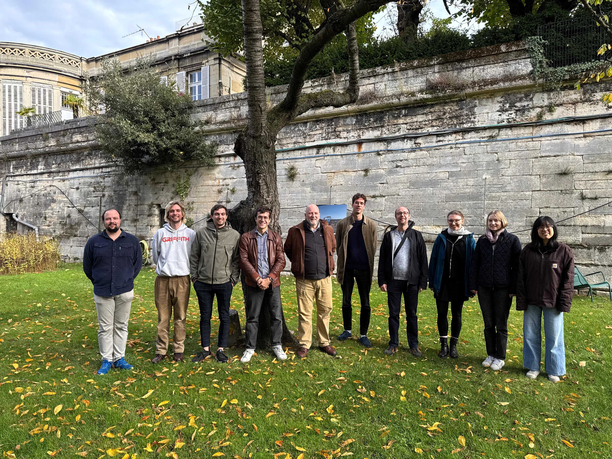

---
# ════════════════════════════════════════════════════════════════════════════════════════
# COMBINED TWO-TALK deck presented at the June 25 2026 CNRS AI Rising Talents interview.
# Two 15-min talks + ~13 min Q&A, for a NON-astrophysicist AI panel (ENS/DI).
#   PART I  (general)   — the AI landscape (METR) → two implications, (1) scientific epistemics /
#                         the choice, (2) sovereignty; then the proposal, cosmology as the proving
#                         ground, the program.
#   INTERMISSION.
#   PART II (in-depth)  — one contribution (the UNIONS B-mode systematics work) told entirely in
#                         plain language; "be pure, not complete"; the judgment skill — telling a
#                         real signal from an instrument's fingerprint — shown in action; one
#                         light agentic clause at the close.
# PUBLISHED AS AN UNLISTED DRAFT: `draft: true` keeps it out of the talks index; `output-file:
# index.html` gives it a bare-dir URL (.../26_CNRS_RisingTalents/) to share with the committee.
# Author-notes were scrubbed of private felt fiber names before publishing — when re-editing, keep
# speaker notes free of felt paths and candid strategy (they land in the public HTML source).
# Export: decktape reveal "file://$(pwd)/_site/26_CNRS_RisingTalents/index.html" out.pdf --size 1920x1080
# (This documentation lives in the front matter on purpose: a raw block before the first ## would
#  render as a blank leading slide — keep it inside the YAML so the deck opens straight on the scaling slide.)
# ════════════════════════════════════════════════════════════════════════════════════════
title: "Developing a practice<br>of AI-mediated science"
occasion: CNRS AI Rising Talents — Interview
description: "Combined two-talk interview deck: a general/program talk and an in-depth science talk, one intermission between"
draft: true
output-file: index.html
author:
    name: Cail Daley
    affiliation: "Département d'Astrophysique / UMR AIM · CEA"
credentials: "Observational cosmologist <span class='ti-dot'>·</span> PhD, University of Illinois, USA <span class='ti-dot'>·</span> postdoc, CEA"
pitch: "Diffusion <span class='ti-dot'>·</span> one PhD, one postdoc, visiting fellows <span class='ti-dot'>·</span> synthetic RL environments for agentic science"
date: June 25, 2026
date-format: long

# logos referenced only via inline-SVG <image href> aren't seen by Quarto's
# resource scanner; declare them so they're copied into _site/.../images/.
resources:
    - images/logo_dataia.png
    - images/logo_aissai.png

format:
    revealjs:
        width:  1920
        height: 1080
        margin: 0
        auto-stretch: false
        theme: [default, ../assets/house.scss, custom.scss]
        slide-number: true
        fig-align: center
        menu: false
        include-after-body:
            - assets/no_footer_on_titleslide.html
            - assets/restore-iframe-focus.html
            - assets/figure-treatment.html
            - assets/wl-shear-animate.html
        footer: "Cail Daley | CNRS AI Rising Talents | June 25, 2026"
        history: false
        hash: true
        pdf-separate-fragments: true
        pdf-max-pages-per-slide: 1
        template-partials:
            - title-slide.html
        center-title-slide: false

html-math-method:
    method: mathjax
    url: https://cdn.jsdelivr.net/npm/mathjax@3/es5/tex-svg-full.js
include-in-header: assets/mathjax.html
---


## Agentic capabilities are increasing exponentially {#metr .metr-slide}

::: {.metr-stage}

::: {.metr-chart-wrap}

::: {.metr-chart-title}
How long a task takes a human expert
:::

::: {.metr-cropbox}
<iframe class="metr-embed" src="https://metr.org/horizon-chart-embed" title="METR — task-completion time horizon (live, interactive)" loading="lazy"></iframe>
:::

:::

::: {.metr-axes-col}

::: {.metr-axes-head}
Driven by
:::

- Scaling laws [[Kaplan ’20](https://arxiv.org/abs/2001.08361) · [Hoffmann ’22](https://arxiv.org/abs/2203.15556)]{.metr-cite}
- Test-time compute [[Snell ’24](https://arxiv.org/abs/2408.03314) · [DeepSeek ’25](https://arxiv.org/abs/2501.12948)]{.metr-cite}
- Synthetic data [[Gunasekar ’23](https://arxiv.org/abs/2306.11644) · [Langlais ’26](https://arxiv.org/abs/2604.18226) (Pleias)]{.metr-cite}

:::

:::

::: notes
~1 min. The opportunity meeting the crisis. This audience knows this chart — keep it plain anyway:
each point is how long a task takes a human expert; the frontier is the longest task an AI agent can
now finish on its own, and it is doubling every few months — roughly 2,500× over four years if it
holds. The three bullets are why the AI panel expects it to continue: scaling laws, test-time
compute, synthetic data (terms they know — fine to name here). OFFLINE FALLBACK if the iframe won't
load on the day: swap for {width=100%}. Credit METR.
:::


## Sovereignty is no longer abstract {#sovereignty-stakes}

:::::::::::::: {.columns style="justify-content:space-between;align-items:flex-start"}
::: {.column width="55%"}

::: {style="text-align:center"}
{style="width:100%;max-width:1100px"}
:::

::: {.fragment data-fragment-index="1" style="width:64%;height:2px;background:#b3a488;margin:0.7em auto 0.6em"}
:::

::: {style="text-align:center"}
[{.fragment data-fragment-index="1" style="width:100%;max-width:1100px"}](https://europe2031.ai){target="_blank" style="display:inline-block;max-width:100%"}
:::

:::
::: {.column width="20%"}

<div class="r-stack" style="height:1.3em;margin-top:-95px"><span class="fragment fade-in-then-out" data-fragment-index="1" style="color:#7a6f5c;font-size:0.66em;letter-spacing:0.04em">June 2026</span><span class="fragment" data-fragment-index="2" style="color:#bc4538;font-size:0.66em;letter-spacing:0.04em">March 2031</span></div>

<div class="r-stack" style="margin-top:0.15em"></div>

:::
::::::::::::::

::: notes
The latest models have become so capable that they're now a question of national security — to the
point that the US government has restricted the release of these models, especially to non-US
citizens, leaving France without access to frontier AI for the first time.

Concerned Europeans have recently been raising the alarm about this, and what this means for Europe's
future — for example, Europe 2031, which forecasts what might happen in Europe over the next five years
as the AI race continues.

Despite the fact that, in their forecast, the ratio of compute in the US and Europe stays roughly the
same over the next five years, by the end of their scenario Europe finds itself economically and
politically sidelined — without the ability to shape its own future and defend its own values.

This is a future that, to avoid, will require a historic mobilization across France and Europe —
including within many scientific domains, where researchers will need to contribute to advancing their
own work as well as European sovereignty.
:::


## Sovereignty goes beyond model capability {#sovereignty}

:::::::::::::: {.columns}
::: {.column style="width:42%"}

::: {style="margin-top:1.0em;padding:0.45em 0.9em;border-left:5px solid #3D5BA0"}
[**model capability**]{style="font-size:1.18em;color:#3D5BA0;font-variant:small-caps;letter-spacing:0.05em"}<br>
[benchmarks, what they can do]{style="color:#7a6f5c;font-size:0.85em"}
:::

::: {style="margin-top:0.7em;padding:0.45em 0.9em;border-left:5px solid #bc4538"}
[**savoir-faire**]{style="font-size:1.18em;color:#bc4538;font-variant:small-caps;letter-spacing:0.05em"}<br>
[diffusion, what we do]{style="color:#7a6f5c;font-size:0.85em"}
:::

::: {style="margin-top:1.25em;font-size:1.12em;line-height:1.3"}
**intellectual sovereignty must be built across all fields now**
:::

:::
::: {.column style="width:58%"}

::: {style="height:830px;display:flex;align-items:center;justify-content:center;margin-top:-10px"}
{.blend-figure style="max-height:830px;max-width:100%"}
:::

::: {style="text-align:right;font-size:0.5em;color:#7a6f5c;margin-top:0.1em"}
Credit: Anthropic Economic Index
:::

:::
::::::::::::::

::: notes
~1 min. The thesis, corrected — BOTH halves are critical (updated from Cail's direction; make it
yours). You need capable models; access to the frontier is real and it matters. But capability alone
isn't sovereignty: if you wait until you *have* the capable model to start learning how to use it,
you've wasted time we don't have. The radar makes the gap visible: blue = what models can already do
(theoretical capability, what benchmarks measure); red = what we actually do with them today. The
area between is not a model problem — it's a know-how problem, and it's the half a researcher can
move *now*. So: model capability = benchmarks, what they can do; savoir-faire = diffusion, what we
do. Closing the gap is intellectual sovereignty, and it has to be built field by field, starting
now — not after the models arrive. (Decorum: keep it about people/practice, not a model race.) Bridge
to the choice: savoir-faire is *how* we work with these tools — and how we work is itself a choice,
which turns the question from *who controls the models* to *what science becomes*.
:::


## AI as pharmakon: we get to choose what science becomes {#the-choice .vcenter}

:::::::::::::: {.columns style="margin-top:0.85em;align-items:stretch"}
::: {.column style="width:50%"}

::: {style="height:100%;display:flex;flex-direction:column;justify-content:space-between;padding:0.2em 1em;border-left:5px solid #7a6f5c"}
[**AI science factories**]{style="font-size:1.08em"}

::: {style="text-align:center"}
{.no-treat style="width:94%;border-radius:5px;box-shadow:0 8px 20px rgba(27,22,17,0.18)"}

{.no-treat style="width:94%;border-radius:5px;box-shadow:0 8px 20px rgba(27,22,17,0.18);margin-top:0.22em"}
:::

::: {style="line-height:1.35"}
[alienation from scientific labor]{style="color:#bc4538;font-size:1.0em"}<br>
[discovery scales with capital, not expertise]{style="color:#bc4538;font-size:0.9em"}
:::
:::

:::
::: {.column style="width:50%"}

::: {style="height:100%;display:flex;flex-direction:column;padding:0.2em 1.1em;border-left:5px solid #3F8278"}
[**An economy of contribution**]{style="font-size:1.08em;color:#3F8278"}

::: {style="flex:1;display:flex;flex-direction:column;justify-content:center;color:#1B1611;padding-bottom:2.5em"}
[« …l'augmentation du savoir des travailleurs à travers un nouvel agencement entre la machine et le travailleur »]{style="display:block;text-align:center;font-size:0.98em;line-height:1.5;padding:0 0.2em"}

[— Bernard Stiegler]{style="display:block;text-align:right;color:#3F8278;font-size:0.9em;letter-spacing:0.02em;margin-top:0.55em"}
:::
:::

:::
::::::::::::::

::: notes
~1 min. The values core of the talk — and the runway straight into the pitch. [Framing below is a
DRAFT — Cail to make it his own; the first-person passage further down is his, keep verbatim.]

THE FRAME — the pharmakon (Derrida, then Stiegler). AI is a *pharmakon*: Derrida's word for the
remedy that is also the poison — one dose, both at once. Which face science gets is not decided by
the technology; it is decided by the *practice* we build around it. (Derrida's student Stiegler
carried the pharmakon to *technics*: the danger is the **proletarianization of knowledge** — our
know-how absorbed into the machine until we can no longer do the work ourselves; the cure he called
**deproletarianization** — deliberately cultivating a new know-how instead of surrendering the old.)

THE POISON — "AI science factories." Not hypothetical: papers already framed as *"Competing with AI
Scientists"* (the John Henry race — the one humans are built to lose), and a *Parallel ArXiv* where
agents write the papers and agents review them — a literature with no one in it; *eerie* in Mark
Fisher's sense (*The Weird and the Eerie*): not the weird but the eerie — an agency with no subject
behind it, a presence where there should be someone and isn't. What's lost isn't jobs; it's the
*doing* of science —
alienation from scientific labor. And there is a second, structural loss — the line above it on the
slide: once people are out of the loop, scientific output is just a function of *capital*. The frontier
labs then have every incentive to stop *selling* the tools and do the science in-house — patent the
results, recoup the investment — because at that scale discovery needs compute, not expertise.
*Discovery scales with capital, not expertise.* And it isn't even clearly *better*: for now the
strongest work is collaborative, humans and agents multiplying each other.

THE CURE — the other face of the pharmakon: the same tools, a different practice. Make it concrete —
the grunt work (installing the software, fighting the pipeline, the dusty-office drudgery) goes to the
agents, and the human is freed for the science that matters: you talk to the model, it hands you a
plot, you discuss it with colleagues wherever you are — on a walk, on the beach — and that
conversation becomes the next set of actions. The shape that wins isn't agent fleets replacing people,
and it isn't the lone researcher either — it's *networks of humans, amplified by agents*, reaching a
deeper and more meaningful understanding than either could alone. That is what I mean: not
surrendering the know-how but cultivating a new one — what Stiegler names an **économie de la
contribution**, where the old producer/consumer split gives way to *contributeurs* who cooperate and
share knowledge (the free-software model). His words, from a 2017 interview: *« l'organisation du
travail se fonde sur l'augmentation du savoir des travailleurs à travers un nouvel agencement entre
la machine et le travailleur »* — the machine **augments** the worker's knowledge rather than
displacing it. He develops the concept in *Pour une nouvelle critique de l'économie politique*
(Galilée, 2009). The mentorship, the judgment, the meaning kept in the work — that is the
cultivation. My program is a bet on this face of the pharmakon.

The deeper point (deliver with restraint, in the first person): this is not only about jobs. It is
about keeping the part of the work we actually love — discovery. I would far rather spend this era
in wonderful, beautiful discovery, amplified, than watch the work get slowly ripped from our hands
by agent "competitors." If a day comes when there is nothing left for us to add, so be it — but I
would rather enjoy the good times while they last, and shape the practice so people stay *in* it. My
program is a bet on the second path.

[Folded in from the old "closed-science" slide — the escalation, spoken if there's time]: And it
isn't only *what* science becomes — it's *who* gets to do it. Research now scales with tokens and
compute, so it's increasingly gated by access: frontier labs run the work in-house, productize the
results to recoup the cost, and the best scientists migrate to the labs to keep doing real research —
science drifts behind closed doors. Access to frontier compute is necessary, not sufficient. (Live
example, June 2026: Midjourney launched "Midjourney Medical," an ultrasonic-CT scanner — even a
mid-size lab is already turning research into a closed product line.) The line: the crisis isn't only
verification — it's who gets the *right* to do research.

(References shown are title/masthead only — arXiv:2604.09621 and parallelscience.org — deliberately
not author lists: the critique is of the framing, not of colleagues, some of whom may be known to
the panel.)

[→ hand straight into the pitch: "So — here's the case I'm making." The "bet on the second
path" line above is the launch; the next slide is the program.]
:::


## The case I'm making {#mission}

::: {style="text-align:center;margin-top:0.1em"}
<svg viewBox="0 0 2000 1010" style="width:98%;height:auto" font-family="'EB Garamond', Georgia, serif">
  <defs><marker id="mfa" viewBox="0 0 10 10" refX="8" refY="5" markerWidth="6.5" markerHeight="6.5" orient="auto-start-reverse"><path d="M0,0 L10,5 L0,10 z" fill="#9A8E76"/></marker></defs>
  <ellipse cx="1000" cy="555" rx="380" ry="210" fill="#FBF6E9" stroke="#C5B89E" stroke-width="2.5"/>
  <text x="1000" y="539" text-anchor="middle" fill="#1B1611" font-size="44"><tspan x="1000" dy="0">Develop and diffuse a practice of</tspan><tspan x="1000" dy="56" font-weight="700">rigorous AI-mediated science</tspan></text>
  <g class="fragment" data-fragment-index="1">
    <g fill="none" stroke="#9A8E76" stroke-width="3.6" marker-start="url(#mfa)" marker-end="url(#mfa)" opacity="0.9"><path d="M 1174,313 Q 1485,418 1526,599"/><path d="M 1476,740 Q 1000,880 524,740"/><path d="M 474,599 Q 515,418 826,313"/></g>
    <polygon points="908,17 1092,17 1185,172 1092,327 908,327 815,172" fill="#FBF6E9" stroke="#BC4538" stroke-width="4" stroke-linejoin="round"/>
    <text x="1000" y="154" text-anchor="middle" fill="#BC4538" font-size="40" font-variant="small-caps" letter-spacing="0.6"><tspan x="1000" dy="0">Cosmological</tspan><tspan x="1000" dy="46">research</tspan></text>
    <polygon points="1608,585 1792,585 1885,740 1792,895 1608,895 1515,740" fill="#FBF6E9" stroke="#3D5BA0" stroke-width="4" stroke-linejoin="round"/>
    <text x="1700" y="694" text-anchor="middle" fill="#3D5BA0" font-size="40" font-variant="small-caps" letter-spacing="0.6"><tspan x="1700" dy="0">Benchmarks &#8594;</tspan><tspan x="1700" dy="46">synthetic RL</tspan><tspan x="1700" dy="46">environments</tspan></text>
    <polygon points="208,585 392,585 485,740 392,895 208,895 115,740" fill="#FBF6E9" stroke="#3F8278" stroke-width="4" stroke-linejoin="round"/>
    <text x="300" y="722" text-anchor="middle" fill="#3F8278" font-size="40" font-variant="small-caps" letter-spacing="0.6"><tspan x="300" dy="0">Diffusion &amp;</tspan><tspan x="300" dy="46">pedagogy</tspan></text>
    <text x="1547" y="413" text-anchor="middle" fill="#1B1611" font-size="38" font-weight="600">one postdoc</text>
    <text x="427" y="406" text-anchor="middle" fill="#1B1611" font-size="38" font-weight="600">one PhD student</text>
    <text x="1000" y="931" text-anchor="middle" fill="#1B1611" font-size="38" font-weight="600">visiting fellows</text>
  </g>
</svg>
:::

::: notes
THE SCRIPT (Cail's words — dictated; preserve):

"I want to propose a meta-research program on the practice of doing science with AI. I'll do it by
staying abreast of — and in fact pushing — the practice of AI-driven science applied to real
research, and using that to learn the practice as much as to do excellent science.

Here are the deliverables. First: a set of benchmarks for agentic science, specifically in cosmology
— which are also the beginnings of a synthetic reinforcement-learning environment for science, one
that can be used to train frontier French models and open models. Second: diffusion through the
French communities — a visiting-fellows program: paid six-month residencies where researchers
bring machine-learning, synthetic-data, and reinforcement-learning expertise in, build it into the
science with us, and carry the practice back into French labs — plus papers on what we learn. Third:
mentoring and pedagogy — discussions and white papers on research pedagogy with AI. And finally:
fundamental cosmology research — excellent science.

To sum it all up quickly: benchmarks to RL environments; diffusion and pedagogy; and fundamental
cosmology research."

(Visual: a full-width flywheel SVG generated by `_flywheel.py` — INLINE svg, no blank lines or pandoc
drops the raw-HTML block; rerun the script to retune geometry/sizes. HUB-FIRST reveal: an ellipse
holds the mission — "Develop and diffuse a practice of **rigorous AI-mediated science**" (tail
dropped; the proving ground is named by the node) — shown alone, then on click the three hexagonal
nodes + **bidirectional** arrows fade in, the loop running both ways. Nodes (small-caps EB Garamond):
cosmological research (the proving ground, cinnabar) ↔ benchmarks→RL environments (cobalt) ↔
diffusion & pedagogy (teal). Diffusion deliverables: visiting fellows (paid residencies) · work with
Paris-Saclay teaching centres · experts trained to join French labs. The three nodes preview the
program-detail slides; keep in sync. Title: "The case I'm making" — de-passived per Micha
(2026-06-22); Cail chose this over stating the case outright.)
:::


## Cosmology provides a challenge and opportunity for agentic AI {#why-cosmology}

::: {style="width:86%;margin:1.2em auto 0"}
```{=html}
<svg viewBox="0 0 1000 175" width="100%" role="img" aria-label="The verification signal decays from clean, verifiable problems into the noise of cosmology, which has no answer key">
<defs>
<linearGradient id="verifGrad" x1="0" y1="0" x2="1" y2="0">
<stop offset="0%" stop-color="#3f8278"/>
<stop offset="50%" stop-color="#8a7a52"/>
<stop offset="100%" stop-color="#bc4538"/>
</linearGradient>
</defs>
<text x="46" y="24" font-family="'EB Garamond',Georgia,serif" font-size="25" font-weight="600" fill="#3f8278">verifiable</text>
<text x="954" y="24" text-anchor="end" font-family="'EB Garamond',Georgia,serif" font-size="25" font-weight="600" fill="#bc4538">no answer key</text>
<text x="500" y="22" text-anchor="middle" font-family="'EB Garamond',Georgia,serif" font-size="14" font-style="italic" fill="#9a8e76" letter-spacing="0.5">the verification signal weakens →</text>
<polyline points="70.0,100.0 75.4,95.3 80.8,90.5 86.1,86.7 91.5,82.8 96.9,79.2 102.2,76.6 107.6,73.7 113.0,71.5 118.4,69.8 123.8,69.9 129.1,69.4 134.5,70.0 139.9,69.8 145.2,71.4 150.6,74.5 156.0,75.2 161.4,78.0 166.8,81.7 172.1,85.2 177.5,89.9 182.9,94.1 188.2,96.6 193.6,101.7 199.0,105.2 204.4,108.6 209.8,112.7 215.1,114.4 220.5,117.3 225.9,118.2 231.2,121.3 236.6,122.3 242.0,123.9 247.4,123.8 252.8,124.8 258.1,125.3 263.5,120.9 268.9,119.6 274.2,118.7 279.6,117.3 285.0,117.3 290.4,115.3 295.8,112.3 301.1,110.9 306.5,103.3 311.9,102.8 317.2,96.6 322.6,97.2 328.0,90.0 333.4,88.2 338.8,93.0 344.1,89.3 349.5,81.4 354.9,84.0 360.2,78.0 365.6,83.0 371.0,86.1 376.4,80.4 381.8,79.1 387.1,85.5 392.5,88.7 397.9,87.2 403.2,81.1 408.6,85.2 414.0,95.4 419.4,95.8 424.8,100.0 430.1,102.9 435.5,94.5 440.9,105.6 446.2,102.0 451.6,105.5 457.0,111.3 462.4,104.1 467.8,115.4 473.1,107.8 478.5,117.8 483.9,113.1 489.2,117.3 494.6,116.4 500.0,102.8 505.4,105.5 510.7,114.9 516.1,102.2 521.5,115.3 526.9,110.4 532.2,99.2 537.6,102.5 543.0,113.5 548.4,91.7 553.8,108.6 559.1,106.4 564.5,92.6 569.9,102.5 575.2,102.5 580.6,107.6 586.0,106.6 591.4,92.7 596.8,101.7 602.1,91.4 607.5,97.8 612.9,95.5 618.2,80.5 623.6,95.0 629.0,92.5 634.4,83.7 639.8,105.9 645.1,107.6 650.5,83.3 655.9,86.7 661.2,106.6 666.6,109.4 672.0,90.5 677.4,83.6 682.8,111.0 688.1,83.4 693.5,86.0 698.9,96.6 704.2,103.8 709.6,116.4 715.0,119.2 720.4,81.5 725.8,111.2 731.1,91.4 736.5,110.4 741.9,85.9 747.2,95.7 752.6,109.3 758.0,114.8 763.4,89.8 768.8,120.2 774.1,112.9 779.5,97.1 784.9,82.8 790.2,94.3 795.6,111.0 801.0,78.7 806.4,115.3 811.8,125.3 817.1,112.2 822.5,102.9 827.9,124.0 833.2,117.9 838.6,107.3 844.0,95.9 849.4,121.2 854.8,108.0 860.1,77.0 865.5,71.3 870.9,90.5 876.2,88.3 881.6,94.8 887.0,122.6 892.4,129.5 897.8,131.0 903.1,73.3 908.5,86.8 913.9,69.2 919.2,132.3 924.6,90.7 930.0,101.2" fill="none" stroke="url(#verifGrad)" stroke-width="2.6" stroke-linejoin="round" stroke-linecap="round"/>
<text x="46" y="168" font-family="'EB Garamond',Georgia,serif" font-size="19" fill="#1b1611">code · math</text>
<text x="954" y="168" text-anchor="end" font-family="'EB Garamond',Georgia,serif" font-size="19" fill="#1b1611">cosmology</text>
</svg>
```
:::

:::::::::::::: {.columns style="margin-top:2.6em"}
::: {.column style="width:50%;text-align:center;padding:0 0.5em;line-height:1.5"}
[**systematics:**]{style="font-size:0.95em"}

[confounding variables]{style="font-size:0.85em"}

[unknown unknowns]{style="font-size:0.78em;color:#9a8e76"}
:::
::: {.column style="width:50%;text-align:center;padding:0 0.5em;line-height:1.5"}
[**simulations:**]{style="font-size:0.95em"}

[building our own answer key]{style="font-size:0.85em"}

[precursor to synthetic environments]{style="font-size:0.78em;color:#9a8e76"}
:::
::::::::::::::

::: notes
[DRAFT — refine to your own voice before the day.] ~1.5 min — the keystone of "why cosmology";
everything downstream flows from it. No dunk on ML — frame cosmology as the unsolved frontier. The
title is **challenge AND opportunity**, and the two columns are those two halves: the *challenge* is
the missing answer key (systematics — confounding variables, unknown unknowns); the *opportunity* is
that our response to it — building our own answer key in simulation — is exactly the substrate
agentic AI needs (a precursor to synthetic environments). Land both halves.

THE SPECTRUM (positive framing): the first places AI got genuinely productive were the *verifiable*
ones — code and math — because you can check the answer automatically and train on it at scale.
Move toward cosmology and the **verification signal weakens**: there's no answer key, no cheap way to
check "is this measurement true." Cosmology is the far end. The point is **not** "AI can't help
here"; it's that this is the frontier that *isn't* solved by turning up the compute — which is exactly
what makes it the interesting, important problem to bring agents to. [The picture: the clean wave on
the left is a signal you can verify; on the right it dissolves into noise — that *is* cosmology, the
signal buried under everything else.]

WHY THERE'S NO ANSWER KEY (the root — this is the heart of it, and it's *not* the systematics):
we have exactly **one universe**, and the experiment **isn't repeatable**. We can't *intervene* (no
controlled experiment) and can't *rerun* it (a cosmic-variance floor on the largest scales — you can
gather more data and average down noise, but you can't draw a second universe). So there is nothing
to check the answer against. That single fact drives *both* columns below: it's why systematics are
so hard (no ground truth to validate them against), and it's why we simulate (if reality won't hand
us an answer key, we build our own). Cosmology is the *sharpest* case of science without an answer
key — not the only one; it's the signature of all observational, historical sciences (astronomy,
geology, climate). The extreme case. [Set up here: we infer the universe's parameters at the percent
level, with noise and systematics much larger than the signal.]

SYSTEMATICS — THE CHALLENGE (the left column; keep it plain for this ML audience — the committee
flagged the mathy phrasing, so the slide says it in their words): a systematic is a **confounding
variable** — something correlated with the quantity I'm trying to measure, so it biases the answer
and I can't cleanly separate the two — and often an **unknown unknown**: I may not even know it's
there, or what shape it takes. With no answer key (above) there's no ground truth to check it
against, which is exactly what makes it the daily craft: telling a real signal from an instrument's
fingerprint. [Precise version, Q&A only — don't lead with it: a nuisance parameter, potentially
unknown, degenerate with the parameter of interest.] (The worked example is Part II.)

SIMULATIONS — THE OPPORTUNITY, BUILDING OUR OWN ANSWER KEY (the right column): reality gives us no answer key and we
can't rerun the universe, so we build one — simulations, digital twins of the real pipeline with the
truth put in by hand. We run the whole analysis on a universe whose answer we already know, and that
is how we understand systematics and the effect of every analysis choice. Frame these as the
**precursor to synthetic environments**: a simulation with a known answer is exactly the kind of
pre-built training ground agents need — the program's next step. [Hold the detail — the simulation
ecosystem (full-physics sims → fast surrogates → SBI) and the benchmark / RL-environment payoff land
two slides on, at #sim-bench-rl. Here, just plant "we already manufacture our own answer keys."]

WHY AGENTS HELP — THE LABOR POINT (say once, plainly; the rest is *demonstrated* in Talk II, so I
don't belabour it here): progress in cosmology is gated less by ideas than by **human labor** — the
systematics grind. Telling signal from fingerprint means checking every version of the data, every
range of scales, every judgment call — tedious, thankless work the field quietly under-rewards (done
honestly, it usually *loosens* your error bars). That is exactly the regime agents change: not merely
doing the work *with* AI, but doing **more rigorous** work, because you can now check at a finer level
than any human team could. [Cue Part II out loud — see the forward-ref below.]

[FORWARD-REF to Part II — per the Jun-23 feedback (Laura & Giulia + the room). When you land
"cosmology is the hard testbed for agentic AI," cue it out loud: *"and I'll show you a concrete
example of exactly this — real systematics-hunting done agentically — in my second talk."* This is
the one that most directly defuses the "you didn't talk about science / prove it" objection, right
where it forms. (The other forward-ref lives on #credentials.) DRAFT cue — make it yours.]

CLOSE: cosmology is the sharpest case of science without an answer key, and cosmologists are the
people who've spent careers compensating — with simulations, systematics, and percent-level rigor.
That's why it's the right field — and why I can do it. (Bridge into the proof.)

[Q&A armor, not on the slide: "unique" is shorthand — strictly it's the signature of all
observational/historical sciences (astronomy, geology, climate), with cosmology the extreme; say so
if pressed. The weak-reward twist (even in simulation the signal is noisy — do everything right and
still land 2σ off by chance; learning efficiently from a reward that noisy is the open AI question)
is the payoff at #sim-bench-rl, not here.]
:::


## I study the growth of cosmic structure {#credentials}

:::::::::::::: {.columns}
::: {.column style="width:64%"}

::: {style="margin-top:0.15em;font-size:1.0em"}
**Leader across three collaborations**
:::

::: {style="margin-top:0.45em;font-size:0.92em;line-height:1.3"}
- [**SPT**]{style="color:#bc4538"} — gravitational lensing of the earliest light<br>[contributed to some of the tightest structure-growth constraints]{style="font-size:0.84em;color:#7a6f5c"}
- [**UNIONS**]{style="color:#bc4538"} — gravitational lensing of galaxies<br>[lead postdoc on the first cosmology release]{style="font-size:0.84em;color:#7a6f5c"}
- [**Euclid**]{style="color:#bc4538"} — combining the two probes<br>[leading a cross-correlation MoU with SPT]{style="font-size:0.84em;color:#7a6f5c"} [&nbsp;&nbsp;]{style="float:right;margin-top:-1.98em;position:relative;left:0.55em"}
:::

::: {style="margin-top:0.5em;font-size:0.8em;color:#7a6f5c;line-height:1.35"}
[**Publications:**]{style="color:#1B1611"}<br>
[**2**]{style="color:#bc4538"} first-author &nbsp;+&nbsp; [**10**]{style="color:#bc4538"} substantial contributions &nbsp;+&nbsp; [**~30**]{style="color:#bc4538"} collaboration
:::

::: {style="border-top:1px solid #c5b89e;width:60%;margin:0.55em 0 0.45em 0;height:0"}
:::

::: {style="font-size:0.9em;line-height:1.35"}
**Core member** of Lightcone Research &nbsp;{style="height:1.4em;vertical-align:-0.32em"} &nbsp; {style="height:1.7em;vertical-align:-0.5em"}
:::

::: {style="margin-top:0.3em;font-size:0.9em"}
**Collaborating with** &nbsp;{.blend-figure style="height:1.8em;vertical-align:-0.6em"} &nbsp;on science verification
:::

:::
::: {.column style="width:36%"}
::: {.research-landscape-figure}
{.blend-figure}
:::
:::
::::::::::::::

::: notes
[DRAFT — refine to your voice.] ~1.5 min. The establishment slide; the rest of the science builds
on this. Keep it as a CV-glance while you narrate.

[T1.7 (Jun 24) — KEEP the right-hand figure (the three-tracers landscape); do NOT swap it for a
"real" output plot — a raw CMB/lensing map is no more legible to this panel, and this illustration is
more useful. The fix is *spoken*: this is the chance to actually DO the science — walk the three
tracers of matter (the CMB via SPT, galaxies via UNIONS, and combining the two in Euclid) and explain
them a bit better than in the run. The figure is the canvas for that.]

CREDENTIALS: PhD at the University of Illinois, in the US; postdoc here at CEA Saclay. I lead
analyses across three cosmology collaborations of very different scale — teams of dozens to thousands
of people — each a different probe, so the systematics differ:
- SPT — during my PhD I contributed to among the tightest constraints on *structure growth* (how
  clumpy the universe has grown) from low-redshift probes, via CMB lensing (Ge+25, Quan+26, Omori+ in
  prep), and produced the CMB maps behind them. [Two-modality answer to "keep it specific but
  legible": the slide keeps the precise term — *structure growth*; you say the lay translation aloud
  — "how clumpy the universe has grown." Don't dumb the slide down; let the voice translate. The
  "low-redshift probes" precision is spoken / Q&A, not on the slide.]
- UNIONS — I was the lead postdoc on the first cosmology release: I brought the systematics
  experience and led the analysis alongside the students, and authored a paper in the release. And
  the way I did that work was already *agentic* — that practice is my own expertise, and **you'll
  hear exactly how in my second talk.** [Forward-reference added per the Jun-23 feedback (Laura &
  Giulia, echoed by the CosmoStat room): on the self-defining slide, say the Part II pointer *out
  loud* and plant "agentic science is my own expertise" here — so "why me" is answered now and paid
  off later. DRAFT phrasing — make it yours. The seniority note to land: a postdoc often just
  supports the students' headline work; here I led with experience.]
- Euclid — I'm leading the cross-correlation MOU with SPT, toward the tightest combined constraints
  on structure growth.
The leverage of working across probes: independent observables turn systematics into testable
differences — the judgment skill again.

AND ALREADY IN THE AI-SCIENCE ECOSYSTEM (two ties, briefly):
- Lightcone — an open ecosystem for reproducible, composable, verifiable science in the age of
  agentic AI; I'm a core member (CNRS + UC Berkeley). [Never "founded".]
- Pleias — collaborating with the French open-model lab to benchmark sovereign models, fine-tuned on
  synthetic data built on the French Science Commons. [Not affiliated — "collaborating with," not
  "member"; logo used with permission of the brand.]
:::


## We will contribute to 4+ analyses across two collaborations {#cosmo-program}

::: {style="text-align:center;font-size:0.74em;color:#7a6f5c;letter-spacing:0.16em;font-variant-caps:small-caps;font-feature-settings:'smcp' 1;margin-top:-0.1em"}
the four-year program &nbsp;·&nbsp; [●]{style="color:#bc4538;font-size:0.7em"} [○]{style="color:#c5b89e;font-size:0.7em"} [○]{style="color:#c5b89e;font-size:0.7em"}
:::

::: {style="text-align:center;margin-top:0.6em;font-size:0.92em;color:#1B1611"}
Constraints on dark energy and dark matter from:
:::

:::::::::::::: {.columns style="margin-top:0.55em"}
::: {.column style="width:50%;padding-right:1.0em"}
::: {style="border-top:3px solid #bc4538;padding-top:0.5em"}
[**UNIONS**]{style="color:#bc4538;font-size:1.14em"} &nbsp; [a team of about ten]{style="font-size:0.8em;color:#7a6f5c"}

::: {style="margin-top:0.26em;font-size:0.78em;color:#7a6f5c;line-height:1.3"}
Independent constraints · a unique northern dataset
:::

::: {style="margin-top:0.5em;font-size:0.88em;line-height:1.6"}
[▸]{style="color:#bc4538"} Tomographic galaxy lensing &nbsp;[2027]{style="font-family:'IBM Plex Mono',ui-monospace,monospace;font-size:0.82em;color:#7a6f5c"}<br>
[▸]{style="color:#bc4538"} Multi-probe lensing + clustering &nbsp;[2029]{style="font-family:'IBM Plex Mono',ui-monospace,monospace;font-size:0.82em;color:#7a6f5c"}
:::
:::
:::
::: {.column style="width:50%;padding-left:1.0em"}
::: {style="border-top:3px solid #bc4538;padding-top:0.5em"}
[**Euclid**]{style="color:#bc4538;font-size:1.14em"} &nbsp; [a collaboration of 2,600+]{style="font-size:0.8em;color:#7a6f5c"}

::: {style="margin-top:0.26em;font-size:0.78em;color:#7a6f5c;line-height:1.3"}
Unprecedented constraints · Europe's flagship telescope
:::

::: {style="margin-top:0.5em;font-size:0.88em;line-height:1.6"}
[▸]{style="color:#bc4538"} CMB cross-correlations &nbsp;[DR1 · 2027]{style="font-family:'IBM Plex Mono',ui-monospace,monospace;font-size:0.82em;color:#7a6f5c"}<br>
[▸]{style="color:#bc4538"} Multi-probe cross-correlations &nbsp;[DR2 · 2029]{style="font-family:'IBM Plex Mono',ui-monospace,monospace;font-size:0.82em;color:#7a6f5c"}
:::
:::
:::
::::::::::::::

::: {style="text-align:center;margin-top:1.0em;font-size:0.72em;color:#7a6f5c;letter-spacing:0.12em;font-variant-caps:small-caps;font-feature-settings:'smcp' 1"}
benefiting from expertise across two Paris-Saclay labs
:::

:::::::::::::: {.columns style="margin-top:0.4em"}
::: {.column style="width:50%;padding-right:1.0em"}
::: {style="text-align:center;border-top:2px solid #c5b89e;padding-top:0.4em"}
[**CEA / CosmoStat**]{style="color:#bc4538;font-size:1.0em"}

::: {style="margin-top:0.18em;font-size:0.82em;color:#7a6f5c;line-height:1.55"}
Martin Kilbinger · Samuel Farrens<br>
[François Lanusse]{style="color:#3D5BA0"}
:::
:::
:::
::: {.column style="width:50%;padding-left:1.0em"}
::: {style="text-align:center;border-top:2px solid #c5b89e;padding-top:0.4em"}
[**IAS**]{style="color:#bc4538;font-size:1.0em"}

::: {style="margin-top:0.18em;font-size:0.82em;color:#7a6f5c;line-height:1.55"}
Giulio Fabbian · Laura Salvati<br>
[Tony Bonnaire]{style="color:#3D5BA0"}
:::
:::
:::
::::::::::::::

::: notes
[DRAFT — refine to your voice.] ~1.5 min. The cosmology half of the program, stated plainly: at
least four analyses across two collaborations of very different scale, all conducted in agentic mode.
The slide stays jargon-free; the precise progression below is *spoken*, not printed.

UNIONS — a small team, about ten people. On the slide: independent cosmological constraints from a
unique northern dataset. Said aloud — what I lead: the progression from cosmic shear → tomographic
shear → a full multi-probe 3×2pt (shear + galaxy–galaxy lensing + clustering); percent-level S8 and
competitive dark-energy constraints from a team an order of magnitude smaller than DES or KiDS. The
point to land: this is where we can really *push* — show how far a small team can go, doing an
enormous amount of high-quality work, because the agents do the running.

EUCLID — Europe's flagship space telescope, a collaboration of 2,600+. On the slide: some of the
tightest cosmological constraints from that mission. Said aloud: I'm a principal postdoc in Euclid's
CMB-cross-correlation group and lead the SPT-3G × Euclid MoU (~1600 deg² overlap from DR1).
Cross-correlations are tighter AND more robust — the two datasets have largely independent
systematics (the systematics theme again: independent observables turn systematics into testable
differences). The deeper point, spoken: a collaboration of thousands hides an enormous amount of
information across wikis, channels, and docs — the open problem is how to diffuse agentic methods
*productively* through a collaboration that large, so the work runs faster and the hidden knowledge
becomes usable. Making that knowledge traversable by agents is itself a contribution.

SENIOR ADVISORS — two tiers, said aloud (the slide shows names + colour; the roles are spoken).
**Top line = the expert cosmologists:** Martin Kilbinger & Samuel Farrens (CEA / CosmoStat / UMR AIM)
and Giulio Fabbian & Laura Salvati (IAS) give world-class *cosmology* supervision — so I'm free to
focus on the AI and meta-research, and the AI-assisted science stays rigorous and principled (the
guarantee the agentic methods answer to real cosmological judgment, not running unchecked). All CNRS;
scientific mentoring, not management. **Second line, in blue = the machine-learning experts:**
François Lanusse (CEA — ML-for-cosmology, Lightcone; one of the strongest AI environments in France)
and Tony Bonnaire (IAS — CNRS researcher, generative-models / diffusion theorist). He doesn't do
agentic science, but knows AI / ML / training deeply and would be a strong partner on the
infrastructure + benchmark work. [CAREFUL — I haven't actually spoken with Tony yet: frame him as a
natural ML/AI partner at IAS, *not* a committed co-supervisor; soften or drop if it feels presumptuous.]

IAS BEAT (spoken — [draft, your voice]): and IAS isn't only where the Euclid-CMB science lives —
they're standing up their own AI task force (Laura's point), and I'd help drive it. So this is
somewhere I wouldn't just *apply* the practice, I'd help build the lab's AI effort from the start.
CEA is the other end — already one of the strongest AI environments in France (François, Lightcone).
Two good homes, for different reasons.

[Timeline moved to the closing slide — the two-tier roadmap now lands there as the program-wide
synthesis, after all three deliverables.]
:::


## I will leverage simulation expertise for synthetic RL environments {#sim-bench-rl}

::: {style="text-align:center;font-size:0.74em;color:#7a6f5c;letter-spacing:0.16em;font-variant-caps:small-caps;font-feature-settings:'smcp' 1;margin-top:-0.1em"}
the four-year program &nbsp;·&nbsp; [○]{style="color:#c5b89e;font-size:0.7em"} [●]{style="color:#bc4538;font-size:0.7em"} [○]{style="color:#c5b89e;font-size:0.7em"}
:::

::: {style="text-align:center;margin-top:0.2em"}
<svg viewBox="0 0 1920 900" style="width:96%;height:auto" font-family="'EB Garamond', Georgia, serif">
  <defs>
    <marker id="sfa" viewBox="0 0 10 10" refX="8" refY="5" markerWidth="7" markerHeight="7" orient="auto-start-reverse"><path d="M0,0 L10,5 L0,10 z" fill="#9A8E76"/></marker>
    <marker id="sfr" viewBox="0 0 10 10" refX="8" refY="5" markerWidth="7" markerHeight="7" orient="auto-start-reverse"><path d="M0,0 L10,5 L0,10 z" fill="#BC4538"/></marker>
    <marker id="sfb" viewBox="0 0 10 10" refX="8" refY="5" markerWidth="7" markerHeight="7" orient="auto-start-reverse"><path d="M0,0 L10,5 L0,10 z" fill="#3D5BA0"/></marker>
  </defs>
  <text x="960" y="52" text-anchor="middle" fill="#1B1611" font-size="38">Cosmology already has a mature, diverse simulation ecosystem</text>
  <path d="M 430,238 Q 960,116 1556,246" fill="none" stroke="#9A8E76" stroke-width="3" stroke-opacity="0.55" marker-end="url(#sfa)"/>
  <g stroke="#BC4538" stroke-width="2.6" stroke-opacity="0.42"><line x1="248" y1="250" x2="338" y2="212"/><line x1="338" y1="212" x2="430" y2="256"/><line x1="248" y1="250" x2="352" y2="330"/><line x1="338" y1="212" x2="352" y2="330"/><line x1="430" y1="256" x2="412" y2="312"/><line x1="352" y1="330" x2="412" y2="312"/><line x1="352" y1="330" x2="250" y2="356"/><line x1="250" y1="356" x2="306" y2="422"/><line x1="306" y1="422" x2="446" y2="378"/><line x1="412" y1="312" x2="446" y2="378"/><line x1="352" y1="330" x2="446" y2="378"/><line x1="352" y1="330" x2="306" y2="422"/></g>
  <g fill="#BC4538"><circle cx="248" cy="250" r="9"/><circle cx="338" cy="212" r="7"/><circle cx="430" cy="256" r="9"/><circle cx="250" cy="356" r="8"/><circle cx="352" cy="330" r="12"/><circle cx="446" cy="378" r="8"/><circle cx="306" cy="422" r="6"/><circle cx="412" cy="312" r="7"/></g>
  <g fill="#BC4538" fill-opacity="0.55"><circle cx="290" cy="240" r="3"/><circle cx="400" cy="222" r="3"/><circle cx="472" cy="322" r="3"/><circle cx="330" cy="402" r="3"/><circle cx="232" cy="312" r="3"/><circle cx="424" cy="424" r="3"/></g>
  <g fill="#BC4538"><circle cx="915" cy="300" r="74" fill-opacity="0.13"/><circle cx="1006" cy="350" r="64" fill-opacity="0.13"/><circle cx="958" cy="312" r="86" fill-opacity="0.09"/></g>
  <g fill="#BC4538" fill-opacity="0.5"><circle cx="918" cy="302" r="13"/><circle cx="1002" cy="350" r="13"/><circle cx="966" cy="300" r="10"/></g>
  <g stroke="#BC4538" stroke-width="2.4" stroke-opacity="0.3"><line x1="918" y1="302" x2="1002" y2="350"/><line x1="966" y1="300" x2="1002" y2="350"/></g>
  <g transform="rotate(-22 1580 330)"><ellipse cx="1580" cy="330" rx="108" ry="74" fill="#BC4538" fill-opacity="0.05" stroke="#BC4538" stroke-opacity="0.5" stroke-width="2"/><ellipse cx="1580" cy="330" rx="74" ry="50" fill="#BC4538" fill-opacity="0.10" stroke="#BC4538" stroke-opacity="0.65" stroke-width="2"/><ellipse cx="1580" cy="330" rx="42" ry="28" fill="#BC4538" fill-opacity="0.20" stroke="#BC4538" stroke-opacity="0.85" stroke-width="2"/></g>
  <circle cx="1580" cy="330" r="5" fill="#BC4538"/>
  <g fill="none" stroke="#9A8E76" stroke-width="3" marker-end="url(#sfa)" opacity="0.9"><line x1="508" y1="332" x2="822" y2="332"/><line x1="1092" y1="332" x2="1430" y2="332"/></g>
  <text x="340" y="500" text-anchor="middle" fill="#1B1611" font-size="40" font-weight="600">Full-physics simulations</text>
  <text x="960" y="500" text-anchor="middle" fill="#1B1611" font-size="40" font-weight="600">Fast surrogates</text>
  <text x="1580" y="500" text-anchor="middle" fill="#1B1611" font-size="40" font-weight="600">Simulation-based inference</text>
  <g class="fragment" data-fragment-index="1">
  <!-- glyph: scientists' expertise — a head, speaking -->
  <circle cx="332" cy="600" r="25" fill="#BC4538" fill-opacity="0.10" stroke="#BC4538" stroke-width="3"/>
  <path d="M 304 656 C 308 632, 356 632, 360 656" fill="none" stroke="#BC4538" stroke-width="3"/>
  <circle cx="332" cy="601" r="4.5" fill="#BC4538"/>
  <g fill="none" stroke="#BC4538" stroke-width="2.4" stroke-opacity="0.7"><path d="M 366 591 a 12 12 0 0 1 0 18"/><path d="M 378 584 a 21 21 0 0 1 0 32"/></g>
  <!-- glyph: benchmarks — a gauge -->
  <path d="M 904 642 A 57 57 0 0 1 1016 642" fill="none" stroke="#3D5BA0" stroke-width="3" stroke-opacity="0.55"/>
  <g fill="#3D5BA0" fill-opacity="0.75"><circle cx="904" cy="642" r="4.5"/><circle cx="922" cy="606" r="4.5"/><circle cx="960" cy="592" r="4.5"/><circle cx="998" cy="606" r="4.5"/><circle cx="1016" cy="642" r="4.5"/></g>
  <line x1="960" y1="642" x2="996" y2="606" stroke="#3D5BA0" stroke-width="3.5"/>
  <circle cx="960" cy="642" r="7" fill="#3D5BA0"/>
  <!-- glyph: synthetic RL environment — a seed spawning variants, on a loop -->
  <g stroke="#3D5BA0" stroke-width="1.8" stroke-opacity="0.4"><line x1="1580" y1="614" x2="1558" y2="598"/><line x1="1580" y1="614" x2="1602" y2="598"/><line x1="1580" y1="614" x2="1562" y2="632"/><line x1="1580" y1="614" x2="1600" y2="632"/></g>
  <g fill="#3D5BA0" fill-opacity="0.5"><circle cx="1558" cy="598" r="5"/><circle cx="1602" cy="598" r="5"/><circle cx="1562" cy="632" r="5"/><circle cx="1600" cy="632" r="5"/></g>
  <circle cx="1580" cy="614" r="7.5" fill="#3D5BA0"/>
  <path d="M 1580 576 A 38 38 0 1 1 1542 614" fill="none" stroke="#3D5BA0" stroke-width="2.8" marker-end="url(#sfb)"/>
  <!-- forward arrows -->
  <line x1="408" y1="620" x2="884" y2="620" fill="none" stroke="#9A8E76" stroke-width="3.5" marker-end="url(#sfa)"/>
  <line x1="1036" y1="620" x2="1524" y2="620" fill="none" stroke="#9A8E76" stroke-width="3.5" marker-end="url(#sfa)"/>
  <!-- labels -->
  <text x="340" y="704" text-anchor="middle" fill="#1B1611" font-size="36" font-weight="600">Scientists' expertise</text>
  <text x="960" y="704" text-anchor="middle" fill="#3D5BA0" font-size="36" font-weight="600">Benchmarks</text>
  <text x="1580" y="704" text-anchor="middle" fill="#3D5BA0" font-size="36" font-weight="600">Synthetic RL environments</text>
  <!-- provenance return loop — closes the cycle -->
  <path d="M 1626 620 C 1894 656, 1832 808, 1380 814 C 1110 818, 810 818, 540 814 C 90 808, 30 656, 254 620" fill="none" stroke="#BC4538" stroke-width="3" stroke-opacity="0.85" marker-end="url(#sfr)"/>
  <text x="960" y="776" text-anchor="middle" fill="#BC4538" font-size="30" font-weight="600">verifiable provenance of synthetic data</text>
  </g>
</svg>
:::

::: notes
~1.5 min. Step 2 — the machinery, told as one flow, and the part this AI panel should care about most.

[FRANÇOIS PASS — slide rebuilt per Cail: trimmed simulation ecosystem on top; the distillation flow
below; "Sovereign models / Project Tapestry" spoken, not drawn. Draft notes — refine to your voice.]

TOP = the machinery (digital twins): cosmology already runs a mature, diverse simulation ecosystem —
full-physics sims → fast ML surrogates → simulation-based inference — built so we *do* know the answer.

BOTTOM (the flow, revealed): scientists' expertise and those simulations become **benchmarks** that
characterise real scientific work; instantiated in simulation, where the answer is known, they become
**synthetic RL environments** — a reward to train agents on (the same machinery that trains our
networks, SBI, scaled up to train *agents*). And it flows **back** — this is the *économie de la
contribution* from the pharmakon slide, made concrete: every environment is traceable to the people it
came from (provenance attribution, as Pleias does for synthetic data), so the value returns to its
source — CNRS and the scientists own it, not a frontier lab. *Say the sovereign-models / Project
Tapestry point out loud here.*

SAY OUT LOUD (the AI contribution — moved off the slide to cut text): the reward is *sparse and weak*
— cosmology is probabilistic, you can do everything right and still land 2σ off by chance. Learning
efficiently from rewards that noisy is a real, unsolved AI research question, and cosmology is the
place to crack it.

[THE NEAREST PUBLISHED ATTEMPT — linked on the slide]: Goel et al. 2025 (arXiv:2512.23707) does this
for science *planning* — non-agentic, over *finite real* archive papers, with a *faked rubric reward*
("most science cannot be bottled into a predefined sandbox"). Our edge: the digital twin gives
*infinite synthetic* realizations with a *known answer* — a TRUE (noisy) reward, not a proxy. Two
advantages to name: **quantity** (infinite vs finite) AND **grounding** (true reward vs proxy). In the
limit, this is how cosmology gets solved — expertise flows into building the simulations; agents RL
against them, forever.

[ON REWARD HACKING — Cail's point]: everything is hackable, including this. The fix is the Anthropic
finding (arXiv:2511.18397): if you simply *tell* the model it's allowed to reward-hack, the
*misalignment* stops generalizing (inoculation, ~90% cut). So we don't chase an unhackable reward — we
inoculate; the ground-truth twin + ever-more-realistic sims keep the *local* hacking honest (closing
the sim-to-real gap closes the hacking surface).

[THE RESEARCH QUESTION, vs what frontier labs do]: how does the extra **variance** — from the
statistical variance of the results (do everything right, still land Nσ off) — increase the **cost and
complexity** of the RL? (More rollouts to resolve a clean gradient; whoever makes noisy-reward RL
sample-efficient makes it cheap.) Feasible at **Jean-Zay scale** by RL-*fine-tuning*, not pre-training.
:::


## I will cultivate a bidirectional diffusion of agentic science expertise {#step-diffusion}

::: {style="text-align:center;font-size:0.74em;color:#7a6f5c;letter-spacing:0.16em;font-variant-caps:small-caps;font-feature-settings:'smcp' 1"}
the four-year program &nbsp;·&nbsp; [○]{style="color:#c5b89e;font-size:0.7em"} [○]{style="color:#c5b89e;font-size:0.7em"} [●]{style="color:#bc4538;font-size:0.7em"}
:::

::: {style="text-align:center;margin-top:0.15em"}
<svg viewBox="0 0 1920 918" style="width:99%;height:auto" font-family="'EB Garamond', Georgia, serif">
  <g class="fragment" data-fragment-index="2">
    <circle cx="880" cy="459" r="445" fill="#3F8278" fill-opacity="0.05" stroke="#3F8278" stroke-width="2.5" stroke-opacity="0.4"/>
    <text x="1067" y="784" text-anchor="middle" fill="#1B1611" font-size="34">Euclid</text>
    <text x="880" y="96" text-anchor="middle" fill="#1B1611" font-size="34">Project Tapestry</text>
    <text x="693" y="784" text-anchor="middle" fill="#1B1611" font-size="34">UNIONS</text>
    <text x="26" y="648" text-anchor="start" fill="#1B1611" font-size="50" font-variant="small-caps" letter-spacing="1"><tspan fill="#BC4538" font-weight="700">3</tspan>  Europe</text>
  </g>
  <g class="fragment" data-fragment-index="1">
    <circle cx="880" cy="459" r="310" fill="#3F8278" fill-opacity="0.11" stroke="#3F8278" stroke-width="2.8" stroke-opacity="0.55"/>
    <image href="images/cnrs_logo.svg" x="833" y="192" width="94" height="94" preserveAspectRatio="xMidYMid meet"/>
    <image href="images/logo_dataia.png" x="617" y="293" width="136" height="104" preserveAspectRatio="xMidYMid meet"/>
    <image href="images/logo_aissai.png" x="1000" y="311" width="150" height="68" preserveAspectRatio="xMidYMid meet"/>
    <image href="images/pleias_logo.png" x="808" y="669" width="144" height="86" preserveAspectRatio="xMidYMid meet"/>
    <image href="images/lightcone_logo.png" x="700" y="611" width="360" height="52" preserveAspectRatio="xMidYMid meet"/>
    <text x="660" y="560" text-anchor="middle" fill="#1B1611" font-size="32">Jean Zay</text>
    <text x="1095" y="545" text-anchor="middle" fill="#1B1611" font-size="32"><tspan x="1095" dy="0">Paris-Saclay</tspan><tspan x="1095" dy="34">pedagogy</tspan></text>
    <text x="26" y="471" text-anchor="start" fill="#1B1611" font-size="50" font-variant="small-caps" letter-spacing="1"><tspan fill="#BC4538" font-weight="700">2</tspan>  France</text>
  </g>
  <circle cx="880" cy="459" r="130" fill="#3F8278" stroke="#3F8278" stroke-width="2.5"/>
  <text x="880" y="418" text-anchor="middle" fill="#FBF6E9" font-size="35" font-variant="small-caps" letter-spacing="1">team</text>
  <text x="880" y="460" text-anchor="middle" fill="#FBF6E9" font-size="35" font-variant="small-caps" letter-spacing="1">visiting fellows</text>
  <text x="880" y="502" text-anchor="middle" fill="#FBF6E9" font-size="35" font-variant="small-caps" letter-spacing="1">labs</text>
  <text x="26" y="294" text-anchor="start" fill="#1B1611" font-size="50" font-variant="small-caps" letter-spacing="1"><tspan fill="#BC4538" font-weight="700">1</tspan>  The team</text>
  <text x="1384" y="256" text-anchor="start" font-size="50"><tspan fill="#3F8278" font-weight="700">Diffuse</tspan><tspan fill="#1B1611"> the practice</tspan></text>
  <text x="1384" y="302" text-anchor="start" font-size="31" fill="#7A6F5C">to established researchers</text>
  <text x="1384" y="460" text-anchor="start" font-size="50"><tspan fill="#BC4538" font-weight="700">Develop</tspan><tspan fill="#1B1611"> the pedagogy</tspan></text>
  <text x="1384" y="506" text-anchor="start" font-size="31" fill="#7A6F5C">for early-career — an open question</text>
  <text x="1384" y="664" text-anchor="start" font-size="50"><tspan fill="#3D5BA0" font-weight="700">Host</tspan><tspan fill="#1B1611"> visiting fellows</tspan></text>
  <text x="1384" y="710" text-anchor="start" font-size="31" fill="#7A6F5C">develop synthetic RL expertise</text>
</svg>
:::

::: notes
[CONCISE SPOKEN VERSION — Jun 24, agreed with Cail; say the point, don't list the partners; refine to your voice]:
Diffusing this comes down to three things. First — training expert cosmologists to work this new
agentic way, hands-on and collaboratively, because it's a craft you learn by doing, not from a paper.
Second — developing the pedagogy for it: what mentoring looks like when the tools move faster than
anyone's expertise, an open question I'll take to the Paris-Saclay teaching centers. And third —
hosting visiting fellows to develop the synthetic-RL expertise: machine-learning researchers who help
turn our simulation pipelines into reinforcement-learning environments for sovereign models.

~1.5 min. Step 3 — diffusion at three scales: **the team → France → Europe** (drawn from the
dossier's "diffusion operates at three scales"). The community ring is the point — DATAIA, AISSAI,
Pleias, Lightcone, Paris-Saclay pedagogy, Euclid, Project Tapestry — this is the ecosystem already in
place. Pedagogy folds into the centre ring (training the team); the "soon we're all students" beat is
spoken (below). Cail's dictated script kept verbatim beneath — keep it or adapt to walk the three
rings outward; do NOT silently rewrite his words.

The thing to say out loud: authentic research requires *both* — guiding principles that stay
relatively stable and build intellectual sovereignty in general, AND specific techniques that change
every few months as model capabilities evolve. We need to diffuse both — chiefly through a
visiting-fellows program (paid residencies, not one-off workshops, so the work actually gets built)
and engagement with the broader community.

Then pedagogy. Experts can get more out of AI today — but soon we will all be students, in the sense
that the work is advancing faster than our expertise. So we have to figure out what mentorship and
pedagogy look like in this new age — an open question I'll take to the teaching centers at
Paris-Saclay. I'm already living it with my own students: they came in skeptical, I didn't push it;
what changed is how I can *support* them — reproduce, check, unblock — and their instincts tell me
where to look, so together we go deeper than either of us could alone.

EUCLID AS A NEW REGIME (say once, in steps — per the Jun-22 feedback; draft, make it yours): the
practice has to scale across organisational sizes. I've proven it on a *nimble team* — in UNIONS a
handful of us did work that usually takes hundreds (that's the second talk). The frontier is
diffusing it through a *huge, decentralised* collaboration like Euclid. Euclid already runs plenty of
ML — classification, data-mining to cope with the data deluge — but it is **not agentic**; the new
regime is making the ground-segment processing more *autonomous* (still checked — just lower human
latency), a different kind of AI application than the panel has seen. And *how* you diffuse this
know-how through a big organisation is itself a broad problem France will have to solve.

Close: train researchers who will strengthen France's AI and agentic research sovereignty —
sovereignty is trained people, not only sovereign models.

(Menu to weave / promote into a third block if wanted: white papers on the practice; cosmology
collaborations as a ready-made diffusion network — Euclid/UNIONS/SPT, 3,000+ researchers, and I'm a
global maintainer of the Euclid Consortium GitHub; the Paris-Saclay ecosystem — DATAIA, the EU-funded
DeMythif.AI doctoral program, PostGenAI@Paris; the Pleias collaboration. The most durable transfer:
students who leave carry the practice to their next posts.)
:::


## Four years to a sovereign practice of agentic science {#close}

:::::::::::::: {.columns style="margin-top:0.8em"}
::: {.column style="width:33.33%;padding:0 0.32em"}
::: {style="border-top:3px solid #BC4538;padding-top:0.4em;text-align:center"}
::: {.rm-colh style="min-height:2.35em;display:flex;align-items:flex-start;justify-content:center"}
[**Develop a practice**]{style="color:#BC4538;font-size:1.0em;line-height:1.1"}
:::
::: {style="font-size:0.78em;color:#7a6f5c;line-height:1.28"}
rigorous AI-mediated science, proven on frontier cosmology
:::
:::
:::
::: {.column style="width:33.33%;padding:0 0.32em"}
::: {style="border-top:3px solid #3F8278;padding-top:0.4em;text-align:center"}
::: {.rm-colh style="min-height:2.35em;display:flex;align-items:flex-start;justify-content:center"}
[**Bidirectional diffusion**]{style="color:#3F8278;font-size:1.0em;line-height:1.1"}
:::
::: {style="font-size:0.78em;color:#7a6f5c;line-height:1.28"}
visiting fellows · pedagogy · science collaborations and CNRS research community
:::
:::
:::
::: {.column style="width:33.33%;padding:0 0.32em"}
::: {style="border-top:3px solid #3D5BA0;padding-top:0.4em;text-align:center"}
::: {.rm-colh style="min-height:2.35em;display:flex;align-items:flex-start;justify-content:center"}
[**Benchmarks &amp; RL**]{style="color:#3D5BA0;font-size:1.0em;line-height:1.1"}
:::
::: {style="font-size:0.78em;color:#7a6f5c;line-height:1.28"}
bring in RL expertise to develop synthetic environments
:::
:::
:::
::::::::::::::

```{=html}
<style>
.reveal section#close .rm-colh p { margin:0; }
.reveal section#close .rm-colh { min-height:1.5em !important; }
.reveal section#close .rm-left { font-family:'EB Garamond',Georgia,serif; font-size:38px; font-weight:600; fill:#1B1611; }
.reveal section#close .rm-date { font-family:'IBM Plex Mono',ui-monospace,monospace; font-size:28px; font-weight:500; fill:#1B1611; letter-spacing:0.03em; }
.reveal section#close .rm-top  { font-family:'EB Garamond',Georgia,serif; font-size:40px; font-weight:600; fill:#3F8278; }
.reveal section#close .rm-bot  { font-family:'EB Garamond',Georgia,serif; font-size:40px; font-weight:600; fill:#BC4538; }
.reveal section#close .rm-sub  { font-family:'EB Garamond',Georgia,serif; font-size:30px; font-weight:400; fill:#7A6F5C; }
.reveal section#close .rm-conn { stroke:#C5B89E; stroke-width:1.6; }
.reveal section#close .rm-dott { fill:#3F8278; }
.reveal section#close .rm-dotb { fill:#BC4538; }
.reveal section#close .rm-dotblue { fill:#3D5BA0; }
.reveal section#close .rm-topblue { font-family:'EB Garamond',Georgia,serif; font-size:40px; font-weight:600; fill:#3D5BA0; }
.reveal section#close .rm-flbl { font-family:'EB Garamond',Georgia,serif; font-size:33px; font-weight:600; fill:#3F8278; }
.reveal section#close .rm-seg  { fill:none; stroke:#C5B89E; stroke-width:4; }
.reveal section#close .rm-fellow { fill:none; stroke:#3F8278; stroke-width:9; stroke-linecap:round; }
.reveal section#close .rm-fcap   { stroke:#3F8278; stroke-width:4; }
</style>
<div style="margin-top:0.4em;text-align:center;padding-right:4%">
<svg id="rm-roadmap" viewBox="0 0 2080 460" style="width:100%;height:auto" role="img" aria-label="Four-year program and science roadmap, revealed in three steps">
  <text class="rm-left" x="470" y="263" text-anchor="end">The four-year program:</text>

  <!-- BASE (on slide enter): the full four-year line with the arrow continuing, and the two hires -->
  <line class="rm-seg" x1="500" y1="255" x2="2040" y2="255"/>
  <path d="M2040 255 L2014 242 L2014 268 Z" fill="#BC4538"/>

  <!-- step 2 — diffuse the savoir-faire: visiting-fellows program runs ON the timeline, Jan 2028 →
       end 2030 (drawn before the nodes so milestone dots paint on top of the band) -->
  <g class="fragment" data-fragment-index="2">
    <line class="rm-fellow" x1="980" y1="255" x2="1965" y2="255"/>
    <line class="rm-fcap" x1="980"  y1="242" x2="980"  y2="268"/>
    <line class="rm-fcap" x1="1965" y1="242" x2="1965" y2="268"/>
    <text class="rm-date" x="1095" y="198" text-anchor="middle">2028–30</text>
    <text class="rm-flbl" x="1095" y="162" text-anchor="middle">Visiting fellows</text>
  </g>

  <!-- the two hires — base -->
  <g>
    <circle class="rm-dott" cx="596" cy="255" r="9"/>
    <line class="rm-conn" x1="596" y1="243" x2="596" y2="214"/>
    <text class="rm-date" x="596" y="200" text-anchor="middle">Jan 2027</text>
    <text class="rm-top" x="596" y="160" text-anchor="middle">Postdoc hire</text>
  </g>
  <g>
    <circle class="rm-dott" cx="885" cy="255" r="9"/>
    <line class="rm-conn" x1="885" y1="243" x2="885" y2="214"/>
    <text class="rm-date" x="885" y="200" text-anchor="middle">Oct 2027</text>
    <text class="rm-top" x="885" y="160" text-anchor="middle">PhD hire</text>
  </g>

  <!-- step 1 — develop the practice via frontier cosmology: the two science releases (below the line) -->
  <g class="fragment" data-fragment-index="1">
    <circle class="rm-dotb" cx="757" cy="255" r="9"/>
    <line class="rm-conn" x1="757" y1="267" x2="757" y2="300"/>
    <text class="rm-date" x="757" y="326" text-anchor="middle">Jun 2027</text>
    <text class="rm-bot" x="757" y="366" text-anchor="middle">First cosmology results</text>
    <text class="rm-sub" x="757" y="400" text-anchor="middle">Euclid DR1, UNIONS</text>
  </g>
  <g class="fragment" data-fragment-index="1">
    <circle class="rm-dotb" cx="1430" cy="255" r="9" stroke="#F7F0E1" stroke-width="3"/>
    <line class="rm-conn" x1="1430" y1="267" x2="1430" y2="300"/>
    <text class="rm-date" x="1430" y="326" text-anchor="middle">Mar 2029</text>
    <text class="rm-bot" x="1430" y="366" text-anchor="middle">Multi-probe cosmology</text>
    <text class="rm-sub" x="1430" y="400" text-anchor="middle">Euclid DR2, UNIONS</text>
  </g>

  <!-- step 3 — agentic benchmarks & environments, landing within the fellowship window (blue) -->
  <g class="fragment" data-fragment-index="3">
    <circle class="rm-dotblue" cx="1340" cy="255" r="9" stroke="#F7F0E1" stroke-width="3"/>
    <line class="rm-conn" x1="1340" y1="243" x2="1340" y2="214"/>
    <text class="rm-date" x="1340" y="200" text-anchor="middle">2029</text>
    <text class="rm-topblue" x="1340" y="160" text-anchor="middle">Benchmarks</text>
  </g>
  <g class="fragment" data-fragment-index="3">
    <circle class="rm-dotblue" cx="1660" cy="255" r="9" stroke="#F7F0E1" stroke-width="3"/>
    <line class="rm-conn" x1="1660" y1="243" x2="1660" y2="214"/>
    <text class="rm-date" x="1660" y="200" text-anchor="middle">2030</text>
    <text class="rm-topblue" x="1660" y="160" text-anchor="middle">RL environments</text>
    <text class="rm-topblue" x="1660" y="116" text-anchor="middle">Synthetic</text>
  </g>
</svg>
<script>
(function(){var s=document.getElementById('rm-roadmap');if(s){s.setAttribute('viewBox','0 0 2080 460');}})();
</script>
</div>
```

::: notes
~1 min, and this slide is also the **leave-up**: keep it on screen through the questions (Laura &
Giulio — the jury re-reads slides while scoring). The slide carries the whole proposal at a glance —
the three pieces across the top, the two-tier roadmap below — so I can *say* the close while they
*read* the summary.

[REVEAL (Jun 24 redesign — re-voice the walk-through in your own words): the timeline builds in
three clicks, each matching one of the three coloured columns by colour.
• **Enter:** the four-year line is already drawn out to an arrow (the program continues), with the
  two hires on it — **Postdoc hire** (Jan 2027) and **PhD hire** (Oct 2027).
• **Click 1 — "Develop a practice" (red):** the two cosmology releases drop in below the line —
  First cosmology results (Jun 2027) and Multi-probe cosmology (Mar 2029).
• **Click 2 — "Diffuse the savoir-faire" (green):** the **Visiting fellows** band lights up *on* the
  timeline (2028–30) — read it together with the hires as "the people."
• **Click 3 — "Benchmarks & environments" (blue):** Benchmarks and Synthetic RL environments land
  *inside* the fellowship window. Colour does the grouping; you don't have to name the tiers.]

Spoken close — sell the researcher, then set up France's stakes:
- The rarest input to the whole program — judgment, telling a real signal from an artifact — is my
  native skill as a cosmologist, shown at scale; the people and ecosystem are already here
  (CosmoStat, IAS, DATAIA, Pleias).
- Walk the roadmap in a sentence: first results around June 2027 (UNIONS tomographic shear, just
  before the first Euclid cosmology), building to the multi-probe analyses and an open methods +
  benchmark suite by 2030 — don't read every node.
- Close on France and the clock: the program ends in 2030 — about six months inside the Europe-2031
  horizon. By then France needs to have put real compute *and* real intellectual talent behind
  staying sovereign; this program is one concrete way to do it — building both the practice and the
  trained people, so France enters that future with savoir-faire of its own.
- Land it (spoken, not on the slide): "AI will keep improving on its own — whether we do rigorous,
  **human-centered** science with it is up to us." Thank you.

[Open with Cail: the title is still being chosen (ledger item 3); hiring sequence on the roadmap
(postdoc-first vs PhD-Y1) and the exact June-2027 co-location still to settle — ledger items
3 & 8.]
:::


<!-- ════════════════════════════════════════════════════════════════════════════════════════
     INTERMISSION  →  PART II: the in-depth science talk (lay translation of RT_2_deepdive).
     Spine: the judgment skill — telling a real signal from an instrument's fingerprint — shown
     in action. ALL jargon stripped. "Be pure, not complete." One light agentic clause at close.
     ════════════════════════════════════════════════════════════════════════════════════════ -->


## &nbsp; {#intermission .intermission data-menu-title="Intermission — break" background-color="#E8D9BF"}

::: {style="height:80vh;display:flex;align-items:center;justify-content:center;text-align:center"}

::: {style="font-family:'EB Garamond',Georgia,serif;font-variant-caps:small-caps;font-feature-settings:'smcp' 1;letter-spacing:0.18em;color:#7A6F5C;font-size:2.4em;font-weight:500"}
intermission
:::

:::

::: notes
The deliberate break — a slide to switch to and stop on. Take the room's temperature before going
on: "Before I move to the second half — would you like to ask questions or discuss now, or shall I
go straight into the science?" A genuine offer; let them choose. Then advance to the Part II opener.
:::


## &nbsp; {#part-two .intermission data-menu-title="Part II — Agentic Science in Practice" background-color="#E8D9BF"}

::: {style="height:80vh;display:flex;flex-direction:column;align-items:center;justify-content:center;text-align:center"}

::: {style="font-variant-caps:small-caps;letter-spacing:0.24em;color:#7a6f5c;font-size:0.8em"}
Part Two
:::

::: {style="margin-top:0.5em;font-size:1.85em;font-weight:600;line-height:1.12"}
Agentic Science in Practice
:::

::: {style="margin-top:0.95em;font-size:1.02em;color:#3a342b;max-width:62%;line-height:1.45"}
Contributions and lessons from a fundamental cosmology analysis done primarily with agentic AI
:::

:::

::: notes
~20 sec. The gear-change between the two talks. "That was the program — what I'd build and why. For
the rest of my time I want to *show* you the skill the whole thing runs on, in a real piece of my
work — and I'll keep it in plain language the whole way." Let the shift land before starting. (Order
is the candidate's choice — if you open with the science instead, this same slide becomes the bridge
*into* the program.)
:::


## Cosmology aspires to be consensus-based {#standard-model}

:::::::::::::: {.columns}
::: {.column style="width:55%"}

::: {style="margin-top:1.0em"}
**Six parameters** predict observables over orders of magnitude of time and spatial scale.
:::

::: {.fragment}

::: {.lcdm-pie}
{.blend-figure}
:::

::: {.pie-credit}
David Spergel / AAAS / Science
:::

:::

:::
::: {.column style="width:45%"}

::: {.standard-model-figure}
{.blend-figure}
:::

:::
::::::::::::::

::: notes
~60 sec — ground the room (this is the second-talk re-grounding: the science has to stand on its own,
so re-establish the consensus before the crack). The consensus framing: cosmology's strength is that
MANY independent probes converge on the same six numbers — that agreement IS the consensus.
Dual-channel by design: the slide carries one line + the figures; the richness is SPOKEN. Open on the
cone + the one line; say it out loud — six parameters predict observables across orders of magnitude
in space AND time, from light elements and the CMB (a one-day-old baby picture of the universe) to
late-time galaxy clustering — point at the cone for the range. Then CLICK: the Spergel budget pie
fades in — composition (dark energy / cold dark matter / atomic), the budget closes, the model
describes 100% of the content perfectly. The turn (spoken, not printed): it's phenomenological — we
capture how dark energy and dark matter shape spacetime, not what they are. Sets up "so where does the
consensus crack?".
:::


## Constraining cosmology with galaxy shapes {#shear-intro}

::: {.absolute top=110 right=36 width=560}
```{=html}
<svg id="wl-shear" viewBox="90 50 480 460" width="100%" role="img" aria-label="Background galaxies sheared into tangential alignment as a foreground mass appears">
<defs>
<radialGradient id="wlMassGlow" cx="50%" cy="50%" r="50%">
<stop offset="0%" stop-color="#bc4538" stop-opacity="0.30"/>
<stop offset="48%" stop-color="#bc4538" stop-opacity="0.11"/>
<stop offset="100%" stop-color="#bc4538" stop-opacity="0"/>
</radialGradient>
</defs>
<g class="fragment" data-fragment-index="1" id="wl-cluster">
<circle cx="350" cy="270" r="140" fill="url(#wlMassGlow)"/>
<circle cx="350" cy="270" r="74" fill="none" stroke="#bc4538" stroke-width="1.4" stroke-dasharray="2 8" opacity="0.4"/>
<ellipse cx="350" cy="270" rx="13" ry="9" fill="#c49333" fill-opacity="0.62" transform="rotate(18 350 270)"/>
<ellipse cx="328" cy="256" rx="9" ry="6" fill="#bc4538" fill-opacity="0.5" transform="rotate(-22 328 256)"/>
<ellipse cx="372" cy="284" rx="8" ry="5.5" fill="#c49333" fill-opacity="0.5" transform="rotate(40 372 284)"/>
<ellipse cx="364" cy="252" rx="6.5" ry="4.5" fill="#bc4538" fill-opacity="0.42" transform="rotate(8 364 252)"/>
<ellipse cx="334" cy="286" rx="6" ry="4" fill="#c49333" fill-opacity="0.42" transform="rotate(-10 334 286)"/>
</g>
<circle r="1" class="wl-gal" style="--ti:translate(498.8px,255.0px) rotate(42.0deg) scale(22.29,10.10);--tl:translate(508.7px,254.0px) rotate(58.3deg) scale(27.81,10.68);--d:0.11s"/>
<circle r="1" class="wl-gal" style="--ti:translate(448.9px,300.9px) rotate(40.3deg) scale(22.94,9.81);--tl:translate(461.8px,305.0px) rotate(65.9deg) scale(24.91,13.06);--d:0.04s"/>
<circle r="1" class="wl-gal" style="--ti:translate(467.3px,361.9px) rotate(-0.8deg) scale(21.97,10.24);--tl:translate(475.2px,368.1px) rotate(-19.6deg) scale(25.92,11.47);--d:0.21s"/>
<circle r="1" class="wl-gal" style="--ti:translate(359.0px,470.2px) rotate(38.4deg) scale(20.73,10.85);--tl:translate(359.3px,477.3px) rotate(25.0deg) scale(24.28,11.34);--d:0.01s"/>
<circle r="1" class="wl-gal" style="--ti:translate(311.5px,459.1px) rotate(-27.8deg) scale(20.86,10.79);--tl:translate(310.0px,466.4px) rotate(-14.3deg) scale(24.84,11.19);--d:0.11s"/>
<circle r="1" class="wl-gal" style="--ti:translate(316.8px,386.9px) rotate(-38.8deg) scale(20.03,11.23);--tl:translate(313.6px,398.4px) rotate(-11.3deg) scale(24.63,12.71);--d:0.00s"/>
<circle r="1" class="wl-gal" style="--ti:translate(132.6px,338.6px) rotate(83.4deg) scale(20.13,11.18);--tl:translate(127.0px,340.3px) rotate(79.7deg) scale(24.72,10.78);--d:0.19s"/>
<circle r="1" class="wl-gal" style="--ti:translate(129.5px,277.7px) rotate(-42.8deg) scale(23.36,9.63);--tl:translate(123.3px,277.9px) rotate(-53.5deg) scale(25.66,10.47);--d:0.11s"/>
<circle r="1" class="wl-gal" style="--ti:translate(170.4px,226.7px) rotate(0.9deg) scale(21.19,10.62);--tl:translate(162.7px,224.9px) rotate(-10.6deg) scale(20.63,13.63);--d:0.17s"/>
<circle r="1" class="wl-gal" style="--ti:translate(235.6px,167.7px) rotate(37.6deg) scale(22.65,9.93);--tl:translate(228.4px,161.2px) rotate(32.5deg) scale(21.13,13.96);--d:0.04s"/>
<circle r="1" class="wl-gal" style="--ti:translate(263.1px,98.7px) rotate(9.8deg) scale(21.46,10.49);--tl:translate(259.7px,92.0px) rotate(-2.5deg) scale(25.84,10.77);--d:0.03s"/>
<circle r="1" class="wl-gal" style="--ti:translate(299.0px,110.0px) rotate(-55.2deg) scale(17.45,12.89);--tl:translate(296.4px,101.7px) rotate(-33.2deg) scale(22.33,12.91);--d:0.03s"/>
<circle r="1" class="wl-gal" style="--ti:translate(445.1px,129.3px) rotate(59.1deg) scale(22.56,9.97);--tl:translate(450.0px,122.1px) rotate(49.7deg) scale(29.43,9.76);--d:0.15s"/>
<circle r="1" class="wl-gal" style="--ti:translate(454.0px,137.0px) rotate(-76.7deg) scale(18.06,12.46);--tl:translate(459.4px,130.1px) rotate(-110.7deg) scale(19.90,14.46);--d:0.15s"/>
<circle r="1" class="wl-gal" style="--ti:translate(471.6px,196.5px) rotate(-35.5deg) scale(22.15,10.16);--tl:translate(480.6px,191.1px) rotate(-42.3deg) scale(20.55,14.64);--d:0.07s"/>
</svg>
```
:::

::: {style="width:62%;margin-top:2.1em;font-size:1.08em"}
**Cosmic shear:** gravitational lensing distorts galaxy shapes by ~1%, **coherently**
:::

::: {.absolute bottom=50 left=80 width=1760 .fragment fragment-index=2}
::: {style="text-align:center;font-size:1.0em;margin-bottom:0.18em"}
Intricate pipelines, **sensitive to systematics**:
:::

{.blend-figure width=100%}
:::

::: notes
~1.5 min, general jury. Say the physics; don't read the slide. Start on the random field (top
right): galaxies have their own random shapes and orientations. CLICK — a mass concentration
appears, and its gravity bends the light of everything behind it, nudging those shapes to align
tangentially around it. Any one galaxy barely moves (~1%), but the alignment is coherent, so
averaged over millions of galaxies it becomes a clean signal that maps the matter — the cosmic
web. A single cluster is the easy case to picture; the real signal is the same effect from all
the large-scale structure at once. We read it out through the two-point shear correlation — how
galaxy shapes align as a function of separation. The bottom strip is the long road from raw sky
images to a cosmological constraint: model the PSF, measure shapes, calibrate, correlate. The
whole rest of the talk lives at one hinge in that chain — getting the shapes clean enough to trust.
:::


## New physics or systematics? {#clumpiness-tension}

:::::::::::::: {.columns}
::: {.column style="width:26%"}

::: {style="margin-top:3.5em;font-size:1.06em;line-height:1.5"}
[Early-universe]{style="color:#8a6310;font-weight:700"} measurements predict<br>**late-time clustering.**
:::

::: {.fragment fragment-index=2 style="margin-top:1.1em;font-size:1.06em;line-height:1.5"}
Only [**wide-field**]{style="color:#901890"} measurements in the [**north!**]{style="color:#901890"}
:::

:::
::: {.column style="width:74%"}

::: {style="position:relative;width:100%"}

::: {.fragment .fade-out fragment-index=1 style="width:100%"}
{.blend-figure style="width:100%;max-width:100%"}

::: {style="text-align:center;font-size:0.54em;color:#9a8f7a;margin-top:0.3em"}
[after Pantos &amp; Perivolaropoulos (2026)](https://arxiv.org/abs/2602.12238)
:::
:::

::: {.fragment .fade-in-then-out fragment-index=1 style="position:absolute;top:50%;left:-7%;width:114%;transform:translateY(-50%)"}
{.blend-figure style="width:100%;max-width:100%"}
:::

::: {.fragment fragment-index=2 style="position:absolute;top:50%;left:-7%;width:114%;transform:translateY(-50%)"}
{.blend-figure style="width:100%;max-width:100%"}
:::

:::

:::
::::::::::::::

::: notes
~1.5 min — the tension, then the turn toward our contribution. FRAME 0 (timeline): we measure how
clustered the universe is at two cosmic epochs — take the early universe (CMB), fast-forward it
through the model, and it predicts how clustered things should be now (gold band); then measure
directly with today's surveys (dots). For years the surveys came in LOW — long enough that the field
took it seriously as NEW PHYSICS. But a low answer can also mean every instrument is being fooled the
same way — a shared systematic. Telling those two apart is the judgment this whole talk runs on.
CLICK (map, no UNIONS): to settle it you need a genuinely INDEPENDENT check — yet the existing deep
lensing surveys all sit in the south and overlap one another. CLICK (map + UNIONS): UNIONS is the
only deep wide-field lensing survey in the northern sky — a fresh, independent vote, and uniquely
placed for cross-correlations (DESI, Euclid, CMB lensing). Where our measurement actually lands is
the payoff later.
:::


## UNIONS-3500 constraints are<br>the culmination of ~10 years of work {#papers-team}

:::::::::::::: {.columns}
::: {.column style="width:48%"}

{.no-treat .blend-figure width=100%}

:::
::: {.column style="width:52%"}

::: {style="margin-top:0.5em;font-size:1.02em"}
A small team of **~10 people**, across five coordinated UNIONS-3500 papers:
:::

::: {style="margin-top:0.7em;font-size:0.88em"}
- **Paper I:** Catalog construction (Hervas-Peters)
- <span style="color:#bc4538">**Paper II:** B-mode systematics (Daley)</span>
- **Paper III:** Configuration-space cosmology (Goh)
- **Paper IV:** Harmonic-space cosmology (Guerrini)
- **Paper V:** Image simulations (Hervas-Peters)
:::

:::
::::::::::::::

::: {style="text-align:center;margin-top:0.5em;font-size:0.95em;color:#7a6f5c"}
Primarily French early-career researchers
:::

::: notes
About ten people built the entire UNIONS-3500 weak-lensing release over roughly a decade of survey
development — far smaller than DES or KiDS. Five coordinated papers from one blinded catalog. This
talk is Paper II, the B-mode systematics analysis (my work). Natural place to make the person-power
point out loud: a small, person-power-limited team is exactly where investing in automation and
accelerated methods pays off.
:::


## Gravitational lensing does not curl {#forbidden-pattern}

:::::::::::::: {.columns style="margin-top:0.4em"}
::: {.column style="width:50%;text-align:center"}
{.eb-pattern width=56%}

::: {style="font-size:0.78em;color:#3a342b;margin-top:0.2em"}
(E-modes)
:::
:::
::: {.column style="width:50%;text-align:center"}
{.eb-pattern width=56%}

::: {style="font-size:0.78em;color:#3a342b;margin-top:0.2em"}
(B-modes) — a null test
:::
:::
::::::::::::::

::: {style="margin-top:1.6em;font-size:1.04em;text-align:center;max-width:90%;margin-left:auto;margin-right:auto"}
In Euclid: a "Tiger Team" of **15 people**, several months
:::

::: notes
~1.5 min. The conceptual gem, and the part an ML audience will love. There's a deep fact here: the
real lensing signal can only look one way (left — a smooth, aligned pattern; physicists call these
E-modes). A curl or swirl (right — B-modes) is something gravity simply cannot produce. So nature
hands us a free, built-in test: measure how much swirl is in the data. It should be exactly zero.
Any swirl you find is contamination — the instrument leaving a fingerprint. This is the lie detector
the rest of the talk runs on. And pinning it down is real work: at Euclid, this B-mode validation is
a tiger team of ~15 people over several months — which is exactly the scale the next slide is about.
:::


## Working with agents allowed me to do the work of a small team {#contributions .vcenter}

::: {style="text-align:center;margin-top:0.1em;width:calc(100% + 208px);margin-left:-104px"}
```{=html}
<svg viewBox="0 0 1220 556" style="width:100%;max-width:none;height:auto;font-family:'EB Garamond',Georgia,serif" xmlns="http://www.w3.org/2000/svg">
  <defs>
    <marker id="c-cinn" markerWidth="10" markerHeight="10" refX="6.6" refY="3.4" orient="auto"><path d="M0,0 L7.6,3.4 L0,6.8 Z" fill="#BC4538"/></marker>
    <marker id="c-cinn2" markerWidth="10" markerHeight="10" refX="6.6" refY="3.4" orient="auto-start-reverse"><path d="M0,0 L7.6,3.4 L0,6.8 Z" fill="#BC4538"/></marker>
    <marker id="c-mut" markerWidth="9" markerHeight="9" refX="5.6" refY="3" orient="auto"><path d="M0,0 L6.4,3 L0,6 Z" fill="#9a8e76"/></marker>
  </defs>

  <!-- ============ LEFT: the data products I produced ============ -->

  <!-- header (centered over the left part) -->
  <text x="320" y="36" text-anchor="middle" font-size="21" font-weight="600" fill="#1B1611">New data products</text>
  <line x1="234" y1="46" x2="406" y2="46" stroke="#BC4538" stroke-width="2"/>

  <!-- ===== "new data products" cluster — shifted down as a group ===== -->
  <g transform="translate(0,16)">

  <!-- estimator triangle edges (endpoints pulled into the interior, clear of the glyphs) -->
  <path d="M312,118 L172,266 M328,118 L448,266 M186,298 L444,298" fill="none" stroke="#c8bca3" stroke-width="1.4"/>

  <!-- apex: correlation functions (enlarged, moved up) -->
  <g transform="translate(320,54) scale(1.42) translate(-310,-100)">
  <ellipse cx="286" cy="100" rx="14" ry="7" transform="rotate(-25 286 100)" fill="none" stroke="#C49333" stroke-width="2.6"/>
  <ellipse cx="334" cy="100" rx="14" ry="7" transform="rotate(28 334 100)" fill="none" stroke="#C49333" stroke-width="2.6"/>
  <line x1="303" y1="100" x2="317" y2="100" stroke="#7a6f5c" stroke-width="1.3" stroke-dasharray="3 3"/>
  </g>
  <text x="320" y="92" text-anchor="middle" font-size="20" fill="#3a342b">correlations</text>

  <!-- bottom-left: power spectra (enlarged, moved left) -->
  <g transform="translate(108,290) scale(1.42) translate(-145,-272)">
  <line x1="104" y1="292" x2="104" y2="252" stroke="#c5b89e" stroke-width="1.2"/>
  <line x1="104" y1="292" x2="186" y2="292" stroke="#c5b89e" stroke-width="1.2"/>
  <path d="M110,284 Q128,254 146,268 Q162,280 172,262 Q178,254 184,260" fill="none" stroke="#3F8278" stroke-width="2.6"/>
  </g>
  <text x="108" y="342" text-anchor="middle" font-size="20" fill="#3a342b">power spectra</text>

  <!-- bottom-right: COSEBIs as an orthogonal basis (enlarged, moved right) -->
  <g transform="translate(516,290) scale(1.42) translate(-482,-276)">
  <path d="M450,262 Q466,252 482,262 Q498,272 514,262" fill="none" stroke="#C49333" stroke-width="2.2"/>
  <path d="M450,276 Q460,268 470,276 Q480,284 490,276 Q500,268 510,276 Q513,278 514,277" fill="none" stroke="#3F8278" stroke-width="2.2"/>
  <path d="M450,290 Q457,284 464,290 Q471,296 478,290 Q485,284 492,290 Q499,296 506,290 Q511,286 514,289" fill="none" stroke="#BC4538" stroke-width="2.2"/>
  </g>
  <text x="516" y="342" text-anchor="middle" font-size="20" fill="#3a342b">orthogonal modes</text>

  <!-- center: the covariance matrix glyph -->
  <g>
    <rect x="275" y="160" width="68" height="68" rx="3" fill="#FBF6E9" stroke="#9a8e76" stroke-width="1.2"/>
    <rect x="277" y="162" width="13" height="13" fill="#BC4538"/><rect x="290" y="162" width="13" height="13" fill="#DB9C90"/><rect x="303" y="162" width="13" height="13" fill="#EAD9C0"/><rect x="316" y="162" width="13" height="13" fill="#EAD9C0"/><rect x="329" y="162" width="12" height="13" fill="#EAD9C0"/>
    <rect x="277" y="175" width="13" height="13" fill="#DB9C90"/><rect x="290" y="175" width="13" height="13" fill="#BC4538"/><rect x="303" y="175" width="13" height="13" fill="#DB9C90"/><rect x="316" y="175" width="13" height="13" fill="#EAD9C0"/><rect x="329" y="175" width="12" height="13" fill="#EAD9C0"/>
    <rect x="277" y="188" width="13" height="13" fill="#EAD9C0"/><rect x="290" y="188" width="13" height="13" fill="#DB9C90"/><rect x="303" y="188" width="13" height="13" fill="#BC4538"/><rect x="316" y="188" width="13" height="13" fill="#DB9C90"/><rect x="329" y="188" width="12" height="13" fill="#EAD9C0"/>
    <rect x="277" y="201" width="13" height="13" fill="#EAD9C0"/><rect x="290" y="201" width="13" height="13" fill="#EAD9C0"/><rect x="303" y="201" width="13" height="13" fill="#DB9C90"/><rect x="316" y="201" width="13" height="13" fill="#BC4538"/><rect x="329" y="201" width="12" height="13" fill="#DB9C90"/>
    <rect x="277" y="214" width="13" height="12" fill="#EAD9C0"/><rect x="290" y="214" width="13" height="12" fill="#EAD9C0"/><rect x="303" y="214" width="13" height="12" fill="#EAD9C0"/><rect x="316" y="214" width="13" height="12" fill="#DB9C90"/><rect x="329" y="214" width="12" height="12" fill="#BC4538"/>
  </g>
  <text x="309" y="250" text-anchor="middle" font-size="19" font-weight="600" fill="#BC4538">new covariances</text>

  <!-- masks (below the triangle) -->
  <polygon points="257,380 279,380 279,368 311,368 311,382 339,382 339,402 329,402 329,418 343,418 343,432 307,432 307,422 279,422 279,432 257,432 257,410 267,410 267,394 257,394" fill="#EBDCC0" stroke="#9a8e76" stroke-width="1.4"/>
  <circle cx="279" cy="390" r="5.5" fill="#FBF6E9" stroke="#BC4538" stroke-width="1.5"/>
  <circle cx="309" cy="404" r="8" fill="#FBF6E9" stroke="#BC4538" stroke-width="1.5"/>
  <circle cx="293" cy="420" r="4.5" fill="#FBF6E9" stroke="#BC4538" stroke-width="1.5"/>
  <text x="300" y="454" text-anchor="middle" font-size="20" fill="#3a342b">masks</text>

  <!-- survey properties (below right) -->
  <rect x="434" y="380" width="122" height="34" rx="8" fill="#FBF6E9" stroke="#9a8e76" stroke-width="1.3"/>
  <g transform="translate(496,396) scale(1.18) translate(-496,-396)">
  <rect x="446" y="389" width="18" height="15" rx="2" fill="none" stroke="#9a8e76" stroke-width="1.5"/>
  <g fill="#7a6f5c"><circle cx="480" cy="391" r="1.7"/><circle cx="488" cy="395" r="1.7"/><circle cx="482" cy="401" r="1.7"/><circle cx="491" cy="389" r="1.7"/><circle cx="476" cy="397" r="1.7"/></g>
  <ellipse cx="513" cy="396" rx="9" ry="5" transform="rotate(25 513 396)" fill="none" stroke="#C49333" stroke-width="1.6"/>
  <path d="M531,401 L535,391 L539,402 L543,391 L547,400" fill="none" stroke="#3F8278" stroke-width="1.5"/>
  </g>
  <text x="495" y="438" text-anchor="middle" font-size="20" fill="#3a342b">survey properties</text>

  <!-- masks feed the covariances and the survey properties -->
  <path d="M300,366 L307,256" fill="none" stroke="#BC4538" stroke-width="2.2" marker-end="url(#c-cinn)"/>
  <path d="M346,400 L430,398" fill="none" stroke="#BC4538" stroke-width="2.2" marker-end="url(#c-cinn)"/>

  <!-- bracket grouping the products (always visible) -->
  <path d="M592,60 L604,60 L604,452 L592,452" fill="none" stroke="#b6a98e" stroke-width="1.6"/>
  </g>

  <!-- ===== fragment: the connector arrow + the whole cross-checking network fade in on one click ===== -->
  <g class="fragment">
  <path d="M606,272 Q734,288 858,300" fill="none" stroke="#BC4538" stroke-width="2.6" marker-end="url(#c-cinn)"/>

  <!-- ============ RIGHT: the validation network (DAG) — catalog (top) → me (middle) → cosmology (bottom) ============ -->
  <text x="945" y="34" text-anchor="middle" font-size="21" font-weight="600" fill="#1B1611">Cross-checking the whole release</text>
  <line x1="800" y1="44" x2="1090" y2="44" stroke="#BC4538" stroke-width="2"/>

  <!-- faint triangle base: the two cosmology papers -->
  <line x1="908" y1="462" x2="982" y2="462" stroke="#c5b89e" stroke-width="1.3" stroke-dasharray="5 5"/>

  <!-- edges from the hub (Paper II): up to the catalog, down to the two cosmology papers -->
  <path d="M954,260 L954,160" fill="none" stroke="#BC4538" stroke-width="2.4" marker-start="url(#c-cinn2)" marker-end="url(#c-cinn2)"/>
  <path d="M906,340 L824,421" fill="none" stroke="#BC4538" stroke-width="2.4" marker-start="url(#c-cinn2)" marker-end="url(#c-cinn2)"/>
  <path d="M1002,340 L1066,421" fill="none" stroke="#BC4538" stroke-width="2.4" marker-start="url(#c-cinn2)" marker-end="url(#c-cinn2)"/>

  <!-- Paper I — the catalog (top) -->
  <rect x="879" y="100" width="150" height="58" rx="11" fill="#FBF6E9" stroke="#9a8e76" stroke-width="1.5"/>
  <text x="954" y="122" text-anchor="middle" font-size="13.5" font-weight="700" letter-spacing="0.05em" fill="#BC4538">PAPER I</text>
  <text x="954" y="143" text-anchor="middle" font-size="17" fill="#1B1611">Catalog</text>

  <!-- Paper II — the hub (me, middle) -->
  <rect x="864" y="261" width="180" height="78" rx="13" fill="#BC4538" stroke="#9a3528" stroke-width="1.5"/>
  <text x="954" y="293" text-anchor="middle" font-size="14.5" font-weight="700" letter-spacing="0.05em" fill="#F6EEDD">PAPER II</text>
  <text x="954" y="317" text-anchor="middle" font-size="18" fill="#FBF6E9">Systematics validation</text>

  <!-- Paper III — cosmology, correlations (bottom-left) -->
  <rect x="731" y="424" width="174" height="80" rx="12" fill="#FBF6E9" stroke="#9a8e76" stroke-width="1.5"/>
  <text x="818" y="450" text-anchor="middle" font-size="14" font-weight="700" letter-spacing="0.05em" fill="#BC4538">PAPER III</text>
  <text x="818" y="474" text-anchor="middle" font-size="18" fill="#1B1611">Cosmology</text>
  <text x="818" y="495" text-anchor="middle" font-size="16" fill="#7a6f5c">(correlations)</text>

  <!-- Paper IV — cosmology, power spectra (bottom-right) -->
  <rect x="985" y="424" width="174" height="80" rx="12" fill="#FBF6E9" stroke="#9a8e76" stroke-width="1.5"/>
  <text x="1072" y="450" text-anchor="middle" font-size="14" font-weight="700" letter-spacing="0.05em" fill="#BC4538">PAPER IV</text>
  <text x="1072" y="474" text-anchor="middle" font-size="18" fill="#1B1611">Cosmology</text>
  <text x="1072" y="495" text-anchor="middle" font-size="16" fill="#7a6f5c">(power spectra)</text>
  </g>
</svg>
```
:::

::: notes
~1.5 min — my contribution, with the agentic point made concrete. I led the B-mode systematics
validation (Paper II) — the kind of cross-checking Euclid runs with a tiger team of ~15 people over
months, done here largely solo. Agentic methods let me make it far more thorough than one person
normally could: I implemented a semi-analytic covariance for the correlation-function B-modes and a
transform between the harmonic and COSEBIs covariances; built data products the rest of the team's
analyses depend on; independently cross-checked the other papers; and ran three fully independent
B-mode estimators, comparing them rigorously rather than trusting any single one. That last point
sets up what follows — the B-modes are the lie detector, and having three of them is what makes the
test trustworthy.
:::


## Using agentic tools well requires a new way of working {#timeline}

::: {style="text-align:center;margin-top:0.2em"}
```{=html}
<svg viewBox="0 0 1280 640" style="width:100%;max-width:1880px;height:auto;font-family:'EB Garamond',Georgia,serif" xmlns="http://www.w3.org/2000/svg">
<rect x="510.0" y="80.0" width="700.0" height="556.0" fill="#BC4538" fill-opacity="0.05"/>
<line x1="510.0" y1="84.0" x2="510.0" y2="426" stroke="#BC4538" stroke-width="1.6" stroke-dasharray="6 5" opacity="0.7"/>
<text x="522.0" y="78.0" font-size="21" fill="#BC4538">I start working with agents &#183; Jul 2025</text>
<line x1="160" y1="282.2" x2="1210" y2="282.2" stroke="#d9cdb4" stroke-width="1"/>
<text x="146" y="288.2" text-anchor="end" font-size="18" fill="#7A6F5C">10k</text>
<line x1="160" y1="144.4" x2="1210" y2="144.4" stroke="#d9cdb4" stroke-width="1"/>
<text x="146" y="150.4" text-anchor="end" font-size="18" fill="#7A6F5C">20k</text>
<rect x="198.5" y="372.7" width="46.0" height="47.3" fill="#BC4538" fill-opacity="1.0"/>
<rect x="250.5" y="276.4" width="46.0" height="143.6" fill="#C9BBA0" fill-opacity="1.0"/>
<text x="221.5" y="363.7" text-anchor="middle" font-size="23" font-weight="700" fill="#BC4538">3k</text>
<rect x="373.5" y="324.9" width="46.0" height="95.1" fill="#BC4538" fill-opacity="1.0"/>
<rect x="425.5" y="314.4" width="46.0" height="105.6" fill="#C9BBA0" fill-opacity="1.0"/>
<text x="396.5" y="315.9" text-anchor="middle" font-size="23" font-weight="700" fill="#BC4538">7k</text>
<rect x="548.5" y="324.7" width="46.0" height="95.3" fill="#BC4538" fill-opacity="1.0"/>
<rect x="600.5" y="364.7" width="46.0" height="55.3" fill="#C9BBA0" fill-opacity="1.0"/>
<text x="571.5" y="315.7" text-anchor="middle" font-size="23" font-weight="700" fill="#BC4538">7k</text>
<rect x="723.5" y="254.2" width="46.0" height="165.8" fill="#BC4538" fill-opacity="1.0"/>
<rect x="775.5" y="339.4" width="46.0" height="80.6" fill="#C9BBA0" fill-opacity="1.0"/>
<text x="746.5" y="245.2" text-anchor="middle" font-size="23" font-weight="700" fill="#BC4538">12k</text>
<rect x="898.5" y="116.2" width="46.0" height="303.8" fill="#BC4538" fill-opacity="1.0"/>
<rect x="950.5" y="207.1" width="46.0" height="212.9" fill="#C9BBA0" fill-opacity="1.0"/>
<text x="921.5" y="107.2" text-anchor="middle" font-size="23" font-weight="700" fill="#BC4538">22k</text>
<rect x="1073.5" y="188.2" width="46.0" height="231.8" fill="#BC4538" fill-opacity="1.0"/>
<rect x="1125.5" y="381.2" width="46.0" height="38.8" fill="#C9BBA0" fill-opacity="1.0"/>
<text x="1096.5" y="179.2" text-anchor="middle" font-size="23" font-weight="700" fill="#BC4538">17k</text>
<line x1="160" y1="420" x2="1210" y2="420" stroke="#7A6F5C" stroke-width="1.8"/>
<text x="160" y="104" text-anchor="start" font-size="23" fill="#7A6F5C">lines touched (&#177;)</text>
<text x="247.5" y="446" text-anchor="middle" font-size="20" fill="#1B1611">2025</text>
<text x="247.5" y="468" text-anchor="middle" font-size="17" fill="#7A6F5C">Q1</text>
<text x="422.5" y="446" text-anchor="middle" font-size="20" fill="#1B1611">2025</text>
<text x="422.5" y="468" text-anchor="middle" font-size="17" fill="#7A6F5C">Q2</text>
<text x="597.5" y="446" text-anchor="middle" font-size="20" fill="#1B1611">2025</text>
<text x="597.5" y="468" text-anchor="middle" font-size="17" fill="#7A6F5C">Q3</text>
<text x="772.5" y="446" text-anchor="middle" font-size="20" fill="#1B1611">2025</text>
<text x="772.5" y="468" text-anchor="middle" font-size="17" fill="#7A6F5C">Q4</text>
<text x="947.5" y="446" text-anchor="middle" font-size="20" fill="#1B1611">2026</text>
<text x="947.5" y="468" text-anchor="middle" font-size="17" fill="#7A6F5C">Q1</text>
<text x="1122.5" y="446" text-anchor="middle" font-size="20" fill="#1B1611">2026</text>
<text x="1122.5" y="468" text-anchor="middle" font-size="17" fill="#7A6F5C">Q2</text>
<rect x="190.0" y="150.0" width="28.0" height="15.0" fill="#BC4538" fill-opacity="1.0"/>
<text x="226" y="163" font-size="21" fill="#1B1611">myself</text>
<rect x="190.0" y="176.0" width="28.0" height="15.0" fill="#C9BBA0" fill-opacity="1.0"/>
<text x="226" y="189" font-size="21" fill="#1B1611">3 collaborators</text>
<line x1="160" y1="560" x2="1210" y2="560" stroke="#d9cdb4" stroke-width="1.4"/>
<text x="160" y="546" font-size="23" fill="#7A6F5C">the practice I built &#8594;</text>
<circle cx="829" cy="560" r="7" fill="#BC4538"/>
<line x1="829" y1="553" x2="829" y2="540" stroke="#7A6F5C" stroke-width="1"/>
<text x="829" y="530" text-anchor="middle" font-size="22" fill="#1B1611">loops</text>
<circle cx="887" cy="560" r="7" fill="#BC4538"/>
<line x1="887" y1="567" x2="887" y2="580" stroke="#7A6F5C" stroke-width="1"/>
<text x="887" y="604" text-anchor="middle" font-size="22" fill="#1B1611">memory systems</text>
<circle cx="945" cy="560" r="7" fill="#BC4538"/>
<line x1="945" y1="553" x2="945" y2="540" stroke="#7A6F5C" stroke-width="1"/>
<text x="945" y="530" text-anchor="middle" font-size="22" fill="#1B1611">constitutions</text>
<circle cx="1105" cy="560" r="7" fill="#BC4538"/>
<line x1="1105" y1="567" x2="1105" y2="580" stroke="#7A6F5C" stroke-width="1"/>
<text x="1105" y="604" text-anchor="middle" font-size="22" fill="#1B1611">chats &#8594;</text>
<text x="1105" y="626" text-anchor="middle" font-size="22" fill="#1B1611">autonomous tasks</text>
<circle cx="1175" cy="560" r="7" fill="#BC4538"/>
<line x1="1175" y1="553" x2="1175" y2="540" stroke="#7A6F5C" stroke-width="1"/>
<text x="1175" y="530" text-anchor="middle" font-size="22" fill="#1B1611">Lightcone</text>
</svg>
```
:::

::: notes
~1.5 min — the agentic explosion, measured honestly, plus the practice that drove it. I started doing
this work with agents in July 2025 — the shaded era. The honest measure of work isn't net lines (they
cancel) or commit counts (gameable); it's everything I touched, written plus deleted. By that measure
2026 Q1 is twenty-two thousand lines even though it nets to almost zero, because agentic work is
relentless iteration and refactoring. My output grew roughly six-fold and came to match the three
collaborators combined — one person doing the work of a small team. The row below is the practice I
built as I went, on the same timeline: loops, then a memory system, then constitutions, then the move
from chat sessions to autonomous tasks, and finally lightcone for verifiable science — the three
principles from the last slide turned into software.
:::


## Stable principles are emerging for agentic science {#principles}

:::::::::::::: {.columns style="margin-top:2.6em;width:calc(100% + 208px);margin-left:-104px"}

::: {.column style="width:27%;text-align:center;padding:0 1em"}
::: {style="font-size:1.3em;font-weight:600;color:#bc4538"}
Verification
:::
::: {style="margin-top:0.35em;font-size:0.86em;color:#3a342b;line-height:1.42;text-wrap:balance"}
design checks into the work
:::
:::

::: {.column style="width:46%;text-align:center;padding:0 0.8em;border-left:1px solid #d9cdb4"}
::: {style="font-size:1.3em;font-weight:600;color:#bc4538"}
Looping
:::
::: {style="margin-top:0.35em;font-size:0.86em;color:#3a342b;line-height:1.42"}
towards a desired state<br>a constitution rather than a plan
:::
:::

::: {.column style="width:27%;text-align:center;padding:0 1em;border-left:1px solid #d9cdb4"}
::: {style="font-size:1.3em;font-weight:600;color:#bc4538"}
Accumulation
:::
::: {style="margin-top:0.35em;font-size:0.86em;color:#3a342b;line-height:1.42;text-wrap:balance"}
searchable traces of previous work
:::
:::

::::::::::::::

::: {style="text-align:center;margin-top:2.4em"}
```{=html}
<div class="r-stack" style="justify-items:center">
<pre class="fragment fade-out" data-fragment-index="1" style="display:inline-block;justify-self:center;text-align:left;background:#FBF6E9;border:1px solid #C5B89E;border-radius:14px;padding:0.8em 1.5em;font-family:'IBM Plex Mono',ui-monospace,monospace;font-size:0.72em;line-height:1.6;color:#3a342b;box-shadow:0 1px 5px rgba(0,0,0,0.05);width:fit-content;margin:0 auto"><span style="color:#7a6f5c"># an agent is an LLM in a loop</span>
<span style="color:#3F8278">context</span> = startup_context + user_prompt
<span style="color:#bc4538">while</span> <span style="color:#bc4538">not</span> done:
    response = llm(<span style="color:#3F8278">context</span>)
    <span style="color:#3F8278">context</span> += execute(response.tool_calls)</pre>
<pre class="fragment" data-fragment-index="1" style="display:inline-block;justify-self:center;text-align:left;background:#FBF6E9;border:1px solid #C5B89E;border-radius:14px;padding:0.8em 1.5em;font-family:'IBM Plex Mono',ui-monospace,monospace;font-size:0.72em;line-height:1.6;color:#3a342b;box-shadow:0 1px 5px rgba(0,0,0,0.05);width:fit-content;margin:0 auto"><span style="color:#7a6f5c"># the same loop, around whole sessions</span>
<span style="color:#3F8278">constitution</span> = user_intent
<span style="color:#bc4538">while</span> <span style="color:#bc4538">not</span> done:
    state = get_state(environment, <span style="color:#3F8278">constitution</span>)  <span style="color:#7a6f5c"># unbiased assessment of state</span>
    implement(state, <span style="color:#3F8278">constitution</span>)
    amend(<span style="color:#3F8278">constitution</span>)  <span style="color:#7a6f5c"># open-ended research</span></pre>
</div>
```
:::

::: notes
~2 min — the heart of the agentic story, and the slide that proves I *think about the practice*, not
just use it. The frame: the specific techniques change every month as the models get better — what I
did in July looks nothing like what I do now. But underneath that churn, three principles have stayed
stable. These are what I'd teach.

**Verify.** The moment agents can do a lot, *verification* becomes the bottleneck — you can generate
far more than you can check. So you organize the work around making the checks cheap and high-signal,
and more fundamentally you *design the work so the checks are built in*. Tests are the obvious case —
but real science has no ground truth to test against; the data is real, the answer is unknown, and a
"check" can be a subtle, nuanced judgment. So it becomes a delicate design problem: name the things
that *must* be true if the work is right, and check them as you go.

**Loop toward a desired state.** The central object is the loop. An agent just *is* an LLM in a loop —
act, observe, update, repeat. The next level of abstraction is to put a loop *around the sessions*: each
one starts from a fresh context. (Verbal: working context is like RAM in the early days of computing —
precious, and it degrades as it fills — "context rot" — so you spend it carefully and wipe it clean
each pass.) And what you hand each session matters: for open-ended research, a rigid plan or checklist
is often counterproductive — it forces you to foresee everything and can't adapt to what the results
tell you. Instead you write a *constitution*: it describes the desired state; the current state is
discoverable from the environment. A goal to reach, not a plan to follow.

**Accumulate context.** You quickly start doing more than you can possibly remember — what you've
already checked, what's true, what failed. You have to take notes, and you can't do it by hand. So you
need a memory system: concentrate as much context as you can into a form that's *searchable* and has
*progressive disclosure* — high-level summaries that open into detail as you drill down. This is what
keeps the work honest: it's how you avoid hallucinating, and how you know what ground you've already
covered.

If you remember three things: verification, looping, accumulation.
:::


## Moving from chats to long-horizon tasks {#longhorizon-tasks}

<div class="r-stack" style="margin-top:0.3em;width:calc(100% + 208px);margin-left:-104px"></div>

::: notes
~45 sec. [DRAFT script — pending Cail's own-words pass.] On the last slide I mentioned the move from
chat sessions to autonomous tasks — this is what that actually looks like. Early on I worked the way
everyone does, one prompt at a time, steering each step myself. Now I mostly hand agents long-horizon
tasks and let them run. This is my real task board: each card is an agent working a piece of the
analysis on its own — some drafting, some in flight, some waiting on my review. And when one finishes
(advance) it hands back a full write-up of a real result — here a shear-catalog cross-check, figures
and numbers ready for me to check. So my own job moved up a level: from doing each step to designing
the tasks and verifying what comes back — which is exactly the judgment I was describing earlier.
:::


## Agentic labor allowed more rigorous cross-checks {#disagreement}

```{=html}
<svg viewBox="0 0 1100 262" style="width:92%;max-width:1560px;height:auto;display:block;margin:0.35em auto 0.2em;font-family:'EB Garamond',Georgia,serif" xmlns="http://www.w3.org/2000/svg">
  <defs>
    <marker id="g-cinn" markerWidth="10" markerHeight="10" refX="6.6" refY="3.4" orient="auto"><path d="M0,0 L7.6,3.4 L0,6.8 Z" fill="#BC4538"/></marker>
    <marker id="g-mut" markerWidth="9" markerHeight="9" refX="5.6" refY="3" orient="auto-start-reverse"><path d="M0,0 L6.4,3 L0,6 Z" fill="#9a8e76"/></marker>
  </defs>

  <!-- configuration space and harmonic space are a Hankel-transform pair -->
  <path d="M250,62 Q550,10 850,62" fill="none" stroke="#9a8e76" stroke-width="1.6" stroke-dasharray="5 4" marker-start="url(#g-mut)" marker-end="url(#g-mut)"/>
  <text x="550" y="30" text-anchor="middle" font-size="16" font-style="italic" fill="#7a6f5c">Hankel transform</text>

  <!-- both compress into COSEBIs -->
  <path d="M205,150 Q335,180 470,192" fill="none" stroke="#BC4538" stroke-width="2.2" marker-end="url(#g-cinn)"/>
  <path d="M895,150 Q765,180 630,192" fill="none" stroke="#BC4538" stroke-width="2.2" marker-end="url(#g-cinn)"/>

  <!-- LEFT: configuration space (correlation functions) -->
  <ellipse cx="158" cy="80" rx="16" ry="8" transform="rotate(-25 158 80)" fill="none" stroke="#C49333" stroke-width="2.6"/>
  <ellipse cx="232" cy="80" rx="16" ry="8" transform="rotate(28 232 80)" fill="none" stroke="#C49333" stroke-width="2.6"/>
  <line x1="178" y1="80" x2="212" y2="80" stroke="#7a6f5c" stroke-width="1.4" stroke-dasharray="3 3"/>
  <text x="195" y="68" text-anchor="middle" font-size="15" font-style="italic" fill="#7a6f5c">&#952;</text>
  <text x="195" y="134" text-anchor="middle" font-size="19" font-style="italic" fill="#3a342b">configuration space</text>

  <!-- RIGHT: harmonic space (power spectrum) -->
  <path d="M848,80 C860,54 878,54 890,80 C902,106 920,106 932,80 C944,54 962,54 974,80" fill="none" stroke="#3F8278" stroke-width="2.8"/>
  <text x="910" y="134" text-anchor="middle" font-size="19" font-style="italic" fill="#3a342b">harmonic space</text>

  <!-- CENTER-BOTTOM: COSEBIs (clean discrete modes) -->
  <line x1="498" y1="208" x2="602" y2="208" stroke="#c5b89e" stroke-width="1.4"/>
  <rect x="504" y="176" width="12" height="32" rx="1.5" fill="#BC4538"/>
  <rect x="524" y="188" width="12" height="20" rx="1.5" fill="#BC4538"/>
  <rect x="544" y="181" width="12" height="27" rx="1.5" fill="#BC4538"/>
  <rect x="564" y="193" width="12" height="15" rx="1.5" fill="#BC4538"/>
  <rect x="584" y="189" width="12" height="19" rx="1.5" fill="#BC4538"/>
  <text x="550" y="234" text-anchor="middle" font-size="21" font-weight="600" fill="#BC4538">COSEBIs</text>
  <text x="550" y="256" text-anchor="middle" font-size="15" font-style="italic" fill="#7a6f5c">clean, discrete E/B modes</text>
</svg>
```

{.blend-figure width=92% fig-align="center"}

::: notes
~2 min — the one plot I hold hands through. Don't read the axes; read the shape. On the left, points
that should sit on the flat line instead climb away from it: a swirl that physics forbids, so it
*must* be contamination. Two of our three measures had passed; this third, sharper one caught it,
because it concentrates a small fingerprint that the others dilute below notice. (If asked about the
two sets of points: that's this one sharpest measure computed two independent ways — they agree,
which is why we trust the catch.) We could even pin
down its size — it repeats at the spacing of the camera's individual sensors, a man-made scale where
the instrument would imprint itself. The intellectual move to land: the disagreement isn't a
failure of the analysis, it's the analysis *working* — the measurement telling us where the
instrument was lying. (Right panel: after we cut the affected range, it sits back on the line — the
next slide.) This is the judgment skill from the first talk, in one real moment.

[DIAGRAM FACTS — accurate, from the paper, for when you redo this slide:
• THREE E/B-separable estimators: harmonic power spectrum Cℓ (catalog-based MASTER — NOT pseudo-Cl);
  real-space pure-mode correlation functions ξ±; COSEBIs Bₙ. Both Cℓ and ξ± transform INTO COSEBIs
  (Xₙ = Σ Wₙ(ℓ)Cℓ, and Xₙ = ∫dθ θ[T₊ₙξ₊ ± T₋ₙξ₋]) — COSEBIs is the apex.
• COVARIANCES: Cℓ → analytic iNKA Gaussian (validated vs 10⁴ Gaussian sims, Paper IV); COSEBIs →
  exact linear transform TᵀC_ξT (no MC); pure-mode ξ± → semi-analytic MC, 2000 Gaussian draws from
  the CosmoCov ξ covariance pushed THROUGH the transform (Hartlap-corrected). The MC route is needed
  ONLY for ξ± (no closed-form transform exists there) — that's the precise point you flagged.
• SIMS: 350 lognormal GLASS mocks (same footprint, no PSF) confirm the estimators add no spurious
  B-modes — so observed swirl is in the data, not the method.
• "Pure-EB" = projecting out ambiguous modes on a finite interval; ξ± and COSEBIs are pure, the
  harmonic Cℓ is not. Lead the telling with what agentic AI *enabled* (per Andreas), not post-hoc.]
:::


## Independent constraints that will tighten quickly {#conservative-result}

```{=html}
<div style="display:flex;align-items:center;justify-content:center;gap:2%;margin-top:0.3em"><div style="flex:0 0 60%;text-align:center"><div style="font-size:0.6em;color:#7a6f5c;margin-top:0.05em">after Pantos &amp; Perivolaropoulos (2026)</div></div><div style="flex:0 0 38%;position:relative;padding-bottom:20.3%;align-self:center"><div class="fragment fade-out" data-fragment-index="1" style="position:absolute;top:0;left:0;width:100%;height:100%"><svg viewBox="0 0 600 320" style="width:100%;height:100%;font-family:'EB Garamond',Georgia,serif" xmlns="http://www.w3.org/2000/svg"><defs><marker id="nzA" markerWidth="10" markerHeight="10" refX="6" refY="4" orient="auto"><path d="M0,0 L8,4 L0,8 Z" fill="#7A6F5C"/></marker></defs><text x="92" y="74" text-anchor="middle" font-size="40" font-weight="700" fill="#BC4538">2D</text><path d="M82,268 C158,268 171,82 235,82 C372,82 398,268 560,268 Z" fill="#BC4538" fill-opacity="0.22" stroke="#BC4538" stroke-width="2.5"/><line x1="60" y1="268" x2="588" y2="268" stroke="#7A6F5C" stroke-width="1.6" marker-end="url(#nzA)"/><line x1="60" y1="268" x2="60" y2="52" stroke="#7A6F5C" stroke-width="1.6" marker-end="url(#nzA)"/><text x="325" y="302" text-anchor="middle" font-size="19" fill="#7A6F5C">distance</text><text x="28" y="160" text-anchor="middle" font-size="19" fill="#7A6F5C" transform="rotate(-90 28 160)">density</text></svg></div><div class="fragment" data-fragment-index="1" style="position:absolute;top:0;left:0;width:100%;height:100%"><svg viewBox="0 0 600 320" style="width:100%;height:100%;font-family:'EB Garamond',Georgia,serif" xmlns="http://www.w3.org/2000/svg"><defs><marker id="nzB" markerWidth="10" markerHeight="10" refX="6" refY="4" orient="auto"><path d="M0,0 L8,4 L0,8 Z" fill="#7A6F5C"/></marker></defs><text x="92" y="74" text-anchor="middle" font-size="40" font-weight="700" fill="#BC4538">3D</text><path d="M82,268 C126,268 133,140 170,140 C225,140 235,268 300,268 Z" fill="#BC4538" fill-opacity="0.36" stroke="#BC4538" stroke-width="2"/><path d="M185,268 C238,268 246,140 290,140 C338,140 348,268 405,268 Z" fill="#3F8278" fill-opacity="0.36" stroke="#3F8278" stroke-width="2"/><path d="M285,268 C340,268 349,140 395,140 C439,140 448,268 500,268 Z" fill="#C49333" fill-opacity="0.36" stroke="#C49333" stroke-width="2"/><path d="M380,268 C430,268 438,140 480,140 C514,140 520,268 560,268 Z" fill="#3D5BA0" fill-opacity="0.36" stroke="#3D5BA0" stroke-width="2"/><line x1="60" y1="268" x2="588" y2="268" stroke="#7A6F5C" stroke-width="1.6" marker-end="url(#nzB)"/><line x1="60" y1="268" x2="60" y2="52" stroke="#7A6F5C" stroke-width="1.6" marker-end="url(#nzB)"/><text x="325" y="302" text-anchor="middle" font-size="19" fill="#7A6F5C">distance</text><text x="28" y="160" text-anchor="middle" font-size="19" fill="#7A6F5C" transform="rotate(-90 28 160)">density</text></svg></div></div></div>
```

::: {style="margin-top:0.5em;font-size:1.0em;text-align:center;line-height:1.3"}
[Agentic science]{style="color:#bc4538;font-weight:600"} will allow us to characterize systematics and shrink error bars<br>as we move from 2D to 3D.
:::

::: notes
~1.5 min. The result, and the forward turn toward tomography. We unblinded and our measurement lands
right on the early-universe prediction: independent, consistent with everyone, and deliberately wide —
a conservative first release, because this number has a history of confident values that later moved
when the next artifact showed up. Now the turn (left plot): these bars tighten fast as we go to 3D.
Today we use one broad slice in distance; next we slice the galaxies into several distance bins —
tomography. [advance: the single distribution breaks into four overlapping bins.] That multiplies the
signal, but also the systematics and the bookkeeping — exactly the judgment-dense work agentic science
makes tractable. Producing numbers you can trust there is where UNIONS goes next, and it sets up the
close.
:::


## Amplifying human expertise for the next release {#science-close}

::: {style="margin-top:1.4em;text-align:center"}
```{=html}
<svg viewBox="0 0 1280 660" style="width:100%;max-width:1900px;height:auto;font-family:'EB Garamond',Georgia,serif" xmlns="http://www.w3.org/2000/svg">
  <defs>
    <marker id="cl-cin" markerUnits="userSpaceOnUse" markerWidth="18" markerHeight="16" refX="13" refY="7" orient="auto"><path d="M0,0 L15,7 L0,14 Z" fill="#BC4538"/></marker>
  </defs>

  <!-- collaborative human expertise -->
  <circle cx="125" cy="330" r="92" fill="#BC4538" fill-opacity="0.07" stroke="#BC4538" stroke-width="2.5"/>
  <text x="125" y="312" text-anchor="middle" font-size="23" font-weight="600" fill="#1B1611">collaborative</text>
  <text x="125" y="340" text-anchor="middle" font-size="23" font-weight="600" fill="#1B1611">human</text>
  <text x="125" y="368" text-anchor="middle" font-size="23" font-weight="600" fill="#1B1611">expertise</text>

  <!-- input arrow + labels -->
  <path d="M218,330 L444,330" fill="none" stroke="#BC4538" stroke-width="3" marker-end="url(#cl-cin)"/>
  <text x="333" y="305" text-anchor="middle" font-size="23" fill="#7A6F5C">meeting transcripts</text>
  <text x="333" y="364" text-anchor="middle" font-size="23" fill="#7A6F5C">vetted wikis</text>

  <!-- funnel walls -->
  <line x1="450" y1="200" x2="884" y2="300" stroke="#3A342B" stroke-width="5" stroke-linecap="round"/>
  <line x1="450" y1="460" x2="884" y2="360" stroke="#3A342B" stroke-width="5" stroke-linecap="round"/>
  <text x="657" y="234" text-anchor="middle" font-size="20" font-weight="600" fill="#3A342B" transform="rotate(12.42 657 250)">immediate &amp; long-term objectives</text>
  <text x="657" y="438" text-anchor="middle" font-size="20" font-weight="600" fill="#3A342B" transform="rotate(-12.42 657 410)">accumulating verification pressure</text>

  <!-- long-horizon agent loops, inside the funnel -->
  <path d="M575,275 A55,55 0 0 1 575,385" fill="none" stroke="#BC4538" stroke-width="4" marker-end="url(#cl-cin)"/>
  <path d="M575,385 A55,55 0 0 1 575,275" fill="none" stroke="#BC4538" stroke-width="4" marker-end="url(#cl-cin)"/>
  <text x="575" y="324" text-anchor="middle" font-size="18" font-weight="600" fill="#1B1611">long-horizon</text>
  <text x="575" y="348" text-anchor="middle" font-size="18" font-weight="600" fill="#1B1611">agent loops</text>

  <!-- funnel exit arrow -->
  <path d="M888,330 L936,330" fill="none" stroke="#BC4538" stroke-width="3" marker-end="url(#cl-cin)"/>

  <!-- live reports page glyph -->
  <rect x="942" y="280" width="108" height="114" rx="9" fill="#FBF6E9" stroke="#C5B89E" stroke-width="2.5"/>
  <line x1="958" y1="304" x2="1034" y2="304" stroke="#c5b89e" stroke-width="2.5"/>
  <line x1="958" y1="319" x2="1034" y2="319" stroke="#c5b89e" stroke-width="2.5"/>
  <line x1="958" y1="334" x2="1012" y2="334" stroke="#c5b89e" stroke-width="2.5"/>
  <rect x="960" y="356" width="11" height="22" fill="#BC4538"/>
  <rect x="976" y="364" width="11" height="14" fill="#BC4538"/>
  <rect x="992" y="350" width="11" height="28" fill="#BC4538"/>
  <rect x="1008" y="360" width="11" height="18" fill="#BC4538"/>
  <text x="996" y="420" text-anchor="middle" font-size="20" font-weight="600" fill="#1B1611">live reports</text>

  <!-- flywheel: reports reviewed, the best flows back -->
  <path d="M996,278 C905,58 350,52 150,242" fill="none" stroke="#BC4538" stroke-width="3.5" marker-end="url(#cl-cin)"/>
</svg>
```
:::

::: notes
~1.5 min — the close, as a flywheel; this is the point the whole talk builds to. The way this analysis
got done is the way the next one scales, and it compounds. I pour in what a cosmologist knows — but
collaboratively: meeting transcripts, the team's vetted wikis, shared judgment. That becomes the
objectives and the verification pressure that shape a funnel; inside it, long-horizon agent loops do an
enormous amount of labor without drifting. Out come live reports I can actually read and check — and
the best of what I learn flows back into the expertise that steers the next turn. A small amount of
human judgment, encoded and refined each cycle, steers a vast amount of machine labor toward results I
can stand behind. That is what made this release tractable for a small team, and the discipline the
giant surveys now arriving will need. Then stop; thank them; take questions.
:::


## Cail Daley — a four-year program for sovereign, AI-mediated science {#leave-up data-menu-title="Summary — leave up"}

::: {style="text-align:center;margin-top:0.15em"}
::: {style="font-size:0.8em;color:#7a6f5c;letter-spacing:0.02em"}
Observational cosmologist · PhD, University of Illinois · postdoc, CEA Saclay
:::
::: {style="margin-top:0.4em;font-size:0.94em;line-height:1.45"}
Leader across three collaborations — [**SPT**]{style="color:#bc4538"} · [**UNIONS**]{style="color:#bc4538"} · [**Euclid**]{style="color:#bc4538"}
:::
::: {style="margin-top:0.24em;font-size:0.82em;color:#7a6f5c"}
[**Publications**]{style="color:#1B1611"} — [**2**]{style="color:#bc4538"} first-author · [**10**]{style="color:#bc4538"} substantial · [**~30**]{style="color:#bc4538"} collaboration
:::
::: {style="margin-top:0.26em;font-size:0.86em;color:#4a4034"}
Core member of **Lightcone** [(CNRS)]{style="color:#7a6f5c"} · collaborating with **Pleias** on science verification
:::
:::

:::::::::::::: {.columns style="margin-top:0.5em"}
::: {.column style="width:33.33%;padding:0 0.32em"}
::: {style="border-top:3px solid #BC4538;padding-top:0.4em;text-align:center"}
::: {.rm-colh style="min-height:2.35em;display:flex;align-items:flex-start;justify-content:center"}
[**Develop a practice**]{style="color:#BC4538;font-size:1.0em;line-height:1.1"}
:::
::: {style="font-size:0.76em;color:#7a6f5c;line-height:1.28"}
rigorous AI-mediated science, proven on frontier cosmology
:::
:::
:::
::: {.column style="width:33.33%;padding:0 0.32em"}
::: {style="border-top:3px solid #3F8278;padding-top:0.4em;text-align:center"}
::: {.rm-colh style="min-height:2.35em;display:flex;align-items:flex-start;justify-content:center"}
[**Bidirectional diffusion**]{style="color:#3F8278;font-size:1.0em;line-height:1.1"}
:::
::: {style="font-size:0.76em;color:#7a6f5c;line-height:1.28"}
visiting fellows · pedagogy · science collaborations and CNRS research community
:::
:::
:::
::: {.column style="width:33.33%;padding:0 0.32em"}
::: {style="border-top:3px solid #3D5BA0;padding-top:0.4em;text-align:center"}
::: {.rm-colh style="min-height:2.35em;display:flex;align-items:flex-start;justify-content:center"}
[**Benchmarks &amp; RL**]{style="color:#3D5BA0;font-size:1.0em;line-height:1.1"}
:::
::: {style="font-size:0.76em;color:#7a6f5c;line-height:1.28"}
bring in RL expertise to develop synthetic environments
:::
:::
:::
::::::::::::::

```{=html}
<style>
.reveal section#leave-up .rm-colh p { margin:0; }
.reveal section#leave-up .rm-colh { min-height:1.5em !important; }
.reveal section#leave-up .rm-date { font-family:'IBM Plex Mono',ui-monospace,monospace; font-size:31px; font-weight:500; fill:#1B1611; letter-spacing:0.03em; }
.reveal section#leave-up .rm-top  { font-family:'EB Garamond',Georgia,serif; font-size:43px; font-weight:600; fill:#3F8278; }
.reveal section#leave-up .rm-bot  { font-family:'EB Garamond',Georgia,serif; font-size:43px; font-weight:600; fill:#BC4538; }
.reveal section#leave-up .rm-sub  { font-family:'EB Garamond',Georgia,serif; font-size:31px; font-weight:400; fill:#7A6F5C; }
.reveal section#leave-up .rm-tier { font-family:'IBM Plex Mono',ui-monospace,monospace; font-size:26px; font-weight:500; letter-spacing:0.1em; }
.reveal section#leave-up .rm-conn { stroke:#C5B89E; stroke-width:1.6; }
.reveal section#leave-up .rm-dott { fill:#3F8278; }
.reveal section#leave-up .rm-dotb { fill:#BC4538; }
.reveal section#leave-up .rm-dotblue { fill:#3D5BA0; }
.reveal section#leave-up .rm-topblue { font-family:'EB Garamond',Georgia,serif; font-size:43px; font-weight:600; fill:#3D5BA0; }
.reveal section#leave-up .rm-flbl { font-family:'EB Garamond',Georgia,serif; font-size:36px; font-weight:600; fill:#3F8278; }
.reveal section#leave-up .rm-seg  { fill:none; stroke:#C5B89E; stroke-width:4; }
.reveal section#leave-up .rm-fellow { fill:none; stroke:#3F8278; stroke-width:9; stroke-linecap:round; }
.reveal section#leave-up .rm-fcap   { stroke:#3F8278; stroke-width:4; }
</style>
<div style="margin-top:0.12em;text-align:center">
<svg id="lu-roadmap" viewBox="300 88 1770 328" style="width:100%;height:auto" role="img" aria-label="Four-year program and cosmology roadmap, 2027 to 2030">
  <text class="rm-tier" x="466" y="167" text-anchor="end" fill="#3F8278">PROGRAM</text>
  <text class="rm-tier" x="466" y="362" text-anchor="end" fill="#BC4538">COSMOLOGY</text>

  <line class="rm-seg" x1="500" y1="255" x2="2040" y2="255"/>
  <path d="M2040 255 L2014 242 L2014 268 Z" fill="#BC4538"/>

  <g>
    <circle class="rm-dott" cx="596" cy="255" r="9"/>
    <line class="rm-conn" x1="596" y1="243" x2="596" y2="214"/>
    <text class="rm-date" x="596" y="200" text-anchor="middle">Jan 2027</text>
    <text class="rm-top" x="596" y="160" text-anchor="middle">Postdoc hire</text>
  </g>
  <g>
    <circle class="rm-dotb" cx="757" cy="255" r="9"/>
    <line class="rm-conn" x1="757" y1="267" x2="757" y2="300"/>
    <text class="rm-date" x="757" y="326" text-anchor="middle">Jun 2027</text>
    <text class="rm-bot" x="757" y="366" text-anchor="middle">First cosmology results</text>
    <text class="rm-sub" x="757" y="400" text-anchor="middle">Euclid DR1, UNIONS</text>
  </g>
  <g>
    <circle class="rm-dott" cx="885" cy="255" r="9"/>
    <line class="rm-conn" x1="885" y1="243" x2="885" y2="214"/>
    <text class="rm-date" x="885" y="200" text-anchor="middle">Oct 2027</text>
    <text class="rm-top" x="885" y="160" text-anchor="middle">PhD hire</text>
  </g>
  <g>
    <line class="rm-fellow" x1="980" y1="255" x2="1965" y2="255"/>
    <line class="rm-fcap" x1="980"  y1="242" x2="980"  y2="268"/>
    <line class="rm-fcap" x1="1965" y1="242" x2="1965" y2="268"/>
    <text class="rm-date" x="1095" y="198" text-anchor="middle">2028–30</text>
    <text class="rm-flbl" x="1095" y="162" text-anchor="middle">Visiting fellows</text>
  </g>
  <g>
    <circle class="rm-dotb" cx="1430" cy="255" r="9" stroke="#F7F0E1" stroke-width="3"/>
    <line class="rm-conn" x1="1430" y1="267" x2="1430" y2="300"/>
    <text class="rm-date" x="1430" y="326" text-anchor="middle">Mar 2029</text>
    <text class="rm-bot" x="1430" y="366" text-anchor="middle">Multi-probe cosmology</text>
    <text class="rm-sub" x="1430" y="400" text-anchor="middle">Euclid DR2, UNIONS</text>
  </g>
  <g>
    <circle class="rm-dotblue" cx="1340" cy="255" r="9" stroke="#F7F0E1" stroke-width="3"/>
    <line class="rm-conn" x1="1340" y1="243" x2="1340" y2="214"/>
    <text class="rm-date" x="1340" y="200" text-anchor="middle">2029</text>
    <text class="rm-topblue" x="1340" y="160" text-anchor="middle">Benchmarks</text>
  </g>
  <g>
    <circle class="rm-dotblue" cx="1660" cy="255" r="9" stroke="#F7F0E1" stroke-width="3"/>
    <line class="rm-conn" x1="1660" y1="243" x2="1660" y2="214"/>
    <text class="rm-date" x="1660" y="200" text-anchor="middle">2030</text>
    <text class="rm-topblue" x="1660" y="160" text-anchor="middle">RL environments</text>
    <text class="rm-topblue" x="1660" y="116" text-anchor="middle">Synthetic</text>
  </g>
</svg>
<script>
(function(){var s=document.getElementById('lu-roadmap');if(s){s.setAttribute('viewBox','300 88 1770 328');}})();
</script>
</div>
```

::: notes
THE LEAVE-UP. Per Giulio & Laura: the last counted slide — keep it on screen through the whole
Q&A; the jury re-reads slides while scoring, so this carries everything at a glance. Don't talk
*to* it; it's already up when you finish Part II's "thank you" — you walk to it as questions begin.
If asked, it answers in one gesture: who I am (top), what I'm proposing (the three pieces), and
when it lands (the timeline — program milestones above the line, cosmology results below).

[Open with Cail: title is provisional (deliberately a name-masthead for the leave-behind, not a
so-what headline — rename freely). #12 — "leading" the SPT MoU — sidestepped here ("×SPT
cross-correlation"); the #credentials slide still says "leading," decide there.]
:::


## &nbsp; {#backup-divider .intermission background-color="#E8D9BF" data-menu-title="Backup slides" data-visibility="uncounted"}

::: {style="height:80vh;display:flex;align-items:center;justify-content:center;text-align:center"}

::: {style="font-family:'EB Garamond',Georgia,serif;font-variant-caps:small-caps;font-feature-settings:'smcp' 1;letter-spacing:0.18em;color:#7A6F5C;font-size:2.4em;font-weight:500"}
backup
:::

:::


## &nbsp; {#sovereign-blueprints .vcenter data-visibility="uncounted"}

```{=html}
<div style="display:flex;justify-content:center;align-items:flex-start;gap:30px">
  <div style="text-align:center">
    <div style="margin-bottom:0.42em"><a href="https://thealliance.ai/projects/tapestry" target="_blank" style="font-size:1.25em;font-variant:small-caps;letter-spacing:0.05em;color:#1B1611;text-decoration:none;white-space:nowrap">Project Tapestry</a></div>
    <a href="https://thealliance.ai/projects/tapestry" target="_blank" style="display:inline-block"></a>
    <div style="margin-top:0.42em;font-size:0.74em"><a href="https://thealliance.ai/projects/tapestry" target="_blank" style="color:#7a6f5c">AI Alliance</a></div>
  </div>
  <div style="text-align:center">
    <div style="margin-bottom:0.42em"><a href="https://writing.antonleicht.me/p/the-moonshot" target="_blank" style="font-size:1.25em;font-variant:small-caps;letter-spacing:0.05em;color:#1B1611;text-decoration:none">The Moonshot</a></div>
    <a href="https://writing.antonleicht.me/p/the-moonshot" target="_blank" style="display:inline-block"></a>
    <div style="margin-top:0.42em;font-size:0.74em"><a href="https://writing.antonleicht.me/p/the-moonshot" target="_blank" style="color:#7a6f5c">Anton Leicht</a></div>
  </div>
</div>
```

::: notes
BACKUP — for Q&A on sovereignty: "what would European AI sovereignty actually take?" Not a contrast —
two complementary, serious proposals. (The depth behind the measured #sovereignty-stakes line.)

PROJECT TAPESTRY (AI Alliance) — the **technical / infrastructural** model. An "N+1" federation: a
shared base model at the core, sovereign nodes around it. Each partner trains locally on its own
data; only weights are exchanged — no data leaves a node — and each keeps the right to sovereign
derivatives it fully owns. Data stays local, shared base, sovereign derivatives — the structure a
sovereign training signal for science would have, and the half my program contributes to (open
benchmarks + RL environments, one field at a time, on French & open models).

THE MOONSHOT (Anton Leicht) — the **financial / political** model. If Europe wanted to own the
frontier outright: ~$500B over four years — mostly compute (~$290B, ~3M Blackwell-class chips,
5–6 GW), plus talent, grid, a political shield, a legacy buyout. A coalition (EU + Canada +
Australia…) governed like a moonshot, ministerial-rank czars. The point is the order of magnitude,
and that it only works with deep cross-domain coordination and buy-in. (Serious Substack essay —
cited for the costing.)

Both are on the table; Europe 2031 (the compute-divergence forecast on the sovereignty slide) is the
third reference.
:::


## Most of the budget funds people {#budget .vcenter data-visibility="uncounted" data-menu-title="Backup — budget"}

```{=html}
<svg viewBox="0 0 1920 540" style="width:97%;height:auto;margin-top:0.3em" font-family="'EB Garamond', Georgia, serif" role="img" aria-label="Budget allocation: ~88% people, ~12% compute and incidentals; total ~850k euro">
  <!-- people brace (over PI+postdoc+PhD+fellows, x 70→1411) -->
  <path d="M70,298 V280 H1411 V298" fill="none" stroke="#C5B89E" stroke-width="2.5"/>
  <text x="740"  y="262" text-anchor="middle" fill="#1B1611" font-size="42" font-variant="small-caps" letter-spacing="1.5">people &#183; ~88%</text>
  <text x="1505" y="262" text-anchor="middle" fill="#7A6F5C" font-size="36" font-variant="small-caps" letter-spacing="1">~12%</text>

  <!-- stacked bar (x 70→1600, w 1530; y 300 h 120) -->
  <g stroke="#FBF6E9" stroke-width="3.5">
    <rect x="70"   y="300" width="630" height="120" fill="#BC4538"/>
    <rect x="700"  y="300" width="306" height="120" fill="#C49333"/>
    <rect x="1006" y="300" width="243" height="120" fill="#3F8278"/>
    <rect x="1249" y="300" width="162" height="120" fill="#3D5BA0"/>
    <rect x="1411" y="300" width="189" height="120" fill="#9A8E76"/>
  </g>

  <!-- = €850k, to the right of the bar -->
  <text x="1760" y="380" text-anchor="middle" fill="#1B1611" font-size="60" font-weight="600">= &#8364;850k</text>

  <!-- € amounts inside segments -->
  <g fill="#FBF6E9" font-size="48" font-weight="600" text-anchor="middle">
    <text x="385"  y="378">&#8364;350k</text>
    <text x="853"  y="378">&#8364;170k</text>
    <text x="1127" y="378">&#8364;135k</text>
    <text x="1330" y="378">&#8364;90k</text>
    <text x="1505" y="378">&#8364;105k</text>
  </g>

  <!-- role labels below, each in its segment colour -->
  <g font-size="34" text-anchor="middle">
    <text x="385"  y="482" fill="#BC4538">My position</text>
    <text x="853"  y="482" fill="#C49333">Postdoc</text>
    <text x="1127" y="482" fill="#3F8278">PhD</text>
    <text x="1330" y="482" fill="#3D5BA0">Fellows</text>
    <text x="1505" y="482" fill="#7A6F5C" font-size="30"><tspan x="1505" dy="0">Compute +</tspan><tspan x="1505" dy="36">incidentals</tspan></text>
  </g>
</svg>
```

::: notes
BACKUP — the budget slide (recommended by an advisor). Held for Q&A: "how would you spend it?"
The flex lives in the spoken answer, not on the slide (Cail's choice).

Spoken (if asked): "It's about €850k — the midpoint of the package — and it's almost entirely people.
My own position is the largest line, then a postdoc, a PhD student, and the visiting fellows; only
about an eighth is compute and incidentals. There's deliberate flex: the postdoc can run two or
three years, we can host two or three fellow-visits across the programme, and compute takes whatever's
left. The one figure I'd confirm with the host lab is the overhead rate, which moves the whole thing
by about €45k."

Key facts in the back pocket (don't put on the slide):
- The package is all-inclusive — overhead ("environmental costs") comes OUT of the €750k–€1M, not on
  top — so the realistic compute line is ~€100k, not the €250k an early sketch had.
- Because I won't be paid less than my postdoc, my contractual salary is the biggest line (~40%).
- Everything except compute + incidentals is people — the point (invest in early-career people).
- The one number to confirm before quoting hard figures: the host's overhead rate (±€45k). (Duration
  is settled at 4 years.)
:::


<!-- ════════════════════════════════════════════════════════════════════════════
     ARCHIVED — "Blinding to avoid confirmation bias" slide.
     Cut from the talk per the Jun-23 CosmoStat practice feedback: the room
     found it disconnected from the agentic-AI through-line. Preserved here, not
     rendered (Quarto .content-hidden excludes it from all output) — it's a nice
     slide and may earn a place in a future science talk. To restore: cut it out of
     the .content-hidden wrapper and move it back after #contributions.
════════════════════════════════════════════════════════════════════════════ -->

:::::::::::::::: {.content-hidden}

## Blinding to avoid confirmation bias {#blinding .vcenter}

::: {style="margin-top:0.3em;text-align:center"}
```{=html}
<svg viewBox="0 0 1060 440" style="width:100%;max-width:1040px;height:auto;font-family:'EB Garamond',Georgia,serif"
     xmlns="http://www.w3.org/2000/svg">
  <defs>
    <marker id="bl-cinnabar" markerWidth="9" markerHeight="9" refX="6.5" refY="3.2" orient="auto">
      <path d="M0,0 L7,3.2 L0,6.4 Z" fill="#BC4538"/>
    </marker>
    <marker id="bl-muted" markerWidth="9" markerHeight="9" refX="6.5" refY="3.2" orient="auto">
      <path d="M0,0 L7,3.2 L0,6.4 Z" fill="#7A6F5C"/>
    </marker>
    <marker id="bl-muted-start" markerWidth="9" markerHeight="9" refX="0.5" refY="3.2" orient="auto">
      <path d="M7,0 L0,3.2 L7,6.4 Z" fill="#7A6F5C"/>
    </marker>
  </defs>

  <!-- ───────── Panel A: without blinding ───────── -->
  <text x="265" y="34" text-anchor="middle" font-size="22" font-weight="600" letter-spacing="0.5" fill="#7A6F5C">Without blinding</text>
  <rect x="30" y="58" width="470" height="344" rx="16" fill="none" stroke="#C5B89E" stroke-width="1.5"/>
  <!-- faint parameter axes -->
  <g stroke="#C5B89E" stroke-width="1.4" opacity="0.7" fill="none">
    <path d="M54,384 L126,384" marker-end="url(#bl-muted)"/>
    <path d="M54,384 L54,314" marker-end="url(#bl-muted)"/>
  </g>
  <!-- the field -->
  <ellipse cx="350" cy="300" rx="66" ry="50" fill="#7A6F5C" opacity="0.10"/>
  <g fill="#7A6F5C">
    <circle cx="332" cy="286" r="6"/><circle cx="368" cy="292" r="6"/><circle cx="348" cy="306" r="6"/>
    <circle cx="376" cy="312" r="6"/><circle cx="330" cy="316" r="6"/><circle cx="358" cy="324" r="6"/>
  </g>
  <text x="350" y="380" text-anchor="middle" font-size="18" fill="#7A6F5C">the rest of the field</text>
  <!-- the truth (near the crowd, but not on it) -->
  <g stroke="#C49333" stroke-width="2.2" fill="none">
    <circle cx="436" cy="296" r="10"/><path d="M436,282 L436,310 M422,296 L450,296"/>
  </g>
  <text x="436" y="272" text-anchor="middle" font-size="17" font-style="italic" fill="#C49333">the truth</text>
  <!-- your result + confirmation-bias pull toward the crowd -->
  <circle cx="150" cy="142" r="9" fill="#BC4538"/>
  <text x="150" y="120" text-anchor="middle" font-size="18" font-weight="600" fill="#BC4538">your result</text>
  <path d="M165,154 Q250,182 304,290" fill="none" stroke="#BC4538" stroke-width="2.6" stroke-dasharray="7 6" marker-end="url(#bl-cinnabar)"/>
  <text x="214" y="174" text-anchor="middle" font-size="17" font-style="italic" fill="#BC4538">confirmation bias</text>

  <!-- ───────── Panel B: with blinding ───────── -->
  <text x="795" y="34" text-anchor="middle" font-size="22" font-weight="600" letter-spacing="0.5" fill="#7A6F5C">With blinding</text>
  <rect x="560" y="58" width="470" height="344" rx="16" fill="none" stroke="#C5B89E" stroke-width="1.5"/>
  <g stroke="#C5B89E" stroke-width="1.4" opacity="0.7" fill="none">
    <path d="M584,384 L656,384" marker-end="url(#bl-muted)"/>
    <path d="M584,384 L584,314" marker-end="url(#bl-muted)"/>
  </g>
  <!-- the field, hidden -->
  <ellipse cx="875" cy="292" rx="68" ry="52" fill="#7A6F5C" opacity="0.05"/>
  <g fill="#7A6F5C" opacity="0.18">
    <circle cx="855" cy="276" r="6"/><circle cx="892" cy="283" r="6"/><circle cx="870" cy="300" r="6"/>
    <circle cx="900" cy="306" r="6"/><circle cx="852" cy="310" r="6"/><circle cx="882" cy="318" r="6"/>
  </g>
  <circle cx="875" cy="292" r="30" fill="#F7F0E1" opacity="0.92" stroke="#C5B89E" stroke-width="1.5"/>
  <text x="875" y="304" text-anchor="middle" font-size="36" fill="#7A6F5C">?</text>
  <text x="875" y="378" text-anchor="middle" font-size="18" fill="#7A6F5C">hidden while we choose</text>
  <!-- your result, distance unknowable -->
  <circle cx="680" cy="142" r="9" fill="#BC4538"/>
  <text x="680" y="120" text-anchor="middle" font-size="18" font-weight="600" fill="#BC4538">your result</text>
  <path d="M696,154 L840,278" fill="none" stroke="#7A6F5C" stroke-width="2" stroke-dasharray="7 6" marker-start="url(#bl-muted-start)" marker-end="url(#bl-muted)"/>
  <text x="730" y="200" text-anchor="middle" font-size="17" font-style="italic" fill="#7A6F5C">distance unknown</text>
</svg>
```
:::

::: {style="margin-top:0.6em;font-size:1.06em;text-align:center;max-width:90%;margin-left:auto;margin-right:auto"}
For this room, it is exactly **holding out a test set** — you cannot tune toward a number you cannot
see.
:::

::: notes
~1.5 min. The discipline that replaces a ground truth — and the part the ML panel will recognise
instantly. Walk the diagram left→right. Left: there's a truth, and there's the rest of the field
clustered near it — and a real pull to land your own result next to everyone else's. That pull is
confirmation bias. Right: so we blind ourselves — we shift our own number by a secret amount and hide
where the field sits, so while we make every analysis choice we genuinely can't tell how far we are
from anyone. Only once every choice is frozen do we unblind. For an AI room, frame it as exactly
holding out a test set so you can't tune to it — confirmation bias, designed out. Say it plainly and
own it; this is the scientific maturity the panel is looking for.
:::

:::::::::::::::: 

