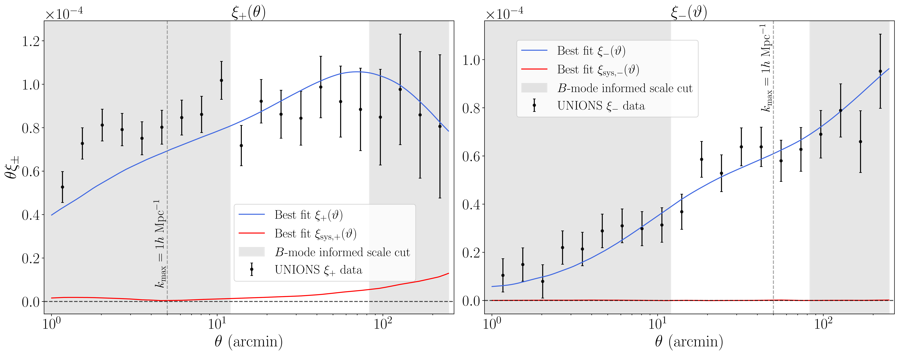
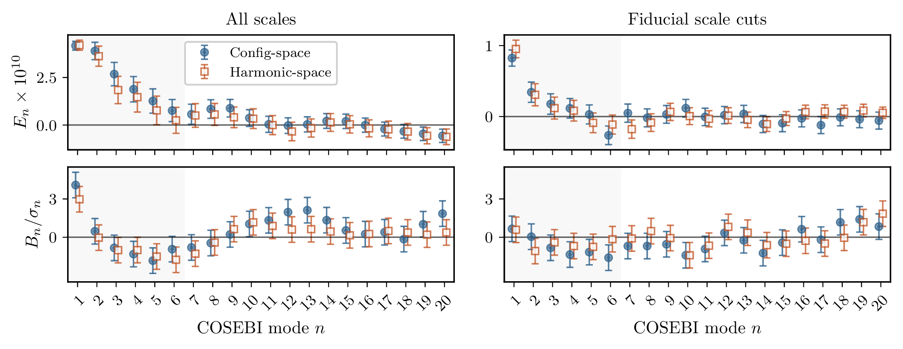
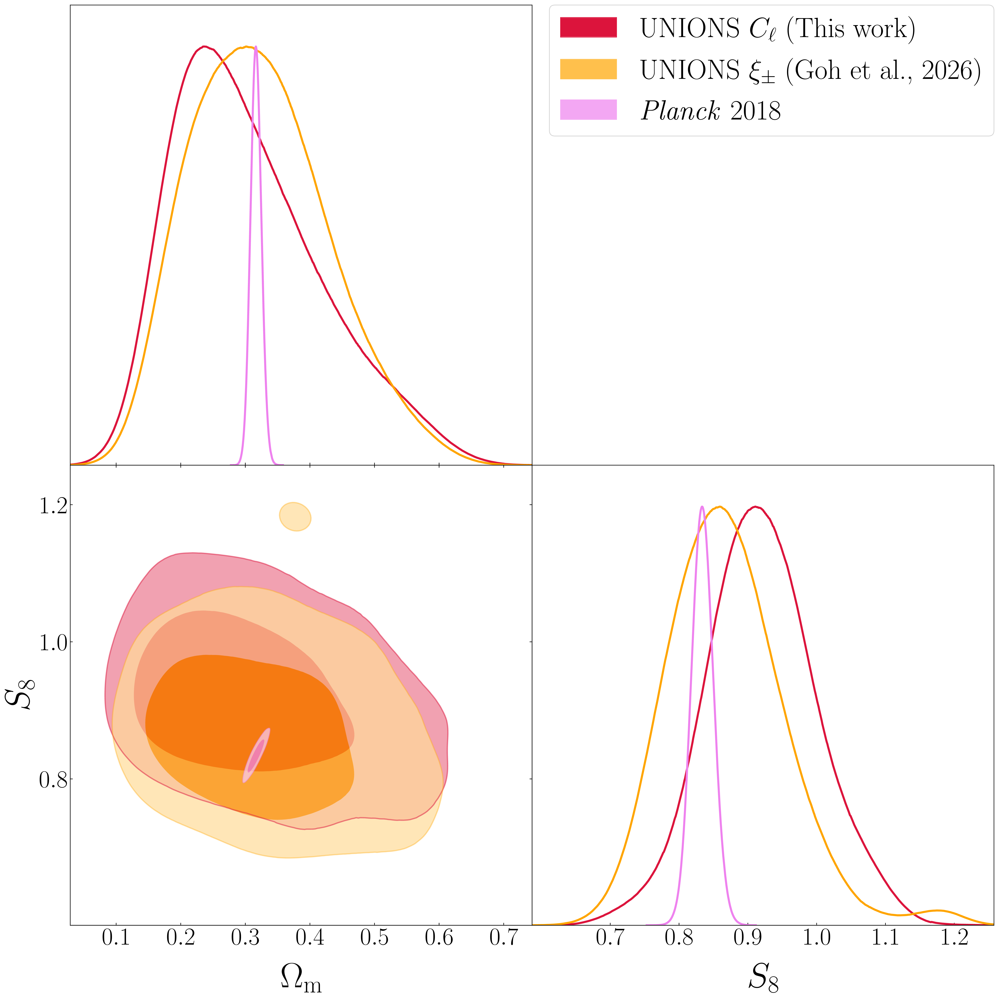
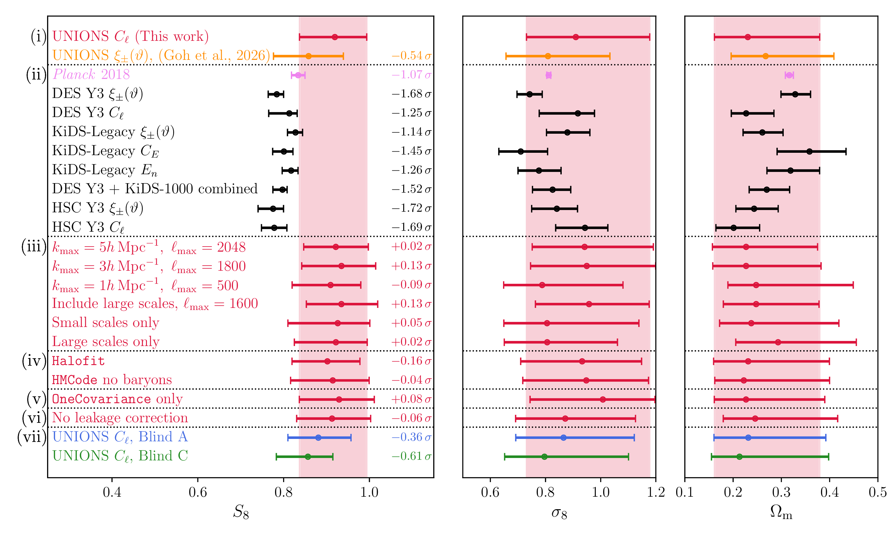

## Why cosmic shear?

::: {style="line-height:1.8em;margin-top:30px"}

- Correlating galaxy shapes measures **structure growth** — dark matter and dark energy
- The field needs **independent datasets** from different instruments and hemispheres
- Careful systematic validation prepares the ground for Stage IV

:::

::: {style="margin-top:40px"}
This talk: the first UNIONS 2D cosmic shear release

- **Paper III** — B-mode validation (Daley et al.)
- **Paper IV** — Configuration-space constraints (Goh et al.)
- **Paper V** — Harmonic-space constraints (Guerrini et al.)
:::

::: notes
Cosmic shear is one of the cleanest probes of the matter distribution we have — you're measuring the distortion of galaxy shapes by all the intervening mass along the line of sight.
As the field matures — DES Y6, KiDS-Legacy, HSC — we're reaching the point where systematic validation matters as much as constraining power. A new survey in a different hemisphere with different instruments is exactly the kind of independent cross-check we need, and a proving ground for the techniques that Stage IV will require.
This release is three companion papers from a single blinded catalogue, built by a team of fewer than ten people.
:::

## Northern-sky cosmic shear

::: {style="margin-top:40px;line-height:1.6em"}

- Only deep wide-field lensing survey in the northern sky — cross-correlations with DESI, Euclid, and CMB lensing

- Non-tomographic: get the systematics right first, then add redshift bins

- Two independent data vectors: $\xi_\pm(\theta)$ and pseudo-$C_\ell$ — same catalog, different bases

- A small team ($< 10$ people) building the infrastructure for future constraints

:::

::: notes
Sacha has just walked you through the catalogue — the survey properties, the PSF model, the systematics tests.
Now I'll take that catalogue and show you what the shear field tells us about cosmology.
UNIONS is the only deep wide-field lensing survey in the north, which opens up cross-correlations that the southern surveys can't do — spectroscopic overlap with DESI, photometric overlap with Euclid, and CMB lensing from ACT and Planck at high northern declination.
:::

## The 2D cosmic shear team

::: {style="text-align:center"}
Core members in alphabetical order (many others have contributed as well):
:::

:::::::::::::: {.columns style="text-align:center"}
::: {.column style="width:25%"}
{width=195px}
:::
::: {.column style="width:25%"}
{width=195px}
:::
::: {.column style="width:25%"}
{width=195px}
:::
::: {.column style="width:25%"}
{height=195px}
:::
::::::::::::::

:::::::::::::: {.columns style="text-align:center"}
::: {.column style="width:33%"}
{width=220px}
:::
::: {.column style="width:33%"}
{width=220px}
:::
::: {.column style="width:33%"}
{width=220px}
:::
::::::::::::::

## Overall analysis — Paper III {.smaller}

::: {style="margin-top:16px;font-size:0.92em"}
Before cosmology, we need clean scales and a validated catalogue version.
:::

::: {style="font-size:0.92em;line-height:1.5em;margin-top:16px;margin-bottom:10px"}
- Four catalogue versions tested across fiducial and full-range cuts
- Only the fiducial size-cuts catalogue passes all three B-mode statistics
:::

{width=1700px fig-align="center"}

::: notes
Sacha has just covered the catalogue and image-simulation papers, so I pick up at the analysis level.
Paper III is the gatekeeper: it decides which catalogue version and which scales are clean enough for cosmology. The punchline is that only one version passes all three B-mode tests.
:::

## Overall analysis — Paper IV {.smaller}

::: {style="margin-top:16px;font-size:0.9em"}
With clean scales in hand, Paper IV fits cosmology to $\xi_\pm(\theta)$.
:::

::: {style="font-size:0.88em;line-height:1.5em;margin-top:20px;margin-bottom:10px"}
- Jointly fits cosmology, intrinsic alignments, and PSF leakage
- PSF leakage ($\alpha$, $\beta$) inferred from diagnostic statistics and marginalized in the cosmological likelihood   — uncertainty in the PSF model propagates into the error budget
:::

{width=90% fig-align="center"}

::: notes
Paper IV takes the validated catalogue and scale cuts from Paper III and fits a cosmological model to the shear correlation functions.
What's distinctive here: rather than just correcting for PSF leakage at the catalog level, the leakage parameters are inferred from rho and tau statistics and carried into the cosmological likelihood as Gaussian priors. The PSF uncertainty propagates into the cosmological error budget. This is not standard practice.
:::

## Overall analysis — Paper V {.smaller}

::: {style="margin-top:16px;font-size:0.9em"}
Paper V provides an independent constraint in harmonic space — same data, different statistical basis.
:::

::: {style="font-size:0.88em;line-height:1.5em;margin-top:20px;margin-bottom:10px"}
- 2D cosmic-shear constraint using pseudo-$C_\ell$
- An independent cross-check: same catalog, $n(z)$, blinding; different likelihood machinery
:::

{width=80% fig-align="center"}

::: notes
Paper V is the harmonic-space constraint — same catalogue, same blinding, same scale cuts, but an entirely independent analysis pipeline. Having two pipelines agree is not just a nice-to-have: we used their consistency as a criterion for unblinding.
:::

## Blinding strategy

:::::::::::::: {.columns}
::: {.column style="width:50%"}

{width=88% fig-align="center"}

::: {style="font-size:0.72em;text-align:center;margin-top:-8px;margin-bottom:12px"}
Three blinded $n(z)$ realizations used during analysis.
:::

:::
::: {.column style="width:50%;font-size:0.86em"}

- Blind the mean of the source $n(z)$: three realizations A/B/C
- Fix all analysis choices before unblinding: catalogue version, scale cuts, robustness criteria
- Both pipelines run on all three blinds

::: {style="font-size:0.78em;margin-top:24px"}
The blinding lives in $n(z)$, not in post-processing. The cosmology-paper authors were inadvertently partially unblinded during final validation checks — this is discussed openly in the papers, and we believe it did not affect the analysis choices.
:::

:::
::::::::::::::

::: notes
We blind by shifting the source redshift distribution, not by hiding the final number after the fact. That means the full machinery is exercised on each blind. The B-mode cuts are fixed before unblinding, so the cosmology is not tuned to the answer.
I should be transparent: the authors of Papers IV and V were inadvertently partially unblinded a couple of weeks before the official ceremony. What happened is that the maximum likelihood estimate — which isn't penalized by priors — peaked at the same S8 for all three blinds, because the n(z) shift maps onto S8 the same way intrinsic alignment does, and the ML was free to compensate with extreme A_IA values that the MAP would have rejected. So they could infer which blind was physical. We believe this didn't affect analysis choices since those were already frozen, but we want to be honest about it.
:::

## B-mode statistics: Pure E/B

::: {style="font-size:0.88em;line-height:1.5em;margin-top:16px"}
**E-modes** = lensing signal. **B-modes** = residual systematics. We use three statistics to separate them.
:::

::: {style="font-size:0.88em;font-weight:700;margin-top:16px;margin-bottom:6px"}
Configuration space: $\xi_\pm^{E/B}(\theta)$
:::

::: {style="font-size:0.84em"}
Isolates ambiguous-mode-free E and B in angle. Gray shading marks the adopted scale cuts.
:::

{width=82% fig-align="center"}

::: notes
The shear field is spin-2 — like CMB polarization, it splits into E-modes and B-modes. Lensing produces only E-modes, so B-modes diagnose residual systematics. The complication is ambiguous modes from masking — you need statistics designed to handle this. We use three.
Pure E/B is the most direct angular-space decomposition. The gray bands mark the configuration-space scale cuts: 12 to 83 arcmin.
:::

## B-mode statistics: Pseudo-$C_\ell$

:::::::::::::: {.columns}
::: {.column style="width:36%"}

::: {style="font-size:0.88em;font-weight:700;margin-top:32px;margin-bottom:6px"}
Harmonic space: $C_\ell^{BB}$, $C_\ell^{EB}$
:::

::: {style="font-size:0.84em;line-height:1.5em"}
NaMaster band-power estimation with mode-coupling correction.

Gray shading marks the harmonic-space scale cuts: $\ell = 300$--$1600$.
:::

:::
::: {.column style="width:64%"}

{width=98% fig-align="center"}

:::
::::::::::::::

::: notes
The pseudo-Cl estimator gives the harmonic-space view. The gray bands mark the harmonic-space cuts at ell 300 to 1600. Both BB and EB are consistent with zero at these scales.
:::

## B-mode statistics: COSEBIs

::: {style="font-size:0.88em;line-height:1.5em;margin-top:16px"}
COSEBIs computed from both configuration-space $\xi_\pm$ and harmonic-space band powers — the two paths agree.
:::

{width=90% fig-align="center"}

::: {style="font-size:0.78em;text-align:center;margin-top:-4px"}
$E_n$ (top) and $B_n/\sigma_n$ (bottom) at fiducial scale cuts. Filled: config-space. Open: harmonic-space.
:::

::: notes
This is the consistency test from the paper discussion. We compute COSEBIs from both the configuration-space correlation functions and the harmonic-space band powers. They agree — the filled circles are config-space, open squares are harmonic-space.
The key insight is that the sensitivity to systematic contamination is set by the filter functions, not the basis in which the two-point function is measured. At fiducial cuts, B-modes are consistent with zero from both paths.
:::

## From B-modes to scale cuts

:::::::::::::: {.columns}
::: {.column style="width:64%"}

{width=98% fig-align="center"}

::: {style="font-size:0.72em;text-align:center;margin-top:-6px"}
2D $p$-value (PTE) scan across angular cuts.
:::

::: {style="font-size:0.79em;line-height:1.4em;margin-top:12px"}
Three statistics converge on the same clean region. Only v1.4.6.3 passes all of them.

Adopted cuts: $[12, 83]$ arcmin and $\ell = 300$--$1600$.
:::

:::
::: {.column style="width:36%;font-size:0.84em"}

 

- Three estimators, different bases, same conclusion
- We look for broad, consistent passage — not any single plot
- Small-scale failures at the MegaCam CCD scale (${\sim}9.4$ arcmin)

::: {style="font-size:0.75em;margin-top:20px"}
The cosmology papers inherit these cuts — they don't choose their own.
:::

:::
::::::::::::::

::: notes
This is the compressed B-mode story.
The colour map is a p-value — computed for every combination of minimum and maximum angular scale. Green means B-modes consistent with zero; red means they're not.
The residual problem sits at the MegaCam CCD scale, around 9 arcminutes. Above that, the field is clean.
The cosmology papers inherit these cuts rather than tuning them themselves.
:::

## Inference ingredients

::: {style="font-size:0.82em;margin-top:10px;margin-bottom:8px;color:#555"}
What connects the validated shear catalogue to cosmological contours.
:::

::: {style="line-height:1.55em;font-size:0.88em"}

**Redshift distribution** — a single 2D source $n(z)$ from SOM-based colour–redshift calibration. Both analyses marginalize over a mean shift $\Delta z$.

**Covariance** — analytical in both spaces (CosmoCov for $\xi_\pm$, iNKA for $C_\ell$), cross-checked with jackknife and GLASS mocks.

**Intrinsic alignments** — with a single redshift bin, $A_\mathrm{IA}$ is degenerate with $S_8$: the data cannot separate them. We construct a Gaussian prior from red/blue galaxy fractions in overlapping spectroscopic data ($A_\mathrm{IA} = 0.83 \pm 0.7$). If this prior is wrong, $S_8$ shifts accordingly — tomography will break the degeneracy.

**Likelihoods** — common model, common $n(z)$, common scale cuts, but separate codes. Both pipelines also marginalize over baryonic feedback and $\Delta z$.

:::

::: notes
I want to be honest about the intrinsic alignment situation. With one redshift bin, the IA amplitude and S8 are almost perfectly degenerate. We can't fit A_IA from the data — so we build a prior from external measurements: splitting galaxies into red and blue populations using spectroscopic overlap, measuring the IA amplitude for each, and combining weighted by the UNIONS colour fractions. The prior is conservatively widened. But this is the main caveat of the non-tomographic analysis: if the prior is wrong, S8 moves. Tomography breaks this because different redshift bins see different ratios of lensing to intrinsic alignment.
The two pipelines share everything except the statistical basis and the likelihood code.
:::

## Cosmological contours

:::::::::::::: {.columns}
::: {.column style="width:60%"}

{width=84% fig-align="center"}

:::
::: {.column style="width:40%"}

 

- First UNIONS 2D cosmic-shear constraints on $\Omega_m$ and $S_8$
- Two independent pipelines land in the same place — and both are consistent with *Planck*
- Broad contours by design: a single redshift bin. Tomography will tighten these substantially

:::
::::::::::::::

::: notes
Here are the unblinded UNIONS contours — configuration space in orange, harmonic space in red, and Planck in pink. Blind B turned out to be the physical n(z).
The contours are wide — that's the reality of a single redshift bin. We're consistent with Planck at about 1 sigma, but honestly our error bars are broad enough that we're consistent with most cosmic shear surveys. The point of this slide isn't the width of the contours — it's that two fully independent pipelines, sharing only the blinded inputs and scale cuts, land in the same place.
:::

## $S_8$ comparison

{width=95% fig-align="center"}

::: notes
This is the summary figure. At the top: our three blinds plus the configuration-space result, showing that both pipelines agree to within half a sigma. Below: UNIONS compared to Planck, DES, KiDS, HSC — we sit comfortably within the lensing family, about 1 sigma from Planck.
The lower sections are robustness: scale cuts, non-linear model, covariance, and leakage correction. Every shift is under 0.2 sigma. The result is stable.
:::

## Configuration vs harmonic space

:::::::::::::: {.columns}
::: {.column style="width:55%"}

{width=80% fig-align="center"}

::: {style="font-size:0.75em;text-align:center;margin-bottom:10px"}
$S_8$ from config vs harmonic space on 350 GLASS mocks.
:::

:::
::: {.column style="width:45%"}

 

- Same catalog, $n(z)$, and blinding
- Independent pipelines: $\xi_\pm$ vs pseudo-$C_\ell$
- Consistency ${\sim}0.4\sigma$ across 350 GLASS mocks
- Validates that both analyses measure the same cosmology

::: {style="font-size:0.8em;margin-top:30px"}
This consistency test was an unblinding criterion.
:::

:::
::::::::::::::

::: notes
A crucial robustness question: do configuration-space and harmonic-space analyses agree?
We test this on 350 GLASS mock catalogs — same catalog run through both pipelines.
The scatter plot shows the S₈ estimates from both spaces are tightly correlated, with consistency at the 0.4 sigma level.
This validates that the two analyses are measuring the same underlying cosmology.
:::

## Summary & outlook

- **UNIONS**: first deep wide-field lensing survey of the northern sky — unique cross-correlation potential with DESI, Euclid, and CMB lensing

- **Systematic rigor**: three B-mode statistics converge on clean scales; PSF leakage marginalized in inference; intrinsic alignment prior constructed from external data, honestly acknowledging the single-bin degeneracy

- **Two pipelines agree**: configuration-space and harmonic-space constraints are consistent (${\sim}0.5\sigma$), validated on 350 GLASS mocks

- **Next:** tomography and $3{\times}2$pt will sharpen these constraints substantially — the infrastructure we're building transfers directly to Stage IV

::: notes
To summarize: UNIONS provides the first northern-sky cosmic shear constraints from a small, focused team.
The constraints are broad — this is a non-tomographic release. What we're showing is that the systematic validation is thorough: three B-mode statistics, PSF leakage propagated into the error budget, and two independent pipelines landing in the same place.
The real deliverable isn't one S8 number — it's the infrastructure and lessons for the Stage IV era. Tomographic analysis, 3x2pt with DESI, and CMB lensing cross-correlations will turn this into a competitive cosmology dataset.
:::

## Thank you! {.team-photo-slide background-image="images_local/unions_team.jpg" background-size="cover" background-position="center"}

::: {style="margin-top:150px;text-align:center"}

::: {style="display:inline-block;padding:22px 36px;background:rgba(255,255,255,0.8);border-radius:18px"}
### Thank you

::: {style="font-size:0.9em;margin-top:12px"}
**cail.daley@cea.fr**
:::
:::

:::

::: notes
Thank you! Happy to take questions.
The five companion papers will be on arXiv in April. Please reach out if you're interested in the catalog or in cross-correlation opportunities.
These slides were made with Claude — I did the thinking, Claude did the typing.
:::

## Backup {background-color="black" style="color:white"}

## E-modes and B-modes {.smaller}

:::::::::::::: {.columns}
::: {.column style="width:50%"}

Spin-2 shear fields can be decomposed into **E-modes** containing the vast majority of lensing information and **B-modes**, which are a probe of systematics at UNIONS noise levels.

 

In the presence of masking, some **ambiguous** modes cannot be cleanly attributed to E or B.

$\implies$ need **E/B-separable** statistics

:::
::: {.column style="width:50%"}
{width=80%}
{width=80%}
:::
::::::::::::::

## Config–harmonic $\Delta S_8$ distribution {.smaller}

{width=55% fig-align="center"}

::: {style="font-size:0.8em;text-align:center"}
$\Delta \langle S_8 \rangle$ between configuration and harmonic space across 350 GLASS mocks. Centered on zero — no systematic bias.
:::

## Pipeline validation on GLASS mocks {.smaller}

:::::::::::::: {.columns}
::: {.column style="width:50%"}

{width=90% fig-align="center"}

::: {style="font-size:0.8em;text-align:center"}
$\Omega_m$–$\sigma_8$ from 350 GLASS mocks (configuration space). Dashed: input cosmology.
:::

:::
::: {.column style="width:50%"}

 
 

- 350 GLASS mock catalogs with realistic UNIONS geometry
- Full inference pipeline run on each mock
- Input cosmology recovered without bias
- Validates covariance, likelihood, and sampling

:::
::::::::::::::

## UNIONS vs Stage III surveys {.smaller}

{width=55% fig-align="center"}

::: {style="font-size:0.8em;text-align:center"}
$\Omega_m$–$S_8$ contours: UNIONS (harmonic + config-space) compared to DES Y3, KiDS-1000, HSC Y3, DES+KiDS combined.
:::
