## Cosmic shear benefits from independent measurements

:::::::::::::: {.columns}
::: {.column style="width:25%"}

::: {style="margin-top:110px;margin-left:45px;margin-right:-15px"}
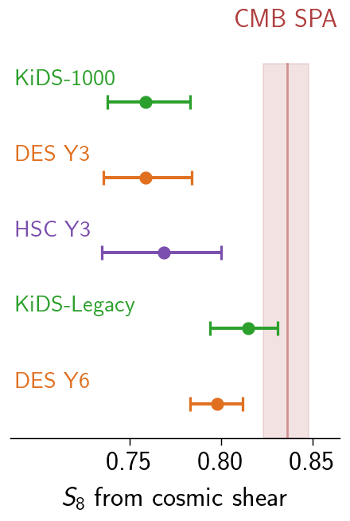{width=115% fig-align="center"}
:::

:::
::: {.column style="width:75%;overflow:hidden"}

::: {.fragment fragment-index=0 style="position:relative;margin-left:-3%;margin-right:-6%"}
{width=130% fig-align="center"}

::: {style="position:absolute;bottom:12px;right:8%;font-size:0.6em;opacity:0.8"}
Credit: DES Collaboration
:::
:::

:::
::::::::::::::

:::: {.r-stack}
::: {.fragment .fade-out fragment-index=0 style="margin:0;width:100%"}
- $S_8$ seems to be converging as systematics improve; consensus is important!
:::
::: {.fragment fragment-index=0 style="margin:0;width:100%"}
- $S_8$ seems to be converging as systematics improve; consensus is important!
- But the northern sky has no wide-field lensing surveys
:::
::::

::: notes
Cosmic shear surveys are now mature enough to produce percent-level constraints. DES Y6 is consistent with Planck at 1.1 sigma in the full parameter space. KiDS-Legacy is converging. The S8 tension appears to be resolving — and it's resolving because systematics are getting better controlled: redshift calibration accounts for two-thirds of the KiDS shift, updated nonlinear modeling for DES.
But consensus requires genuinely independent measurements — not just more data from overlapping footprints. This map shows the current landscape: DES, KiDS, and HSC all overlap each other on the sky. Jefferson et al. 2025 explicitly states "overlaps between all pairs." But look at the north — there's nothing there.
:::

## UNIONS adds deep wide-field lensing constraints in the North

:::::::::::::: {.columns}
::: {.column style="width:25%"}

::: {style="margin-top:110px;margin-left:45px;margin-right:-15px"}
{width=115% fig-align="center"}
:::

:::
::: {.column style="width:75%;overflow:hidden"}

::: {style="position:relative;margin-left:-3%;margin-right:-6%"}
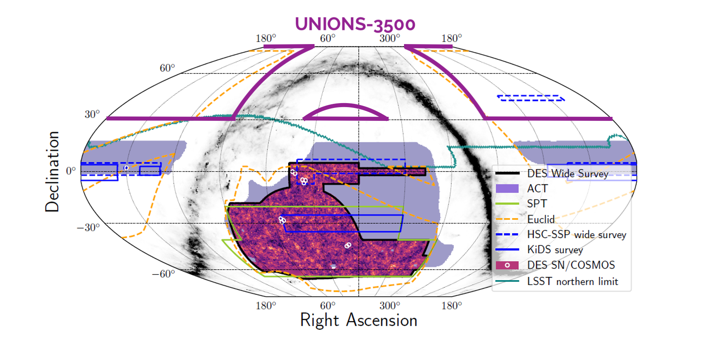{width=130% fig-align="center"}

::: {style="position:absolute;bottom:12px;right:8%;font-size:0.6em;opacity:0.8"}
Credit: DES Collaboration
:::
:::

:::
::::::::::::::

- Different instrument, on-sky systematics, sample variance
- New cross-correlation opportunities (DESI, Planck, BOSS)

::: notes
UNIONS covers the northern sky at declination above 30 degrees, extending to 15. Zero overlap with DES, KiDS, or HSC. That means independent large-scale structure, independent sample variance, different Galactic foreground, different atmospheric conditions, and a completely different instrument — CFHT MegaCam versus DECam, OmegaCAM, and Hyper Suprime-Cam.
This is the only Stage III cosmic shear survey that doesn't share sky with any of the others. And that northern footprint is what makes it uniquely valuable for cross-correlations — DESI spectroscopy and Planck CMB lensing at high declination are all in the north.
:::

## UNIONS-3500 constraints are the culmination of ~10 years of work

::: {style="margin-top:60px"}
- A small team of ~10 people
- Non-tomographic; multi-bin redshift calibration in preparation
- Inference with correlation functions $\xi_\pm(\theta)$ and band powers $C_\ell$
:::

::: {style="margin-top:80px"}
Building on the catalog described in Sacha's talk:

- **Paper III**: B-mode validation (Daley et al.)
- **Paper IV**: configuration-space constraints (Goh et al.)
- **Paper V**: harmonic-space constraints (Guerrini et al.)
:::

::: notes
Sacha has just walked you through the catalog — the survey properties, the PSF model, the systematics tests. Now I'll take that catalog and show you what the shear field tells us about cosmology.
This release is three companion papers from a single blinded catalog, built by about ten people over roughly a decade of survey development.
:::

## The 2D cosmic shear team

::: {style="text-align:center;font-size:1.1em"}
Core members in alphabetical order (many others have contributed over the years):
:::

:::::::::::::: {.columns style="text-align:center"}
::: {.column style="width:25%"}
{width=260px}
:::
::: {.column style="width:25%"}
{width=260px}
:::
::: {.column style="width:25%"}
{width=260px}
:::
::: {.column style="width:25%"}
{width=260px}
:::
::::::::::::::

::: {style="margin-top:50px"}
:::

:::::::::::::: {.columns style="text-align:center"}
::: {.column style="width:33%"}
{width=280px}
:::
::: {.column style="width:33%"}
{width=280px}
:::
::: {.column style="width:33%"}
{width=280px}
:::
::::::::::::::

## Paper III uses B-modes to select the catalog and set scale cuts

- To leading order, B-modes serve as a systematics null test
- Synthesize $\xi_\pm^B$, COSEBIs, and $C_\ell$ statistics to inform scale cuts and sample selection

{width=85% fig-align="center"}

::: notes
Paper III is the gatekeeper: it decides which catalog version and which scales are clean enough for cosmology.
This is the pure E/B decomposition — the total shear correlation function split into its E-mode, B-mode, and ambiguous components. E-modes carry the lensing signal, B-modes diagnose residual systematics, and ambiguous modes arise from masking. The gray bands mark where we cut — scales where B-modes are too large.
We use three statistics in different bases — pure E/B in angular space, COSEBIs as discrete modes, and Cl in harmonic space — and look for convergence across all three.
:::

## Paper IV jointly fits cosmology and PSF leakage in real space

{width=90% fig-align="center"}

::: {style="text-align:center;font-size:0.9em"}
$\xi_\pm(\theta)$ with best-fit model and leakage systematics
:::

::: notes
Paper IV takes the validated catalog and scale cuts from Paper III and fits a cosmological model to the shear correlation functions.
What's distinctive here: rather than just correcting for PSF leakage at the catalog level, the leakage parameters are inferred from rho and tau statistics and carried into the cosmological likelihood as Gaussian priors. The PSF uncertainty propagates into the cosmological error budget. This is not standard practice.
:::

## Paper V provides harmonic-space constraints from the same data

- Same catalog, $n(z)$, and blinding, but different basis and weighting of scales

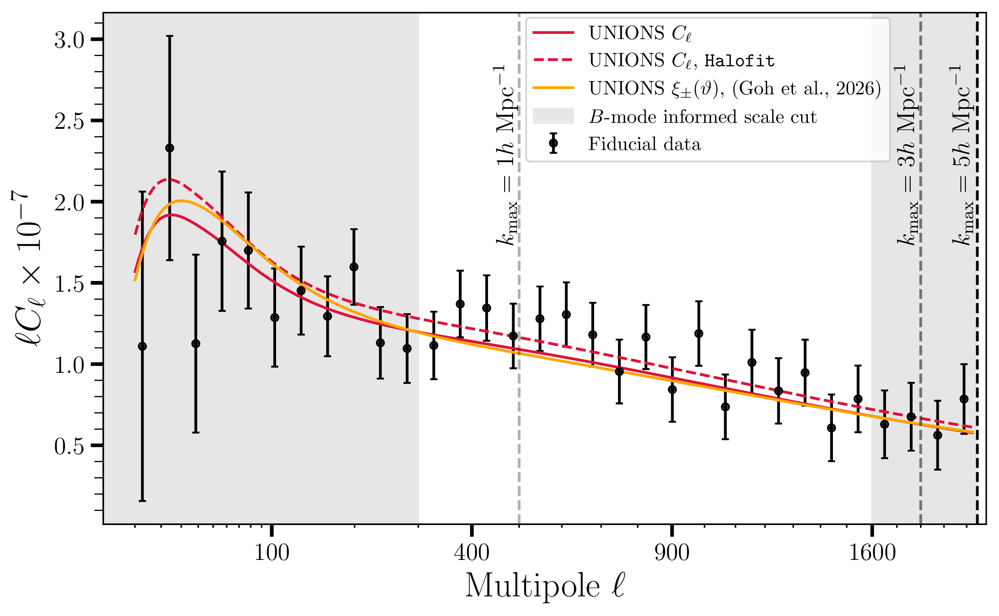{width=80% fig-align="center"}

::: notes
Paper V analyzes the same catalog in harmonic space — same blinding, same scale cuts, but a different basis and likelihood code. Having the two analyses agree is not just a nice-to-have: we used their consistency as a criterion for unblinding.
:::

## All analysis choices fixed before unblinding

:::::::::::::: {.columns}
::: {.column style="width:45%"}

::: {style="margin-top:80px"}
- Blind by modifying $n(z)$: three realizations A/B/C, one unshifted

- Catalog version, scale cuts, and robustness criteria frozen before collaboration-wide unblinding

- Caveat: cosmology-paper authors were inadvertently unblinded ~2 weeks before. No analysis choices changed after this point
:::

:::
::: {.column style="width:55%"}

::: {style="margin-top:40px"}
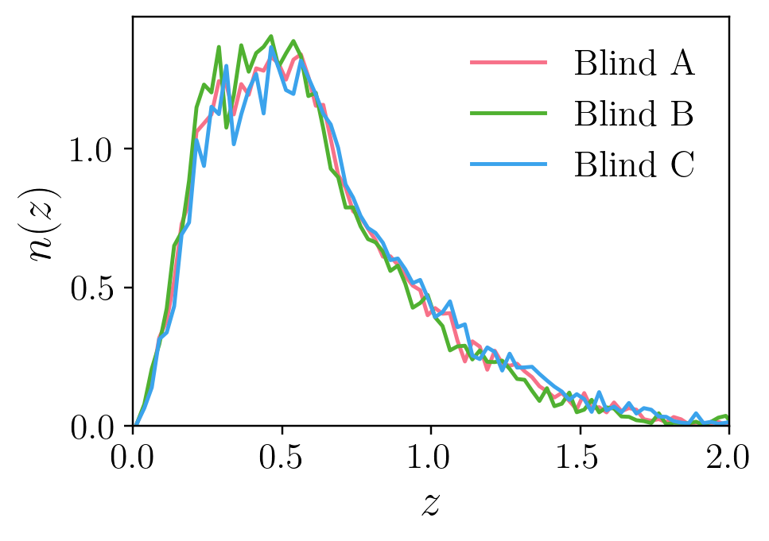{width=95% fig-align="center"}

::: {style="font-size:0.75em;text-align:center;margin-top:-8px"}
Three redshift blinds used in this analysis. B turned out to be real.
:::
:::

:::
::::::::::::::

::: notes
We blind by modifying the source redshift distribution, not by hiding the final number after the fact. That means the full machinery is exercised on each blind. The B-mode cuts are fixed before unblinding, so the cosmology is not tuned to the answer.
I should be transparent: the authors of Papers IV and V were inadvertently unblinded about two weeks before the collaboration-wide unblinding. The maximum likelihood estimate — which isn't penalized by priors — peaked at the same S8 for all three blinds, because the S8–A_IA degeneracy allowed A_IA to compensate the n(z) modification. So they could infer which blind was physical. No significant analysis choices were changed after this point — catalog version, scale cuts, and robustness criteria were already frozen.
:::

## Different B-mode statistics do not always agree

- Over the full range ($1$–$250'$, $\ell \lesssim 2000$): $\xi_\pm^B$ and $C_\ell^{BB}$ pass, but COSEBIs fail

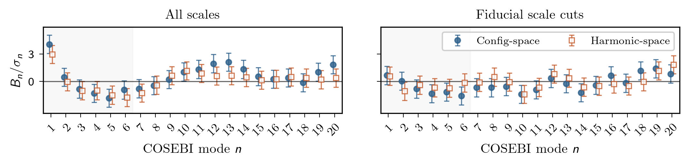{width=85% fig-align="center"}

- Each statistic weights scales differently; we require all three to pass
- Not able to decisively identify the origin of these B-modes

::: notes
This is the main finding of Paper III. Pure E/B and Cl pass the null test on the full angular range — but COSEBIs fail. The B-modes show an oscillating structure that Asgari et al. 2019 associated with repeating additive shear bias at the CCD scale.
The key insight: this is not a matter of configuration versus harmonic space. We compute COSEBIs from both xi_pm and from the Cl bandpowers — they agree with each other, and they both fail. Yet the Cls themselves pass. The sensitivity to contamination is set by the filter functions, not the basis. COSEBIs concentrate sensitivity on the contaminated scales through their filter functions W_n.
This matters because COSEBIs are designed to compress cosmological information — they're arguably the most informative B-mode diagnostic. The synthesis of multiple statistics is how you understand the systematics in the data.
:::

## Sample selection and scale cuts informed by B-mode tests

:::::::::::::: {.columns}
::: {.column style="width:55%"}

::: {style="margin-top:60px"}
- Scale cuts informed by B-mode PTEs, PSF leakage, and blinded $S_8$ dependence (Papers IV/V)

- Adopted cuts: $[12, 83]'$, $\ell = 300$–$1600$ ($k_\mathrm{max} \approx 2.6\;h\,\mathrm{Mpc}^{-1}$); all PTEs $> 0.18$
:::

:::
::: {.column style="width:45%"}

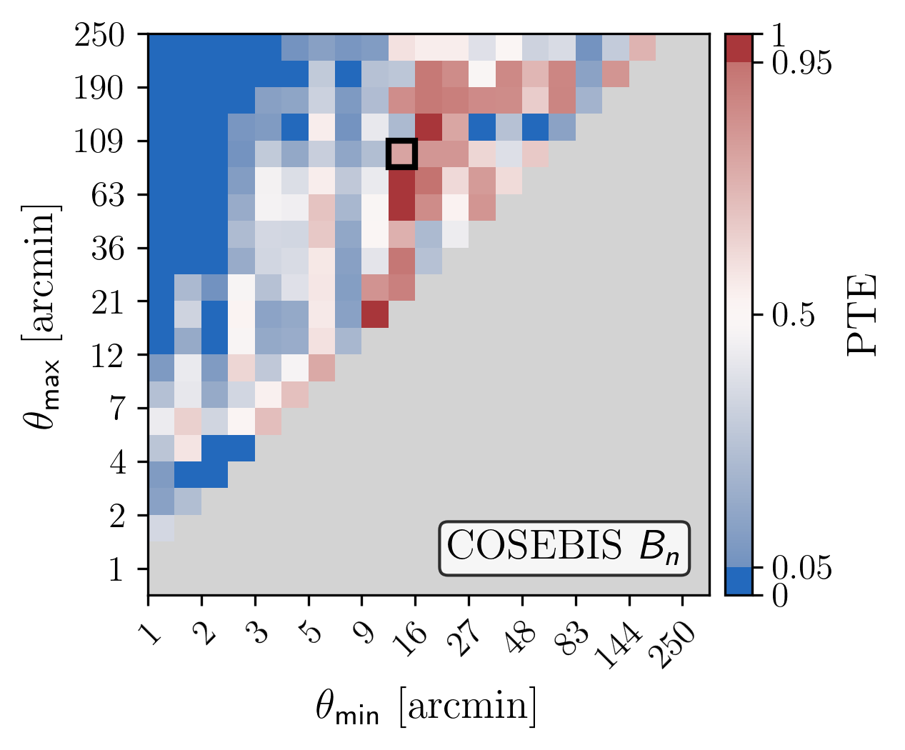{width=98% fig-align="center"}

::: {style="font-size:0.75em;text-align:center;margin-top:-6px"}
COSEBIS PTEs as a function of lower and upper scale cut. Square: adopted cuts.
:::

:::
::::::::::::::

::: notes
This is the compressed B-mode story. The colour map is a p-value — computed for every combination of minimum and maximum angular scale. Red means B-modes consistent with zero; blue means they're not.
The three statistics weight scales differently: a feature narrow in angle maps onto a broad range in ell, so harmonic cuts can't isolate it. COSEBIs concentrate sensitivity at the contaminated scales through their filter functions.
The adopted scale cuts weren't chosen from B-mode PTEs alone — they also incorporate inference-stability checks and PSF leakage considerations from Papers IV and V.
:::

## Inference marginalizes over nuisance parameters with conservative priors

::: {style="line-height:2.4em;margin-top:50px"}

- **Covariance** — CosmoCov for $\xi_\pm$, iNKA for $C_\ell$; validated with jackknife and 350 GLASS mocks
- **Redshifts** — $r$-band only; $n(z)$ from CFHTLenS cross-match + SOM. Marginalize over $\Delta z$
- **Intrinsic alignments** — NLA model; $A_\mathrm{IA}$ degenerate with $S_8$ especially with one bin; Gaussian prior from red/blue split ($0.83 \pm 0.7$)

:::

::: notes
Let me walk through the main ingredients going into the inference.

First, redshifts. We only use the r-band for shape measurement, so we don't have colors for the full sample. We get the redshift distribution by cross-matching with CFHTLenS in a 44 square degree overlap and training a self-organizing map on ~65,000 spectroscopic galaxies from DEEP2, VVDS, and VIPERS. The calibration bias is delta-z = 0.033, which we marginalize over. The key limitation: we're relying on 44 square degrees to represent 3500. Full-footprint multi-band photometry is in preparation.

Second, PSF leakage. Paper IV goes beyond catalog-level correction: the leakage parameters are inferred from rho and tau statistics and carried into the cosmological likelihood as Gaussian priors, so the PSF model uncertainty propagates into the error budget.

Third, intrinsic alignments. With one redshift bin, A_IA and S8 are almost perfectly degenerate. We can't fit A_IA from the data — so we build a prior from external measurements. This is the main caveat of the non-tomographic analysis: if the prior is wrong, S8 moves. Tomography breaks this.

We also inflate the priors on delta-z, A_IA, and m-bias by factors of 1.4, 2, and 3 from the measured values — that's why the contours on the next slide are so wide. These will all tighten with future work.
:::

## UNIONS constraints agree with Planck and Stage III at ~1σ

:::::::::::::: {.columns}
::: {.column style="width:50%"}

::: {style="text-align:center;margin-top:200px"}
| | $S_8$ | $\Omega_m$ |
|---|---|---|
| $\xi_\pm$ | $0.858^{+0.082}_{-0.081}$ | $0.267^{+0.141}_{-0.072}$ |
| $C_\ell$ | $0.917^{+0.077}_{-0.079}$ | $0.221^{+0.175}_{-0.058}$ |
:::

- Priors on $\Delta z$, $A_\mathrm{IA}$, $m$-bias inflated by ${\times}1.4$/${\times}2$/${\times}3$ to be conservative

:::
::: {.column style="width:50%"}

:::: {.r-stack}
::: {.fragment .fade-out fragment-index=0 style="margin-right:-8%"}
{width=115% fig-align="right"}
:::
::: {.fragment fragment-index=0 style="margin-right:-8%"}
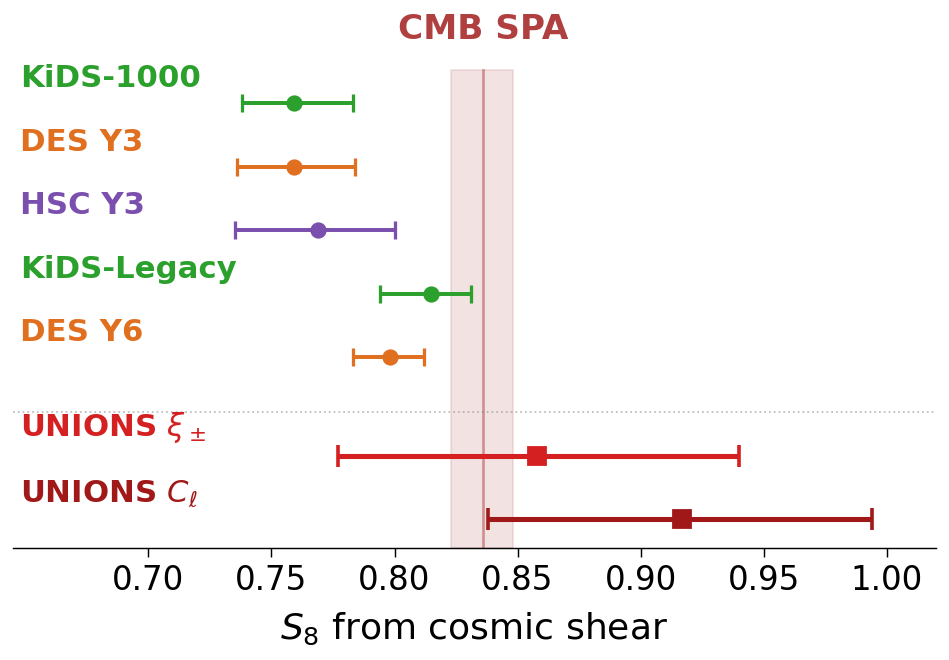{width=115% fig-align="right"}
:::
::::

:::
::::::::::::::

::: notes
Here are the UNIONS contours in context. Configuration space in orange, harmonic space in red — you can see KiDS-Legacy, HSC-Y3, and Planck for comparison.
The contours are wide — with a single redshift bin, A_IA and S8 are nearly degenerate. The Gaussian prior we build from external data keeps the constraints finite, but a flat prior would essentially erase them. Multi-bin redshift calibration is in progress and will break this degeneracy.
[CLICK] And here's where UNIONS sits in the S8 landscape — consistent with everyone. The error bars span the entire range. That's the cost of one redshift bin. Tomography will fix it.
:::

## $S_8$ is robust to analysis choices but sensitive to the IA prior

:::::::::::::: {.columns}
::: {.column style="width:40%"}

::: {style="margin-top:220px"}
- Most robustness tests shift $S_8$ by $< 0.4\sigma$

- $A_\mathrm{IA}$ is the dominant nuisance: largely unconstrained, removing it shifts $S_8$ by $0.7\sigma$
:::

:::
::: {.column style="width:60%"}

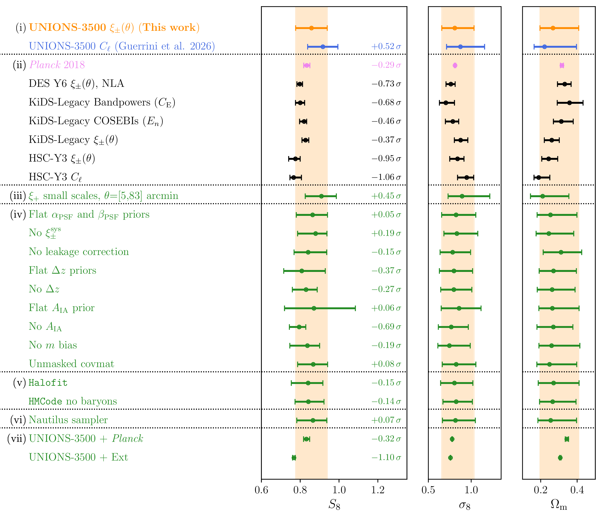{width=105% fig-align="right"}

:::
::::::::::::::

::: notes
This is the robustness summary. The whisker plot shows our result is stable: scale cuts, non-linear model, covariance, and leakage correction all shift S8 by less than 0.2 sigma.
The exception is the intrinsic alignment treatment. A_IA is essentially unconstrained by our single-bin data — the posterior just follows the degeneracy direction. Turning off IA or switching to a flat prior produces the largest shifts. That's the main caveat of this release, and it's what tomography will resolve.
:::

## Two analyses agree to ~2σ, calibrated on 350 GLASS mocks

:::::::::::::: {.columns}
::: {.column style="width:45%"}

::: {style="margin-top:180px"}
- Shared inputs: mocks calibrate the expected scatter between analyses
- 2.6% of mocks show a smaller $\Delta S_8$
- An unblinding criterion, to our knowledge a first for cosmic shear
:::

:::
::: {.column style="width:55%"}

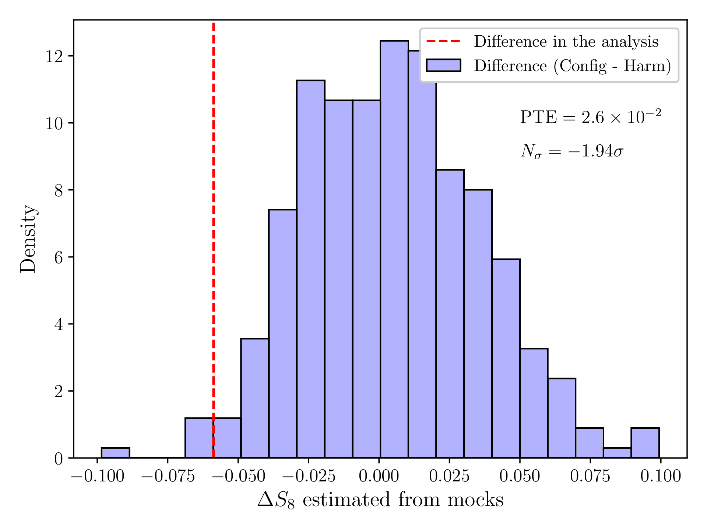{width=90% fig-align="center"}

::: {style="font-size:0.75em;text-align:center;margin-bottom:10px"}
$\Delta S_8$ between config and harmonic space: data vs 350 GLASS mocks.
:::

:::
::::::::::::::

::: notes
The two analyses share nearly everything — same catalog, same n(z), same blinding, overlapping inference code. So you can't just compare their error bars as if they were independent. A half-sigma shift in uncorrelated posteriors means nothing; a half-sigma shift in highly correlated measurements might mean a lot.
We calibrate this by running both pipelines on 350 GLASS mocks. The observed S8 difference is about 2 sigma relative to the mock distribution. Not alarming, but not negligible — and this is something we decided to check before unblinding, not after.
:::

## Thank you! {.team-photo-slide background-image="images/unions_team.jpg" background-size="cover" background-position="center"}

::: {style="margin-top:150px;text-align:center"}

::: {style="display:inline-block;padding:22px 36px;background:rgba(255,255,255,0.8);border-radius:18px"}
[**Thank you!**]{style="font-size:1.5em"}

[cail.daley@cea.fr]{style="font-size:0.9em;margin-top:12px"}
:::

:::

::: notes
Thank you! Happy to take questions.
These slides were made with Claude — I did the thinking, Claude did the typing.
:::

## UNIONS delivers the first northern-sky cosmic shear constraints

::: {style="line-height:2.2em;margin-top:40px"}

- **Key result**: $S_8 = 0.86$ (real space), $0.92$ (harmonic), consistent with Planck at ${\sim}1\sigma$; systematic uncertainties inflated ${\times}1.4$–${\times}3$ to be conservative
- **Systematic validation**: three B-mode statistics converge on clean scales; PSF leakage marginalized in the likelihood
- **Pipeline agreement**: real-space and harmonic-space analyses agree, calibrated on 350 GLASS mocks. An unblinding criterion
- **Next**: tomography will break the $A_\mathrm{IA}$–$S_8$ degeneracy; $3{\times}2$pt with DESI and CMB lensing cross-correlations will sharpen constraints

:::

::: notes
Five companion papers on arXiv in April. Please reach out if you're interested in the catalog or in cross-correlation opportunities.
:::

<!-- Summary stays visible during Q&A -->

## Backup {background-color="black" style="color:white" visibility="uncounted"}

## Masking creates ambiguous modes that require E/B-separable statistics {visibility="uncounted"}

:::::::::::::: {.columns}
::: {.column style="width:50%"}

Spin-2 shear fields can be decomposed into **E-modes** containing the vast majority of lensing information and **B-modes**, which are a probe of systematics at UNIONS noise levels.

 

In the presence of masking, some **ambiguous** modes cannot be cleanly attributed to E or B.

$\implies$ need **E/B-separable** statistics

:::
::: {.column style="width:50%"}
{width=80%}
{width=80%}
:::
::::::::::::::

## Only the PSF size-corrected catalog passes across all statistics and scale cuts {visibility="uncounted"}

{width=1700px fig-align="center"}

::: {style="font-size:0.8em;text-align:center"}
$p$-values for four catalog versions across fiducial and full-range cuts. Only the fiducial (PSF size-corrected) passes all three statistics.
:::

## $C_\ell^{BB}$ and $C_\ell^{EB}$ are consistent with zero within the adopted scale cuts {visibility="uncounted"}

:::::::::::::: {.columns}
::: {.column style="width:36%"}

::: {style="font-size:0.95em;line-height:1.5em;margin-top:32px"}
NaMaster band-power estimation with mode-coupling correction.

Gray shading marks the harmonic-space scale cuts: $\ell = 300$--$1600$.
:::

:::
::: {.column style="width:64%"}

{width=98% fig-align="center"}

:::
::::::::::::::

## The ML peaks at the same $S_8$ for all three blinds {visibility="uncounted"}

:::::::::::::: {.columns}
::: {.column style="width:35%"}

 

- Dashed lines: maximum likelihood (no prior penalty)
- ML free to push $\Delta z$ and $A_\mathrm{IA}$ to extreme values that compensate the $n(z)$ modification
- MAP (contours) rejects these, but ML reveals which blind is physical

:::
::: {.column style="width:65%"}

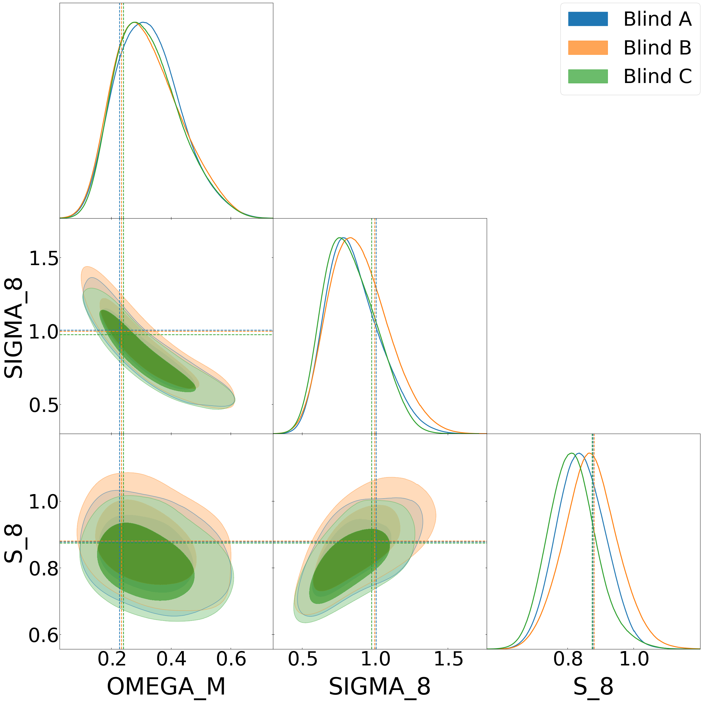{height=920px fig-align="center"}

:::
::::::::::::::

## $A_\mathrm{IA}$ is unconstrained by the data but strongly affects $S_8$ {visibility="uncounted"}

:::::::::::::: {.columns}
::: {.column style="width:35%"}

 

$S_8$–$\Omega_m$–$A_\mathrm{IA}$ from configuration-space inference.

- Gaussian $A_\mathrm{IA}$ prior (orange) vs flat prior (blue) vs no IA (green)
- $A_\mathrm{IA}$ is largely unconstrained by the data but strongly affects $S_8$
- A lower $A_\mathrm{IA}$ gives lower $S_8$

:::
::: {.column style="width:65%"}

::: {style="margin-top:40px"}
{height=880px fig-align="center"}
:::

:::
::::::::::::::

## $S_8$ is robust to $k_\mathrm{max}$: nonlinear scale cuts shift constraints by $< 0.2\sigma$ {visibility="uncounted"}

:::::::::::::: {.columns}
::: {.column style="width:35%"}

 

- Fiducial $\ell_\mathrm{max} = 1600$ ($k_\mathrm{max} \approx 2.6\;h\,\mathrm{Mpc}^{-1}$)
- Tested $k_\mathrm{max} \in [1, 3, 5]\;h\,\mathrm{Mpc}^{-1}$
- All shifts $< 0.2\sigma$ from fiducial

:::
::: {.column style="width:65%"}

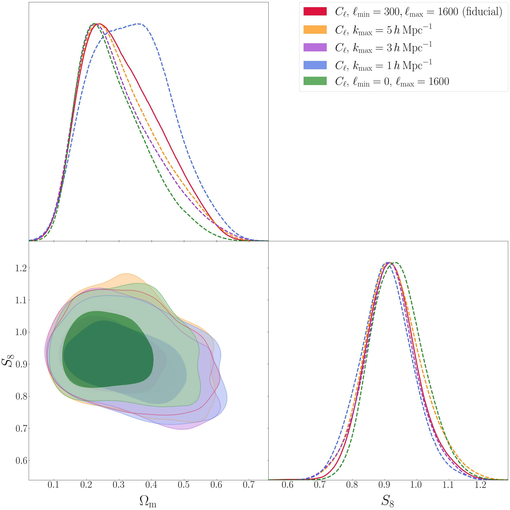{height=920px fig-align="center"}

:::
::::::::::::::

## Angular scale cuts map to different $k_\mathrm{max}$ for $\xi_+$ and $\xi_-$ {visibility="uncounted"}

:::::::::::::: {.columns}
::: {.column style="width:35%"}

 

- Color: fraction of $C_\ell$ signal from $k < k_\mathrm{max}$ at each $\theta$
- Red curve: 90% signal boundary
- $\xi_+$ at $12'$: $k_\mathrm{max} = 0.43\;h\,\mathrm{Mpc}^{-1}$
- $\xi_-$ at $12'$: $k_\mathrm{max} = 2.85\;h\,\mathrm{Mpc}^{-1}$

:::
::: {.column style="width:65%"}

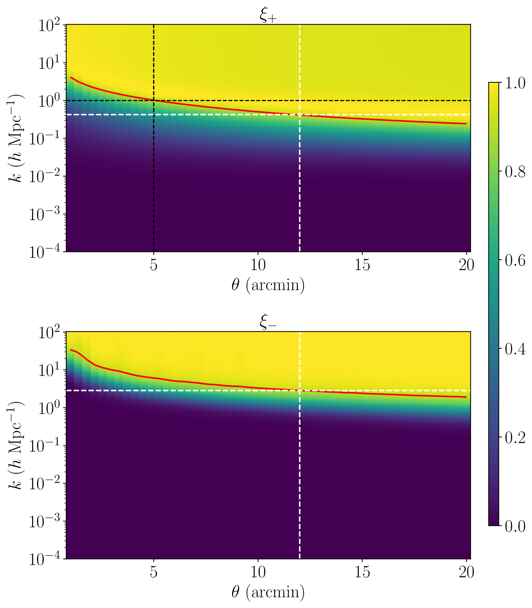{height=920px fig-align="center"}

:::
::::::::::::::

## Harmonic-space $S_8$ is robust to scale cuts and analysis choices {visibility="uncounted"}

:::::::::::::: {.columns}
::: {.column style="width:30%"}

 

- Scale cuts, nonlinear model, covariance, and leakage choices all shift $S_8$ by $< 0.2\sigma$
- Consistent across all three blinds

:::
::: {.column style="width:70%"}

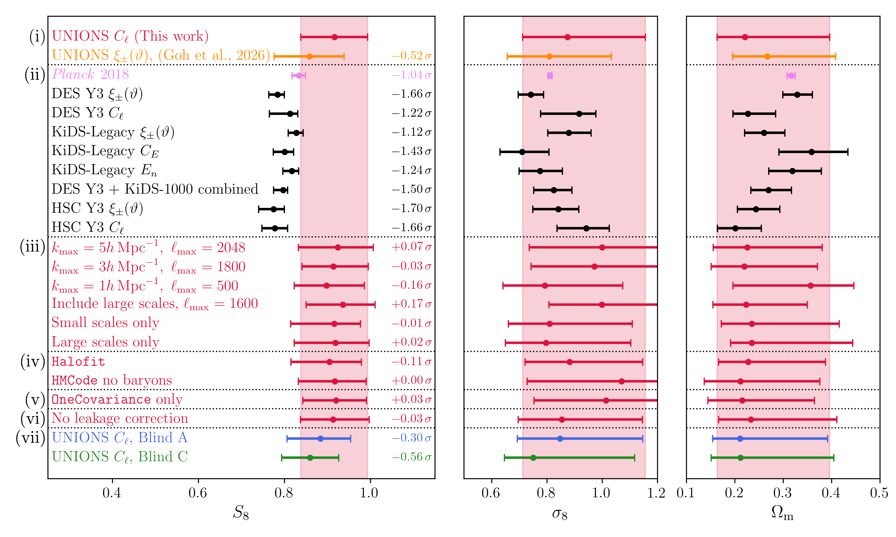{width=98% fig-align="center"}

:::
::::::::::::::

## The $\Omega_m$ difference between pipelines is unremarkable {visibility="uncounted"}

:::::::::::::: {.columns}
::: {.column style="width:40%"}

 

- $\Delta\Omega_m = 0.046$, PTE $= 0.20$, $N_\sigma = 0.83$
- The tension is in $S_8$ specifically, not a general disagreement
- Broad $\Omega_m$ posteriors mean almost any difference is consistent

:::
::: {.column style="width:60%"}

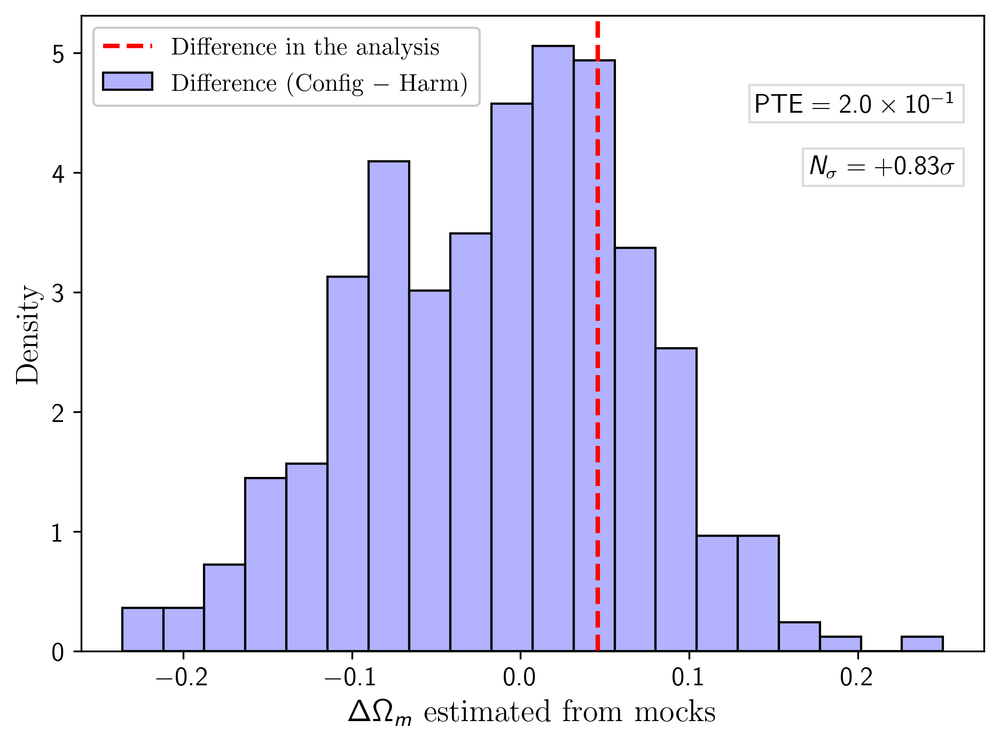{width=98% fig-align="center"}

:::
::::::::::::::

## Config and harmonic posteriors agree across all parameters {visibility="uncounted"}

:::::::::::::: {.columns}
::: {.column style="width:18%"}

::: {style="font-size:0.95em;line-height:1.5em"}
UNIONS $C_\ell$ (red) vs $\xi_\pm$ (orange).

- Same blinded inputs
- Agreement across all parameters
:::

:::
::: {.column style="width:82%"}

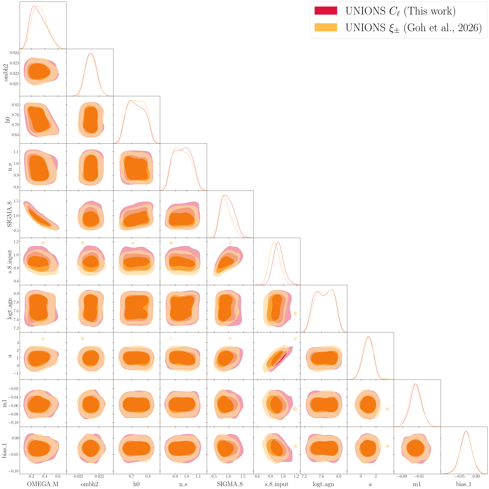{height=920px fig-align="center"}

:::
::::::::::::::

