## Why cosmic shear?

::: {style="line-height:1.6em"}

Gravitational lensing distorts galaxy shapes as light traverses the large-scale matter distribution. Correlating those shapes measures the **matter power spectrum** — a direct probe of structure growth under dark matter and dark energy. Getting $S_8$ right is one of the open problems in cosmology: cosmic shear surveys have consistently measured lower values than the CMB.

 

This talk presents the first UNIONS 2D cosmic shear cosmology release:

- **Paper III** — B-mode validation (Daley et al.)
- **Paper IV** — Configuration-space constraints (Goh et al.)
- **Paper V** — Harmonic-space constraints (Guerrini et al.)

 

A careful first result: tomography, $3{\times}2$pt, and cross-correlations will follow.

:::

::: notes
Cosmic shear is one of the cleanest probes of the matter distribution we have — you're measuring the distortion of galaxy shapes by all the intervening mass along the line of sight.
S₈ encodes the amplitude of structure growth. Most cosmic shear surveys find values about 2–3 sigma lower than Planck — is that new physics, or systematic error? A new survey in a different hemisphere with different instruments is exactly the kind of independent check we need.
This release is three companion papers from a single blinded catalogue.
:::

## First cosmic shear from the northern sky

::: {style="margin-top:40px;line-height:1.6em"}

- Unique northern-sky Stage-III weak-lensing dataset — strong cross-correlation potential with DESI, Euclid, and CMB lensing

- 2D (non-tomographic): deliberately conservative first cosmology release

  - tomographic constraints will follow once multi-bin photo-$z$ calibration is in place

- Two independent data vectors: $\xi_\pm(\theta)$ (configuration space) and pseudo-$C_\ell$ (harmonic space)

- Culmination of more than five years of coordinated observations and pipeline development

:::

::: notes
Sacha has just walked you through the catalogue — the survey properties, the PSF model, the systematics tests.
Now I'll take that catalogue and show you what the shear field tells us about cosmology.
UNIONS is the only deep wide-field lensing survey in the north, which opens up cross-correlations that the southern surveys can't do — spectroscopic overlap with DESI, photometric overlap with Euclid, and CMB lensing from ACT and Planck at high northern declination.
:::

## The 2D cosmic shear team

::: {style="text-align:center"}
Core members in alphabetical order (many others have contributed as well):
:::

:::::::::::::: {.columns style="text-align:center"}
::: {.column style="width:25%"}
{width=195px}
:::
::: {.column style="width:25%"}
{width=195px}
:::
::: {.column style="width:25%"}
{width=195px}
:::
::: {.column style="width:25%"}
{height=195px}
:::
::::::::::::::

:::::::::::::: {.columns style="text-align:center"}
::: {.column style="width:33%"}
{width=220px}
:::
::: {.column style="width:33%"}
{width=220px}
:::
::: {.column style="width:33%"}
{width=220px}
:::
::::::::::::::

## Overall analysis {.smaller}

::: {style="margin-top:16px;font-size:0.9em"}
Before we can do cosmology, we need to know which scales and which catalogue version are clean. That's the job of Paper III.
:::

### Paper III
**Validation**

::: {style="font-size:0.88em;line-height:1.5em;margin-top:26px;margin-bottom:18px"}
- Four catalogue versions tested across fiducial and full-range cuts
- Only the fiducial size-cuts catalogue remains acceptable across all three statistics
:::

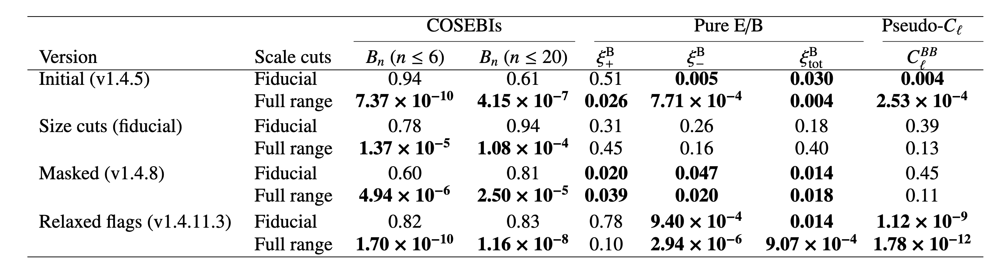{width=94% fig-align="center"}

::: notes
Sacha has just covered the catalogue and image-simulation papers, so I pick up at the analysis level.
Paper III is the gatekeeper: it decides which catalogue version and which scales are clean enough for cosmology. You'll see the details in a few slides — for now, the punchline is that only one version passes all three B-mode tests.
:::

## Overall analysis {.smaller}

::: {style="margin-top:16px;font-size:0.9em"}
With clean scales in hand, Paper IV fits cosmology to the angular correlation functions $\xi_\pm(\theta)$.
:::

### Paper IV
**Configuration space**

::: {style="font-size:0.86em;line-height:1.5em;margin-top:24px;margin-bottom:10px"}
- First 2D UNIONS constraint in configuration space, jointly fitting cosmology, nuisance terms, and PSF leakage
:::

{width=90% fig-align="center"}

::: notes
Paper IV takes the validated catalogue and scale cuts from Paper III and fits a cosmological model to the shear correlation functions.
:::

## Overall analysis {.smaller}

::: {style="margin-top:16px;font-size:0.9em"}
Paper V repeats the exercise in harmonic space — a second, independent constraint from the same data.
:::

:::::::::::::: {.columns style="margin-top:24px"}
::: {.column style="width:34%"}
### Paper V
**Harmonic space**

::: {style="font-size:0.88em;line-height:1.5em;margin-top:26px"}
- 2D cosmic-shear constraint in harmonic space using pseudo-$C_\ell$
- A second constraint on equal footing that helps test robustness across analysis basis
:::
:::
::: {.column style="width:66%"}
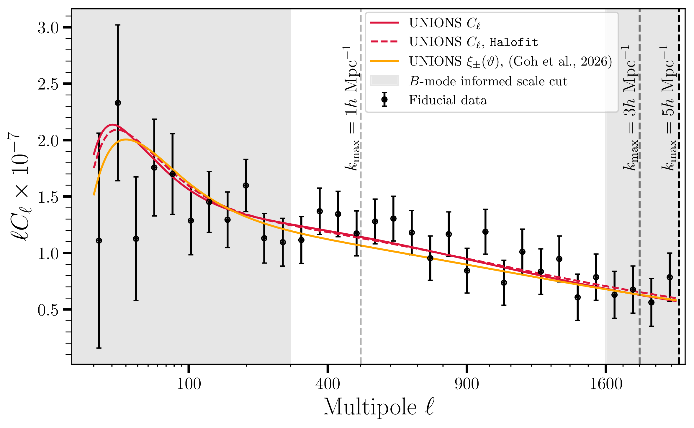{width=98% fig-align="center"}
:::
::::::::::::::

::: notes
Paper V is the harmonic-space cosmology result — same catalogue, same blinding, same scale cuts, but an independent analysis pipeline. The fact that both spaces give consistent results is one of the key messages of this release.
:::

## Blinding strategy

:::::::::::::: {.columns}
::: {.column style="width:50%"}

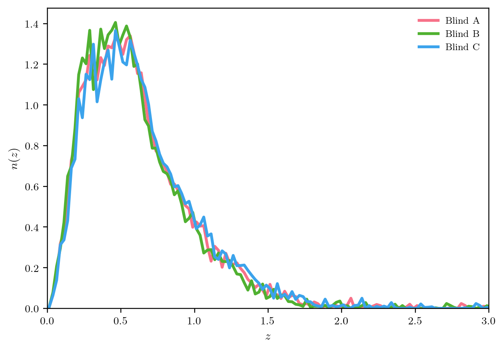{width=88% fig-align="center"}

::: {style="font-size:0.72em;text-align:center;margin-top:-8px;margin-bottom:12px"}
Three blinded $n(z)$ realizations used during analysis.
:::

:::
::: {.column style="width:50%;font-size:0.86em"}

- Blind the mean of the source redshift distribution: three realizations A/B/C
- Fix analysis choices before revealing which blind is physical: catalogue version, scale cuts, and robustness criteria
- While blind, run catalog variations, covariance choices, likelihood tests, and both cosmology pipelines on all three blinds

::: {style="font-size:0.8em;margin-top:28px"}
The blinding lives in $n(z)$, not in post-processing of the contours.
:::

:::
::::::::::::::

::: notes
We blind by shifting the source redshift distribution, not by hiding the final number after the fact.
That means the full machinery is exercised on each blind.
The B-mode cuts are fixed before unblinding, so the cosmology is not tuned to the answer.
:::

## Three B-mode statistics

::: {style="font-size:0.88em;line-height:1.5em;margin-top:20px"}
Shear is a **spin-2 field** — like polarization, it decomposes into **E-modes** (the lensing signal) and **B-modes** (a probe of residual systematics at UNIONS noise levels). Masking creates **ambiguous modes** that can't be cleanly assigned to E or B, so we need statistics that separate them.
:::

::: {style="font-size:0.98em;font-weight:700;line-height:1.2em;margin-top:16px;margin-bottom:10px"}
Configuration space: Pure E/B correlation functions $\xi_\pm^{E/B}(\theta)$
:::

::: {style="font-size:0.84em;line-height:1.5em"}
Linear combinations of $\xi_\pm$ that isolate ambiguous-mode-free E and B signals — the most direct view of where residual B-modes sit in angle.
:::

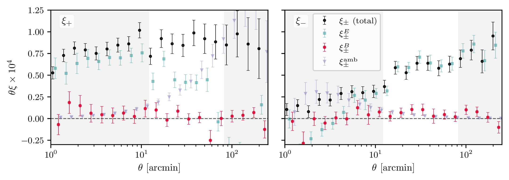{width=76% fig-align="center"}

::: notes
Let me explain what we're looking for. The shear field is spin-2 — just like CMB polarization, it splits into E-modes and B-modes. Gravitational lensing produces only E-modes, so any B-mode signal is telling us something went wrong — PSF residuals, detection biases, that sort of thing.
The complication is that with a masked sky, some modes are ambiguous — you can't tell if they're E or B. So you need statistics that are designed to separate them cleanly. We use three.
Pure E/B is the most direct angular-space decomposition. You can see exactly where the residual B-modes sit in angle.
:::

## Three B-mode statistics (2/3)

:::::::::::::: {.columns}
::: {.column style="width:38%"}

::: {style="font-size:0.98em;font-weight:700;line-height:1.2em;margin-top:32px;margin-bottom:10px"}
Discrete modes: COSEBIs $E_n, B_n$
:::

::: {style="font-size:0.84em;line-height:1.5em"}
Complete orthogonal E/B modes over a finite angular range.

They compress the information efficiently, but the full angular range is too aggressive for this release.
:::

:::
::: {.column style="width:62%"}

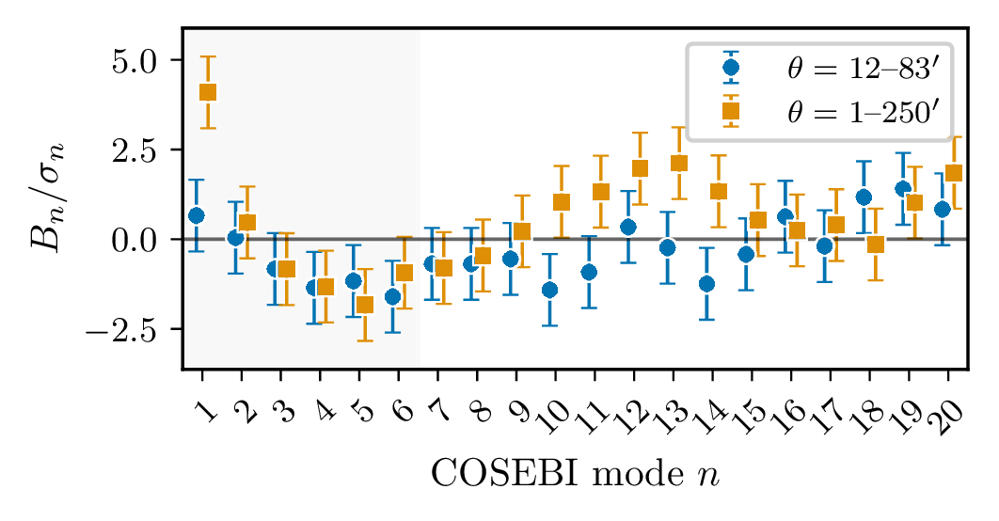{width=92% fig-align="center"}

:::
::::::::::::::

::: notes
COSEBIs are compact and orthogonal, so they give a complementary lens on the same data.
Here they help show that the full range is too optimistic, which pushes us toward the fiducial cuts.
:::

## Three B-mode statistics (3/3)

:::::::::::::: {.columns}
::: {.column style="width:38%"}

::: {style="font-size:0.98em;font-weight:700;line-height:1.2em;margin-top:32px;margin-bottom:10px"}
Harmonic space: band powers $C_\ell^{EE}, C_\ell^{BB}$
:::

::: {style="font-size:0.84em;line-height:1.5em"}
NaMaster band-power estimation with mode-coupling correction.

This gives a harmonic-space view before we ever get to cosmological contours.
:::

:::
::: {.column style="width:62%"}

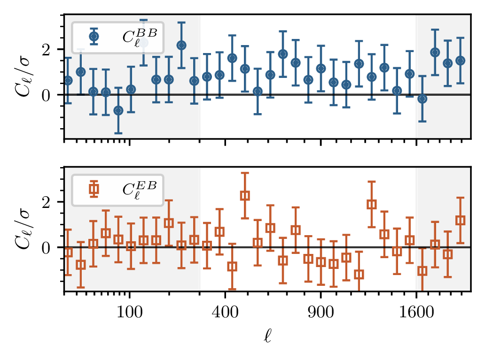{width=92% fig-align="center"}

:::
::::::::::::::

::: notes
The pseudo-Cl estimator is a third basis and an important bridge into the harmonic-space cosmology paper.
No single statistic gets to dominate the decision on its own.
:::

## B-mode validation sets the cuts

:::::::::::::: {.columns}
::: {.column style="width:64%"}

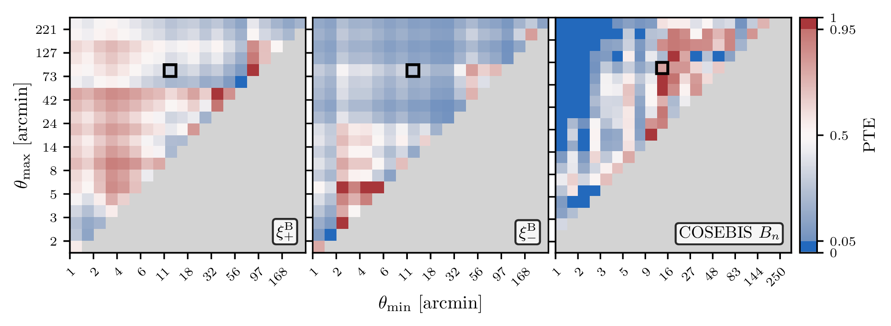{width=98% fig-align="center"}

::: {style="font-size:0.72em;text-align:center;margin-top:-6px"}
2D $p$-value (PTE) scan used to define the fiducial angular cuts.
:::

::: {style="font-size:0.79em;line-height:1.4em;margin-top:12px"}
Three statistics point to the same broad stable region, and only v1.4.6.3 remains acceptable across all of them.

Adopted cuts: $[12, 83]$ arcmin and $\ell = 300$--$1600$.
:::

:::
::: {.column style="width:36%;font-size:0.84em"}

 

- Three estimators probe the same shear field in different bases
- We look for regions that pass broadly and consistently, rather than over-weighting one plot
- Small-scale failures trace the MegaCam CCD scale (${\sim}9.4$ arcmin)

::: {style="font-size:0.75em;margin-top:20px"}
This is the bridge from Paper III into the cosmology papers.
:::

:::
::::::::::::::

::: notes
This is the compressed B-mode story.
The colour map is a p-value — probability to exceed the observed chi-squared under the null hypothesis of no B-modes — computed for every combination of minimum and maximum angular scale. Green means the B-modes are consistent with zero; red means they're not.
The residual problem sits at the MegaCam CCD scale, around 9 arcminutes. Above that, the field is clean.
The cosmology papers inherit these cuts rather than tuning them themselves.
:::

## Photo-$z$, covariance, likelihoods

::: {style="font-size:0.82em;margin-top:10px;margin-bottom:8px;color:#555"}
The ingredients that connect the validated shear catalogue to cosmological contours.
:::

::: {style="line-height:1.55em;font-size:0.88em"}

**Redshift distribution** — a single 2D source $n(z)$, estimated with a SOM-based colour–redshift calibration. Both analyses marginalize over a mean shift $\Delta z$. Full multi-bin photo-$z$ is the main prerequisite for tomographic follow-up.

**Covariance** — analytical in both spaces (CosmoCov for $\xi_\pm$, iNKA-style for $C_\ell$), cross-checked with jackknife and GLASS mocks.

**Likelihoods** — common cosmological model, common $n(z)$, common scale cuts from Paper III, but separate likelihood codes. Nuisance treatment covers intrinsic alignments, baryons, and $\Delta z$.

:::

::: {style="font-size:0.84em;margin-top:18px"}
The two pipelines share the same blinded inputs and validated scales — only the basis and likelihood machinery differ.
:::

::: notes
I'm compressing the ingredients into one slide so we can spend more time on the results.
The key point: both pipelines share inputs and scale cuts from Paper III. The only difference is the statistical basis — real-space correlation functions versus harmonic-space power spectra — and the likelihood machinery built around each.
The redshift distribution is 2D, which is why this release is less constraining than tomographic surveys, but it's a deliberate choice: get the systematics right first.
:::

## Cosmological contours

:::::::::::::: {.columns}
::: {.column style="width:60%"}

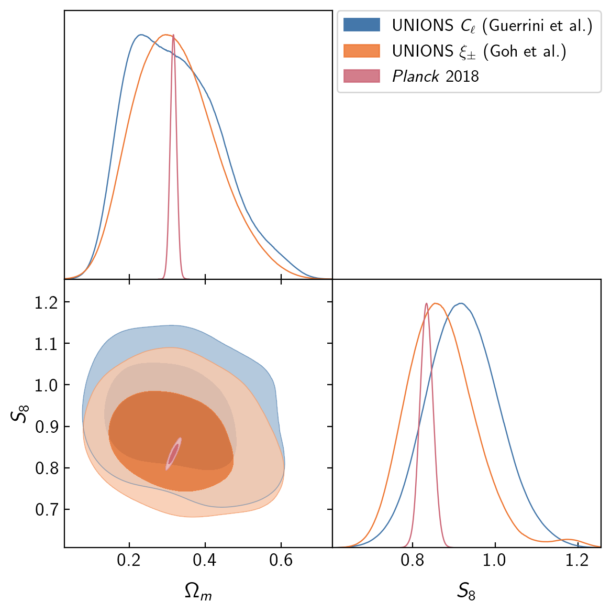{width=84% fig-align="center"}

:::
::: {.column style="width:40%"}

 

- First UNIONS 2D cosmic-shear constraints on $\Omega_m$ and $S_8$
- Configuration and harmonic space are broadly consistent with each other and with *Planck*
- Error bars are wide — this is a non-tomographic release by design

:::
::::::::::::::

::: notes
Here are the unblinded UNIONS contours — configuration space in orange, harmonic space in blue, and Planck in pink.
Both UNIONS analyses are consistent with each other and with Planck. The contours are wide because we're fitting a single source redshift bin — tomography will tighten these substantially.
The important thing is not the error bar: it's that two independent pipelines land in the same place.
:::

## $S_8$ comparison

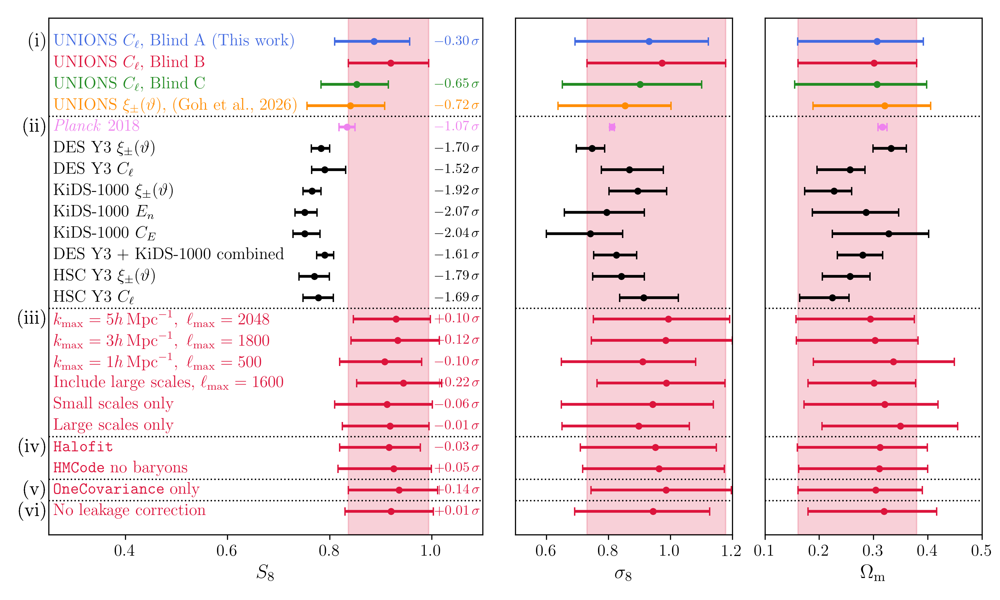{width=88% fig-align="center"}

::: {style="font-size:0.82em;line-height:1.5em;margin-top:8px"}
- **(i)** Three blinds and both pipelines — blind A is the physical $n(z)$; configuration and harmonic space agree within ${\sim}0.4\sigma$
- **(ii)** Broadly consistent with *Planck* ($0.7\sigma$) and other Stage-III shear surveys
- **(iii–vi)** Robustness tests: scale cuts, non-linear model, covariance, leakage correction — all shifts $< 0.2\sigma$
:::

::: notes
This is the summary figure. At the top: our three blinds plus the configuration-space result, showing that both pipelines agree to within half a sigma. Below: UNIONS compared to Planck, DES, KiDS, HSC — we sit comfortably within the lensing family, 0.7 sigma from Planck.
The lower sections are robustness: scale cuts, non-linear model, covariance, and leakage correction. Every shift is under 0.2 sigma. The result is stable.
:::

## Configuration vs harmonic space

:::::::::::::: {.columns}
::: {.column style="width:55%"}

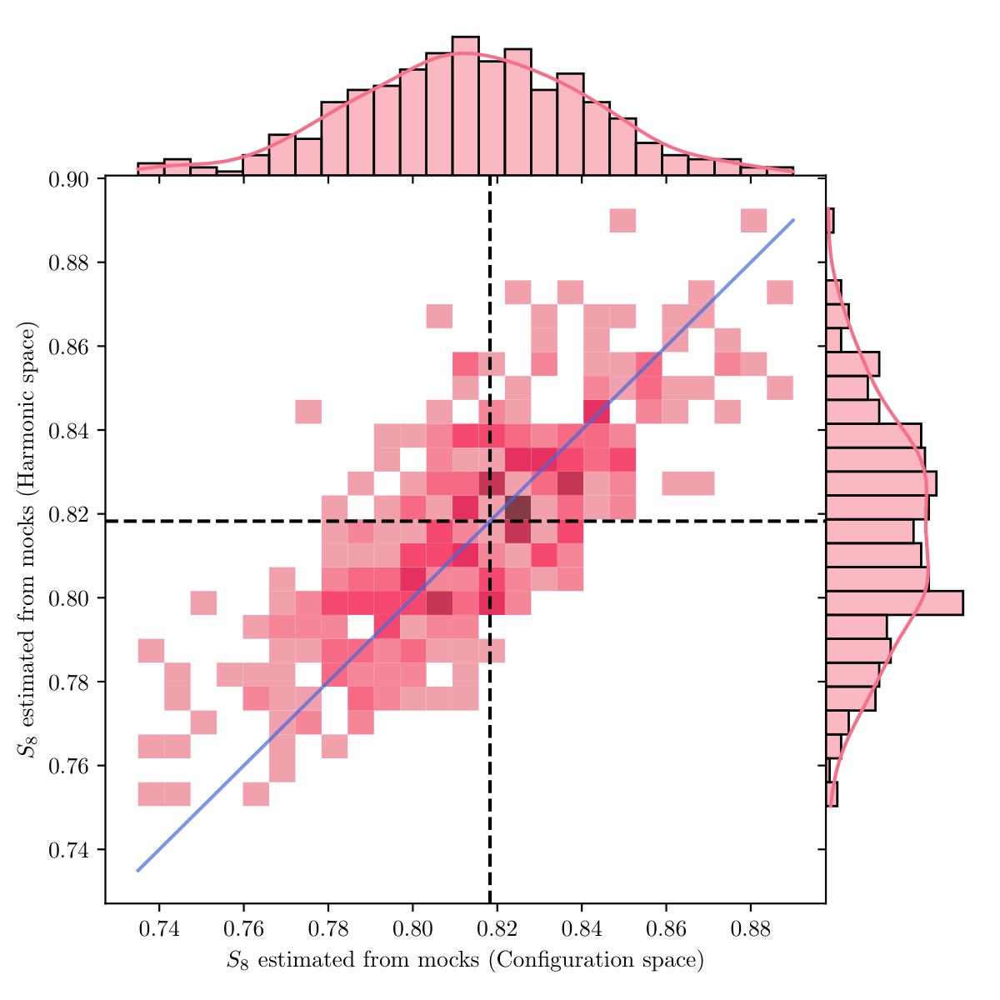{width=80% fig-align="center"}

::: {style="font-size:0.75em;text-align:center;margin-bottom:10px"}
$S_8$ from config vs harmonic space on 350 GLASS mocks.
:::

:::
::: {.column style="width:45%"}

 

- Same catalog, $n(z)$, and blinding
- Independent pipelines: $\xi_\pm$ vs pseudo-$C_\ell$
- Consistency ${\sim}0.4\sigma$ across 350 GLASS mocks
- Validates that both analyses measure the same cosmology

::: {style="font-size:0.8em;margin-top:30px"}
Key robustness test for the UNIONS cosmic shear release.
:::

:::
::::::::::::::

::: notes
A crucial robustness question: do configuration-space and harmonic-space analyses agree?
We test this on 350 GLASS mock catalogs — same catalog run through both pipelines.
The scatter plot shows the S₈ estimates from both spaces are tightly correlated, with consistency at the 0.4 sigma level.
This validates that the two analyses are measuring the same underlying cosmology.
:::

## Summary & outlook

- **UNIONS**: largest deep weak lensing survey of the northern sky (3500 deg²)

- **B-mode validation** (Paper III): three complementary statistics confirm B-modes consistent with zero on scales used for cosmology

- **Cosmological constraints** (Papers IV & V): two 2D cosmic shear pipelines give consistent results from the same blinded catalog and $n(z)$ inputs

- **Next:** tomographic analysis, $3{\times}2$pt, and cross-correlations with CMB lensing will turn this validation release into a substantially sharper cosmology data set

::: notes
To summarize: UNIONS provides the first deep wide-field lensing constraint from the northern sky.
B-modes validated with three statistics — the scale cuts are well-motivated.
The important cosmology result here is not just one number: it's that harmonic and configuration-space analyses agree when run on the same blinded inputs.
Next steps: tomographic analysis will improve constraints significantly, 3x2pt with spectroscopic surveys, and cross-correlations with CMB lensing from ACT and Planck.
:::

## Thank you! {.team-photo-slide background-image="images_local/unions_team.jpg" background-size="cover" background-position="center"}

::: {style="margin-top:150px;text-align:center"}

::: {style="display:inline-block;padding:22px 36px;background:rgba(255,255,255,0.8);border-radius:18px"}
### Thank you

::: {style="font-size:0.9em;margin-top:12px"}
**cail.daley@cea.fr**
:::
:::

:::

::: notes
Thank you! Happy to take questions.
The five companion papers will be on arXiv shortly. Please reach out if you're interested in the catalog or in cross-correlation opportunities.
:::

## Backup {background-color="black" style="color:white"}

## E-modes and B-modes {.smaller}

:::::::::::::: {.columns}
::: {.column style="width:50%"}

Spin-2 shear fields can be decomposed into **E-modes** containing the vast majority of lensing information and **B-modes**, which are a probe of systematics at UNIONS noise levels.

 

In the presence of masking, some **ambiguous** modes cannot be cleanly attributed to E or B.

$\implies$ need **E/B-separable** statistics

:::
::: {.column style="width:50%"}
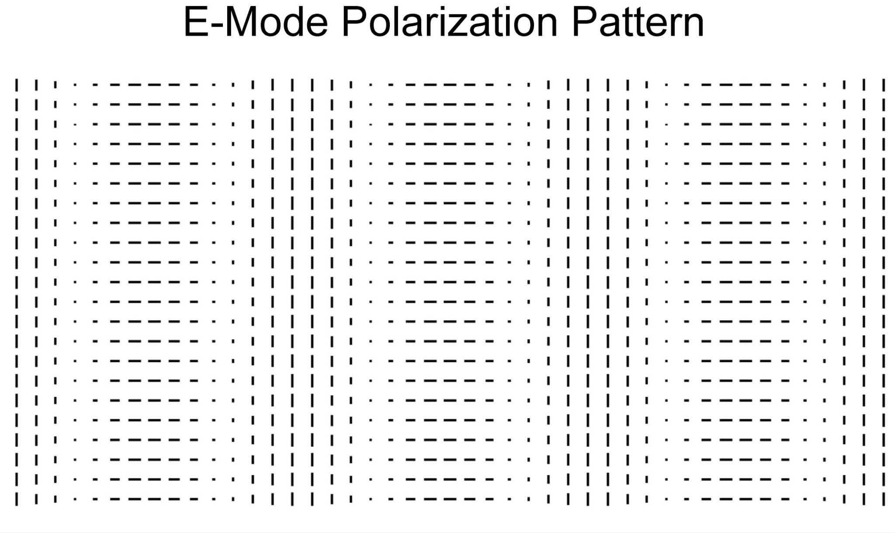{width=80%}
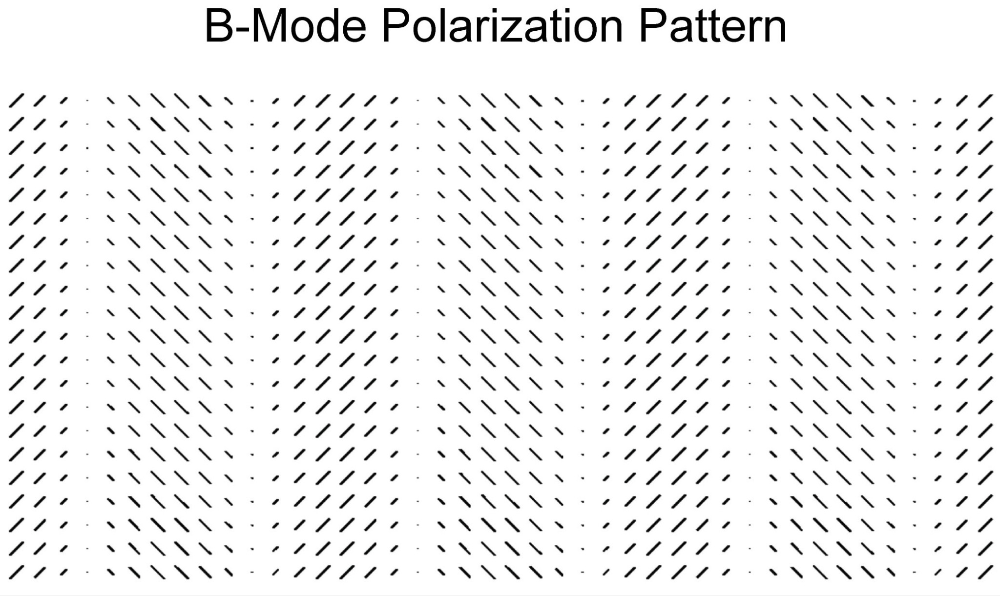{width=80%}
:::
::::::::::::::

## Config–harmonic $\Delta S_8$ distribution {.smaller}

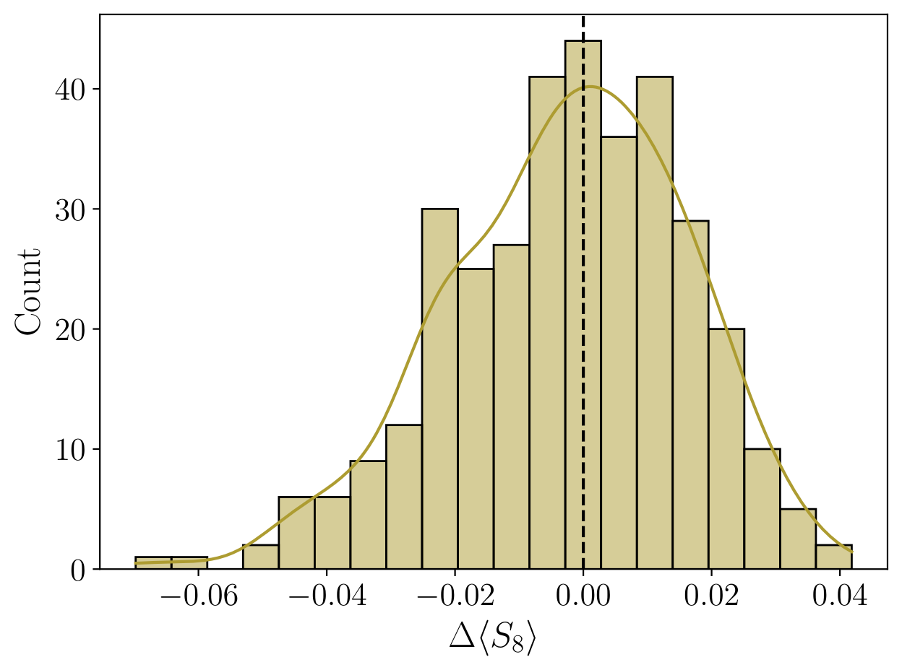{width=55% fig-align="center"}

::: {style="font-size:0.8em;text-align:center"}
$\Delta \langle S_8 \rangle$ between configuration and harmonic space across 350 GLASS mocks. Centered on zero — no systematic bias.
:::

## Pipeline validation on GLASS mocks {.smaller}

:::::::::::::: {.columns}
::: {.column style="width:50%"}

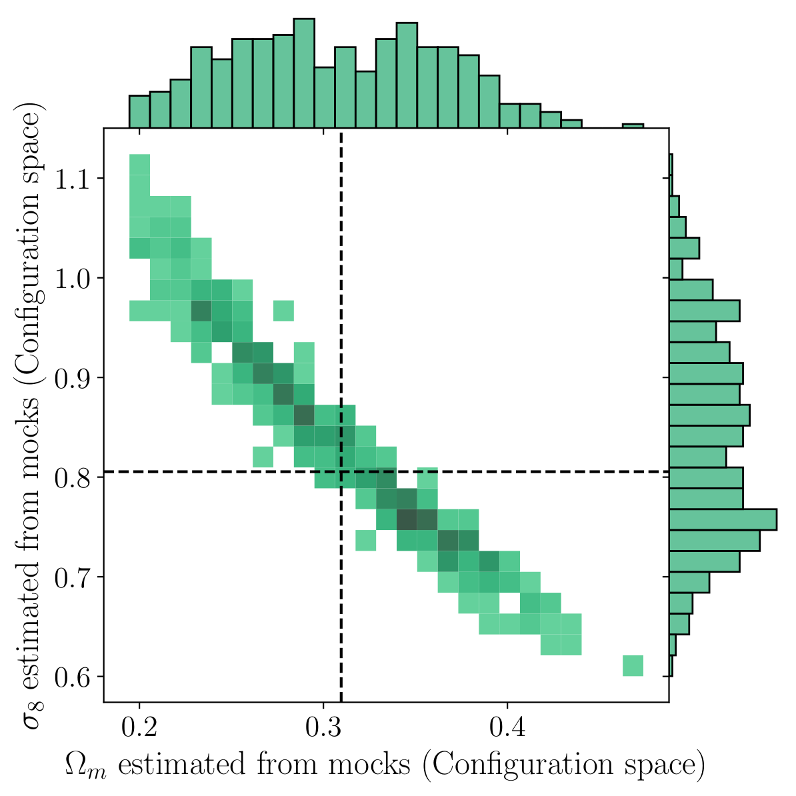{width=90% fig-align="center"}

::: {style="font-size:0.8em;text-align:center"}
$\Omega_m$–$\sigma_8$ from 350 GLASS mocks (configuration space). Dashed: input cosmology.
:::

:::
::: {.column style="width:50%"}

 
 

- 350 GLASS mock catalogs with realistic UNIONS geometry
- Full inference pipeline run on each mock
- Input cosmology recovered without bias
- Validates covariance, likelihood, and sampling

:::
::::::::::::::

## Three blinds — harmonic space {.smaller}

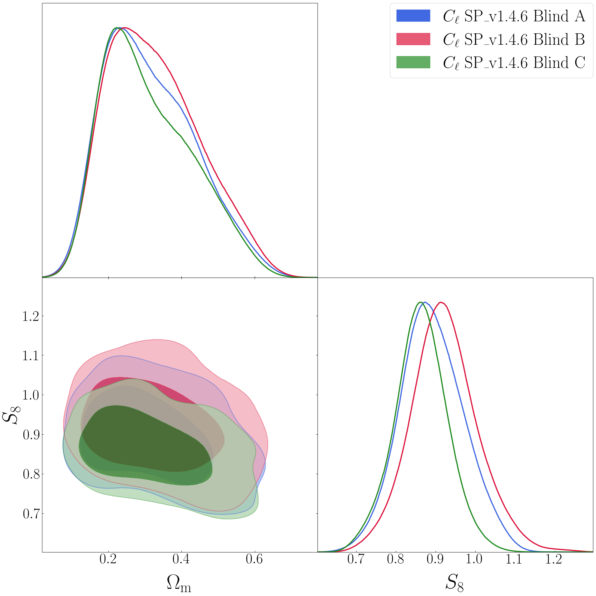{width=55% fig-align="center"}

::: {style="font-size:0.8em;text-align:center"}
$\Omega_m$–$S_8$ contours for all three blinded $n(z)$ realizations (harmonic space). Blinding shifts the $n(z)$ mean redshift.
:::

## UNIONS vs Stage III surveys {.smaller}

{width=55% fig-align="center"}

::: {style="font-size:0.8em;text-align:center"}
$\Omega_m$–$S_8$ contours: UNIONS (harmonic + config-space) compared to DES Y3, KiDS-1000, HSC Y3, DES+KiDS combined.
:::
